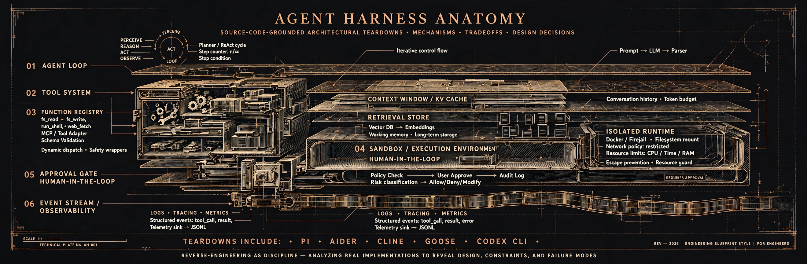

# Agent Harness Anatomy

Rigorous, source-grounded architecture teardowns of AI agent harnesses —
starting with pi, then aider. Every behavioral claim is pinned to verifiable source
code; no product-review prose.

Companion repo to the Substack series.

## Articles

| # | Harness | Article | Substack |
|---|---|---|---|
| 1 | pi (v1.0.2) | [pi/article.md](pi/article.md) | forthcoming |
| 2 | aider (v0.86.2) | [aider/article.md](aider/article.md) | forthcoming |
| 3 | Cline (v4.1.22) | [cline/article.md](cline/article.md) | forthcoming |
| 4 | Goose (v1.53.0) | [goose/article.md](goose/article.md) | forthcoming |
| 5 | Codex CLI (rust-v0.160.0) | [codex/article.md](codex/article.md) | forthcoming |

## What's here

- `<harness>/article.md` — the full article text with evidence endnotes
- `<harness>/figures/` — static figures (SVG + PNG) used in the articles
- `<harness>/diagrams/` — data behind the interactive diagrams
- `diagrams/template.html` — the interactive diagram viewer
- [comparison-matrix.md](comparison-matrix.md) — the running ten-dimension
  comparison, one column per harness

## Interactive diagrams

Each harness ships a JSON diagram spec plus a trace-step file under
`<harness>/diagrams/`. Open `diagrams/template.html` in a browser (served
over HTTP, e.g. via GitHub Pages) and point it at the JSON to explore the
architecture interactively: pan, zoom, click nodes for module references.

## Grounding

Every article pins a release tag and commit SHA up front, and every
behavioral claim carries a footnote to a line-level permalink in that
pinned tree. Claims are graded VERIFIED (source), DOCS (documentation),
or INFERRED (reasoned from source) — the grade travels with the claim.
