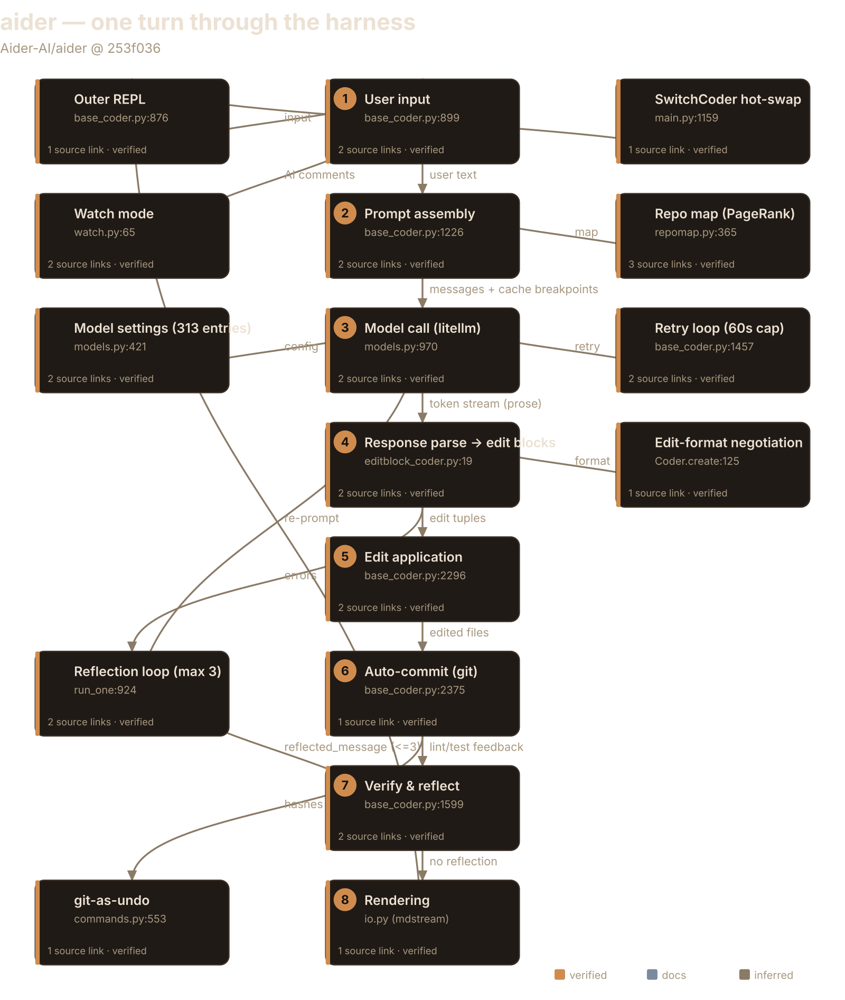
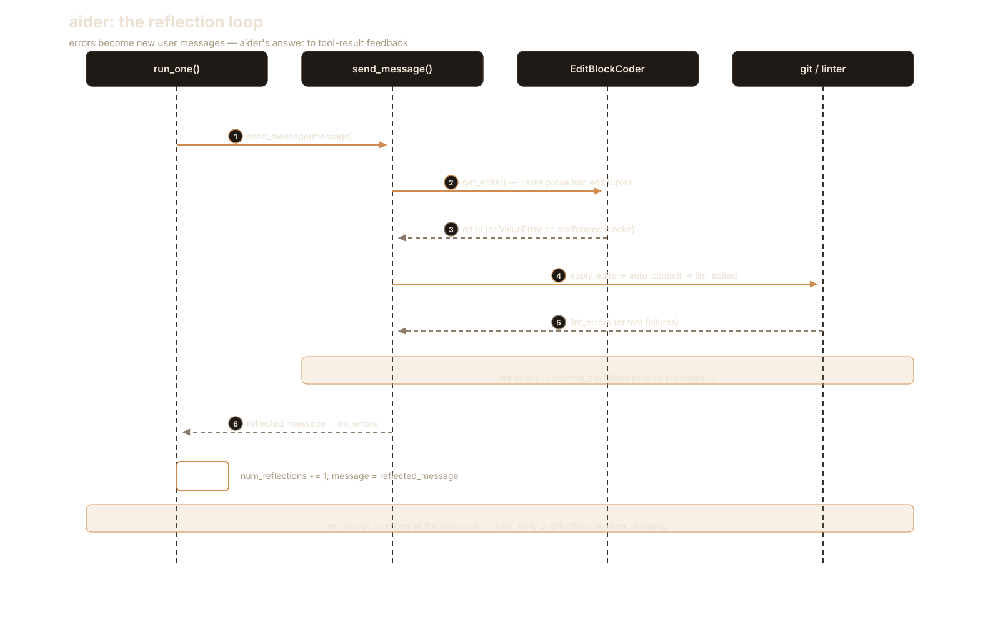
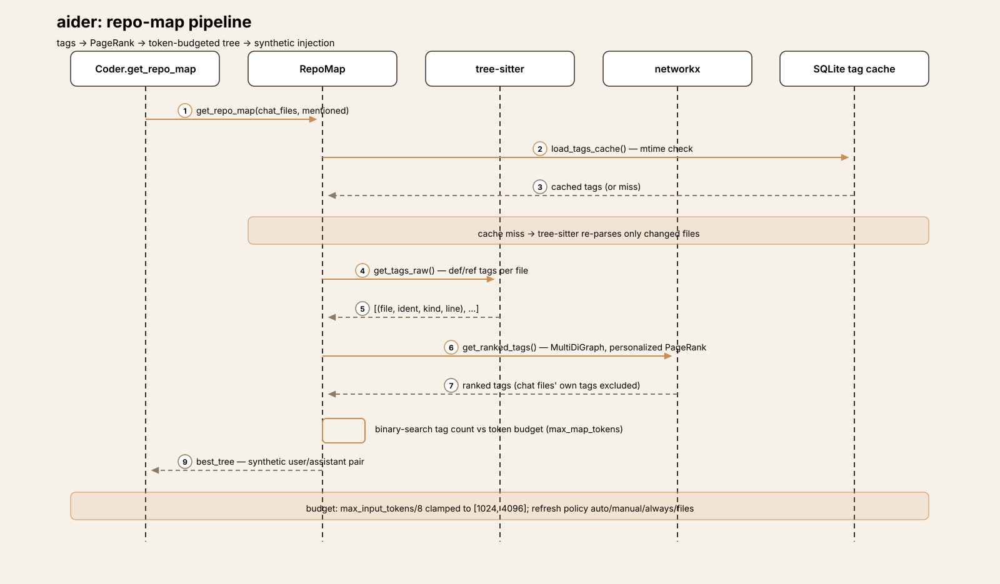
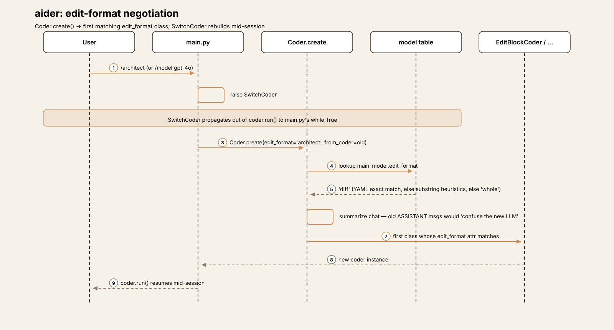

# Agent Harness Anatomy #2: aider — the pair programmer that parses prose

> **Series:** Agent Harness Anatomy — top-down dissections of real agent
> harnesses, grounded in verifiable source code. Every behavioral claim
> below carries a footnote to a pinned GitHub permalink; the full evidence
> lives in the endnotes.

## Version block

- **Repo:** [Aider-AI/aider](https://github.com/Aider-AI/aider)
- **Pinned:** tag `v0.86.2` → `253f0368b873ba30d8ee26e463718f0c03614ddf` (2026-02-11)
- **Language:** Python (146 `.py` files, 38,158 LOC — `aider/` 20,237 · `tests/` 12,306 · `scripts/` 3,152 · `benchmark/` 2,463)
- **License:** Apache-2.0
- **Claim under test:** "AI pair programming in your terminal"



## The mental model

aider is a **text-format-negotiating pair programmer**: one LLM call per
turn, then a deterministic parse→apply→verify pipeline, with git as the
undo system.[^1] There is no tool-call loop. The model never calls tools —
it emits *prose* (SEARCH/REPLACE edit blocks, unified diffs, whole-file
rewrites), and aider parses that prose, applies it to files, lints and
tests the result, and reflects any errors back as new user messages.[^2]

This inverts pi's bet from article #1. Where pi hands the model a typed
tool protocol and stays rigorously model-agnostic, aider hands the model
*formatting conventions* and compensates with deep model-specific
knowledge: a 313-entry compatibility table plus substring heuristics that
decide, per model, which edit format to use, whether to send a repo map,
and how to place reminders.[^3] The tradeoff is load-bearing. Text formats
work with any model that can follow instructions — no function-calling API
required, which mattered enormously when aider was designed — but every
format is a brittle contract that must be tuned per model. pi's thesis was
"mechanism in the core, policy in extensions." aider's is closer to: **the
model does the acting; aider does the parsing, the verifying, and the
remembering which models need which format.**

## Package map

Single-package layout (`aider/`), not pi's monorepo. Dependency direction:
`main.py` → `coders/` (the loop) → `models.py`/`llm.py` (providers),
`repomap.py`, `repo.py`, `commands.py`, `io.py`, `history.py`,
`linter.py`.[^2]

| Module | LOC | Role |
|---|---|---|
| `coders/base_coder.py` | 2,485 | THE loop, prompt assembly, edit application |
| `commands.py` | 1,694 | 42 slash commands, `SwitchCoder` hot-swap |
| `models.py` | 1,323 | Model compat table (YAML + heuristics), litellm calls |
| `main.py` | 1,274 | CLI entry, mode dispatch, coder construction |
| `repomap.py` | 867 | PageRank repo map (tree-sitter + networkx) |
| `io.py` | ~700 | prompt_toolkit input, watch/clipboard hooks |
| `history.py` | 143 | background-thread chat summarization |
| `diffs.py` | 128 | streaming whole-file diff display helper |
| `gui.py` | — | streamlit browser GUI (alt interface) |
| `watch.py` | ~310 | watchdog file watcher ("AI comments") |
| `voice.py` | — | whisper voice input |

Entry is `aider/__main__.py` → `main()` at `main.py:451`.[^1]

## The core loop

Three nested levels, and naming them correctly is the whole article:

- **Outer REPL** — `Coder.run()` (`base_coder.py:876`): `while True:`
  read input via `get_input()` → `run_one(...)`. KeyboardInterrupt goes to
  `keyboard_interrupt()` (Ctrl+C twice within 2 seconds exits); EOFError
  returns.[^4] One level up, `main.py` wraps `coder.run()` in its own
  `while True` that catches `SwitchCoder` — raised by `/model`,
  `/architect`, `/ask` and friends — to hot-swap the coder, model, or edit
  format mid-session.[^5]
- **Reflection loop** — `run_one()` (`base_coder.py:924`): `while message:`
  → `send_message(message)`; if anything during the turn set
  `self.reflected_message` (malformed edits, lint errors, test errors,
  files the model mentioned but never added), the loop re-prompts with
  that text as the new message. Capped by `max_reflections = 3`
  (`base_coder.py:101`): hit the cap and the turn ends with "Only 3
  reflections allowed, stopping."[^6]
- **Retry loop** — inside `send_message()` (`base_coder.py:1457`):
  `while True:` around the actual `self.send(...)`, with exponential
  backoff (`retry_delay *= 2` from 0.125s, giving up past
  `RETRY_TIMEOUT = 60` in `models.py:26`). Context-window exhaustion is
  *not* retried; output-length truncation triggers an
  assistant-prefill continuation if the model supports it.[^7]

```python
def run_one(self, user_message, preproc):
    self.init_before_message()

    if preproc:
        message = self.preproc_user_input(user_message)
    else:
        message = user_message

    while message:
        self.reflected_message = None
        list(self.send_message(message))

        if not self.reflected_message:
            break

        if self.num_reflections >= self.max_reflections:
            self.io.tool_warning(f"Only {self.max_reflections} reflections allowed, stopping.")
            return

        self.num_reflections += 1
        message = self.reflected_message
```

**The most interesting negative finding:** there is no max-iteration,
max-step, or max-turn cap on the REPL itself — the only numeric bound in
the system is `max_reflections = 3` on the re-prompt loop.[^8] But unlike
pi, where a missing cap is a live trust decision (a runaway model burns
tokens until Ctrl+C), aider's loop *can't* really doom-loop: each turn is
exactly one LLM call followed by a deterministic pipeline. The reflection
cap bounds re-prompts, and the REPL just waits for the next human input.
The dangerous loop in a tool-calling harness doesn't exist here because
the model is never handed the steering wheel — it only ever writes prose.



## One turn, end to end

Trace: the user types `add error handling to foo.py` with `foo.py`
already `/add`ed to the chat (default edit format `diff`, model gpt-4o).

**① Input.** `Coder.run()` → `get_input()` (`base_coder.py:899`,
prompt_toolkit via `io.get_input` at `io.py:523`) → `run_one(…,
preproc=True)` → `preproc_user_input` (`:912`): slash-command check,
then `check_for_file_mentions` on the *user's* text, then URL
detection.[^9]

**② Prompt assembly.** `send_message()` (`:1419`) → `format_messages()`
(`:1333`) → `format_chat_chunks()` (`:1226`). The wire order is fixed in
`ChatChunks.all_messages()` (`coders/chat_chunks.py:16`): system (main
system prompt + examples + reminder) → examples → read-only files →
**repo map** → done (summarized history) → chat files (the full content
of `foo.py`) → cur (the user message) → reminder.[^10] Three things worth
noticing. First, the repo map, read-only files, and chat files are each
sent as **synthetic user/assistant pairs** — the map is followed by an
assistant message saying "Ok, I won't try and edit those files without
asking first."[^11] The model is being stage-managed with fake
conversation. Second, prompt-cache breakpoints are attached via
`add_cache_control_headers` (`:28`): system/examples, repo(+readonly),
chat files — the stable prefixes, exactly the sections cheapest to
cache.[^10] Third, `check_tokens()` asks "Try to proceed anyway?" if the
assembled prompt exceeds the model's context window (`:1415`), and
`warm_cache()` arms a background thread that will keep the cache alive
with real `max_tokens=1` LLM calls on a ~5-minute timer (`:1340`).[^12]

The tradeoff: aider's prompt is a *performance*, assembled fresh every
turn from a dozen sources with cache geometry baked in — versus pi's
diffed, versioned system-prompt protocol. aider re-sends everything and
leans on prompt caching to make it cheap; pi sends deltas. Both are
answers to the same token-economics problem, from opposite directions.

**③ Model call.** `send()` (`:1783`) → `Model.send_completion()`
(`models.py:970`) → `litellm.completion(model="gpt-4o", …)`; tokens
stream through `show_send_output_stream`, or arrive whole via
`show_send_output`.[^13] No function/tool calling — the edits come back
as SEARCH/REPLACE text blocks inside the prose.

**④ Response parsing.** `EditBlockCoder.get_edits()`
(`coders/editblock_coder.py:19`) → `find_original_update_blocks()`
(`:439`): scans the response for `<<<<<<< SEARCH` / `=======` /
`>>>>>>> REPLACE` fenced blocks and resolves the target filename from
the 3 preceding lines — exact match, then basename, then difflib 0.8
fuzzy, then any dotted name.[^14] ```` ```bash ```` blocks are
intercepted separately: they yield `(None, shell_content)` tuples,
collected into `self.shell_commands` (`:33`) for confirmed execution
later — the model's "run this" suggestions never execute inline.[^14]

**⑤ Edit application.** `apply_updates()` (`:2296`) runs
`get_edits()`, then a dry run, then `prepare_to_edit`, then
`apply_edits()` which writes the files. `do_replace()` (`:364`) tries
exact match → leading-whitespace-flexible match → `...` elision handling
(`try_dotdotdots`). Blocks that match nothing raise `ValueError` with a
"SearchReplaceNoExactMatch" report including "did you mean" similar
lines from `find_similar_lines` — and that error text becomes the next
reflection.[^15]

*Seam worth knowing:* `replace_most_similar_chunk` (`:157`) has a bare
`return` sitting *before* the call to `replace_closest_edit_distance`
— the edit-distance fuzzy fallback is dead code. Only
exact/whitespace/`...` matching actually runs. The function reads like
it has four strategies; it has three.[^15]

**⑥ Commit.** `auto_commit()` (`:2375`) → `repo.commit(fnames,
context=cur_messages, aider_edits=True)` — every applied turn becomes a
git commit with an LLM-written message. The hash is tracked in
`aider_commit_hashes`, which is what powers `/undo`.[^16] Then
`move_back_cur_messages()` (`:1036`) retires the turn's messages into
history and kicks off background summarization (more below).[^17]

**⑦ Verify & reflect.** Post-apply feedback (`:1599-1622`): if
`auto_lint`, `lint_edited()` (`:1681`) runs per-language lint commands
(`linter.py:82`, from `resources/lint-commands.json`, falling back to a
`basic_lint`) — on errors, aider asks "Attempt to fix lint errors?" and,
on yes, sets `reflected_message = lint_errors`, sending the linter's
complaints back to the model as a new user message (reflection 1 of
≤3).[^18] Then `run_shell_commands()`: each model-suggested shell block
requires explicit per-command confirmation
(`explicit_yes_required=True`, `:2456`); output is optionally appended
to the chat as a user/assistant pair. Then the `auto_test` command runs
the same confirm→reflect cycle for test failures.[^18]

**⑧ Rendering.** Tokens stream live via `mdstream`
(`io.get_assistant_mdstream`); after applying, aider prints "Applied
edit to foo.py" and — if the turn moved HEAD — a `/undo` hint
(`show_undo_hint`, `:2404`).[^19] Rendering is imperative throughout:
there is no event stream for interfaces to subscribe to, which is why
the streamlit GUI re-implements display logic instead of observing
it.[^20]

## Subsystem inventory

- **Repo map** (signature subsystem). `repomap.py:42`. The pipeline:
  1. **Tag extraction** (`get_tags_raw`, `:279`): tree-sitter queries per
     language (`queries/` dir) produce `def`/`ref` tags per file, cached
     in SQLite at `.aider.tags.cache.v{CACHE_VERSION}` (`:42-43`) with
     mtime invalidation (`load_tags_cache`, `:217`).
  2. **Personalized PageRank** (`get_ranked_tags`, `:365`): a
     `networkx.MultiDiGraph` of the repo's files, edges
     referencer→definer weighted by identifier heuristics — mentioned
     identifiers ×10, long snake/kebab/camelCase names ×10, `_private`
     ×0.1, defined-in-many-files ×0.1, referencer-in-chat ×50, ref
     counts sqrt-scaled. The personalization vector boosts chat files,
     mentioned files, and path-component matches; chat files' own tags
     are excluded from the output.
  3. **Token budgeting** (`get_ranked_tags_map_uncached`, `:629`):
     binary search over tag count (initial guess `max_map_tokens //
     25`), rendering each candidate tree and token-counting it — with a
     sampling estimator for chunks over 200 chars (`:89`) — accepting
     the first within 15% of budget or the best under it. Budget
     defaults to `max_input_tokens/8` clamped to [1024, 4096]
     (`models.py:767-774`).
  4. **Rendering** (`to_tree` `:748`, `render_tree` `:710`): per-file
     ctags-style listings with lines of interest; mtime-keyed
     `tree_cache`.
  5. **Injection** (`get_repo_map`, `base_coder.py:709`): personalized on
     the current message's mentioned files and identifiers, with a
     **triple fallback** — personalized → global unhinted → fully
     unhinted (`:709-745`).
  6. **Refresh policy** (`:600-610`): `manual` freezes the last map,
     `always` regenerates, `files` caches on file sets, `auto`
     regenerates only when the previous build took over 1 second
     (`map_processing_time > 1.0`), keyed on chat plus mentions.[^21]



  This is aider's answer to "how does the model see the codebase" —
  algorithmic, token-budgeted, and re-personalized every turn. pi's
  answer is "it doesn't, unless you put files in context or write a
  skill." Neither is obviously right: aider pays tree-sitter +
  PageRank compute on every session so the model can navigate
  unprompted; pi pays nothing and makes context the user's job.

- **Edit formats.** Each format is a `Coder` subclass selected by its
  `edit_format` class attribute; `Coder.create()` (`base_coder.py:125`)
  picks the first class whose attribute matches, defaulting to
  `main_model.edit_format` from the model table.[^22]

  | Format | Coder | Parse |
  |---|---|---|
  | `diff` | `EditBlockCoder` (`:13`) | SEARCH/REPLACE blocks, fuzzy filename |
  | `udiff` | `UnifiedDiffCoder` (`:46`) | unified diff hunks, `normalize_hunk` |
  | `whole` | `WholeFileCoder` (`:10`) | full-file fenced rewrites |
  | `patch` | `PatchCoder` (`:210`) | `*** Begin Patch` sentinels; `*** Update/Add/Delete File:` actions with `@@` context chunks and tracked fuzz — tolerant of missing sentinels |
  | `ask` | `AskCoder` (`:5`) | read-only Q&A (no `apply_updates`) |
  | `architect` | `ArchitectCoder` (`:6`) | plan → user-confirmed → editor coder |
  | `context` | `ContextCoder` (`:5`) | repo Q&A with map |

  Format switching (`/architect`, `/ask`, `/code`, `/context`) raises
  `SwitchCoder`; `main.py` rebuilds the coder, **summarizing chat
  history** when the format changes because old ASSISTANT messages
  would "confuse the new LLM" (`base_coder.py:163-176`).[^23] Architect
  is aider's closest thing to sub-agents: sequential two-model
  delegation (architect plans, editor executes) with a user gate —
  "Edit the files?" (`architect_coder.py:11-48`) — synchronous and
  confirmed, not autonomous.[^24]



- **Model layer.** `models.py`: `Model` wraps litellm. Compatibility
  comes from **two tables**: `resources/model-settings.yml` (**313
  models**, user-overridable via `--model-settings-file`,
  `models.py:142-146`) → exact match, then
  `apply_generic_model_settings()` (`:421`): dozens of **substring
  heuristics** (`"/o3-mini" in model`, `"gpt-4" in model`, …) setting
  `edit_format`, `use_repo_map`, `streaming`, `use_temperature`,
  `reasoning_tag`, reminder placement. Fallback defaults live on the
  dataclass: `edit_format="whole"`, `use_repo_map=False`
  (`:119-123`).[^25] The weak model (default gpt-4o-mini per the YAML)
  handles commit messages and summarization; `simple_send_with_retries`
  (`:1024`) tries `[weak_model, main_model]` in order.[^26]

  *Seams worth knowing:* `system_prompt_prefix` is assigned twice in a
  row (`:426-427`) — harmless, but it signals how this function grows
  by accretion. And the `"gpt-3.5" in model or "gpt-4" in model` branch
  (`:511`) is partly dead: an earlier `"gpt-4" in model` branch returns
  first, so the gpt-4 half never fires. In a 1,323-line file of
  per-model special cases, dead branches are the tax on being
  model-aware.[^25]

- **Session & history.** Two message lists: `cur_messages` (the live
  turn) vs `done_messages` (history). `move_back_cur_messages()`
  retires the turn and starts **background-thread summarization**
  (`summarize_start` `:1002`; `ChatSummary` over
  `[weak_model, main_model]`, budget
  `clamp(max_input_tokens/16, 1024, 8192)`); `summarize_end()` (`:1024`)
  joins that thread *inside* `format_chat_chunks` — a slow
  summarization blocks prompt assembly, not the model call.[^27]
  Persistence is a markdown log, `.aider.chat.history.md`, in the git
  root (`args.py:274`), reloadable via `--restore-chat-history`. **No
  compaction, no sessions directory** — pi's JSONL sessions plus
  compaction versus aider's markdown log plus summarization.[^27]

- **Watch mode.** `FileWatcher` (`watch.py:65`, watchdog, background
  thread) starts when the input prompt shows (`io.py:649`); on change
  it interrupts input (`io.interrupt_input`, `io.py:516`) and
  `process_changes()` (`watch.py:181`) scans for `AI!`/`AI?` code
  comments, adds the files to chat, and builds a prompt with tree
  context around the comment lines — returned as the "user input".
  **The filesystem is an input device.** A clipboard watcher
  (`copypaste.py`) does the same for pastes.[^28]

- **Interfaces.** prompt_toolkit CLI (`io.py`) is primary;
  `--message`/`--message-file` for one-shots; `--apply` applies an edit
  file without involving the model at all. `gui.py` is a streamlit
  browser GUI wrapping the same `Coder`.[^20]

- **Failure handling.** Exponential-backoff retry (60s cap) on
  transient litellm errors; no retry on context-window exhaustion (asks
  the user to proceed anyway); output-length truncation →
  assistant-prefill continuation; malformed edits → reflected error
  text (≤3 reflections); lint/test failures → confirm → reflected
  errors; double-Ctrl+C exits.[^7][^29]

- **Security model.** Inverted versus pi: **edits to chat files apply
  with no prompt**. Prompts appear only at the boundary — "Create new
  file?" (`:2207`), "Allow edits to file that has not been added to the
  chat?" (`:2226`), every suggested shell command
  (`explicit_yes_required=True`, `:2456`). The safety net is git
  auto-commit plus `/undo`, not approvals — and there is no sandboxing
  of any kind at runtime.[^30]

- **Telemetry.** Mixpanel + PostHog (`analytics.py:55-56`). Mentioned
  for completeness; keys are redacted here and it doesn't touch the
  loop.[^31]

## Extension points

Here's the finding that shapes this whole section: **aider's extension
surface is configuration, not code.** There is no plugin API to learn —
extending aider means editing settings, switching formats, or forking.

- **Slash commands (closed set).** `commands.py` holds **42 slash
  commands**; any `cmd_*` method auto-registers (`get_commands`,
  `:276`) and dispatches by prefix match in `do_run` (`:288`), with a
  `!` prefix escaping to shell.[^32] The set is the product:
  `/add` `/drop` `/read-only` (context management), `/model`
  `/editor-model` `/weak-model` (SwitchCoder hot-swap), `/architect`
  `/ask` `/code` `/context` (format switches), `/undo` (reverts only
  aider's own commits — checks `aider_commit_hashes`, refuses dirty
  files and multi-parent commits, `:553-600`), `/diff` `/commit`
  `/lint` `/test` `/run`, `/map` `/map-refresh`, `/tokens`,
  `/voice` (whisper, needs `OPENAI_API_KEY`, `:1234`), `/web`
  (scrape), `/paste`, `/copy-context`, `/settings`, `/report`.[^32]
  **Start here:** read `cmd_add` and `cmd_undo` — context management
  and git-backed undo are the two commands every other feature
  orbits.
- **Model settings YAML.** The 313-entry `model-settings.yml` is the
  closest thing aider has to a plugin manifest: per-model edit
  format, repo-map on/off, streaming, temperature, reminder placement —
  overridable per deployment with `--model-settings-file`.[^25]
  **Start here:** copy the file, change one model's `edit_format`,
  and watch the whole prompt contract change. That's the leverage
  point pi's extensions would occupy.
- **Edit formats (fork to extend).** New formats are new `Coder`
  subclasses with an `edit_format` attribute and `get_edits()` /
  `apply_edits()` implementations — selected by `Coder.create()`
  (`:125`). There is no registry API; adding a format means editing
  the `coders/` package.[^22] **Start here:** `patch_coder.py` — the
  newest format, and the most tolerant parser, is the best template.
- **Watch mode.** Filesystem-as-input via `watch.py` and the `AI!`
  comment convention — the one axis where aider accepts ambient,
  non-conversational input.[^28] **Start here:** `process_changes()`
  (`watch.py:181`).

What you cannot do without forking: add a hook into the loop (no hook
system exists), register a tool (there is no tool protocol — the model
writes prose), load an MCP server (no MCP client exists),[^33] or add a
skill pack (no skill loader exists).[^34] pi's answer to "I want new
behavior" is an extension point; aider's is a config flag, a slash
command, or a fork. That's not a deficiency — it's the price of the
text-format bet: when the contract with the model is prose conventions,
the harness's job is prompt engineering and parsing, and there's simply
less machinery to plug into.

## Deliberate omissions

| Capability | pi (v1.0.2) | aider (v0.86.2) |
|---|---|---|
| Tool calling | Native: 4 built-ins + registry, schema-validated, parallel | **None.** Model emits text edit blocks; aider parses prose |
| MCP | Wraps MCP servers as native tools | **Absent** (grep `aider/*.py` + `coders/*.py` → 0 hits) |
| Plugin/extension API | TS extensions, hooks at every seam | **Absent** (grep "plugin" → 0 hits); 42 commands are a closed list |
| Skills | Skill dirs + frontmatter + `/skill:` | **Absent** (grep "skill" → 0 hits) |
| Sub-agents | Deliberately omitted | Architect ≈ sequential 2-model delegation with a user gate — not autonomous |
| Approval prompts | `beforeToolCall` hook (extensible) | Boundary-only (new files, external files, shell); chat-file edits auto-apply |
| Sandbox | Relies on extension policy | None at runtime |
| Session format | JSONL under `~/.pi/agent/sessions/` | Markdown log `.aider.chat.history.md` in the repo |
| Compaction | `core/compaction/` branch summarization | Background-thread summarization (weak model first) |
| Interfaces | TUI / print / RPC / SDK on one event stream | prompt_toolkit CLI + streamlit GUI; imperative rendering |
| Repo map | None (explicit context) | **Signature subsystem** (PageRank + tree-sitter) |
| Model compat | Model-agnostic `StreamFn` | 313-entry YAML + substring heuristics (load-bearing) |
| Auto-commit | No | Every turn → git commit (undoable) |
| Iteration cap | None | None on REPL; `max_reflections = 3` on re-prompt |
| Watch mode | No | Filesystem as input (`AI!` comments) |

Read the omissions as aider's thesis restated: everything pi
externalizes into an extension system, aider either bakes into the
single package (repo map, lint/test loops, watch mode) or declines to
have (tools, MCP, skills, plugins). The bet is that a pair programmer
needs *fewer* extension axes, not more — the model's prose is the
universal interface, and the harness's job is to parse it faithfully,
verify it mechanically, and commit it reversibly.

## Comparison matrix row

| # | Dimension | aider (v0.86.2) |
|---|---|---|
| 1 | Agent loop | No tool-call loop; parse→apply→reflect over text edit formats; REPL + reflection (≤3) + retry; no REPL iteration cap [^4][^6][^8] |
| 2 | Tool system | None — model emits SEARCH/REPLACE blocks parsed by edit-format coders; shell suggestions run only with per-command confirmation [^14][^18] |
| 3 | Model providers | litellm behind a `Model` wrapper; 313-entry YAML + substring heuristics (model-aware, load-bearing); weak model for commits/summaries [^25][^26] |
| 4 | Prompt construction | Fixed wire order with synthetic user/assistant pairs; prompt-cache breakpoints on stable prefixes; repo map re-injected per turn [^10][^11] |
| 5 | Memory/session | In-memory cur/done messages; background-thread summarization; markdown log in repo; git auto-commit per turn [^16][^27] |
| 6 | Reasoning/planning | Architect = sequential 2-model delegation with user gate; no autonomous sub-agents [^24] |
| 7 | Extensibility | 42 closed slash commands; model-settings YAML; no plugin API, MCP, or skills — configuration, not code [^32][^33][^34] |
| 8 | Interfaces | prompt_toolkit CLI; `--message` one-shot; streamlit GUI; imperative rendering, no event stream [^20] |
| 9 | Failure handling | Exp-backoff retry (60s cap); no retry on context exhaustion; malformed edits reflected (≤3); lint/test confirm loops [^7][^18] |
| 10 | Security model | Chat-file edits auto-apply; prompts only at boundaries; git auto-commit + `/undo`; no sandbox [^30] |

## Endnotes

All notes are VERIFIED against `v0.86.2`
(`253f0368b873ba30d8ee26e463718f0c03614ddf`) unless marked otherwise.
`GH` = `https://github.com/Aider-AI/aider/blob/253f0368b873ba30d8ee26e463718f0c03614ddf/`.

[^1]: Entry: `aider/__main__.py` delegates to `main()` at
    [GH…/main.py#L451](https://github.com/Aider-AI/aider/blob/253f0368b873ba30d8ee26e463718f0c03614ddf/aider/main.py#L451).
[^2]: Single-package layout; dependency direction `main.py` → `coders/`
    → `models.py`/`llm.py`, `repomap.py`, `repo.py`, `commands.py`,
    `io.py`, `history.py`, `linter.py`, per the module table (LOC
    verified with `wc -l` at the pinned tree
    `253f0368b873ba30d8ee26e463718f0c03614ddf`: `coders/base_coder.py`
    2485, `commands.py` 1694, `models.py` 1323, `main.py` 1274,
    `repomap.py` 867, `history.py` 143, `aider/diffs.py` 128).
[^3]: `resources/model-settings.yml` holds 313 model entries (counted by
    YAML parse at the pinned tree); user override via
    `--model-settings-file`
    ([GH…/models.py#L142-L146](https://github.com/Aider-AI/aider/blob/253f0368b873ba30d8ee26e463718f0c03614ddf/aider/models.py#L142-L146)).
[^4]: `Coder.run()` at
    [GH…/base_coder.py#L876](https://github.com/Aider-AI/aider/blob/253f0368b873ba30d8ee26e463718f0c03614ddf/aider/coders/base_coder.py#L876)
    (`while True:` → `get_input()` → `run_one(...)`);
    `KeyboardInterrupt` → `keyboard_interrupt()` (double-Ctrl+C within 2s
    exits), `EOFError` → return.
[^5]: `main.py` wraps `coder.run()` in `while True`, catching
    `SwitchCoder` to rebuild the coder mid-session, at
    [GH…/main.py#L1159-L1164](https://github.com/Aider-AI/aider/blob/253f0368b873ba30d8ee26e463718f0c03614ddf/aider/main.py#L1159-L1164).
[^6]: `run_one()` reflection loop at
    [GH…/base_coder.py#L924-L944](https://github.com/Aider-AI/aider/blob/253f0368b873ba30d8ee26e463718f0c03614ddf/aider/coders/base_coder.py#L924-L944);
    `max_reflections = 3` at
    [L101](https://github.com/Aider-AI/aider/blob/253f0368b873ba30d8ee26e463718f0c03614ddf/aider/coders/base_coder.py#L101);
    cap message: "Only 3 reflections allowed, stopping."
[^7]: Retry loop inside `send_message()` at
    [GH…/base_coder.py#L1457-L1490](https://github.com/Aider-AI/aider/blob/253f0368b873ba30d8ee26e463718f0c03614ddf/aider/coders/base_coder.py#L1457-L1490)
    (`retry_delay *= 2`, give up past `RETRY_TIMEOUT = 60` at
    [GH…/models.py#L26](https://github.com/Aider-AI/aider/blob/253f0368b873ba30d8ee26e463718f0c03614ddf/aider/models.py#L26));
    `ContextWindowExceededError` → exhausted (no retry);
    `FinishReasonLength` → assistant-prefill continuation when the model
    supports it.
[^8]: Negative finding: case-insensitive grep for
    `max_iter|max_steps|max_turns` over `aider/` at the pinned SHA
    `253f0368b873ba30d8ee26e463718f0c03614ddf` returns only
    `max_reflections` — no iteration cap on the REPL.
[^9]: Input path: `get_input()` at
    [GH…/base_coder.py#L899](https://github.com/Aider-AI/aider/blob/253f0368b873ba30d8ee26e463718f0c03614ddf/aider/coders/base_coder.py#L899)
    via `io.get_input` at
    [GH…/io.py#L523](https://github.com/Aider-AI/aider/blob/253f0368b873ba30d8ee26e463718f0c03614ddf/aider/io.py#L523);
    `preproc_user_input` at
    [L912](https://github.com/Aider-AI/aider/blob/253f0368b873ba30d8ee26e463718f0c03614ddf/aider/coders/base_coder.py#L912)
    (slash-command check, `check_for_file_mentions`, URL detection).
[^10]: `send_message()` at
    [GH…/base_coder.py#L1419](https://github.com/Aider-AI/aider/blob/253f0368b873ba30d8ee26e463718f0c03614ddf/aider/coders/base_coder.py#L1419)
    → `format_messages()` at
    [L1333](https://github.com/Aider-AI/aider/blob/253f0368b873ba30d8ee26e463718f0c03614ddf/aider/coders/base_coder.py#L1333)
    → `format_chat_chunks()` at
    [L1226](https://github.com/Aider-AI/aider/blob/253f0368b873ba30d8ee26e463718f0c03614ddf/aider/coders/base_coder.py#L1226);
    wire order in `ChatChunks.all_messages()` at
    [GH…/coders/chat_chunks.py#L16-L27](https://github.com/Aider-AI/aider/blob/253f0368b873ba30d8ee26e463718f0c03614ddf/aider/coders/chat_chunks.py#L16-L27)
    (system → examples → readonly → repo → done → chat_files → cur →
    reminder); cache breakpoints in `add_cache_control_headers` at
    [L28](https://github.com/Aider-AI/aider/blob/253f0368b873ba30d8ee26e463718f0c03614ddf/aider/coders/chat_chunks.py#L28).
[^11]: Repo map and read-only/chat files are injected as synthetic
    user/assistant pairs in `get_repo_messages()` at
    [GH…/base_coder.py#L750-L762](https://github.com/Aider-AI/aider/blob/253f0368b873ba30d8ee26e463718f0c03614ddf/aider/coders/base_coder.py#L750-L762),
    including the assistant message "Ok, I won't try and edit those
    files without asking first."
[^12]: `check_tokens()` asks "Try to proceed anyway?" at
    [GH…/base_coder.py#L1415](https://github.com/Aider-AI/aider/blob/253f0368b873ba30d8ee26e463718f0c03614ddf/aider/coders/base_coder.py#L1415);
    `warm_cache()` at
    [L1340](https://github.com/Aider-AI/aider/blob/253f0368b873ba30d8ee26e463718f0c03614ddf/aider/coders/base_coder.py#L1340)
    arms a background thread sending real `litellm.completion`
    calls with `max_tokens=1` on a ~5-minute timer (`delay = 5 * 60 -
    5`, overridable via `AIDER_CACHE_KEEPALIVE_DELAY`), warning but
    continuing on error.
[^13]: `send()` at
    [GH…/base_coder.py#L1783](https://github.com/Aider-AI/aider/blob/253f0368b873ba30d8ee26e463718f0c03614ddf/aider/coders/base_coder.py#L1783)
    → `Model.send_completion()` at
    [GH…/models.py#L970](https://github.com/Aider-AI/aider/blob/253f0368b873ba30d8ee26e463718f0c03614ddf/aider/models.py#L970)
    → `litellm.completion(...)`; streaming via
    `show_send_output_stream`.
[^14]: `EditBlockCoder.get_edits()` at
    [GH…/coders/editblock_coder.py#L19-L33](https://github.com/Aider-AI/aider/blob/253f0368b873ba30d8ee26e463718f0c03614ddf/aider/coders/editblock_coder.py#L19-L33);
    `find_original_update_blocks()` at
    [L439](https://github.com/Aider-AI/aider/blob/253f0368b873ba30d8ee26e463718f0c03614ddf/aider/coders/editblock_coder.py#L439)
    (filename from the 3 preceding lines: exact → basename → difflib
    0.8 fuzzy → any dotted name); ```` ```bash ```` blocks yield
    `(None, shell_content)` into `self.shell_commands` (`:33`).
[^15]: `apply_updates()` at
    [GH…/base_coder.py#L2296](https://github.com/Aider-AI/aider/blob/253f0368b873ba30d8ee26e463718f0c03614ddf/aider/coders/base_coder.py#L2296)
    (dry run → `prepare_to_edit` → `apply_edits`); `do_replace()` at
    [GH…/coders/editblock_coder.py#L364](https://github.com/Aider-AI/aider/blob/253f0368b873ba30d8ee26e463718f0c03614ddf/aider/coders/editblock_coder.py#L364)
    (exact → whitespace-flexible → `...` elision via
    `try_dotdotdots`); failures raise `ValueError` with
    "SearchReplaceNoExactMatch" plus `find_similar_lines`
    suggestions. Seam: `replace_most_similar_chunk` (`:157`) returns
    before `replace_closest_edit_distance` (`:184`) — the fuzzy
    fallback is dead code.
[^16]: `auto_commit()` at
    [GH…/base_coder.py#L2375](https://github.com/Aider-AI/aider/blob/253f0368b873ba30d8ee26e463718f0c03614ddf/aider/coders/base_coder.py#L2375)
    → `repo.commit(..., aider_edits=True)`; hashes tracked in
    `aider_commit_hashes` (powers `/undo`).
[^17]: `move_back_cur_messages()` at
    [GH…/base_coder.py#L1036](https://github.com/Aider-AI/aider/blob/253f0368b873ba30d8ee26e463718f0c03614ddf/aider/coders/base_coder.py#L1036)
    retires turn messages and starts background summarization.
[^18]: Post-apply feedback at
    [GH…/base_coder.py#L1599-L1622](https://github.com/Aider-AI/aider/blob/253f0368b873ba30d8ee26e463718f0c03614ddf/aider/coders/base_coder.py#L1599-L1622);
    `lint_edited()` at
    [L1681](https://github.com/Aider-AI/aider/blob/253f0368b873ba30d8ee26e463718f0c03614ddf/aider/coders/base_coder.py#L1681),
    per-language lint in
    [GH…/linter.py#L82](https://github.com/Aider-AI/aider/blob/253f0368b873ba30d8ee26e463718f0c03614ddf/aider/linter.py#L82)
    (commands from `resources/lint-commands.json`); shell blocks run
    with `explicit_yes_required=True` at
    [L2456](https://github.com/Aider-AI/aider/blob/253f0368b873ba30d8ee26e463718f0c03614ddf/aider/coders/base_coder.py#L2456).
[^19]: Streaming render via `io.get_assistant_mdstream`; `/undo` hint in
    `show_undo_hint()` at
    [GH…/base_coder.py#L2404](https://github.com/Aider-AI/aider/blob/253f0368b873ba30d8ee26e463718f0c03614ddf/aider/coders/base_coder.py#L2404).
[^20]: `gui.py` imports streamlit
    ([GH…/gui.py#L7](https://github.com/Aider-AI/aider/blob/253f0368b873ba30d8ee26e463718f0c03614ddf/aider/gui.py#L7))
    and wraps the same `Coder`; rendering is imperative — no event
    stream exists for interfaces to subscribe to.
[^21]: Repo map pipeline: tag extraction in `get_tags_raw` at
    [GH…/repomap.py#L279](https://github.com/Aider-AI/aider/blob/253f0368b873ba30d8ee26e463718f0c03614ddf/aider/repomap.py#L279),
    SQLite cache `.aider.tags.cache.v{CACHE_VERSION}` at
    [L42-L43](https://github.com/Aider-AI/aider/blob/253f0368b873ba30d8ee26e463718f0c03614ddf/aider/repomap.py#L42-L43)
    (`load_tags_cache` at
    [L217](https://github.com/Aider-AI/aider/blob/253f0368b873ba30d8ee26e463718f0c03614ddf/aider/repomap.py#L217));
    personalized PageRank in `get_ranked_tags` at
    [L365](https://github.com/Aider-AI/aider/blob/253f0368b873ba30d8ee26e463718f0c03614ddf/aider/repomap.py#L365)
    (identifier weights: mentioned ×10, long snake/kebab/camelCase
    ×10, `_private` ×0.1, defined-in->5-files ×0.1,
    referencer-in-chat ×50, sqrt-scaled ref counts);
    token budgeting by binary search in
    `get_ranked_tags_map_uncached` at
    [L629](https://github.com/Aider-AI/aider/blob/253f0368b873ba30d8ee26e463718f0c03614ddf/aider/repomap.py#L629)
    (initial guess `max_map_tokens // 25`, sampling estimator past 200
    chars at
    [L89](https://github.com/Aider-AI/aider/blob/253f0368b873ba30d8ee26e463718f0c03614ddf/aider/repomap.py#L89),
    accept within 15%); rendering via `to_tree` at
    [L748](https://github.com/Aider-AI/aider/blob/253f0368b873ba30d8ee26e463718f0c03614ddf/aider/repomap.py#L748)
    and `render_tree` at
    [L710](https://github.com/Aider-AI/aider/blob/253f0368b873ba30d8ee26e463718f0c03614ddf/aider/repomap.py#L710);
    budget `max_input_tokens/8` clamped to [1024, 4096] in
    `get_repo_map_tokens` at
    [GH…/models.py#L767-L774](https://github.com/Aider-AI/aider/blob/253f0368b873ba30d8ee26e463718f0c03614ddf/aider/models.py#L767-L774);
    refresh policy (`manual`/`always`/`files`/`auto`, auto regenerates
    past 1s processing) at
    [GH…/repomap.py#L601-L610](https://github.com/Aider-AI/aider/blob/253f0368b873ba30d8ee26e463718f0c03614ddf/aider/repomap.py#L601-L610).
[^22]: `Coder.create()` at
    [GH…/base_coder.py#L125-L160](https://github.com/Aider-AI/aider/blob/253f0368b873ba30d8ee26e463718f0c03614ddf/aider/coders/base_coder.py#L125-L160)
    (first class whose `edit_format` matches wins; default from
    `main_model.edit_format`); format classes: `EditBlockCoder`
    (`diff`) at
    [GH…/coders/editblock_coder.py#L15](https://github.com/Aider-AI/aider/blob/253f0368b873ba30d8ee26e463718f0c03614ddf/aider/coders/editblock_coder.py#L15),
    `UnifiedDiffCoder` (`udiff`) at
    [GH…/coders/udiff_coder.py#L46](https://github.com/Aider-AI/aider/blob/253f0368b873ba30d8ee26e463718f0c03614ddf/aider/coders/udiff_coder.py#L46),
    `WholeFileCoder` (`whole`) at
    [GH…/coders/wholefile_coder.py#L10](https://github.com/Aider-AI/aider/blob/253f0368b873ba30d8ee26e463718f0c03614ddf/aider/coders/wholefile_coder.py#L10),
    `PatchCoder` (`patch`) at
    [GH…/coders/patch_coder.py#L210](https://github.com/Aider-AI/aider/blob/253f0368b873ba30d8ee26e463718f0c03614ddf/aider/coders/patch_coder.py#L210),
    `AskCoder` (`ask`) at
    [GH…/coders/ask_coder.py#L5](https://github.com/Aider-AI/aider/blob/253f0368b873ba30d8ee26e463718f0c03614ddf/aider/coders/ask_coder.py#L5),
    `ArchitectCoder` (`architect`) at
    [GH…/coders/architect_coder.py#L6](https://github.com/Aider-AI/aider/blob/253f0368b873ba30d8ee26e463718f0c03614ddf/aider/coders/architect_coder.py#L6),
    `ContextCoder` (`context`) at
    [GH…/coders/context_coder.py#L5](https://github.com/Aider-AI/aider/blob/253f0368b873ba30d8ee26e463718f0c03614ddf/aider/coders/context_coder.py#L5).
    `PatchCoder` parses `*** Begin Patch` / `*** End Patch`
    sentinels with `*** Update File:` / `*** Add File:` /
    `*** Delete File:` actions and `@@` context chunks (fuzz
    tracked on the `Patch` dataclass), tolerating missing
    sentinels when the content is patch-like
    ([GH…/coders/patch_coder.py#L217-L260](https://github.com/Aider-AI/aider/blob/253f0368b873ba30d8ee26e463718f0c03614ddf/aider/coders/patch_coder.py#L217-L260)).
[^23]: Format-switch summarization in `Coder.create()` at
    [GH…/base_coder.py#L163-L176](https://github.com/Aider-AI/aider/blob/253f0368b873ba30d8ee26e463718f0c03614ddf/aider/coders/base_coder.py#L163-L176)
    (old ASSISTANT messages would "confuse the new LLM").
[^24]: `ArchitectCoder` (extends `AskCoder`) at
    [GH…/coders/architect_coder.py#L6-L48](https://github.com/Aider-AI/aider/blob/253f0368b873ba30d8ee26e463718f0c03614ddf/aider/coders/architect_coder.py#L6-L48):
    plan → user-confirmed ("Edit the files?") → editor coder.
    Synchronous delegation, not autonomous sub-agents.
[^25]: `apply_generic_model_settings()` at
    [GH…/models.py#L421](https://github.com/Aider-AI/aider/blob/253f0368b873ba30d8ee26e463718f0c03614ddf/aider/models.py#L421)
    (substring heuristics setting `edit_format`, `use_repo_map`,
    `streaming`, `use_temperature`, `reasoning_tag`, reminder
    placement); fallback defaults `edit_format="whole"`,
    `use_repo_map=False` on the `ModelSettings` dataclass at
    [L119-L123](https://github.com/Aider-AI/aider/blob/253f0368b873ba30d8ee26e463718f0c03614ddf/aider/models.py#L119-L123).
    Seams: `system_prompt_prefix` assigned twice at
    [L426-L427](https://github.com/Aider-AI/aider/blob/253f0368b873ba30d8ee26e463718f0c03614ddf/aider/models.py#L426-L427);
    the `"gpt-3.5" in model or "gpt-4" in model` branch at
    [L511](https://github.com/Aider-AI/aider/blob/253f0368b873ba30d8ee26e463718f0c03614ddf/aider/models.py#L511)
    is partly dead — an earlier `"gpt-4" in model` branch returns
    first.
[^26]: `simple_send_with_retries()` at
    [GH…/models.py#L1024](https://github.com/Aider-AI/aider/blob/253f0368b873ba30d8ee26e463718f0c03614ddf/aider/models.py#L1024)
    tries `[weak_model, main_model]` in order; weak model defaults to
    gpt-4o-mini per `model-settings.yml`.
[^27]: `summarize_start()` at
    [GH…/base_coder.py#L1002](https://github.com/Aider-AI/aider/blob/253f0368b873ba30d8ee26e463718f0c03614ddf/aider/coders/base_coder.py#L1002)
    spawns the background thread; `summarize_end()` at
    [L1024](https://github.com/Aider-AI/aider/blob/253f0368b873ba30d8ee26e463718f0c03614ddf/aider/coders/base_coder.py#L1024)
    joins it inside `format_chat_chunks` — a slow summarization blocks
    prompt assembly. History budget
    `max_chat_history_tokens = clamp(max_input_tokens/16, 1024,
    8192)`. Persistence: `.aider.chat.history.md` in the git root
    ([GH…/args.py#L274](https://github.com/Aider-AI/aider/blob/253f0368b873ba30d8ee26e463718f0c03614ddf/aider/args.py#L274)),
    reloadable with `--restore-chat-history`.
[^28]: `FileWatcher` at
    [GH…/watch.py#L65](https://github.com/Aider-AI/aider/blob/253f0368b873ba30d8ee26e463718f0c03614ddf/aider/watch.py#L65)
    starts when the input prompt shows
    ([GH…/io.py#L649](https://github.com/Aider-AI/aider/blob/253f0368b873ba30d8ee26e463718f0c03614ddf/aider/io.py#L649));
    on change it interrupts input (`io.interrupt_input` at
    [GH…/io.py#L516](https://github.com/Aider-AI/aider/blob/253f0368b873ba30d8ee26e463718f0c03614ddf/aider/io.py#L516))
    and `process_changes()` at
    [GH…/watch.py#L181](https://github.com/Aider-AI/aider/blob/253f0368b873ba30d8ee26e463718f0c03614ddf/aider/watch.py#L181)
    scans for `AI!`/`AI?` comments, adds the files to chat, and builds
    a prompt with tree context around the comment lines.
[^29]: Double-Ctrl+C exit in `keyboard_interrupt()` at
    [GH…/base_coder.py#L983-L998](https://github.com/Aider-AI/aider/blob/253f0368b873ba30d8ee26e463718f0c03614ddf/aider/coders/base_coder.py#L983-L998)
    (2-second threshold between interrupts).
[^30]: No per-edit approval: `apply_updates()`
    ([GH…/base_coder.py#L2296](https://github.com/Aider-AI/aider/blob/253f0368b873ba30d8ee26e463718f0c03614ddf/aider/coders/base_coder.py#L2296))
    contains no `confirm_ask`; prompts exist only at boundaries —
    "Create new file?" at
    [L2207](https://github.com/Aider-AI/aider/blob/253f0368b873ba30d8ee26e463718f0c03614ddf/aider/coders/base_coder.py#L2207),
    "Allow edits to file that has not been added to the chat?" at
    [L2226](https://github.com/Aider-AI/aider/blob/253f0368b873ba30d8ee26e463718f0c03614ddf/aider/coders/base_coder.py#L2226),
    shell commands at
    [L2456](https://github.com/Aider-AI/aider/blob/253f0368b873ba30d8ee26e463718f0c03614ddf/aider/coders/base_coder.py#L2456).
    Negative finding: case-insensitive grep for
    `sandbox|chroot|firejail|bubblewrap` over `aider/*.py` and
    `aider/coders/*.py` returns zero hits (the `docker/` dir holds
    dev-container files only).
[^31]: Telemetry: Mixpanel + PostHog initialized at
    [GH…/analytics.py#L55-L56](https://github.com/Aider-AI/aider/blob/253f0368b873ba30d8ee26e463718f0c03614ddf/aider/analytics.py#L55-L56)
    (keys redacted here).
[^32]: 42 `cmd_*` methods (counted at the pinned tree);
    auto-registration in `get_commands()` at
    [GH…/commands.py#L276](https://github.com/Aider-AI/aider/blob/253f0368b873ba30d8ee26e463718f0c03614ddf/aider/commands.py#L276),
    prefix dispatch in `do_run()` at
    [L288](https://github.com/Aider-AI/aider/blob/253f0368b873ba30d8ee26e463718f0c03614ddf/aider/commands.py#L288);
    `/undo` at
    [L553-L600](https://github.com/Aider-AI/aider/blob/253f0368b873ba30d8ee26e463718f0c03614ddf/aider/commands.py#L553-L600)
    (reverts only aider's own commits: checks `aider_commit_hashes`,
    refuses dirty files and multi-parent commits); `/voice` at
    [L1234](https://github.com/Aider-AI/aider/blob/253f0368b873ba30d8ee26e463718f0c03614ddf/aider/commands.py#L1234)
    (whisper, needs `OPENAI_API_KEY`).
[^33]: Negative finding: case-insensitive grep for `mcp` over
    `aider/*.py` and `aider/coders/*.py` at the pinned SHA
    `253f0368b873ba30d8ee26e463718f0c03614ddf` returns zero
    hits — no MCP client exists.
[^34]: Negative finding: case-insensitive grep for `skill` over
    `aider/*.py` at the pinned SHA
    `253f0368b873ba30d8ee26e463718f0c03614ddf` returns zero hits — no
    skill loader exists. (Same scope for `plugin`: zero hits — no
    plugin API.)

---

*Next in the series: Cline — where the same ten dimensions meet the IDE
extension host.*
