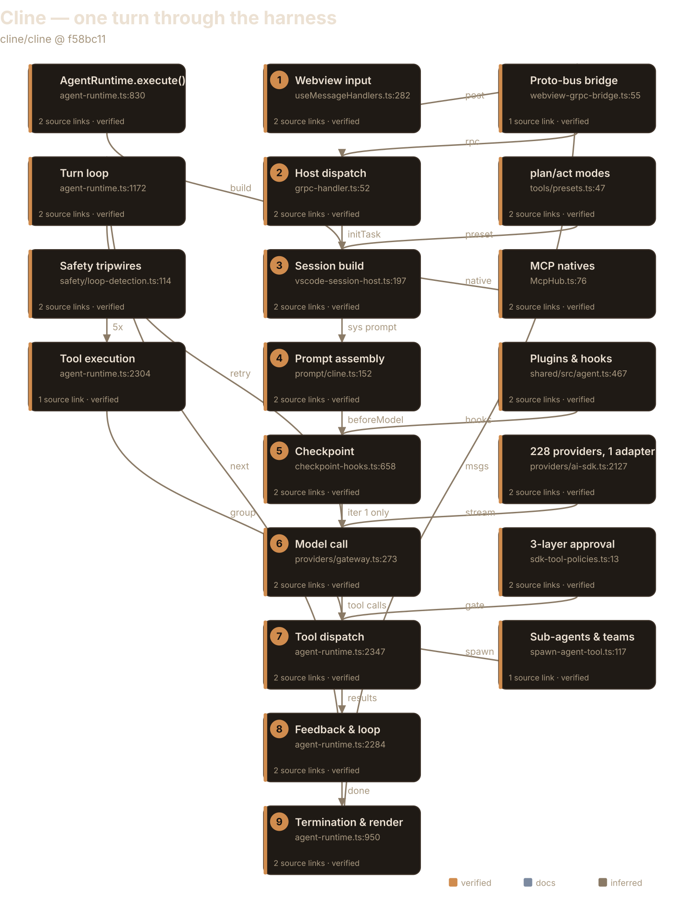
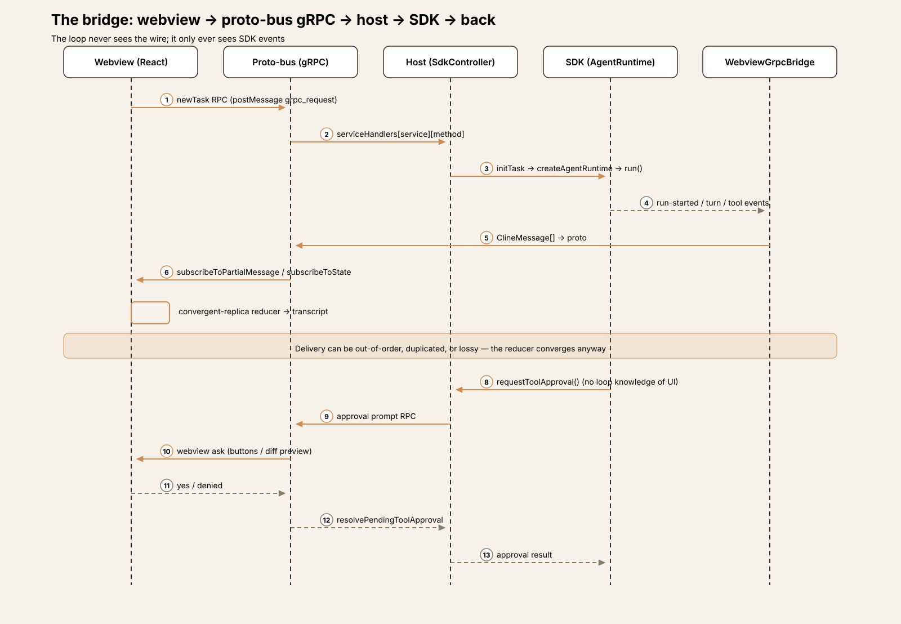
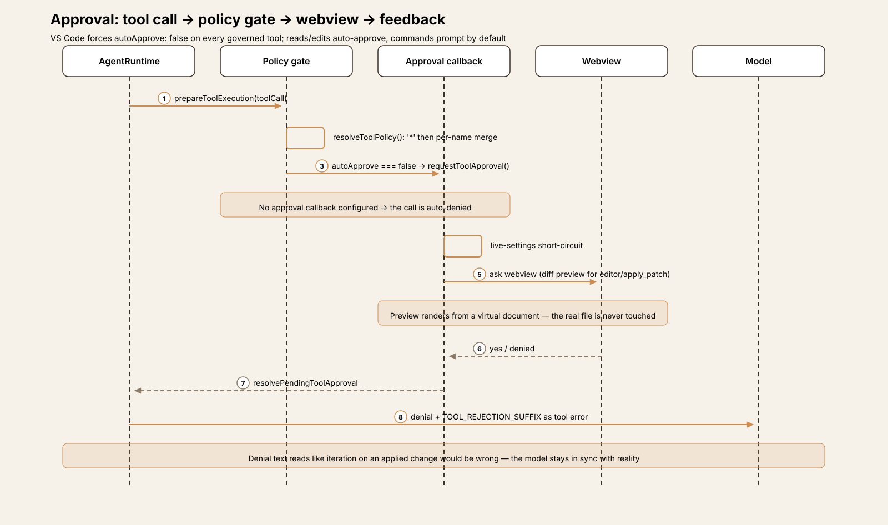
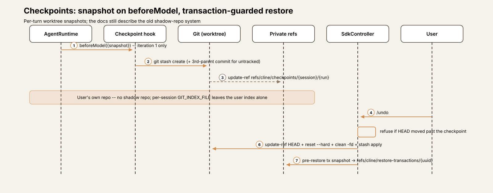

# Agent Harness Anatomy #3: Cline — the approval-gated IDE resident

> **Series:** Agent Harness Anatomy — top-down dissections of real agent
> harnesses, grounded in verifiable source code. Every behavioral claim
> below carries a footnote to a pinned GitHub permalink; the full evidence
> lives in the endnotes.

## Version block

- **Repo:** [cline/cline](https://github.com/cline/cline)
- **Pinned:** tag `v4.1.22` → `f58bc118bdeef1bd2813cd08e00d98bdcda96475` (2026-09-29)
- **Language:** TypeScript (bun workspace)
- **License:** Apache-2.0
- **Claim under test:** "Autonomous coding agent right in your IDE"
- **Scope:** this teardown covers the **VS Code extension** (`apps/vscode/`);
  the SDK underneath is mapped as the loop's home, `apps/cli` is noted where
  it inverts the extension's defaults, and the desktop app is out of scope.[^1]

| Package | Non-test `.ts` | Role |
|---|---|---|
| `apps/vscode/src` | 570 files, 76,962 LOC | Extension host, webview, gRPC bridge |
| `sdk/packages/core/src` | 342 files, 110,215 LOC | Runtime, tools, session, safety, checkpoints |
| `sdk/packages/agents/src` | 2 files, 2,919 LOC | THE loop |
| `sdk/packages/shared/src` | 99 files, 18,252 LOC | Contracts, hooks, prompt templates |
| `sdk/packages/llms/src` | ~17.5k non-generated LOC | Provider gateway + one AI-SDK adapter |

(The `llms` package also carries **199,952 lines of generated model catalog**
— `catalog.generated.ts` alone is 196,595 lines marked "DO NOT EDIT".
Generated artifacts are excluded from the code total
above — a counting convention applied across the series; the catalog's scale is itself a finding, covered under providers.)[^1]



## The mental model

Cline is an **approval-gated, checkpointed pair programmer that lives
inside the IDE**: the agent loop is a host-independent SDK
(`@cline/agents`), the VS Code extension is a thin host that configures
policy and executors, and the webview is a gRPC client rendering a
convergent transcript.[^2] Three inversions against the series so far: pi
pushes policy out to extensions; aider replaces policy with git; Cline
makes policy the product — a three-layer approval model with diff previews
in the IDE.[^3] And where pi's loop is a library you embed and aider's loop
is a CLI you run, Cline's loop is an npm SDK with a plugin interface — the
IDE is one host among several, and the CLI host inverts the extension's
approval posture entirely.[^4]

The governing tradeoff: Cline asks the most and sandboxes the least. Every
command prompts by default, every turn snapshots your worktree, and the
safety net is *reversibility* (checkpoints, diff previews, denial feedback)
rather than *containment*. If you're building a harness, that's Cline's
thesis in one sentence: the user is the sandbox, so make asking cheap and
undoing certain.

## Package map

A layered monorepo, with the dependency direction running strictly
downward:[^5]

```
@cline/shared   contracts: AgentTool, hooks, prompt templates, ToolPolicy
      ↑
@cline/llms     gateway registry + one Vercel-AI-SDK adapter; 228 provider specs
      ↑
@cline/agents   THE loop (agent-runtime.ts, 2,862 lines)
      ↑
@cline/core     ClineCore, session orchestration, tools, safety, checkpoints, extensions
      ↑
apps/vscode     extension host: SdkController, VscodeSessionHost, gRPC, webview
apps/cli        @cline/cli — separate host app, opposite approval default
```

Entry is `apps/vscode/src/extension.ts:67` `activate()` → a
`VscodeWebviewProvider` → `SdkController` (2,499 lines), which builds
sessions through `VscodeSessionHost` (wrapping `ClineCore` with VS Code
tool executors, the MCP hub, and a terminal manager) down to
`createAgentRuntime` in `@cline/agents`.[^2] The React webview
(`apps/vscode/webview-ui/`) never touches the loop — it talks to the host
over a generated proto-bus gRPC bridge (`apps/vscode/proto/`, 22 services,
224 RPCs), and a `WebviewGrpcBridge` translates SDK session events back
into `ClineMessage`s for the UI's subscription streams.[^26]

## The core loop

The loop is `AgentRuntime.execute()` in
`sdk/packages/agents/src/agent-runtime.ts` (2,862 lines). Entry points
`run(input)` / `continue(input)` both funnel into `execute()`, and the
loop construct itself is disarmingly plain:[^7]

```ts
while (
    this.config.maxIterations === undefined ||
    this.state.iteration < this.config.maxIterations
) {
```

Three nested levels, the same shape as aider's:

- **Outer run** — `execute()`: `ensureInitialized()`, a fresh
  `AbortController`, `beforeRun` hooks, a `run-started` event, input
  normalization, a completion-tool reminder injected so the model sees it
  on the first request, then the turn loop.[^8]
- **Turn loop** — per iteration: a `turn-started` event →
  `generateAssistantMessageWithProviderRetry()` (provider retry:
  `PROVIDER_ERROR_MAX_RETRIES = 3`, 1s→15s backoff, transient errors only)
  → the assistant message is recorded → tool-call parts are extracted. With
  no tool calls, completion reminders are consulted and the run either
  re-loops or `finishRun("completed")` fires the `run-finished` event.
  With tool calls, `executeToolCalls()` runs them, results are pushed as
  messages, and `findCompletingToolMessage()` checks whether any tool with
  `lifecycle.completesRun === true` succeeded — exactly one in-tree tool
  has it, `submit_and_exit`: the run's stop button is a tool.[^9][^10]
- **Tool execution** — `prepareToolExecution()`: resolve the tool →
  `beforeTool` hooks (which can rewrite input, override policy, or skip) →
  `resolveToolPolicy()` (merges the `"*"` policy, then the per-name one) →
  `enabled === false` skips → `autoApprove === false` triggers
  `requestToolApproval()` — and if no approval callback is configured, the
  call is **auto-denied**. A denial becomes a skip reason plus
  `TOOL_REJECTION_SUFFIX`, fed back to the model as a tool error.[^11]
  Execution is grouped by `executionMode`: sequential calls run one by one;
  **adjacent parallel calls are batched into one `Promise.all`**. All 9
  default tools are sequential; only `spawn_agent` and configured-agent
  tools opt into `"parallel"`.[^12]

**The most interesting negative finding:** there is no iteration cap in the
VS Code host — `cline-session-factory.ts` sets `maxIterations:
undefined`.[^13] The numeric bound is not turns but *repetition*: loop
detection aborts on 5 consecutive identical tool calls (soft nudge at 3),
and the mistake tracker stops the run after 6 consecutive failed turns
(a productive turn resets the count; at the limit the host decides whether
to continue).[^14] Like pi, Cline trusts the model's stop behavior — but
unlike pi it keeps two tripwires on the wall, both reactive rather than
preventive.

Recovery paths inside the loop: an output-token cut-off with no tool calls
gets `MAX_TOKENS_RECOVERY_LIMIT = 3` retries with a conciseness nudge (the
counter resets on any tool-call turn, so progress buys more budget);
context-window overflow routes to the compaction pipeline or a terminal
message; an empty response throws; a content filter ends with a message
advising the user to rephrase.[^15] Mid-run user messages don't start a new
run — `PendingPromptService` queues them and `notifyPendingUserMessage()`
aborts the in-flight model request so the new message folds into the next
turn.[^16]

## One turn, end to end

Trace: the user types `add a retry helper to src/utils.ts and run the
tests` in the VS Code sidebar, act mode, default auto-approvals.

**① Input (webview).** `handleSendMessage` in the React UI calls
`TaskServiceClient.newTask()` — a generated `ProtoBusClient` subclass.
The webview `postMessage`s `{type: "grpc_request", ...}` to the host;
server-streaming RPCs register callbacks plus an unsubscribe handle. The
model-facing loop never sees this wire; it only ever sees SDK events.[^17]

**② Host dispatch.** `handleGrpcRequest` routes to the generated
`serviceHandlers[service][method]` table, landing in
`SdkController.handleTaskCreation` → `initTask`, which coordinates the
task-start sequence.[^18]

**③ Session build.** `cline-session-factory.ts` builds the session config —
mode `act` selects `ToolPresets.act`, `maxIterations: undefined`, and the
per-mode model fields (`planMode*`/`actMode*` settings keys) — then
`VscodeSessionHost.start` → `ClineCore.start` → a `SessionRuntime` →
`createAgentRuntime` with the 9 default tools, the MCP `server__tool`
natives, and one quiet substitution: VS Code suppresses the SDK's shell
tool via `toolExecutors.bash = undefined` and registers its own
terminal-backed `run_commands` under the identical name — same policy key,
different execution semantics, invisible to the policy layer.[^19][^20]

**④ Prompt assembly.** `buildClineSystemPrompt` renders the ACT base
template, replacing `{{PLATFORM_NAME}}`, `{{CURRENT_DATE}}`,
`{{IDE_NAME}}`, `{{CWD}}`, `{{CLINE_RULES}}` (user rules formatted as
`# Rules` / `## <name>` / instructions), and `{{CLINE_METADATA}}`. Then
`MessageBuilder` normalizes the message list for the API: truncation
budgets, missing-tool-result repair, sticky outdated-rewrite decisions.[^21]

**⑤ Checkpoint.** The `beforeModel` hook fires — iteration 1 only — and
snapshots the worktree: `git stash create`, plus a synthesized third-parent
commit for untracked files, pinned under the private ref
`refs/cline/checkpoints/{session}/{runCount}` **in the user's own
repository**. (More on why the docs describe something else entirely
below.)[^22]

**⑥ Model call.** `DefaultGateway.stream()` → `registry.resolveModel()`
does an **exact-ID match** against the provider catalog (unknown IDs fall
back to an unregistered-model path, not an error) → capability gates →
the family factory builds a Vercel AI SDK provider → `streamText`. Tokens
stream back as runtime events.[^23]

**⑦ Tool dispatch.** The model emits `read_files` and `editor` calls.
`prepareToolExecution` resolves the policy: VS Code forces
`autoApprove: false` on every governed tool so the SDK always consults the
live UI, and the approval callback applies the live settings — reads,
edits, browser, and MCP are auto-approved by default; **commands always
prompt**. `read_files` and `editor` run; each result is appended.[^24]

**⑧ Feedback & loop.** Tool results feed the next iteration. When the model
calls `run_commands` for the tests, the approval callback prompts in the
webview — edits get a diff preview rendered from a virtual document ("the
real file is never opened or modified by the preview"); command asks get
buttons. A denial comes back with "The user denied this edit. The file was
NOT modified…" plus `TOOL_REJECTION_SUFFIX`, fed to the model as a tool
error — the denial text is written to read like *iteration on an applied
change would be wrong*, keeping the model in sync with reality.[^25]

**⑨ Termination & render.** No more tool calls, no completion reminders →
`finishRun("completed")` → `run-finished` → `WebviewGrpcBridge` translates
SDK events into `ClineMessage`s → proto → the webview's
`subscribeToPartialMessage` / `subscribeToState` streams → the
convergent-replica reducer renders the transcript. If the user wants the
pre-turn worktree back, `/undo` calls `SdkController.restoreCheckpoint`:
refuse if HEAD moved past the checkpoint, else `update-ref HEAD` +
`reset --hard` + conditional `clean -fd` + `stash apply`, guarded by a
pre-restore transaction snapshot under
`refs/cline/restore-transactions/{uuid}`.[^26][^27]

## The bridge: host ↔ webview

The extension host and the React webview are two processes that never share
memory, and the wire between them is a first-class architectural component
— not a rendering detail. It is the mechanism by which loop events become
IDE UI and user gestures become loop inputs, with no analogue in pi or
aider. Everything between host and webview crosses `apps/vscode/proto/`: **22
services, 224 RPCs** — 16 `cline/*` services (tasks, checkpoints, MCP,
browser, terminal…) and 6 `host/*` services (the host calling back into the
webview).[^26] The clients are generated `ProtoBusClient` subclasses; the
server side is a generated `serviceHandlers` dispatch table. A "send
message" is a `newTask` RPC; a "stream the transcript" is two
server-streaming subscriptions (`subscribeToPartialMessage`,
`subscribeToState`) with callback-plus-unsubscribe handles on the webview
side.[^17][^18]

The transcript is a **convergent replica**. The SDK emits events; the
`WebviewGrpcBridge` translates each into a `ClineMessage`; the messages
cross the proto wire; the webview reduces them into React state. Delivery
can be out-of-order, duplicated, or lossy — the reducer converges anyway.
pi's TUI, RPC mode, and print mode are all subscribers to one event stream
with no privileged renderer; Cline keeps the no-privileged-renderer shape
but puts a lossy network in the middle and makes convergence the webview's
job.[^26]

This layering is also what makes the loop host-independent. The
`AgentRuntime` in `@cline/agents` knows nothing about VS Code: it emits
typed events and honors a 7-callback hook bag. The VS Code host is
configuration — tool executors, policy construction, the approval
callback, the checkpoint hook — plus the bridge. The CLI host is the same
loop with opposite policy (`"*": {autoApprove: true}`) and no webview at
all.[^2][^4] If you're building a harness, that's the design decision to
steal: *the loop is the product; every interface is a host*, and the price
is a real distributed-systems problem (224 RPCs, convergent transcripts)
where a terminal harness has a function call.

One seam lives here worth naming: VS Code's slash-command expansion is
permissive mid-message (`expandSlashCommands`), while the SDK/CLI path only
expands a leading `/` (`resolveRuntimeSlashCommand`) — two expansion
semantics for the same user gesture, split by which host you're in.[^43]



## Subsystem inventory

- **Tools.** 9 built-ins, all factories in
  `sdk/packages/core/src/extensions/tools/definitions.ts`:[^28]

  | Tool | Factory | Notes |
  |---|---|---|
  | `read_files` | `createReadFilesTool` (:268) | retryable, maxRetries=1 |
  | `search_codebase` | `createSearchTool` (:364) | retryable, maxRetries=1 |
  | `run_commands` | `createShellTool` (:496) | non-retryable; suppressed in VS Code, replaced by the terminal-backed same-named tool |
  | `fetch_web_content` | `createWebFetchTool` (:556) | retryable, maxRetries=2 |
  | `apply_patch` | `createApplyPatchTool` (:649) | canonical patch format; non-retryable |
  | `editor` | `createEditorTool` (:698) | diff-view edit pipeline; non-retryable ("stateful") |
  | `skills` | `createSkillsTool` (:761) | invokes skill/slash-command bodies |
  | `ask_question` | `createAskQuestionTool` (:818) | user question round-trip |
  | `submit_and_exit` | `createSubmitAndExitTool` (:839) | `lifecycle.completesRun: true` — the run's stop button |

  The contract is `AgentTool` = definition + `executionMode`
  (`"sequential"` | `"parallel"`) + `timeoutMs` / `retryable` /
  `maxRetries` / `execute`, built by the `createTool` factory (default
  `timeoutMs: 30_000`).[^29] Registration runs through
  `DefaultRuntimeBuilder.build` → `createBuiltinToolsList` → mode preset
  (`ToolPresets`) + model-tool routing + executor merge → policy and
  global-disabled filtering; **host executors take precedence over SDK
  defaults**, which is how VS Code injects its terminal, editor-diff, and
  file-read executors without forking the runtime.[^30] Team mode adds
  `spawn_agent` plus eleven `team_*` tools — the only in-tree parallel
  tools besides configured-agent tools.[^31] And the old world is truly
  gone: no `AgentTool` is registered under any legacy name
  (`write_to_file`, `execute_command`, `browser_action`, `use_mcp_tool`,
  …) — the names survive only in display enums, message-translator compat
  cases, and policy alias lists.[^32]

- **The approval model** (the signature subsystem). Three layers:

  **1. The SDK policy gate** (`prepareToolExecution`): `ToolPolicy` is
  `{enabled, autoApprove}`, both defaulting to **true** — unlisted tools
  fail open, and only an explicit `autoApprove === false` triggers the
  approval callback. With no callback configured, the call is auto-denied.[^11]
  **2. VS Code policy construction**: `buildToolPolicies` forces
  `autoApprove: false` on *every governed tool* — reads, edits, commands,
  web, all `server__tool` MCP tools — so the SDK always consults the live
  UI. The live defaults then auto-approve reads, edits, browser, and MCP;
  **commands always prompt**. The CLI is the mirror image:
  `"*": {autoApprove: true}`.[^3][^39]
  **3. The approval callback**: live-settings short-circuit → diff preview
  for `editor`/`apply_patch` from a virtual document → webview ask →
  `resolvePendingToolApproval`. Anything but "yes" is a denial, and the
  denial reason is crafted so the model doesn't hallucinate an applied
  edit.[^25]

  Two seams. First, the per-server per-tool `autoApprove` arrays in the MCP
  settings file are **dead in the SDK path** — the callback honors only the
  global `actions.useMcp` toggle — and there is no tool-count limit; a
  tool-list change triggers a silent session rebuild.[^34] Second, a naming
  mismatch with teeth: `buildToolPolicies` keys policies on the raw
  `server__tool` name, but registration runs names through a transform that
  truncates anything over 64 characters to 55 chars + `_` + an 8-char sha1 —
  while policy lookup uses the *registered* name. A long MCP tool name
  misses its `{autoApprove: false}` policy and falls through to the
  default-open `autoApprove: true`.[^34] Two naming schemes, one lookup,
  fail-open default: the kind of seam that only a pinned-reading finds.



- **Checkpoints — the docs are wrong.** `docs/core-workflows/checkpoints.mdx`
  claims Cline "maintains a shadow Git repository separate from your
  project's actual Git history," snapshotting "after each tool use" while
  "your main Git repository stays untouched." At this SHA, all three claims
  are false.[^22] The code snapshots **once per user turn** (the
  `beforeModel` hook, iteration 1 only), via `git stash create` plus a
  synthesized third-parent commit for untracked files, pinned under private
  refs `refs/cline/checkpoints/{session}/{runCount}` **in the user's own
  repo** — using a persistent per-session `GIT_INDEX_FILE` so the user's
  index is never disturbed. Restore refuses if HEAD moved past the
  checkpoint; otherwise `update-ref HEAD` + `reset --hard` + conditional
  `clean -fd` + `stash apply`, guarded by a pre-restore transaction
  snapshot. The docs describe the legacy system; the code describes
  `git stash` with private refs. Code wins, and the disagreement is the
  finding.[^27]



- **Safety.** Loop detection watches consecutive identical (name +
  key-sorted-JSON-signature) tool calls: a user-role recovery nudge at 3, a
  mistake record and abort at 5 — but it's **reactive**, fed from the
  `tool-started` event rather than the `beforeTool` hook its own header
  claims, so the 5th call starts before the abort lands.[^14] The mistake
  tracker defaults to 6 consecutive all-failed turns; a productive turn
  resets it; at the limit the host decides continue vs stop.[^14]
  `rules.ts` is system-prompt formatting only — no enforcement.
  `subprocess-sandbox.ts` is an IPC wrapper for internal Node helpers and
  the agent-plugin sandbox, **not** a command sandbox: `run_commands`
  executes unsandboxed in the user's shell.[^40] The plan-mode guard is a
  `beforeTool` hook rejecting file-editing shell commands, and it documents
  itself honestly as "a simple blacklist, not a shell interpreter" that
  won't catch `python -c "open(...,'w')"`.[^40]

- **Providers — aider's philosophy, pi-beating transport unity.** 228
  registered providers (211 models.dev-generated specs + 17 handwritten,
  merged by `mergeBuiltinSpecs`), but **no per-provider handler classes**:
  14 `ProviderFamily` values bind to one generic `createAiSdkProvider` —
  the Vercel AI SDK is the universal transport (`streamText`), vendor
  modules only construct AI-SDK provider instances, and the legacy
  `ApiHandler` interface survives as a compat shim.[^6][^41] Model
  resolution is an **exact-ID match** (`registry.resolveModel`); an unknown
  model ID takes the unregistered-model fallback, not an error. Per-model
  behavior is data-driven — capabilities, reasoning options, route matchers
  — with **no aider-style substring heuristics** in the resolution
  path.[^23] Adding a provider means adding a `BuiltinSpec` record, not a
  handler class. The tradeoff is scale: the philosophy needs a ~200k-line
  generated catalog that must be regenerated as the model world changes —
  aider's 313-entry YAML fits in a code review; Cline's doesn't.[^6]

- **MCP.** `McpHub` (2,196 lines): stdio, SSE, and streamable HTTP servers
  from a zod-validated `cline_mcp_settings.json`, chokidar-watched with
  content-fingerprint reconciliation, OAuth support, and debounced refresh
  on `tools/list_changed` notifications.[^33] Server tools become **native
  `AgentTool`s** via `createMcpTools`, named `server__tool` — no
  `use_mcp_tool` wrapper in the SDK path. Resources and prompts are
  webview-display-only; no agent tool reads MCP resources.[^33] Approval is
  where the seams from the approval section bite: every MCP tool is forced
  to `autoApprove: false`, but the callback only honors the global toggle.

- **Modes.** The classic Architect/Code/Debug/Ask/Orchestrator modes do not
  exist at this SHA. What exists: VS Code's `Mode = "plan" | "act"`, the
  SDK's `AgentMode = "act" | "plan" | "yolo" | "zen"` — and **no custom
  modes**.[^35] Per-mode differences are minimal and mechanical: plan vs
  act differ by **exactly one tool** (`editor` off in plan);
  `run_commands` stays on in plan for read-only investigation, with the
  plan-mode command-guard hook as the hard backstop. Plan mode is the ACT
  system prompt plus appended `PLAN_MODE_INSTRUCTIONS`; yolo gets its own
  base template. Each mode can name its own model via `planMode*` /
  `actMode*` settings keys. Switching mid-task (`togglePlanActMode`)
  cancels the turn and **rebuilds the whole session** — new toolset, new
  prompt, new guard registration — stamping `<mode_notice>` on the next
  user message. The CLI additionally exposes a model-callable
  `switch_to_act_mode` tool that VS Code deliberately omits.[^35]

- **Prompt construction.** `buildClineSystemPrompt`: base template (ACT or
  YOLO) + placeholder replacement + mode instructions; `overridePrompt`
  wins entirely if set. `MessageBuilder` then normalizes for the API —
  truncation budgets, missing-tool-result repair, sticky outdated-rewrite
  decisions. User rules inject via the `registerRule` extension API,
  formatted as `# Rules` / `## <name>` / instructions.[^21]

- **Hooks & plugins.** Two hook layers. The **runtime hook bag**
  (`AgentRuntimeHooks`): seven callbacks —
  `beforeRun`/`afterRun`/`beforeModel`/`afterModel`/`beforeTool`/`afterTool`/`onEvent`.
  `beforeTool` can rewrite input, override the `ToolPolicy`, or skip the
  call; hooks can `appendContext` (lands as a `<hook_context>` user message
  on the next request), `stop`, or drive `AgentStopControl`.[^36] The
  **plugin interface** (`AgentRuntimePlugin`): `setup()` returns `{tools,
  hooks}` — pi-grade extensibility at the SDK layer, which aider has
  nothing comparable to.[^4] Then **file-based user hooks**: ten named hook
  files (`TaskStart`…`SessionShutdown`), discovered across
  `~/Documents/Cline/Hooks`, `~/.cline/hooks`, and workspace hook dirs;
  hook scripts can emit `cancel`, `contextModification`, `systemPrompt`,
  or `appendMessages`. `PreCompact` is named but maps to `undefined` —
  unwired. A **legacy** JSON-stdin/stdout hook system survives only through
  `hooks-adapter.ts`, which wires 4 of 9 points and explicitly lists 5 as
  not wired.[^36]

- **Session state.** New sessions persist to **SQLite** (a `sessions` table
  with optimistic concurrency via `status_lock`), with a
  `FileSessionService` (`sessions.index.json`) implementing the same
  adapter — two backends behind one interface. Per-session artifacts: a
  **versioned whole-file JSON envelope** (`{version: 1, updated_at,
  messages: [...]}` — rewritten via `writeFileSync` on persist, not
  append-only), a `compaction.json` sidecar (prefix-hash verified), and a
  manifest. Legacy tasks persist as `tasks/<taskId>/{ui_messages.json,
  api_conversation_history.json, context_history.json,
  task_metadata.json}`, bridged by `sdk-task-history.ts`; resume pins
  `config.sessionId = taskId` and reseeds via `startSession`. Compaction is
  manual (`/compact` → `condense` RPC → `compactTask()`); the old behavior,
  per the `condense.ts` docstring, "produced an improvised fake summary
  without actually compacting" (ref CLINE-2503).[^37]

- **Sub-agents.** Present, in both stacks. Legacy: YAML agent configs under
  `~/Documents/Cline/Agents/` become dynamic `use_subagent_<name>` tools
  via a chokidar-watched loader. Core: the `spawn_agent` tool (spawns a
  full delegated agent, waits, returns text/iterations/usage), configured
  markdown agents (frontmatter: name, description, tools, skills,
  providerId, modelId, maxIterations), and the team runtime with its
  `team_*` tools.[^31][^38] Neither pi (deliberately omitted) nor aider
  (architect = sequential delegation with a user gate) has this.

- **Interfaces.** The VS Code sidebar webview is primary, over the
  proto-bus gRPC bridge. `@cline/cli` (3.0.66) is a separate host app with
  the opposite approval default. `@cline/sdk` on npm is literally
  `export * from "@cline/core"` — one line, no README.[^4][^39] There is no
  TUI event stream equivalent to pi's; rendering is webview React state fed
  by the two subscription streams through the convergent-replica reducer.[^26]

- **Failure handling.** Provider retry (3 retries, 1s→15s backoff,
  transient-only); output-limit cut-off (3 recovery retries with a
  conciseness nudge, counter resets on tool-call progress); context
  overflow (compaction pipeline, then terminal messages); loop detection
  (3× nudge / 5× abort, reactive); mistake tracker (6 consecutive, host
  decides); no `maxIterations` in the VS Code host — the numeric bound is 5
  identical tool calls, not turns.[^9][^13][^14][^15]

- **Security model.** Approvals at the tool boundary (per-tool policies +
  webview UI with diff previews), **not** sandboxing — `run_commands` runs
  unsandboxed in the user's shell. Safety net #2 is the checkpoint refs
  (per-turn worktree snapshots, restorable, transaction-guarded). Safety
  net #3 is the plan-mode command blacklist, self-documented bypasses and
  all.[^3][^22][^40] Contrast the series: pi relies on extension policy +
  `beforeToolCall`; aider relies on git auto-commit + boundary prompts.
  Cline asks the most (every command prompts by default) and sandboxes the
  least.

## Extension points

Cline's extension surface is the richest of the three harnesses so far —
and it operates at two altitudes: the SDK's programmatic plugin layer and
the user's file-based layer.

### 1. Runtime hooks

The 7-callback `AgentRuntimeHooks` bag (`beforeRun`/`afterRun`/
`beforeModel`/`afterModel`/`beforeTool`/`afterTool`/`onEvent`) is the
innermost seam: `beforeTool` can rewrite a call's input, override its
`ToolPolicy`, or skip it; hooks can `appendContext` (surfaced as a
`<hook_context>` user message on the next request), `stop` the run, or
drive `AgentStopControl`. The checkpoint system itself is just a
`beforeModel` hook — the deepest integration point is also the extension
API.[^36]

**Start here:** `AgentRuntimeHooks` in `sdk/packages/shared/src/agent.ts`.
If you're porting a pi `beforeToolCall` gate, this is the same shape with
more verbs.

### 2. Plugins (`AgentRuntimePlugin`)

`setup()` returns `{tools, hooks}` — tools enter the same registry and
policy pipeline as the 9 built-ins, hooks join the runtime bag. This is
pi-grade extensibility at the SDK layer: policy-aware, lifecycle-aware,
and host-independent.[^4]

**Start here:** the plugin interface at
`sdk/packages/shared/src/agent.ts:493-507`, then
`DefaultRuntimeBuilder.build` to see where plugin tools merge.

### 3. Custom tools

`createTool({name, description, inputSchema, execute})` plus the execution
contract (`executionMode`, `timeoutMs` defaulting to 30s, `retryable` /
`maxRetries`). Host executors take precedence over SDK defaults, so a host
can re-skin execution (terminal-backed shell, diff-view editor) without
touching tool definitions — the mechanism VS Code itself uses.[^29][^30]

**Start here:** `createTool` in `sdk/packages/shared/src/tools/create.ts`,
then a built-in factory in `definitions.ts` for the input-schema idiom.

### 4. File-based user hooks

Ten named hook files (`TaskStart`…`SessionShutdown`), discovered across
`~/Documents/Cline/Hooks`, `~/.cline/hooks`, and workspace hook dirs.
Hook scripts run as subprocesses and can emit `cancel`,
`contextModification`, `systemPrompt`, or `appendMessages` — user-level
automation without writing TypeScript. `PreCompact` is named in the config
but maps to `undefined`: the extension point exists, the wiring doesn't.[^36]

**Start here:** `hook-file-config.ts` for the ten names and discovery
order, `hook-file-hooks.ts` for the engine.

### 5. Skills

The `skills` tool invokes skill bodies, with `SKILL.md` discovery across
`~/.cline/skills`, `.agents/skills`, and project dirs — the same
frontmatter-and-markdown shape pi uses, but executed as a tool call rather
than prompt injection.[^43]

### 6. Slash commands

Two expansion semantics, split by host: VS Code's `expandSlashCommands` is
permissive mid-message; the SDK/CLI `resolveRuntimeSlashCommand` only
expands a leading `/`. Same user gesture, different parsing, depending on
which host you're in — a small seam, but exactly the kind the bridge
section warns about.[^43]

### 7. MCP servers

Configure in `cline_mcp_settings.json` (zod-validated, chokidar-watched);
tools arrive as native `server__tool` `AgentTool`s. No wrapper layer, no
`use_mcp_tool` — but mind the approval seams documented above: the global
toggle is the only live switch, and long names can miss their policies.[^33][^34]

**Start here:** `McpHub.ts` for lifecycle, `createMcpTools` for the
tool-creation path.

### 8. Sub-agents & teams

Three generations coexist: legacy YAML agents (`~/Documents/Cline/Agents/`
→ `use_subagent_<name>` tools), the `spawn_agent` tool (full delegated
agent, waits, returns text/iterations/usage), configured markdown agents
with frontmatter (name, description, tools, skills, provider, model,
maxIterations), and the team runtime with its `team_*` tools — the only
in-tree parallel tools.[^31][^38]

### 9. Rules

`.clinerules` files and the `registerRule` extension API feed
`formatRulesForSystemPrompt`, rendering user rules as `# Rules` /
`## <name>` / instructions in the system prompt. Formatting only — no
enforcement; the command guard is a separate, dumber layer.[^21][^40]

## Tradeoffs

- **Approval-gating vs git-as-safety vs hook policy.** pi gives you the
  hook and makes you build the gate; aider never asks for chat files and
  lets git remember; Cline asks constantly and remembers via private refs.
  Cline's bet: interruptions are cheaper than surprises, *if* asking is
  one click and undo is certain. The price is prompt fatigue — which is why
  the defaults auto-approve reads and edits and only ever force the
  question on commands.[^3][^24]
- **Per-turn checkpoints vs per-turn commits.** aider's auto-commits are
  public history in your repo; Cline's are `git stash` snapshots under
  private refs, invisible until you ask, with a transaction-guarded
  restore. Commits are for humans; stash-refs are for the machine. Cline's
  are cheaper to create and harder to discover — which is presumably why
  the docs still describe the old shadow-repo story nobody updated.[^22][^27]
- **SDK-lib loop vs embedded loop.** pi's loop is a library you embed;
  aider's is a CLI you run; Cline's is an npm package you host. The
  dividend: the CLI host reuses the entire loop with a one-line policy
  inversion. The cost: the host↔webview bridge is a 224-RPC distributed
  system with a convergent transcript — a whole reliability problem a
  terminal harness never has.[^4][^26]
- **Data-driven catalog vs heuristics vs agnosticism.** pi is
  model-agnostic by design; aider is model-aware by necessity (substring
  heuristics, load-bearing); Cline is model-aware by *scale* — 228
  providers behind one AI-SDK adapter, exact-ID resolution, per-model
  behavior as data. No brittle string matching, but a ~200k-line generated
  catalog that rots the moment models.dev changes shape.[^6][^23]
- **Native MCP tools vs wrapped MCP tools.** pi wraps each server tool in
  its own `ToolDefinition`; Cline mints them as first-class `AgentTool`s.
  The wrapper is a seam you can see; the native path hides its seams
  deeper — in policy-key naming, where a truncated name fails open.[^33][^34]

## Deliberate omissions

- **No repo map.** The negative grep is clean — no tree-sitter, no ctags,
  no PageRank anywhere in the SDK or the extension. aider's signature
  subsystem is simply absent; Cline answers "how does the model see the
  codebase" with search/read tools, plan mode, and the user's own file
  selection in the IDE.[^42]
- **No custom modes.** plan/act is the whole space (plus yolo/zen in the
  SDK/CLI, which are presets, not user-definable modes). The classic
  Architect/Code/Debug/Ask/Orchestrator vocabulary is gone, and nothing
  replaced it as a user-facing abstraction.[^35]
- **No command sandbox.** Approvals and checkpoints are the entire safety
  story; `run_commands` runs in the user's shell, unsandboxed, by design.[^40]
- **No edit-format negotiation.** The model calls tools; it never emits
  prose edit blocks. aider's whole format-compatibility machinery —
  the 313-entry YAML, the per-model heuristics — has no counterpart
  because the function-calling contract replaced it.[^6]
- **No public event stream.** SDK events exist, but the webview is the
  privileged renderer at the end of a gRPC bridge — pi's "every interface
  is a subscriber" shape, with one subscriber that matters.[^26]

## Comparison matrix row

| # | Dimension | pi (v1.0.2) | aider (v0.86.2) | Cline (v4.1.22) |
|---|---|---|---|---|
| 1 | Agent loop | Event-sourced; inner + outer loops; no iteration cap | No tool-call loop; parse→apply→reflect; REPL + reflection (≤3) + retry | Host-independent SDK `AgentRuntime.execute`; turn loop + tool execution; `maxIterations: undefined` in VS Code host — bound is 5 identical tool calls [^7][^13][^14] |
| 2 | Tool system | 4 built-ins + registry; TypeBox validation; sequential/parallel | None — model emits SEARCH/REPLACE blocks | 9 built-ins + MCP natives + team tools; sequential default, adjacent-parallel batching; 30s default timeout [^12][^28][^29] |
| 3 | Model providers | ~35 behind one `StreamFn` | litellm; 313-entry YAML + substring heuristics | 228 providers, one generic Vercel AI SDK adapter; exact-ID resolution; data-driven per-model behavior; ~200k-line generated catalog [^6][^23] |
| 4 | Prompt construction | Structured sections, diffed per turn | Fixed wire order, synthetic user/assistant pairs, cache breakpoints | Template + placeholder replacement; `MessageBuilder` normalization; rules as `# Rules` sections [^21] |
| 5 | Memory/session | JSONL sessions; compaction | In-memory cur/done; background summarization; markdown log; git auto-commit | SQLite + file-backend; versioned whole-file JSON envelopes; manual `/compact` (was fake pre-CLINE-2503) [^37] |
| 6 | Reasoning/planning | Thinking forwarded; no planner/sub-agents | Architect = sequential delegation with user gate | plan/act modes (differ by one tool); sub-agents + teams present [^35][^38] |
| 7 | Extensibility | TS extensions, hooks, MCP, skills | 42 closed commands; no plugin API/MCP/skills | Richest so far: `AgentRuntimePlugin`, 7-callback hooks, file hooks, skills, MCP, sub-agents [^4][^36] |
| 8 | Interfaces | TUI / print / RPC / SDK on one event stream | prompt_toolkit CLI + streamlit GUI | VS Code webview over proto-bus gRPC (22 svcs/224 RPCs) + CLI host + npm SDK re-export [^26][^39] |
| 9 | Failure handling | Auto-retry, truncation guards, abort; no cap | Exp-backoff (60s); malformed edits reflected (≤3) | Provider retry 3×; output-limit recovery 3×; loop detection 3×/5× (reactive); mistake tracker 6; no host iteration cap [^9][^14][^15] |
| 10 | Security model | Project trust + extension hooks; no approval UX | Boundary prompts; git auto-commit + `/undo`; no sandbox | Finest-grained: per-tool policies + webview UI + diff previews; commands always prompt; no sandbox; per-turn stash checkpoints [^3][^22][^40] |

## Endnotes

All notes are VERIFIED against `v4.1.22`
(`f58bc118bdeef1bd2813cd08e00d98bdcda96475`) unless marked DOCS.
`GH` = `https://github.com/cline/cline/blob/f58bc118bdeef1bd2813cd08e00d98bdcda96475/`.

[^1]: Tag `v4.1.22` ("chore(vscode): release v4.1.22"), committed 2026-09-29
    20:51:26 -0700; Apache-2.0 (`LICENSE`); TypeScript bun workspace.
    Non-test `.ts`: `apps/vscode/src` 570 files / 76,962 LOC,
    `sdk/packages/core/src` 342 / 110,215, `sdk/packages/agents/src` 2 /
    2,919, `sdk/packages/shared/src` 99 / 18,252,
    `sdk/packages/llms/src` ~17.5k non-generated. Generated catalog
    excluded as generated code: `catalog.generated.ts` 196,595 lines
    ("Auto-generated model catalog … DO NOT EDIT"),
    `providers.generated.ts` 2,973, `provider-ids.generated.ts` 224,
    `cline-recommended.generated.ts` 160 — 199,952 generated lines total.
    Entry: `activate()` at
    [GH…/apps/vscode/src/extension.ts#L67](https://github.com/cline/cline/blob/f58bc118bdeef1bd2813cd08e00d98bdcda96475/apps/vscode/src/extension.ts#L67).
    Scope: the VS Code extension; `apps/cli` noted for its inverted
    approval default; the desktop app is out of scope.
[^2]: The loop is `AgentRuntime.execute()` in
    [GH…/sdk/packages/agents/src/agent-runtime.ts](https://github.com/cline/cline/blob/f58bc118bdeef1bd2813cd08e00d98bdcda96475/sdk/packages/agents/src/agent-runtime.ts)
    (2,862 lines). Extension entry `extension.ts:67` → `VscodeWebviewProvider`
    → `SdkController` (`apps/vscode/src/sdk/SdkController.ts`, 2,499 lines)
    → `VscodeSessionHost` (`apps/vscode/src/sdk/vscode-session-host.ts`)
    wrapping `ClineCore` with VS Code tool executors, the MCP hub, and a
    terminal manager. The webview never touches the loop — see [^26].
[^3]: Three approval layers. (1) SDK policy gate: `ToolPolicy{enabled,
    autoApprove}`, both defaulting to `true`, at
    [GH…/sdk/packages/shared/src/llms/tools.ts#L7-L19](https://github.com/cline/cline/blob/f58bc118bdeef1bd2813cd08e00d98bdcda96475/sdk/packages/shared/src/llms/tools.ts#L7-L19)
    — unlisted tools fail open; only `autoApprove === false` triggers
    approval. (2) VS Code policy construction:
    [GH…/apps/vscode/src/sdk/sdk-tool-policies.ts#L13-L41](https://github.com/cline/cline/blob/f58bc118bdeef1bd2813cd08e00d98bdcda96475/apps/vscode/src/sdk/sdk-tool-policies.ts#L13-L41)
    forces `autoApprove: false` on every governed tool. (3) The approval
    callback at
    [GH…/apps/vscode/src/sdk/sdk-interaction-coordinator.ts#L94-L137](https://github.com/cline/cline/blob/f58bc118bdeef1bd2813cd08e00d98bdcda96475/apps/vscode/src/sdk/sdk-interaction-coordinator.ts#L94-L137).
    CLI mirror image: `"*": {autoApprove: true}` at
    [GH…/apps/cli/src/main.ts#L893-L902](https://github.com/cline/cline/blob/f58bc118bdeef1bd2813cd08e00d98bdcda96475/apps/cli/src/main.ts#L893-L902).
[^4]: `@cline/sdk` is
    `export * from "@cline/core"` — one line, no README. The plugin
    interface `AgentRuntimePlugin` (`setup()` → `{tools, hooks}`) at
    [GH…/sdk/packages/shared/src/agent.ts#L493-L507](https://github.com/cline/cline/blob/f58bc118bdeef1bd2813cd08e00d98bdcda96475/sdk/packages/shared/src/agent.ts#L493-L507).
[^5]: Layering per `sdk/ARCHITECTURE.md`; dependency direction verified
    from imports: `extension.ts` → `SdkController` →
    `VscodeSessionHost` (`ClineCore`) → `SessionRuntime` →
    `createAgentRuntime` (`@cline/agents`). `AgentTool` contract at
    [GH…/sdk/packages/shared/src/agent.ts#L202](https://github.com/cline/cline/blob/f58bc118bdeef1bd2813cd08e00d98bdcda96475/sdk/packages/shared/src/agent.ts#L202).
[^6]: 228 registered providers: 211 models.dev-generated specs + 17
    handwritten, merged by `mergeBuiltinSpecs` at
    [GH…/sdk/packages/llms/src/providers/builtins.ts#L356](https://github.com/cline/cline/blob/f58bc118bdeef1bd2813cd08e00d98bdcda96475/sdk/packages/llms/src/providers/builtins.ts#L356)
    (ID universe cross-checked via `BUILT_IN_PROVIDER_IDS` at
    [GH…/sdk/packages/llms/src/providers/ids.ts#L90-L92](https://github.com/cline/cline/blob/f58bc118bdeef1bd2813cd08e00d98bdcda96475/sdk/packages/llms/src/providers/ids.ts#L90-L92)).
    No per-provider handler classes: 14 `ProviderFamily` values bind to one
    generic `createAiSdkProvider` at
    [GH…/sdk/packages/llms/src/ai-sdk.ts#L2127](https://github.com/cline/cline/blob/f58bc118bdeef1bd2813cd08e00d98bdcda96475/sdk/packages/llms/src/ai-sdk.ts#L2127);
    the universal transport is AI-SDK `streamText` at
    [GH…/sdk/packages/llms/src/ai-sdk.ts#L2324](https://github.com/cline/cline/blob/f58bc118bdeef1bd2813cd08e00d98bdcda96475/sdk/packages/llms/src/ai-sdk.ts#L2324).
[^7]: The loop construct, verbatim, at
    [GH…/sdk/packages/agents/src/agent-runtime.ts#L830-L833](https://github.com/cline/cline/blob/f58bc118bdeef1bd2813cd08e00d98bdcda96475/sdk/packages/agents/src/agent-runtime.ts#L830-L833).
    Entry: `run(input)` at L623, `continue(input)` at L627, both into
    `execute()` at L783.
[^8]: `execute()` stages — `ensureInitialized()`, fresh `AbortController`,
    `beforeRun` hooks, `run-started` event, input normalization, the
    completion-tool reminder — at
    [GH…/sdk/packages/agents/src/agent-runtime.ts#L783-L830](https://github.com/cline/cline/blob/f58bc118bdeef1bd2813cd08e00d98bdcda96475/sdk/packages/agents/src/agent-runtime.ts#L783-L830).
[^9]: `generateAssistantMessageWithProviderRetry()` at
    [GH…/sdk/packages/agents/src/agent-runtime.ts#L1172](https://github.com/cline/cline/blob/f58bc118bdeef1bd2813cd08e00d98bdcda96475/sdk/packages/agents/src/agent-runtime.ts#L1172);
    `PROVIDER_ERROR_MAX_RETRIES = 3`, 1s→15s backoff, transient errors
    only, at
    [GH…/sdk/packages/agents/src/agent-runtime.ts#L76-L86](https://github.com/cline/cline/blob/f58bc118bdeef1bd2813cd08e00d98bdcda96475/sdk/packages/agents/src/agent-runtime.ts#L76-L86).
[^10]: `executeToolCalls()` at
    [GH…/sdk/packages/agents/src/agent-runtime.ts#L2284](https://github.com/cline/cline/blob/f58bc118bdeef1bd2813cd08e00d98bdcda96475/sdk/packages/agents/src/agent-runtime.ts#L2284);
    `findCompletingToolMessage()` at L2320; `submit_and_exit` carries
    `lifecycle.completesRun: true` at
    [GH…/sdk/packages/core/src/extensions/tools/definitions.ts#L845-L847](https://github.com/cline/cline/blob/f58bc118bdeef1bd2813cd08e00d98bdcda96475/sdk/packages/core/src/extensions/tools/definitions.ts#L845-L847)
    — the only in-tree tool with it. Completion reminders via
    `getCompletionReminderMessages` at
    [GH…/sdk/packages/agents/src/agent-runtime.ts#L763](https://github.com/cline/cline/blob/f58bc118bdeef1bd2813cd08e00d98bdcda96475/sdk/packages/agents/src/agent-runtime.ts#L763);
    otherwise `finishRun("completed")`.
[^11]: `prepareToolExecution()` at
    [GH…/sdk/packages/agents/src/agent-runtime.ts#L2347](https://github.com/cline/cline/blob/f58bc118bdeef1bd2813cd08e00d98bdcda96475/sdk/packages/agents/src/agent-runtime.ts#L2347):
    `resolveToolPolicy` merges `"*"` then per-name at
    [GH…/sdk/packages/agents/src/agent-runtime.ts#L216-L225](https://github.com/cline/cline/blob/f58bc118bdeef1bd2813cd08e00d98bdcda96475/sdk/packages/agents/src/agent-runtime.ts#L216-L225);
    `requestToolApproval()` at
    [L2445](https://github.com/cline/cline/blob/f58bc118bdeef1bd2813cd08e00d98bdcda96475/sdk/packages/agents/src/agent-runtime.ts#L2445)
    (no callback configured → auto-deny); denials append
    `TOOL_REJECTION_SUFFIX` at
    [L2432](https://github.com/cline/cline/blob/f58bc118bdeef1bd2813cd08e00d98bdcda96475/sdk/packages/agents/src/agent-runtime.ts#L2432).
[^12]: `executionMode` grouping at
    [GH…/sdk/packages/agents/src/agent-runtime.ts#L2304-L2317](https://github.com/cline/cline/blob/f58bc118bdeef1bd2813cd08e00d98bdcda96475/sdk/packages/agents/src/agent-runtime.ts#L2304-L2317):
    sequential calls run one by one, adjacent parallel calls batch into one
    `Promise.all`. All 9 default tools are sequential; only `spawn_agent`
    and configured-agent tools set `"parallel"`.
[^13]: `maxIterations: undefined` at
    [GH…/apps/vscode/src/sdk/cline-session-factory.ts#L1108](https://github.com/cline/cline/blob/f58bc118bdeef1bd2813cd08e00d98bdcda96475/apps/vscode/src/sdk/cline-session-factory.ts#L1108).
    Negative finding: `maxIterations` over `apps/vscode/src` (`*.ts`,
    tests excluded) at the pinned SHA returns only that assignment — no
    host-side default exists. Termination: no tool calls + no completion
    reminders → `finishRun("completed")`; a completing tool succeeding;
    `maxIterations` hit (throws); abort; error.
[^14]: Loop detection in
    [GH…/sdk/packages/core/src/runtime/safety/loop-detection.ts](https://github.com/cline/cline/blob/f58bc118bdeef1bd2813cd08e00d98bdcda96475/sdk/packages/core/src/runtime/safety/loop-detection.ts):
    consecutive identical (name + key-sorted-JSON-signature) tool calls —
    soft nudge at 3, mistake record + abort at 5, in
    [GH…/sdk/packages/core/src/runtime/safety/session-runtime-orchestrator.ts#L1417-L1481](https://github.com/cline/cline/blob/f58bc118bdeef1bd2813cd08e00d98bdcda96475/sdk/packages/core/src/runtime/safety/session-runtime-orchestrator.ts#L1417-L1481).
    It is reactive: fed from the `tool-started` event at
    [GH…/sdk/packages/core/src/runtime/safety/session-runtime-orchestrator.ts#L1257](https://github.com/cline/cline/blob/f58bc118bdeef1bd2813cd08e00d98bdcda96475/sdk/packages/core/src/runtime/safety/session-runtime-orchestrator.ts#L1257),
    not the `beforeTool` hook its own file header claims — the 5th
    identical call starts before the abort lands. Mistake tracker: default
    6 consecutive all-failed turns at
    [GH…/sdk/packages/core/src/runtime/safety/session-runtime-orchestrator.ts#L449](https://github.com/cline/cline/blob/f58bc118bdeef1bd2813cd08e00d98bdcda96475/sdk/packages/core/src/runtime/safety/session-runtime-orchestrator.ts#L449);
    a productive turn resets; at the limit the host decides continue/stop.
[^15]: `MAX_TOKENS_RECOVERY_LIMIT = 3` at
    [GH…/sdk/packages/agents/src/agent-runtime.ts#L63-L72](https://github.com/cline/cline/blob/f58bc118bdeef1bd2813cd08e00d98bdcda96475/sdk/packages/agents/src/agent-runtime.ts#L63-L72)
    (output-token cut-off with no tool calls → retry with a conciseness
    nudge; counter resets on any tool-call turn). Context-window overflow →
    compaction pipeline or terminal message at
    [GH…/sdk/packages/agents/src/agent-runtime.ts#L96-L112](https://github.com/cline/cline/blob/f58bc118bdeef1bd2813cd08e00d98bdcda96475/sdk/packages/agents/src/agent-runtime.ts#L96-L112).
[^16]: Mid-run user messages: `PendingPromptService` queues them;
    `notifyPendingUserMessage()` aborts the in-flight model request via
    `modelSteerController?.abort()` at
    [GH…/sdk/packages/agents/src/agent-runtime.ts#L632](https://github.com/cline/cline/blob/f58bc118bdeef1bd2813cd08e00d98bdcda96475/sdk/packages/agents/src/agent-runtime.ts#L632),
    folding the new message into the next turn.
[^17]: Webview input: `handleSendMessage` in
    [GH…/apps/vscode/webview-ui/src/components/chat/chat-view/hooks/useMessageHandlers.ts#L282](https://github.com/cline/cline/blob/f58bc118bdeef1bd2813cd08e00d98bdcda96475/apps/vscode/webview-ui/src/components/chat/chat-view/hooks/useMessageHandlers.ts#L282)
    (`await TaskServiceClient.newTask(request)`) — a generated
    `ProtoBusClient` subclass; the base class `postMessage`s
    `{type: "grpc_request", ...}` at
    [GH…/apps/vscode/webview-ui/src/services/grpc-client-base.ts#L47-L49](https://github.com/cline/cline/blob/f58bc118bdeef1bd2813cd08e00d98bdcda96475/apps/vscode/webview-ui/src/services/grpc-client-base.ts#L47-L49).
    Server-streaming RPCs register callbacks plus unsubscribe handles.
[^18]: Host dispatch: `handleGrpcRequest` at
    [GH…/apps/vscode/src/core/controller/grpc-handler.ts#L52-L67](https://github.com/cline/cline/blob/f58bc118bdeef1bd2813cd08e00d98bdcda96475/apps/vscode/src/core/controller/grpc-handler.ts#L52-L67)
    → generated `serviceHandlers[service][method]` →
    `SdkController.handleTaskCreation` at
    [GH…/apps/vscode/src/sdk/SdkController.ts#L1498](https://github.com/cline/cline/blob/f58bc118bdeef1bd2813cd08e00d98bdcda96475/apps/vscode/src/sdk/SdkController.ts#L1498)
    → `initTask` at
    [L1409](https://github.com/cline/cline/blob/f58bc118bdeef1bd2813cd08e00d98bdcda96475/apps/vscode/src/sdk/SdkController.ts#L1409).
[^19]: Session build: `apps/vscode/src/sdk/cline-session-factory.ts` (mode
    `act` → `ToolPresets.act`; per-mode model fields at
    [GH…/apps/vscode/src/sdk/cline-session-factory.ts#L399-L424](https://github.com/cline/cline/blob/f58bc118bdeef1bd2813cd08e00d98bdcda96475/apps/vscode/src/sdk/cline-session-factory.ts#L399-L424))
    → `VscodeSessionHost.start` at
    [GH…/apps/vscode/src/sdk/vscode-session-host.ts#L198](https://github.com/cline/cline/blob/f58bc118bdeef1bd2813cd08e00d98bdcda96475/apps/vscode/src/sdk/vscode-session-host.ts#L198)
    → `ClineCore.start`
    (`sdk/packages/core/src/core/ClineCore.ts:285`) → `SessionRuntime` →
    `createAgentRuntime` with the 9 default tools plus MCP `server__tool`
    natives.
[^20]: VS Code suppresses the SDK's shell tool via
    `toolExecutors.bash = undefined` and registers its own terminal-backed
    `run_commands` under the identical name at
    [GH…/apps/vscode/src/sdk/vscode-session-host.ts#L118-L126](https://github.com/cline/cline/blob/f58bc118bdeef1bd2813cd08e00d98bdcda96475/apps/vscode/src/sdk/vscode-session-host.ts#L118-L126)
    (tool implementation at
    [GH…/apps/vscode/src/sdk/vscode-run-commands-tool.ts#L531](https://github.com/cline/cline/blob/f58bc118bdeef1bd2813cd08e00d98bdcda96475/apps/vscode/src/sdk/vscode-run-commands-tool.ts#L531))
    — same policy key, different execution semantics, invisible to the
    policy layer.
[^21]: `buildClineSystemPrompt` at
    [GH…/sdk/packages/shared/src/prompt/cline.ts#L152-L209](https://github.com/cline/cline/blob/f58bc118bdeef1bd2813cd08e00d98bdcda96475/sdk/packages/shared/src/prompt/cline.ts#L152-L209)
    (`{{PLATFORM_NAME}}`, `{{CURRENT_DATE}}`, `{{IDE_NAME}}`, `{{CWD}}`,
    `{{CLINE_RULES}}`, `{{CLINE_METADATA}}`; `overridePrompt` wins
    entirely). `MessageBuilder` at
    [GH…/sdk/packages/core/src/session/services/message-builder.ts#L108](https://github.com/cline/cline/blob/f58bc118bdeef1bd2813cd08e00d98bdcda96475/sdk/packages/core/src/session/services/message-builder.ts#L108)
    (truncation budgets, missing-tool-result repair). User rules via
    `registerRule`, formatted at
    [GH…/sdk/packages/core/src/runtime/safety/rules.ts#L12-L22](https://github.com/cline/cline/blob/f58bc118bdeef1bd2813cd08e00d98bdcda96475/sdk/packages/core/src/runtime/safety/rules.ts#L12-L22).
[^22]: Checkpoint snapshot: the `beforeModel` hook at
    [GH…/sdk/packages/core/src/hooks/checkpoint-hooks.ts#L658](https://github.com/cline/cline/blob/f58bc118bdeef1bd2813cd08e00d98bdcda96475/sdk/packages/core/src/hooks/checkpoint-hooks.ts#L658)
    (iteration 1 only, `snapshot.iteration !== 1` returns early) runs
    `git stash create` plus a synthesized third-parent commit for
    untracked files, pinned under private refs
    `refs/cline/checkpoints/{sessionId}/{runCount}` at
    [GH…/sdk/packages/core/src/hooks/checkpoint-hooks.ts#L630-L648](https://github.com/cline/cline/blob/f58bc118bdeef1bd2813cd08e00d98bdcda96475/sdk/packages/core/src/hooks/checkpoint-hooks.ts#L630-L648)
    — in the user's own repo, via a persistent per-session `GIT_INDEX_FILE`.
    The docs at
    [GH…/docs/core-workflows/checkpoints.mdx#L17](https://github.com/cline/cline/blob/f58bc118bdeef1bd2813cd08e00d98bdcda96475/docs/core-workflows/checkpoints.mdx#L17)
    claim a "shadow Git repository separate from your project's actual Git
    history" with snapshots "after each tool use" while "your main Git
    repository stays untouched" — all three claims are false at this SHA.
[^23]: `DefaultGateway.stream()` at
    [GH…/sdk/packages/llms/src/providers/gateway.ts#L273](https://github.com/cline/cline/blob/f58bc118bdeef1bd2813cd08e00d98bdcda96475/sdk/packages/llms/src/providers/gateway.ts#L273);
    `registry.resolveModel()` at
    [GH…/sdk/packages/llms/src/registry.ts#L251](https://github.com/cline/cline/blob/f58bc118bdeef1bd2813cd08e00d98bdcda96475/sdk/packages/llms/src/registry.ts#L251)
    (exact-ID match; unknown modelId → unregistered-model fallback, not an
    error); per-model behavior is data-driven (capabilities, reasoning
    options, route matchers) — no aider-style substring heuristics in the
    resolution path (see [^41]).
[^24]: VS Code forces `autoApprove: false` on every governed tool
    ([GH…/apps/vscode/src/sdk/sdk-tool-policies.ts#L13-L41](https://github.com/cline/cline/blob/f58bc118bdeef1bd2813cd08e00d98bdcda96475/apps/vscode/src/sdk/sdk-tool-policies.ts#L13-L41)).
    Live defaults at
    [GH…/sdk/packages/shared/src/storage/AutoApprovalSettings.ts#L33-L44](https://github.com/cline/cline/blob/f58bc118bdeef1bd2813cd08e00d98bdcda96475/sdk/packages/shared/src/storage/AutoApprovalSettings.ts#L33-L44):
    reads, edits, browser, MCP auto-approved; commands always prompt. The
    approval callback at
    [GH…/apps/vscode/src/sdk/sdk-interaction-coordinator.ts#L94-L137](https://github.com/cline/cline/blob/f58bc118bdeef1bd2813cd08e00d98bdcda96475/apps/vscode/src/sdk/sdk-interaction-coordinator.ts#L94-L137).
[^25]: Diff preview via `SdkDiffEditCoordinator` at
    [GH…/apps/vscode/src/sdk/sdk-diff-edit-coordinator.ts#L97-L117](https://github.com/cline/cline/blob/f58bc118bdeef1bd2813cd08e00d98bdcda96475/apps/vscode/src/sdk/sdk-diff-edit-coordinator.ts#L97-L117)
    (virtual document — "the real file is never opened or modified by the
    preview" at
    [L60-L68](https://github.com/cline/cline/blob/f58bc118bdeef1bd2813cd08e00d98bdcda96475/apps/vscode/src/sdk/sdk-diff-edit-coordinator.ts#L60-L68));
    `resolvePendingToolApproval` at
    [GH…/apps/vscode/src/sdk/sdk-interaction-coordinator.ts#L160-L216](https://github.com/cline/cline/blob/f58bc118bdeef1bd2813cd08e00d98bdcda96475/apps/vscode/src/sdk/sdk-interaction-coordinator.ts#L160-L216);
    denial text at
    [GH…/sdk/packages/core/src/runtime/safety/tool-approval-denial.ts#L6-L7](https://github.com/cline/cline/blob/f58bc118bdeef1bd2813cd08e00d98bdcda96475/sdk/packages/core/src/runtime/safety/tool-approval-denial.ts#L6-L7)
    ("The user denied this edit. The file was NOT modified…").
[^26]: The proto-bus: `apps/vscode/proto/` — 22 services, 224 RPCs (16
    `cline/*`, 6 `host/*`). `WebviewGrpcBridge` at
    [GH…/apps/vscode/src/sdk/webview-grpc-bridge.ts#L55](https://github.com/cline/cline/blob/f58bc118bdeef1bd2813cd08e00d98bdcda96475/apps/vscode/src/sdk/webview-grpc-bridge.ts#L55)
    translates SDK session events into `ClineMessage`s → proto →
    `subscribeToPartialMessage` / `subscribeToState` streams → the
    webview's convergent-replica reducer renders the transcript
    (out-of-order/duplicate/lossy delivery converges).
[^27]: Restore at
    [GH…/sdk/packages/core/src/session/services/checkpoint-restore.ts#L439-L477](https://github.com/cline/cline/blob/f58bc118bdeef1bd2813cd08e00d98bdcda96475/sdk/packages/core/src/session/services/checkpoint-restore.ts#L439-L477)
    (refuses if HEAD moved past the checkpoint at
    [L414-L437](https://github.com/cline/cline/blob/f58bc118bdeef1bd2813cd08e00d98bdcda96475/sdk/packages/core/src/session/services/checkpoint-restore.ts#L414-L437);
    `update-ref HEAD` + `reset --hard` + conditional `clean -fd` +
    `stash apply`, guarded by a pre-restore transaction snapshot under
    `refs/cline/restore-transactions/{uuid}`); UI entry
    `SdkController.restoreCheckpoint` at
    [GH…/apps/vscode/src/sdk/SdkController.ts#L1704-L1786](https://github.com/cline/cline/blob/f58bc118bdeef1bd2813cd08e00d98bdcda96475/apps/vscode/src/sdk/SdkController.ts#L1704-L1786);
    compare via
    [GH…/sdk/packages/core/src/session/services/checkpoint-diff.ts#L150](https://github.com/cline/cline/blob/f58bc118bdeef1bd2813cd08e00d98bdcda96475/sdk/packages/core/src/session/services/checkpoint-diff.ts#L150).
[^28]: The 9 built-in tool factories in
    [GH…/sdk/packages/core/src/extensions/tools/definitions.ts](https://github.com/cline/cline/blob/f58bc118bdeef1bd2813cd08e00d98bdcda96475/sdk/packages/core/src/extensions/tools/definitions.ts):
    `createReadFilesTool` L268, `createSearchTool` L364, `createShellTool`
    L496, `createWebFetchTool` L556, `createApplyPatchTool` L649,
    `createEditorTool` L698, `createSkillsTool` L761,
    `createAskQuestionTool` L818, `createSubmitAndExitTool` L839.
[^29]: `AgentTool` contract at
    [GH…/sdk/packages/shared/src/agent.ts#L202](https://github.com/cline/cline/blob/f58bc118bdeef1bd2813cd08e00d98bdcda96475/sdk/packages/shared/src/agent.ts#L202)
    (definition + `executionMode` at
    [L207](https://github.com/cline/cline/blob/f58bc118bdeef1bd2813cd08e00d98bdcda96475/sdk/packages/shared/src/agent.ts#L207));
    `createTool` factory at
    [GH…/sdk/packages/shared/src/tools/create.ts#L81](https://github.com/cline/cline/blob/f58bc118bdeef1bd2813cd08e00d98bdcda96475/sdk/packages/shared/src/tools/create.ts#L81)
    (default `timeoutMs: 30_000` at
    [L129](https://github.com/cline/cline/blob/f58bc118bdeef1bd2813cd08e00d98bdcda96475/sdk/packages/shared/src/tools/create.ts#L129)).
[^30]: `DefaultRuntimeBuilder.build` at
    [GH…/sdk/packages/core/src/runtime/orchestration/runtime-builder.ts#L403](https://github.com/cline/cline/blob/f58bc118bdeef1bd2813cd08e00d98bdcda96475/sdk/packages/core/src/runtime/orchestration/runtime-builder.ts#L403)
    → `createBuiltinToolsList` at
    [L140](https://github.com/cline/cline/blob/f58bc118bdeef1bd2813cd08e00d98bdcda96475/sdk/packages/core/src/runtime/orchestration/runtime-builder.ts#L140)
    → policy/global-disabled filtering at
    [L105-L119](https://github.com/cline/cline/blob/f58bc118bdeef1bd2813cd08e00d98bdcda96475/sdk/packages/core/src/runtime/orchestration/runtime-builder.ts#L105-L119).
    Host executors take precedence over SDK defaults at
    [GH…/sdk/packages/core/src/extensions/tools/index.ts#L218-L221](https://github.com/cline/cline/blob/f58bc118bdeef1bd2813cd08e00d98bdcda96475/sdk/packages/core/src/extensions/tools/index.ts#L218-L221).
    `ToolPresets` at
    [GH…/sdk/packages/core/src/extensions/tools/presets.ts#L20](https://github.com/cline/cline/blob/f58bc118bdeef1bd2813cd08e00d98bdcda96475/sdk/packages/core/src/extensions/tools/presets.ts#L20).
[^31]: Team tools at
    [GH…/sdk/packages/core/src/extensions/tools/team/team-tools.ts#L303-L682](https://github.com/cline/cline/blob/f58bc118bdeef1bd2813cd08e00d98bdcda96475/sdk/packages/core/src/extensions/tools/team/team-tools.ts#L303-L682)
    (`spawn_agent` + eleven `team_*` tools). Legacy YAML agents:
    `~/Documents/Cline/Agents/*.yaml` → dynamic `use_subagent_<name>`
    tools via a chokidar-watched `AgentConfigLoader`.
[^32]: Negative finding: grep for `name: "write_to_file"`, `"execute_command"`,
    `"read_file"`, `"search_files"`, `"browser_action"`,
    `"ask_followup_question"`, `"attempt_completion"`, `"use_mcp_tool"` over
    `sdk/packages`, `apps/vscode/src`, `apps/cli` (`*.ts`, tests excluded)
    at the pinned SHA `f58bc118bdeef1bd2813cd08e00d98bdcda96475` returns zero
    matches — no `AgentTool` is registered under any legacy name.
[^33]: `McpHub` at
    [GH…/apps/vscode/src/services/mcp/McpHub.ts#L76](https://github.com/cline/cline/blob/f58bc118bdeef1bd2813cd08e00d98bdcda96475/apps/vscode/src/services/mcp/McpHub.ts#L76)
    (2,196 lines; stdio/SSE/streamableHttp; zod-validated
    `cline_mcp_settings.json`; chokidar-watched; OAuth; debounced refresh
    on `tools/list_changed`). `createMcpTools` at
    [GH…/sdk/packages/core/src/extensions/mcp/tools.ts#L16](https://github.com/cline/cline/blob/f58bc118bdeef1bd2813cd08e00d98bdcda96475/sdk/packages/core/src/extensions/mcp/tools.ts#L16);
    naming at
    [GH…/sdk/packages/core/src/extensions/mcp/name-transform.ts#L20-L38](https://github.com/cline/cline/blob/f58bc118bdeef1bd2813cd08e00d98bdcda96475/sdk/packages/core/src/extensions/mcp/name-transform.ts#L20-L38)
    (names over 64 chars → 55 chars + `_` + 8-char sha1). Negative finding:
    grep for `readResource|resources/read|prompts/get` over
    `sdk/packages/core/src` returns zero hits — MCP resources/prompts are
    webview-display-only.
[^34]: MCP approval seams: the per-server per-tool `autoApprove` arrays in the
    settings file are dead in the SDK path — only the global
    `actions.useMcp` toggle is honored. Negative finding: grep for
    `maxTools|toolCountLimit|tooManyTools|MAX_TOOLS|tools\.slice` over the
    MCP directories returns zero hits (one commented-out slice in an error
    message at `McpHub.ts:818`) — no tool-count limit. Tool-list changes
    trigger a silent session rebuild at
    [GH…/apps/vscode/src/sdk/sdk-mcp-coordinator.ts#L35-L113](https://github.com/cline/cline/blob/f58bc118bdeef1bd2813cd08e00d98bdcda96475/apps/vscode/src/sdk/sdk-mcp-coordinator.ts#L35-L113).
    The naming seam: `buildToolPolicies` keys policies on the raw
    `server__tool` name while registration truncates+hashes long names —
    and policy lookup uses the *registered* name
    ([GH…/sdk/packages/agents/src/agent-runtime.ts#L2419](https://github.com/cline/cline/blob/f58bc118bdeef1bd2813cd08e00d98bdcda96475/sdk/packages/agents/src/agent-runtime.ts#L2419)).
    A truncated name misses its `{autoApprove: false}` policy and falls
    through to the default-open `autoApprove: true` (see [^3]).
[^35]: `Mode = "plan" | "act"` at
    [GH…/sdk/packages/shared/src/storage/types.ts#L14](https://github.com/cline/cline/blob/f58bc118bdeef1bd2813cd08e00d98bdcda96475/sdk/packages/shared/src/storage/types.ts#L14);
    `AgentMode = "act" | "plan" | "yolo" | "zen"` at
    [GH…/sdk/packages/shared/src/session/runtime-config.ts#L3](https://github.com/cline/cline/blob/f58bc118bdeef1bd2813cd08e00d98bdcda96475/sdk/packages/shared/src/session/runtime-config.ts#L3).
    plan vs act differ by exactly one tool (`editor` off in plan) at
    [GH…/sdk/packages/core/src/extensions/tools/presets.ts#L47-L61](https://github.com/cline/cline/blob/f58bc118bdeef1bd2813cd08e00d98bdcda96475/sdk/packages/core/src/extensions/tools/presets.ts#L47-L61).
    Negative findings: grep for `"architect"|"orchestrator"|"debug"` as mode
    names plus `customModes|roomodes|custom-modes` over `apps/`, `sdk/`,
    `evals/` returns no mode definitions — the classic modes are gone and
    there are no custom modes. Plan prompt: `PLAN_MODE_INSTRUCTIONS` at
    [GH…/sdk/packages/shared/src/prompt/cline.ts#L41-L43](https://github.com/cline/cline/blob/f58bc118bdeef1bd2813cd08e00d98bdcda96475/sdk/packages/shared/src/prompt/cline.ts#L41-L43).
    Mid-task switch `togglePlanActMode` → `rebuildSessionForMode` at
    [GH…/apps/vscode/src/sdk/sdk-mode-coordinator.ts#L113-L168](https://github.com/cline/cline/blob/f58bc118bdeef1bd2813cd08e00d98bdcda96475/apps/vscode/src/sdk/sdk-mode-coordinator.ts#L113-L168).
    CLI-only `switch_to_act_mode` tool omitted by VS Code at
    [GH…/apps/vscode/src/sdk/sdk-session-config-builder.ts#L11-L17](https://github.com/cline/cline/blob/f58bc118bdeef1bd2813cd08e00d98bdcda96475/apps/vscode/src/sdk/sdk-session-config-builder.ts#L11-L17).
[^36]: `AgentRuntimeHooks` (7 callbacks) at
    [GH…/sdk/packages/shared/src/agent.ts#L467](https://github.com/cline/cline/blob/f58bc118bdeef1bd2813cd08e00d98bdcda96475/sdk/packages/shared/src/agent.ts#L467);
    `AgentAfterToolResult.appendContext` (→ `<hook_context>` user messages)
    at
    [GH…/sdk/packages/shared/src/agent.ts#L443-L451](https://github.com/cline/cline/blob/f58bc118bdeef1bd2813cd08e00d98bdcda96475/sdk/packages/shared/src/agent.ts#L443-L451).
    File-based hooks: engine `hook-file-hooks.ts` (1,171 lines), ten named
    files in
    [GH…/sdk/packages/core/src/hooks/hook-file-config.ts#L19-L30](https://github.com/cline/cline/blob/f58bc118bdeef1bd2813cd08e00d98bdcda96475/sdk/packages/core/src/hooks/hook-file-config.ts#L19-L30)
    (`PreCompact` maps to `undefined` — named but unwired). Legacy hook
    system survives only via `hooks-adapter.ts` (4 of 9 points wired, 5
    explicitly not).
[^37]: Session persistence: SQLite `sessions` table with `status_lock`
    optimistic concurrency at
    [GH…/sdk/packages/core/src/services/storage/sqlite-session-store.ts](https://github.com/cline/cline/blob/f58bc118bdeef1bd2813cd08e00d98bdcda96475/sdk/packages/core/src/services/storage/sqlite-session-store.ts),
    plus a `FileSessionService` (`sessions.index.json`) behind the same
    adapter — two backends, one seam. Per-session artifacts: versioned
    whole-file JSON envelope (`{version: 1, updated_at, messages: [...]}`,
    rewritten via `writeFileSync` on persist), `compaction.json`
    (prefix-hash verified), manifest. Legacy tasks:
    `tasks/<taskId>/{ui_messages.json, api_conversation_history.json,
    context_history.json, task_metadata.json}`, bridged by
    `sdk-task-history.ts`; resume pins `config.sessionId = taskId` and
    reseeds via `startSession` at
    [GH…/apps/vscode/src/sdk/sdk-task-resume.ts#L36-L71](https://github.com/cline/cline/blob/f58bc118bdeef1bd2813cd08e00d98bdcda96475/apps/vscode/src/sdk/sdk-task-resume.ts#L36-L71).
    Manual `/compact` → `condense` RPC → `compactTask()`; the old behavior
    "produced an improvised fake summary without actually compacting" (noted
    in the `condense.ts` docstring, ref CLINE-2503).
[^38]: Sub-agents: the `spawn_agent` tool at
    [GH…/sdk/packages/core/src/extensions/tools/team/spawn-agent-tool.ts](https://github.com/cline/cline/blob/f58bc118bdeef1bd2813cd08e00d98bdcda96475/sdk/packages/core/src/extensions/tools/team/spawn-agent-tool.ts)
    (spawns a full delegated agent, waits, returns text/iterations/usage);
    configured markdown agents (frontmatter: name, description, tools,
    skills, providerId, modelId, maxIterations) at
    [GH…/sdk/packages/core/src/extensions/tools/team/configured-agent-tool.ts](https://github.com/cline/cline/blob/f58bc118bdeef1bd2813cd08e00d98bdcda96475/sdk/packages/core/src/extensions/tools/team/configured-agent-tool.ts);
    the team runtime with its `team_*` tools (see [^31]).
[^39]: Interfaces: the React webview over the proto-bus gRPC bridge (see
    [^26]); `@cline/cli` 3.0.66 as a separate host app with the opposite
    approval default
    ([GH…/apps/cli/src/main.ts#L893-L902](https://github.com/cline/cline/blob/f58bc118bdeef1bd2813cd08e00d98bdcda96475/apps/cli/src/main.ts#L893-L902)).
[^40]: `command-guard.ts` documents itself as "a simple blacklist, not a
    shell interpreter" at
    [GH…/sdk/packages/core/src/runtime/safety/command-guard.ts#L1-L18](https://github.com/cline/cline/blob/f58bc118bdeef1bd2813cd08e00d98bdcda96475/sdk/packages/core/src/runtime/safety/command-guard.ts#L1-L18)
    (plan-mode enforcement via the `command-guard-extension.ts`
    `beforeTool` hook). `subprocess-sandbox.ts` consumers: only
    `plugin-sandbox.ts:322` (internal Node helpers) — it is not a command
    sandbox; `run_commands` executes unsandboxed in the user's shell.
[^41]: Provider philosophy: adding a provider = adding a `BuiltinSpec`
    record
    ([GH…/sdk/packages/llms/src/providers/builtin-types.ts](https://github.com/cline/cline/blob/f58bc118bdeef1bd2813cd08e00d98bdcda96475/sdk/packages/llms/src/providers/builtin-types.ts)),
    not a handler class. Negative finding: no aider-style substring
    heuristics in the resolution path — `.includes(` in
    `sdk/packages/llms/src` outside catalog-metadata derivations appears
    nowhere in `registry.ts:225-244` (exact-ID match + unregistered
    fallback). The legacy `ApiHandler` interface survives as a compat shim
    at
    [GH…/sdk/packages/llms/src/providers/handler.ts#L28](https://github.com/cline/cline/blob/f58bc118bdeef1bd2813cd08e00d98bdcda96475/sdk/packages/llms/src/providers/handler.ts#L28)
    and
    [GH…/sdk/packages/llms/src/providers/compat.ts#L678](https://github.com/cline/cline/blob/f58bc118bdeef1bd2813cd08e00d98bdcda96475/sdk/packages/llms/src/providers/compat.ts#L678).
[^42]: Negative finding: grep for `repomap|repo-map|code-map|codemap|`,
    `codebaseindex|codebase-index`, `tree-sitter|treesitter`, and `ctags`
    over `sdk/packages/*/src` and `apps/vscode/src` (`*.ts`, tests excluded)
    at the pinned SHA `f58bc118bdeef1bd2813cd08e00d98bdcda96475` returns zero
    hits each — no repo-map equivalent exists.
[^43]: Slash commands: VS Code's permissive mid-message
    `expandSlashCommands` vs the SDK/CLI's leading-`/`-only
    `resolveRuntimeSlashCommand` — two expansion semantics for the same
    gesture. Skills: the `skills` tool at
    [GH…/sdk/packages/core/src/extensions/tools/definitions.ts#L761](https://github.com/cline/cline/blob/f58bc118bdeef1bd2813cd08e00d98bdcda96475/sdk/packages/core/src/extensions/tools/definitions.ts#L761);
    global `SKILL.md` discovery at
    [GH…/sdk/packages/core/src/services/marketplace.ts#L249-L253](https://github.com/cline/cline/blob/f58bc118bdeef1bd2813cd08e00d98bdcda96475/sdk/packages/core/src/services/marketplace.ts#L249-L253)
    (`~/.cline/skills/<name>/SKILL.md`, `~/.agents/skills/<name>/SKILL.md`).

---

*Next in the series: Goose — where the same ten dimensions meet an MCP-native runtime.*
