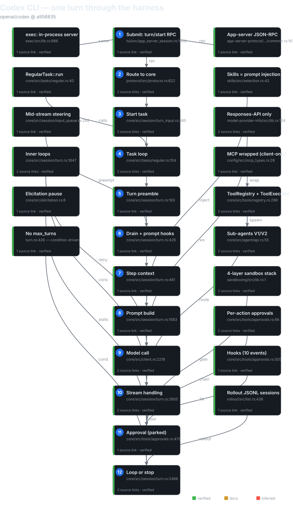
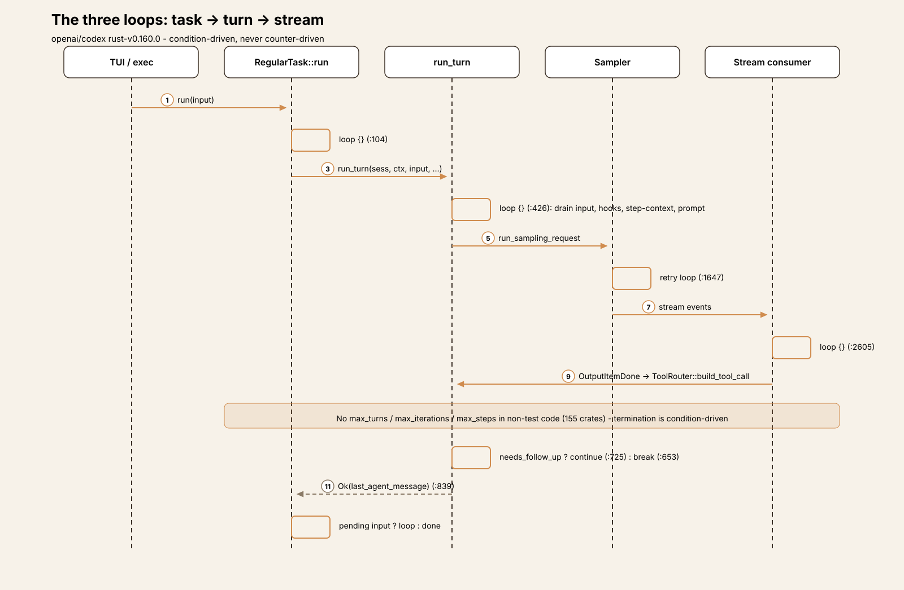
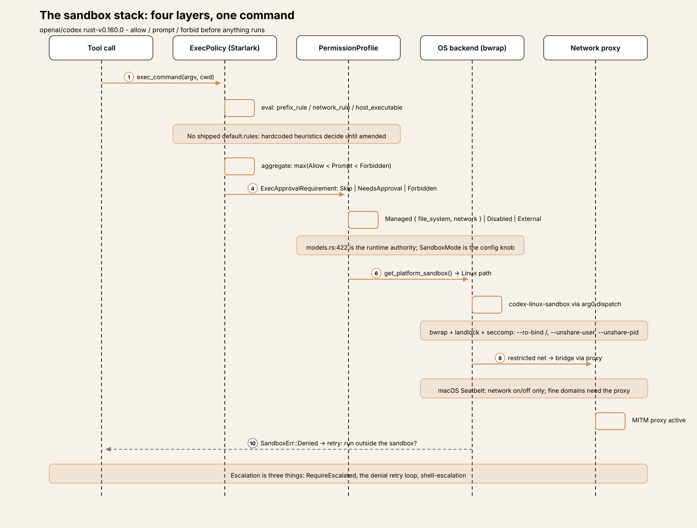
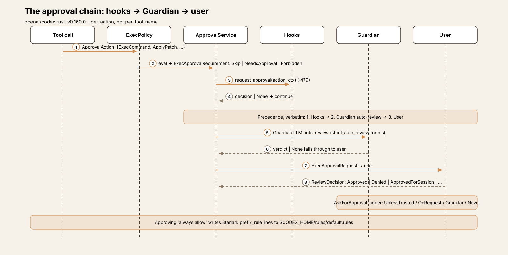
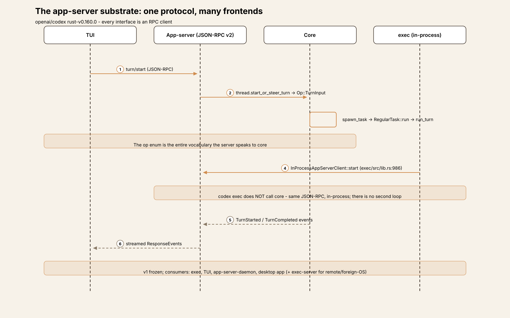

# Agent Harness Anatomy #5: Codex CLI — the sandbox-first agent that speaks one wire protocol

> **Series:** Agent Harness Anatomy — top-down dissections of real agent
> harnesses, grounded in verifiable source code. Every behavioral claim
> below carries a footnote to a pinned GitHub permalink; the full evidence
> lives in the endnotes.

## Version block

- **Repo:** [openai/codex](https://github.com/openai/codex)
- **Pinned:** tag `rust-v0.160.0` → `a956835d020762cb2b570053af06f643a11c0ecc` (2026-10-01)
- **Language:** Rust (cargo workspace `codex-rs/`, 154 members)
- **License:** Apache-2.0
- **Claim under test:** "a local, extensible, open source AI agent"
- **Scope:** this teardown covers the **Rust CLI** (`codex-rs/`), the
  series' sandbox/security axis. The legacy TypeScript CLI (`codex-cli/`
  at repo root) is out of scope.[^1]

| Crate | Non-test `.rs` | Role |
|---|---|---|
| `core` | 409 files, 123,071 LOC | THE product crate: turn loop, tools, sandboxing, sessions |
| `tui` | 660 files, 271,033 LOC | Interactive terminal UI (Ratatui; genuinely large, no generated bulk) |
| `app-server` | 119 files, 50,602 LOC | JSON-RPC v2 substrate — the real interface layer |
| `exec-server` | 89 files, 33,513 LOC | Standalone remote/foreign-OS exec service |
| `cli` | 50 files, 27,788 LOC | CLI binary, ~25 subcommands |
| `protocol` | 56 files, 28,203 LOC | Shared protocol types (incl. `PermissionProfile`) |
| `config` | 64 files, 21,549 LOC | 9-layer config stack |
| `codex-mcp` | 36 files, 13,081 LOC | MCP client runtime |
| `hooks` | 28 files, 11,657 LOC | Hook system (12 lifecycle events) |
| `rollout` | 22 files, 9,423 LOC | Session persistence (JSONL) |
| `model-provider` | 20 files, 6,442 LOC | Provider abstraction |
| `apply-patch` | 9 files, 4,828 LOC | Codex's own patch format + application |
| `exec` | 8 files, 4,350 LOC | Non-interactive mode (an app-server client) |
| `tools` | 24 files, 3,398 LOC | Shared tool definition layer (`ToolExecutor`) |
| `execpolicy` | 11 files, 1,954 LOC | Starlark exec-policy language |
| `skills` | 9 files, 1,493 LOC | SKILL.md discovery/injection |

Workspace total: 3,017 non-test `.rs` files under the workspace crates' `src/`
directories (excluding `*tests.rs` and `tests/`).
Entry is the CLI binary at `codex-rs/cli/src/main.rs` → `cli_main`;
bare `codex` launches the TUI; the agent loop is `run_turn` at
`codex-rs/core/src/session/turn.rs`.[^1]



## The mental model

Codex is a **sandbox-first, approval-gated pair programmer that speaks
exactly one wire protocol**. Three inversions define it against the
series so far. Against pi: where pi's interfaces subscribe to one event
stream, Codex's interfaces are all JSON-RPC clients of one **app-server**
— the TUI, `exec`, and the managed daemon drive core through it, and even
`codex exec` spins an in-process app-server rather than calling core
directly.[^2] Against aider: where aider negotiates with the model through
text edit formats and remembers via git, Codex speaks native Responses
API function tools — and there is no Chat Completions path at all; the
`WireApi` enum has exactly one variant, and `"chat"` deserialization is
explicitly rejected.[^3] Against Cline and Goose: where Cline's safety is
approval-first and Goose's is preventive-plus-judge, Codex's is
**sandbox-first** — a four-layer stack (Starlark exec-policy language →
declarative permission profiles → three OS backends → MITM network
proxy) that decides allow/prompt/forbid *before* anything runs, with
approvals as the policy/UX layer on top.[^4]

The governing tradeoff: Codex pays for the heaviest safety machinery in
the series — OS-level MAC backends, not shell wrappers — and funds it
with the narrowest wire protocol. One API shape, many doors in: 5
built-in providers behind 8 auth modes. If you're building a harness,
that's Codex's thesis in one sentence: **constrain the blast radius in
the OS, and you can afford to let the model act.**

## Package map

A layered cargo workspace, dependency direction running strictly
downward:[^1]

```
model-provider-info   WireApi enum (Responses only), provider metadata
        ↑
model-provider        ModelProvider trait, auth plumbing, capabilities
codex-mcp             MCP client runtime
        ↑
core                  turn loop, tool registry, sandboxing, sessions,
                      approvals, compaction, hooks, sub-agents
        ↑
app-server            JSON-RPC v2 substrate: thread/start|resume|fork|...,
                      consumed by exec, TUI, daemon, desktop app
        ↑
cli / tui / exec      all drive core through app-server; exec is in-process
```

`codex-rs/core/src` key dirs: `session/` (the loop: `turn.rs` 3,187
lines, `handlers.rs`, `turn_input.rs`, `input_queue.rs`), `tools/`
(registry, router, orchestrator, approvals, `handlers/`, `runtimes/`),
`sandboxing/` (platform backends), `exec_policy.rs`, `unified_exec/`,
`compact*.rs`, `guardian/` (LLM auto-review), `agent/` (sub-agent
control), `elicitation.rs`.

## The core loop

**Three nested loops**, not one — each at a different altitude:[^5]

1. **Task loop** — `RegularTask::run` (`core/src/tasks/regular.rs:40`):
   re-runs whole turns while pending user input remains (`loop {}` at
   `:104`).
2. **Turn loop** — `run_turn`'s `loop {}` (`core/src/session/turn.rs:426`):
   each iteration is one sampling request — one model call plus all the
   tools that response triggered. **This is the agent loop in the
   article's sense.**
3. **Inner loops** — `try_run_sampling_request`'s stream-consumer loop
   (`turn.rs:2605`) plus a retry loop in `run_sampling_request`
   (`turn.rs:1647`).

`run_turn`'s signature, verbatim (`turn.rs:163-172`):[^6]

```rust
pub(crate) async fn run_turn(
    sess: Arc<Session>,
    turn_context: Arc<TurnContext>,
    mut input: Vec<TurnInput>,
    mcp_startup_requirements: &mut McpStartupRequirements,
    prewarmed_client_session: Option<ModelClientSession>,
    cancellation_token: CancellationToken,
) -> CodexResult<Option<String>>
```

It returns the last agent message. The loop is **condition-driven**
(`loop {}` + `break`/`continue`), not counter-driven — there is no
iteration counter anywhere in the 154 crates.[^7]

Loop-body stages per iteration (`turn.rs:426-838`): drain pending user
input → prompt-hook inspection → step-context capture (re-resolves tools,
permissions, environments) → time reminder + world state → prompt build
→ sampling request → post-sampling bookkeeping → mid-turn compaction
rollover (`continue`) → stop path (stop hooks, legacy after-agent hook,
post-turn compaction) → `continue`/`break` → error arms.[^5]

**Termination:** the model sends only an assistant message; a stop hook's
`should_stop`; hook-blocked input; a terminal error; user interrupt
(`Op::Interrupt` → `abort_all_tasks(Interrupted)` → `TurnAborted` at
every await point); or the server's `end_turn: false` absent with no tool
calls.[^8] **No `max_turns`, `max_iterations`, or step cap exists in
non-test code** — an exhaustive grep across all 154 crates finds only
unrelated caps (a guardian token budget, a tool-search byte cap, TUI
history-read limits).[^7] The doom-loop guard is a retry budget plus
compaction-once-per-step plus the user interrupt — reactive, like
Cline's, but without even Cline's identical-call counter.[^9]

**Tool dispatch** is concurrent by default: `ToolRouter::build_tool_call`
per `OutputItemDone` (`stream_events_utils.rs:325`) → futures in
`FuturesOrdered` → `drain_in_flight` (`turn.rs:2466`) records results
into history before the next iteration. Tool errors become failure
results, never break the loop. `parallel_tool_calls: true` on every
prompt.[^10]

**Approvals park the loop inside the tool future.**
`ApprovalService::request_approval` (`tools/approvals.rs:479`) runs the
chain — hooks, then the Guardian LLM auto-reviewer, then the user — and
the turn loop cannot proceed past `drain_in_flight` until the decision
lands. Denials become failure tool results. Elicitation is a separate
session-wide pause counter that stalls tool-result delivery without
breaking the loop.[^11]

**Compaction** fires at four points: pre-turn, mid-turn rollover on
token-limit (with `continue`), post-turn threshold check, and a
one-per-step guardian-budget recovery. Two engines are selected by
provider capability: local summarization vs remote V2 over the Responses
endpoint.[^12]



## Trace one turn

Trace input: the user types `refactor the retry helper to use exponential
backoff` in the TUI and hits Enter. The trace crosses three process
boundaries — TUI → app-server → core — because every interface is an
RPC client:[^13]

1. **Submit.** The TUI sends app-server RPC `turn/start`
   (`tui/src/app_server_session.rs:1308-1341`), packaging the text with
   sandbox-policy and permission overrides resolved from config.
2. **Route to core.** `turn_processor.rs:630` →
   `thread.start_or_steer_turn(...)` → `Op::TurnInput`
   (`protocol/src/protocol.rs:625`) → `session/handlers.rs:485` →
   `turn_input::handle`. The op enum is the entire vocabulary the
   server speaks to core.[^13]
3. **Start task.** No active turn → `spawn_task` (`turn_input.rs:365`) →
   `tasks/mod.rs:287` records `ActiveTurn` and spawns with a fresh
   `CancellationToken`.[^13]
4. **Task loop.** `RegularTask::run` (`tasks/regular.rs:40`) emits
   `TurnStarted` and enters its `loop {}` (`:104`), calling `run_turn`
   (`:105`) with the input, MCP startup requirements, and any
   prewarmed client session.[^5]
5. **Turn preamble.** Inside `run_turn` (`turn.rs:163`): guardian check,
   pre-sampling compaction, MCP resolution, the first step-context
   capture, skill/plugin injection, session-start hooks — then the user
   message is recorded to history.[^5]
6. **Iteration 1 — drain and inspect.** The `loop {}` body
   (`turn.rs:426`): no pending input to drain on a fresh turn;
   prompt-hook inspection runs (`:426-446`).
7. **Iteration 1 — step context.** Tools re-resolved, approval policy
   bound to the turn (`turn.rs:461-503`); time reminder and world state
   assembled.
8. **Iteration 1 — prompt.** `clone_history().await.for_prompt(...)` plus
   `executed_tool_calls.attach_to_prompt` → `build_prompt` →
   `Prompt { input, tools, parallel_tool_calls: true,
   base_instructions, ... }` (`turn.rs:1583-1592`).[^14]
9. **Iteration 1 — model call.** `run_sampling_request` →
   `try_run_sampling_request` → `client_session.stream(...)` →
   WebSocket-first (permanent HTTP/SSE fallback), both POSTing to
   `/responses` (`client.rs:2218-2263`). The request carries
   `store: false`, `stream: true`, and a thread-scoped
   `prompt_cache_key` for cache affinity (`client.rs:886-1007`).[^3][^14]
10. **Stream handling.** The inner loop (`turn.rs:2605`) consumes
    `ResponseEvent`s: text deltas stream to the TUI live; each
    completed tool call arrives as `OutputItemDone` →
    `ToolRouter::build_tool_call` (`stream_events_utils.rs:325`),
    spawned into `in_flight` with `needs_follow_up = true`.[^10]
11. **Approval, parked in the tool future.** For any gated call,
    `ApprovalService::request_approval` (`tools/approvals.rs:479`)
    runs hooks → Guardian → user; the turn loop sits in
    `drain_in_flight` (`turn.rs:2466`) until the decision lands.
    Denials become failure tool results, not loop breaks.[^11]
12. **Loop or stop.** `drain_in_flight` records every
    `FunctionCallOutput` envelope into history (`turn.rs:2466-2492`).
    `needs_follow_up = true` → `continue` (`turn.rs:757`): iteration 2
    rebuilds the prompt from history now containing tool results. The
    model replies with only an assistant message →
    `!needs_follow_up` → stop hooks → post-turn compaction check →
    `break` (`turn.rs:653-755`). `run_turn` returns
    `Ok(last_agent_message)` (`:839`); `TurnCompleted` is emitted and
    the TUI renders from the streamed events.[^5][^8]

**Steering variant:** mid-stream user input cancels the step's preempt
token (`input_queue.rs:246`); `run_sampling_request` returns early with
`needs_follow_up: true`; the loop drains the new input at its top and
re-samples — the same shape as Cline's mid-run steering, one layer
lower.[^5] **Exec variant:** `codex exec` drives the identical pipeline
through its in-process app-server — there is no second loop.[^2]

## The sandbox stack

The sandbox stack clears the new-section bar. It is not one mechanism
but **four stacked layers**, each with its own language, its own
authority, and its own failure modes — and it is precisely the series'
stated angle for this teardown. No other harness in the series has
anything at this altitude: aider has no sandbox, Cline's commands run
unsandboxed in the user's shell, Goose checks extensions at install time
and then trusts them. Codex constrains the blast radius in the OS.

**Layer 1 — the exec-policy language.** A Starlark per-command policy
language (`codex-execpolicy` crate) that decides **allow / prompt /
forbid** before anything runs. Exactly three builtins
(`execpolicy/src/parser.rs:347-473`): `prefix_rule` (argv-prefix
matching, first token keys the lookup; `match`/`not_match` examples
validated at parse time), `network_rule` (wildcards forbidden at parse,
`rule.rs:196-200`), `host_executable` (a PATH-spoofing defense).
Decisions aggregate by max: Allow < Prompt < Forbidden
(`decision.rs:7-27`). This layer is the approval gate — and it starts
empty: **no shipped default `.rules` file exists** (verified by
`find`), so hardcoded heuristics decide unmatched commands until the
user amends policy. Approving "always allow" appends `prefix_rule(...)`
lines to `$CODEX_HOME/rules/default.rules`, hot-swapped via
`ArcSwap`.[^15]

**Layer 2 — the permission profile.** The declarative *what*:
`PermissionProfile` (`protocol/src/models.rs:422`) =
`Managed { file_system, network }` | `Disabled` ("do not apply an
outer sandbox") | `External { network }` (filesystem isolation by an
external caller). The classic `read-only` / `workspace-write` /
`danger-full-access` names survive only as **diagnostic tags** —
`sandbox_tags.rs` maps a live profile back to those names for metrics,
and its header is explicit: "Labels never inspect the filesystem and
**must not be used for authorization**"
(`core/src/sandbox_tags.rs:1-2`). The user-facing config knob is still
the legacy `SandboxMode` enum (`protocol/src/config_types.rs:104-114`,
default `ReadOnly`) with a compatibility shim both ways — two policy
models, one name, and the runtime authority is the profile.[^16]

**Layer 3 — the platform backends.** The OS *how*
(`codex-sandboxing` crate + helpers), selected per platform by
`get_platform_sandbox()` (`sandboxing/src/manager.rs:49`):
- **macOS:** Seatbelt via `/usr/bin/sandbox-exec` with embedded
  `.sbpl` templates, starting from `(deny default)`. The network
  block is binary on/off — fine-grained domains need Layer 4.
- **Linux:** bubblewrap (prefers system `bwrap`, falls back to the
  bundled binary) + landlock + seccomp, driven by the
  `codex-linux-sandbox` helper — which is the `codex-exec` binary
  re-invoked through **arg0 dispatch** (`exec/src/main.rs:1-35`).
  Mounts `--ro-bind / /` with writable roots layered on top,
  deny-read globs expanded pre-launch, `--unshare-user` always,
  `--unshare-pid` by default, `--unshare-net` for restricted
  networking.
- **Windows:** three backends — MXC native PSEC (AppContainer
  fallbacks deliberately excluded, `mxc-sandbox/src/lib.rs:89-95`),
  restricted-token (cannot enforce deny-reads — hard errors
  instead), and elevated (WFP, deny-read ACLs, a provisioning
  service). Two decision sites carry a `TODO(anp)` to reconcile
  them.[^17]

**Layer 4 — the network proxy.** `codex-network-proxy`: a local
MITM-capable forward proxy, the only path to the internet in
restricted modes. This is what makes the macOS/Linux network
asymmetry honest — Linux gets a real net namespace plus proxy
bridge plus domain policy; macOS Seatbelt is binary on/off and
fine-grained domains ride the managed proxy.[^18]

**Escalation is three distinct things**, and the code keeps them
separate: `SandboxPermissions::RequireEscalated` (declarative "run
outside the sandbox" — blocked when deny-reads exist, because they'd
be silently dropped); the sandbox-denial retry loop (the "run outside
the sandbox?" prompt after `SandboxErr::Denied`,
`core/src/tools/orchestrator.rs:320-490`); and `shell-escalation` — a
patched zsh fork whose execve wrapper asks an in-process server
per-`exec()` whether to re-run unsandboxed
(`shell-escalation/src/unix/`).[^19]

The load-bearing seam: **malformed `.rules` fails open** to the
requirements policy with a warning (`load_exec_policy_with_warning`)
— fail-open on syntax, fail-closed on semantics — and hardcoded
heuristics shadow the Starlark language as a second authority for
unmatched commands. Two more honest edges: `AllowPrefixRules::
IgnoreForCyberModel` can silently strip user-configured allow rules
for certain models, and the docs for both sandboxing and exec-policy
are three-line redirects to a website — the richest semantics doc in
the tree is `linux-sandbox/README.md`, Linux only.[^20]



## Subsystem inventory

### 1. The approval model (policy/UX half)

Approvals in Codex are **per-action, not per-tool-name**. The sealed
`ApprovalAction` enum (`tools/approvals.rs:67`) enumerates exactly what
can be approved: `ExecCommand`, `WriteStdin`, `Execve`, `ApplyPatch`,
`McpToolCall`, `NetworkAccess`, `RequestPermissions`. There is no
generic "approve tool X" primitive — `write_stdin` is an
approval-worthy action category of its own, which tells you how
fine the model is.[^21]

The user-facing ladder is `AskForApproval::{UnlessTrusted, OnRequest,
Granular, Never}` (`protocol/src/protocol.rs:986`; `OnRequest` is the
default). `Granular` splits the policy surface five ways:
`sandbox_approval`, `rules`, `skill_approval`, `request_permissions`,
`mcp_elicitations`. Per call, the exec-policy layer (or a default
requirement when no rule applies) yields an `ExecApprovalRequirement`
(`core/src/tools/sandboxing.rs:153`): `Skip | NeedsApproval |
Forbidden` — deny-reads make unsandboxed execution refuse outright
(`sandboxing.rs:239-296`): "Denied reads only exist inside the
sandbox."[^21]

The request flow (`Session::request_approval`, `approvals.rs:479-552`)
follows a precedence the code states verbatim in a comment: **1.
Hooks → 2. Guardian auto-review → 3. User.** The Guardian
(`core/src/guardian/`) is an LLM auto-reviewer extension; `None` from
the reviewer falls through to the user — "no contributor is never an
implicit allow" — and `strict_auto_review` forces the Guardian path
even for `Skip` requirements. User prompts emit
`ExecApprovalRequest` events; decisions return via oneshot.
`ReviewDecision` (`protocol.rs:4159`) has eight variants:
`Approved`, `ApprovedExecpolicyAmendment`,
`ApprovedForSession`, `ApprovedMcpPolicyAmendment`,
`NetworkPolicyAmendment`, `Denied`, `TimedOut`, `Abort` — note how
many of them *amend policy*, not just the call: approving "always
allow" writes Starlark into `$CODEX_HOME/rules/default.rules`, and
approving an MCP policy writes a persistent cross-session amendment.
Session caching via `with_cached_approval` uses canonicalized
command keys.[^22]

**Start here:** `core/src/tools/approvals.rs:479` for the chain,
`core/src/tools/sandboxing.rs:153` for the decision type.



### 2. The tool system

The tool layer is split across two crates: `codex-rs/tools/` (the
shared definition layer — `ToolSpec`, the `ToolExecutor` trait,
Responses API serialization) and `core/src/tools/` (the host:
`ToolRegistry` as `IndexMap<ToolName, RegisteredTool>`
(`registry.rs:296`), `ToolRouter`, `orchestrator.rs` for the
approval+sandbox stages, `handlers/` per built-in). Registration
distinguishes trusted (core built-ins) from external
(dynamic/MCP/extension; reserved names rejected); duplicate
registration is a hard error. `ToolExposure`
(`tools/src/tool_executor.rs:51`) — `Direct | Deferred |
DeferredModelOnly | DirectModelOnly | CodeModeOnly | Hidden` —
controls visibility: heavy tools (MCP, v1 sub-agents) register
`Deferred`, and the model calls `tool_search` to load namespaces on
demand, aider-`SwitchCoder` style but per-namespace. The per-turn
toolset is assembled in `spec_plan.rs` (~1,534 lines).[^23]

Built-ins (model-facing names): `exec_command`, `write_stdin`,
`apply_patch`, `update_plan`, `tool_search`, `request_user_input`
(`_async`), `send_message_to_user_async`, `new_context`,
`get_context_remaining`, `curr_time`, `sleep`,
`wait_for_environment`, `view_image`, `request_permissions`,
`list_available_plugins_to_install`, `request_plugin_install`,
`list_mcp_resources`, `list_mcp_resource_templates`,
`read_mcp_resource`, `<namespace>.<tool>` (MCP), `spawn_agent`
(plus V1 `multi_agent_v1.*`), and extension tools (`notes.*`,
`history.*`, `image_gen.imagegen`, `web.run`, `memories.*`,
`*_goal`). Tools reach the model as Responses API function tools
(`client.rs:912,937`).[^23]

The negative that defines the design: **no built-in
`read_file`/`write_file`/`edit`/`search` tool exists in core.**
Reads, listings, and searches go through `exec_command`; edits go
through `apply_patch`. The model shells out to see the world —
which is exactly why the sandbox stack has to be this good.[^24]

**Start here:** `codex-rs/tools/src/tool_executor.rs` for the trait,
`core/src/tools/registry.rs:296` for registration.

### 3. apply-patch

Codex's own patch format — a series institution carried over from
the TS CLI: `*** Begin Patch` / `*** Add|Delete|Update File:` /
`@@` hunks / `*** End Patch`, parsed by
`apply-patch/src/parser.rs` and verified into an `ApplyPatchAction`
*before* execution, so the diff can be shown in the approval
prompt; it renders back to unified diff for display. Standalone via
argv[1] `--codex-run-as-apply-patch` self-invocation — the same
arg0-dispatch trick as the Linux sandbox helper.[^25]

### 4. MCP

`codex-mcp` is an MCP **client** runtime (`McpConnectionManager`) —
not a server exposing Codex. Servers are configured in
`config.toml`'s `mcp_servers` (stdio + streamable-HTTP transports)
and their tools are **wrapped** in `McpHandler` (a `CoreToolRuntime`)
under sanitized namespaced names (`<namespace>.<tool>`), raw names
preserved for protocol calls. Approval is per server/tool via
`AppToolApproval::{Auto, Prompt, Writes, Approve}`
(`config/src/mcp_types.rs:28`), settable per-server or per-tool,
with a dedicated connector-attributed prompt UI, session-remember,
and persistent cross-session policy amendments
(`ApprovedMcpPolicyAmendment`). MCP server-side elicitation is
gated by the granular `mcp_elicitations` approval mode.[^26]

Contrast the series: Goose's tools *are* MCP (everything is a
server); Cline's are native `AgentTool`s; pi wraps servers as native
tools; Codex wraps too — but with the richest per-server approval
machinery of the four.

**Start here:** `config/src/mcp_types.rs:28`, then `McpHandler`.

### 5. Skills, hooks, plugins, slash commands

- **Skills** are **prompt injection, not tools**: `SKILL.md`
  frontmatter discovery across User/Repo/System/Admin scopes;
  `$skill://` mentions → `collect_explicit_skill_mentions` →
  fragments injected into the turn. Plus implicit invocation when a
  shell command matches a skill's. Same shape as pi and Cline —
  skills ride the prompt, never the tool registry.[^27]
- **Hooks**: 12 lifecycle events (`session_start`,
  `user_prompt_submit`, `pre_tool_use`, `permission_request`,
  `post_tool_use`, `stop`, `interrupt`, `pre/post_compact`,
  `subagent_start`, `subagent_stop`, `session_end`) plus the legacy
  `after_agent`. Hooks are shell
  commands or MCP servers; they can block, rewrite tool input,
  inject context, or force approval decisions — and they sit at
  precedence #1 in the approval chain, ahead of the Guardian and
  the user.[^28]
- **Plugins**: a manifest declares skills, MCP servers, apps, and
  hooks — model tools come from those, never from a direct
  "plugin tool" API. There is a `ToolContributor` API for
  programmatic registration.[^29]
- **Slash commands**: a **closed TUI-only enum**
  (`tui/src/slash_command.rs`) — not user-extensible. Plugins
  contribute prompt text through skill interfaces instead.[^29]

### 6. Sub-agents

Present, in **two generations** selected by
`multi_agent_version` (`spec_plan.rs:668`): V1
(`multi_agent_v1.spawn_agent` / `send_input` / `resume_agent` /
`wait_agent` / `close_agent`) and V2 (`spawn_agent`,
`send_message`, `followup_task`, `wait_agent`,
`interrupt_agent`, `list_agents`), depth-limited via
`agent_max_depth`. `AgentControl::spawn`
(`core/src/agent/api.rs:40`); inter-agent communication runs over
`agent_message_board.rs` and
`RolloutItem::InterAgentCommunication`; subagents get
nicknames/roles and skip the memory pipeline.[^30]

### 7. Providers

**Responses-API-only** — the narrowest wire protocol in the
series. `WireApi::Responses` is the sole enum variant; `"chat"`
is rejected at deserialization with
`CHAT_WIRE_API_REMOVED_ERROR`
(`model-provider-info/src/lib.rs:104-129`). Transport is
WebSocket-first with permanent HTTP/SSE fallback, both to
`/responses` (`client.rs:2235-2263`); stream retries default 5,
hard cap 100 (`model-provider-info/src/lib.rs:64-72`); terminal
errors are enumerated via `retry_delay() → None`
(`protocol/src/error.rs:389`); a WebSocket→HTTP fallback resets
the retry counter; `UnboundedConnectionRetries` retries
connection failures forever on a 5s→60s backoff.[^3][^31]

Five built-in providers: `openai` (default), `amazon-bedrock`,
`amazon-bedrock-runtime`, `ollama` (localhost:11434), `lmstudio`
(localhost:1234) (`model-provider-info/src/lib.rs:652-684`) — and
the repo comment explicitly refuses third-party bundling; users
add `model_providers` in config.toml. The `ModelProvider` trait
(`model-provider/src/provider.rs:141`) exposes `info()`,
`capabilities()` (`namespace_tools`, `image_generation`,
`web_search`, `external_web_access`, `remote_compaction`), and
auth plumbing. **Eight auth modes** (`CodexAuth`,
`login/src/auth/manager.rs:92`): API key, ChatGPT OAuth PKCE
(subscription), auth tokens, headers, agent identity, PAT, Bedrock
key/credentials. The broadest auth surface in the series behind
the narrowest wire protocol — one API shape, many doors in.[^31]

### 8. Prompt construction

`Prompt { input, tools, parallel_tool_calls: true,
base_instructions, output_schema, cyber_access_program }`
(`turn.rs:1583`) becomes a `ResponsesApiRequest` with `model`,
`instructions`, `input`, `tools`, `tool_choice: "auto"` —
**`store: false`, `stream: true`**, and a thread-scoped
`prompt_cache_key` (`client.rs:886-1007`). Two shapes exist: full
Responses vs **responses-lite**, which moves instructions/tools
into the input prefix with stable thread-scoped UUIDv5 IDs for
prefix-cache hits. Cache affinity is per-thread; resume is a
client-side rebuild from rollout JSONL — no server-side state.[^32]

Assembly order: `base_instructions` (model-catalog template or
custom override, provenance-tracked) → developer-role message
(dev instructions + world-state sections: permissions,
environments, tools budget, collaboration mode) → user-role
message (AGENTS.md, memory ≤8.9KB, env, skills, hooks). The repo's
AGENTS.md house rules for prompt fragments: no history rewrite,
nothing over 10K tokens, every fragment bounded with a hard
cap.[^32]

### 9. Sessions

Rollout JSONL at
`~/.codex/sessions/YYYY/MM/DD/rollout-<ts>-<uuid>.jsonl`
(`rollout/src/list.rs:438`); 12 `RolloutItem` variants
(`history/src/lib.rs:201`) — `SessionMeta`, `ResponseItem`,
`InterAgentCommunication`, `Compacted`, `TurnContext`,
`TokenUsageRecord`, `WorldState`, `SecurityRiskScore`,
`RetainedContext`, `EventMsg`, and more. A `codex-state` crate
mirrors metadata into SQLite; `thread-store` keeps a session
index. Resume is `thread/resume` RPC → rollout re-read
(`InitialHistory::{New, Cleared, Resumed, Forked}`); fork via
`thread/fork` with three persistence modes (`Copied`,
`CopiedDeferred`, `Referenced`).[^33]

**Cross-session memory** is a first-class pipeline:
`$CODEX_HOME/memories[_v2]/`, two-phase LLM
extraction/consolidation at root-session startup, feature-gated,
skipped for subagents. CLI surface: `codex resume | fork |
archive | unarchive | delete | queue`.[^34]

### 10. Interfaces

- **CLI** (`cli/src/main.rs`): ~25 subcommands; bare `codex` →
  TUI; `exec`, `review`, `apply`, `resume`, `fork`, `queue`,
  `agents`, `login`, `mcp`, `plugin`, `marketplace`, `cloud`,
  `doctor`, `sandbox`, `debug` — plus hidden `tcp-tunnel`,
  `execpolicy`, `responses-api-proxy`, `stdio-to-uds`.
- **TUI** (`tui/`): interactive Ratatui UI against an in-process
  or remote app-server daemon.
- **`exec`**: non-interactive — and it does **not** call core.
  It starts an `InProcessAppServerClient`
  (`exec/src/lib.rs:986`) and drives everything via JSON-RPC.
  Headless event processors, `--json` JSONL output, and the
  escape hatch `--dangerously-bypass-approvals-and-sandbox`.
- **app-server**: the full JSON-RPC v2 API (`initialize`,
  `thread/*`, `memory/*`, `rollout/compress`, config,
  `userVerification/*`, …), v1 frozen; consumers are exec, the
  TUI, the `app-server-daemon` (managed shared daemon), and the
  desktop app.
- **exec-server**: a separate standalone service with its own
  protocol for remote/foreign-OS execution.[^2]



### 11. Config

A **9-layer stack**
(`config/src/config_layer_source.rs:6`): PackagedDefaults → Mdm
→ System → EnterpriseManaged → User (`~/.codex/config.toml` +
named profiles) → Project (`.codex/`) → SessionFlags (session
overrides, including CLI `--config`), plus two legacy
managed-config layers (`LegacyManagedConfigTomlFromFile`,
`LegacyManagedConfigTomlFromMdm`). Key settings: `model`,
`model_provider(s)`, `approval_policy`, `sandbox_mode`,
`instructions`, `profile`, `otel`, `memories`,
`project_doc_max_bytes`. The schema is emitted to
`core/config.schema.json`.[^35]

### 12. AGENTS.md handling

Discovery walks up from the cwd to the nearest
`project_root_markers` (default `.git`), concatenating
`AGENTS.md` root→cwd; `AGENTS.override.md` is checked first;
`$CODEX_HOME/AGENTS.md` supplies the global layer. Untrusted
projects skip repository docs. Thread instructions are capped
at ~10k tokens (rejected, not truncated); project docs are
bounded by `project_doc_max_bytes` (truncated with warning).
Injected as a user-role `ContextualUserFragment`; subagents
inherit the snapshot.[^36]

## Extension points

Nine axes, each with its practical starting point:

### 1. The `ToolExecutor` trait

The programmatic axis: implement `ToolExecutor` in the
`codex-rs/tools` crate, register through the `ToolRegistry`
(`IndexMap<ToolName, RegisteredTool>`), pick a `ToolExposure`
(`Direct` vs `Deferred` + `tool_search` for heavy namespaces).
Trusted (core built-ins) vs external (dynamic/MCP/extension)
registration; reserved names rejected; duplicates are a hard
error.[^23]

**Start here:** `codex-rs/tools/src/tool_executor.rs:51`
(`ToolExposure`), then `core/src/tools/registry.rs:296`.

### 2. MCP servers

`config.toml` `mcp_servers` (stdio + streamable-HTTP); tools
wrapped in `McpHandler` as `<namespace>.<tool>`; approval per
server/tool via `AppToolApproval::{Auto, Prompt, Writes,
Approve}` with session-remember and persistent cross-session
amendments.[^26]

**Start here:** `config/src/mcp_types.rs:28`, then the
`McpHandler` wrapping in `core/src/tools/`.

### 3. Skills

`SKILL.md` frontmatter discovery (User/Repo/System/Admin
scopes); `$skill://` mentions inject fragments into the turn;
implicit invocation on shell-command match. Prompt injection,
not tools.[^27]

**Start here:** `collect_explicit_skill_mentions` in
`core/src/`, then the `skills` crate for discovery.

### 4. Hooks

12 lifecycle events + legacy `after_agent`; shell commands or
MCP servers; can block, rewrite tool input, inject context, or
force approval decisions — precedence #1 in the approval chain,
ahead of the Guardian and the user.[^28]

**Start here:** the `hooks` crate event list, then the
approval-chain comment at
`core/src/tools/approvals.rs:506`.

### 5. Plugins

Manifests declaring skills, MCP servers, apps, hooks —
`ToolContributor` for programmatic tools; model tools arrive
through the declared surfaces, never a direct "plugin tool"
API. Schedule shapes can be declared (metadata-only at this
SHA — no executor in the tree).[^29][^37]

**Start here:** the plugin manifest schema, then
`ToolContributor`.

### 6. Slash commands

Closed TUI-only enum (`tui/src/slash_command.rs`) — the
finding is the closedness: extending the command surface means
forking the TUI, like aider's 42 closed commands.[^29]

### 7. Sub-agents

V1 (`multi_agent_v1.*`) and V2 (plain names) selected by
`multi_agent_version` (`spec_plan.rs:668`),
`agent_max_depth`-limited, communicating over the agent
message board with rollout-persisted
`InterAgentCommunication` items.[^30]

**Start here:** `core/src/agent/api.rs:40`
(`AgentControl::spawn`).

### 8. Custom providers

`model_providers` in config.toml — the repo refuses
third-party bundling, so the long tail is user-declared, not
shipped. Implement the `ModelProvider` trait
(`model-provider/src/provider.rs:141`): `info()`,
`capabilities()`, auth plumbing; `stream()` does the work.[^31]

**Start here:** `model-provider/src/provider.rs:141`, then
the smallest built-in impl as the idiom.

### 9. Config profiles

Named profiles in `~/.codex/config.toml`, project `.codex/`
layers, session flags, CLI `--config` overrides — the 9-layer
stack makes "my team's locked-down profile" a config artifact,
not a fork.[^35]

**Start here:**
`config/src/config_layer_source.rs:6`.

## Tradeoffs

- **Sandbox-first vs approval-first vs git-as-safety vs judge.**
  Cline asks the user constantly and sandboxes nothing; aider never asks
  for chat files and lets git remember; Goose prevents (modes,
  inspectors, an LLM judge) but never restores; pi hands you the hook.
  Codex is the only harness whose safety story is *enforcement in the
  OS* — Seatbelt, bubblewrap+landlock+seccomp, restricted tokens —
  with approvals as the policy/UX layer deciding what enters the
  sandbox. The price is platform complexity: three backends, two
  Windows decision sites, and a macOS/Linux network asymmetry that
  needs a proxy to paper over.[^4][^17][^18]
- **One wire protocol vs model-agnosticism.** pi's `StreamFn` will
  talk to anything; aider's YAML and Goose's catalog bend per model;
  Cline unifies transport behind one adapter. Codex goes further:
  `WireApi` has exactly one variant, and `"chat"` is rejected at
  deserialization. The dividend is total control of the prompt shape
  (responses-lite, UUIDv5 prefix-cache IDs, `store: false`); the
  cost is that every non-OpenAI-shaped provider must speak Responses
  or go through a shim.[^3][^32]
- **Per-action approvals vs per-tool policies.** Cline approves tool
  names; Goose approves calls through modes and a judge. Codex's
  sealed `ApprovalAction` enum approves *actions* — `WriteStdin` is
  its own category, distinct from `ExecCommand`. Finer than Cline's
  per-tool policies, and it composes with the sandbox: the same
  decision type (`ExecApprovalRequirement`) drives both the prompt
  and the sandbox bypass.[^21]
- **App-server substrate vs embedded loop.** pi, aider, and Goose
  embed the loop in the process you launched; Cline extracts it into
  an SDK library. Codex extracts it behind a *server*: TUI, exec,
  daemon, and desktop are all JSON-RPC clients. The win is interface
  uniformity (one protocol, many frontends, including headless
  `--json`); the tax is a protocol boundary inside what used to be
  a function call — every turn crosses it twice.[^2]
- **No read_file, by design.** The model shells out to see the
  world (`exec_command`) and patches through `apply_patch`. This
  looks primitive next to Cline's typed file tools — until you see
  the sandbox stack it funds. When every read is a subprocess, the
  sandbox sees everything; a native `read_file` would bypass
  Layer 1's Starlark policy entirely. The missing tool is the
  sandbox's load-bearing wall.[^24][^15]
- **Unbounded by construction.** No `max_turns` anywhere in 154
  crates — the loop ends when the model stops calling tools, a hook
  says stop, or the user interrupts. Against Goose's 1000-turn
  budget and Cline's 5-identical-call tripwire, Codex trusts the
  retry budget, compaction-once-per-step, and the human. It's the
  most permissive loop in the series, paired with the most
  restrictive execution environment — freedom of *iteration*,
  constraint of *action*.[^7][^9]
- **Two policy models, one name.** `PermissionProfile` is the
  runtime authority; the legacy `SandboxMode` enum is the config
  knob with a shim both ways; the classic mode names survive as
  diagnostic tags that "must not be used for authorization." Three
  representations of "how locked down is this," and only one of
  them decides. The migration seam is honest, and it's the kind of
  thing that bites at 2 AM.[^16]

## Deliberate omissions

- **No Chat Completions path.** `WireApi` has one variant;
  `"chat"` fails deserialization with a dedicated error. There is
  no fallback, no compat shim — the one place in the series where
  a wire protocol was *removed* rather than added.[^3]
- **No built-in read_file / write_file / edit / search.**
  Reads go through `exec_command`, edits through `apply_patch`.
  The negative grep over the tool handlers and `spec_plan.rs` is
  clean — this is architecture, not oversight.[^24]
- **No repo map.** aider's PageRank-over-tree-sitter signature
  subsystem has no Codex equivalent; `file-search` is a fuzzy path
  finder, not a code map. Context comes from the working tree the
  sandbox already sees.[^14]
- **No git-based undo.** aider auto-commits every turn; Cline
  stashes every turn under private refs. Codex has neither — the
  negative grep finds only rollout replay. Like Goose, the safety
  story is entirely preventive; unlike Goose, the prevention is in
  the kernel.[^33]
- **No scheduler executor.** Plugins declare schedule shapes;
  the only `ScheduledTask` hits are the protocol type, a test
  fixture, and a remote plugin stub. Goose runs cron in-process;
  Codex declares it and stops.[^37]
- **No shipped default `.rules`.** The Starlark policy language
  starts empty; hardcoded heuristics decide until the user
  amends. The most powerful layer of the sandbox is opt-in
  configuration — a deliberate bootstrapping choice with a
  fail-open seam on malformed rules.[^15][^20]
- **No third-party provider bundling.** The repo comment refuses
  it outright; the long tail is user-declared in config.toml.
  Five providers ship; the eighth auth mode is yours to wire.[^31]

## Comparison matrix row

| # | Dimension | pi (v1.0.2) | aider (v0.86.2) | Cline (v4.1.22) | Goose (v1.53.0) | Codex (rust-v0.160.0) |
|---|---|---|---|---|---|---|
| 1 | Agent loop | Event-sourced; inner + outer loops; no iteration cap | No tool-call loop; parse→apply→reflect; REPL + reflection (≤3) + retry | Host-independent SDK `AgentRuntime.execute`; `maxIterations: undefined` — bound is 5 identical tool calls | Two loops, migration in progress: legacy `agent.rs` plain `loop{}` (default, `max_turns`=1000) vs opt-in effect-sourced state machine, LLM call dead last | **Three nested**: `RegularTask::run` → `run_turn` `loop{}` (one sampling request/iter) → stream-consumer + retry; condition-driven; **no max_turns anywhere in 154 crates** — bound is retry budget + compaction-once-per-step + user interrupt [^5][^7][^9] |
| 2 | Tool system | 8 built-ins (4 active by default) + registry; TypeBox validation; sequential/parallel | None — model emits SEARCH/REPLACE blocks | 9 built-ins (7 active in VS Code act mode) + MCP natives + team tools (SDK/CLI); sequential default, adjacent-parallel batching | Entirely MCP-shaped: every tool is an MCP server (builtins = in-process tokio duplex); `ext__tool` namespacing; no non-MCP path | Responses API function tools; `ToolRegistry` (`IndexMap`) + `ToolExecutor` trait; `ToolExposure` (`Deferred` + `tool_search`); concurrent dispatch (`FuturesOrdered`); **no built-in read_file/write_file/edit** — reads via `exec_command`, edits via `apply_patch` [^10][^23][^24][^25] |
| 3 | Model providers | ~42 behind one `StreamFn` | litellm; 313-entry YAML + substring heuristics | 228 providers, one generic Vercel AI SDK adapter; exact-ID resolution | Single `Provider` trait (`stream()` required); 36 static + 48 declarative JSON + custom; 8,160-entry models.dev snapshot + heuristics | **Responses-API-only** (`WireApi` single variant; `"chat"` rejected); 5 built-in providers (openai, 2× Bedrock, ollama, lmstudio); **8 auth modes**; `ModelProvider` trait; WS-first + HTTP/SSE fallback to `/responses`; retries 5 (cap 100) [^3][^31] |
| 4 | Prompt construction | Structured sections, diffed per turn | Fixed wire order, synthetic user/assistant pairs, cache breakpoints | Template + placeholder replacement; `MessageBuilder` normalization | `PromptManager` from extension info + directory hints + goose mode; toolshim/native split per model | `Prompt` → `ResponsesApiRequest` (`store: false`, `stream: true`, thread `prompt_cache_key`); **responses-lite** shape (UUIDv5 prefix-cache IDs); assembly base→developer→user; fragments hard-capped (AGENTS.md ≤10K) [^14][^32] |
| 5 | Memory/session | JSONL sessions; compaction | In-memory cur/done; background summarization; markdown log; git auto-commit | SQLite + file-backend; versioned whole-file JSON envelopes; auto + manual compaction | SQLite `sessions.db` + JSON blobs; full `Recipe` persisted; explicit cross-session recall; `user_visible`/`agent_visible` flags | **Rollout JSONL** `~/.codex/sessions/YYYY/MM/DD/` (14 `RolloutItem` variants) + SQLite index; fork 3 modes (`Copied`/`CopiedDeferred`/`Referenced`); **cross-session LLM memory extraction** (`$CODEX_HOME/memories`); resume = client-side rebuild [^33][^34] |
| 6 | Reasoning/planning | Thinking forwarded; no planner/sub-agents | Architect = sequential delegation with user gate | plan/act modes (differ by one tool); sub-agents + teams (SDK/CLI only) | GooseMode (Auto/Approve/SmartApprove/Chat); `summon` sub-agents (forced Auto, 25 turns, no nesting); recipes; in-process cron | **Sub-agents, two generations** (V1 `multi_agent_v1.*`, V2 plain names) via `multi_agent_version`, `agent_max_depth`; `update_plan` tool; **Guardian LLM auto-reviewer** in the approval chain [^30][^22][^23] |
| 7 | Extensibility | TS extensions, hooks, MCP, skills | 42 closed commands; no plugin API/MCP/skills | `AgentRuntimePlugin`, 7-callback hooks, file hooks, skills, MCP, sub-agents | Broadest so far: MCP configs (4 transports), 12-event hooks, recipes, schedules, sub-agents, skills, custom providers, `Provider` trait | `ToolExecutor` trait + `ToolContributor`; **MCP wrapped** (`McpHandler`, client-only); skills = prompt injection; hooks (12 events, precedence #1 in approvals); plugins (manifest); **closed TUI slash commands**; user-declared providers [^23][^26][^27][^28][^29][^31] |
| 8 | Interfaces | TUI / print / RPC / SDK on one event stream | prompt_toolkit CLI + streamlit GUI | VS Code webview over proto-bus gRPC (22 svcs/224 RPCs) + CLI host + npm SDK re-export | Rust CLI REPL + Electron desktop + ACP bridge + Telegram gateway; `AgentEvent`s; uniffi bindings | **All RPC**: TUI + `exec` + daemon are **app-server (JSON-RPC v2) clients**; `exec` is in-process; separate `exec-server` for remote/foreign-OS [^2] |
| 9 | Failure handling | Auto-retry, truncation guards, abort; no cap | Exp-backoff (60s); malformed edits reflected (≤3) | Provider retry 3×; output-limit recovery 3×; loop detection 3×/5× (reactive); mistake tracker 6; no host iteration cap | Three-layer retry; `max_turns`=1000; repetition guard inert — the bound is turns, not loops | Stream retries 5 (cap 100); WS→HTTP fallback resets counter; **unbounded connection retries** (5s→60s); **no loop detection by design**; tool errors become failure results, never break the loop [^3][^9][^10] |
| 10 | Security model | Project trust + extension hooks; no approval UX | Boundary prompts; git auto-commit + `/undo`; no sandbox | Finest-grained: per-tool policies + webview UI + diff previews; commands prompt by default; no sandbox; per-turn stash checkpoints | Modes × `permission.yaml` × 5-inspector chain; LLM judge for SmartApprove; no undo | **Strongest: 4-layer sandbox** (Starlark exec-policy → `PermissionProfile` → OS backends: Seatbelt / bwrap+landlock+seccomp / Windows PSEC → MITM network proxy); **per-action approvals** (sealed enum); hooks → Guardian → user; `AskForApproval` 4-mode ladder; **no undo** [^4][^15][^16][^17][^18][^21][^22] |

## Endnotes

All notes are VERIFIED against `rust-v0.160.0`
(`a956835d020762cb2b570053af06f643a11c0ecc`) unless marked DOCS; line
anchors and file paths re-checked on 2026-10-07.
`GH` = `https://github.com/openai/codex/blob/a956835d020762cb2b570053af06f643a11c0ecc/`.

[^1]: Tag `rust-v0.160.0`, SHA
    `a956835d020762cb2b570053af06f643a11c0ecc`, committed 2026-10-01
    17:13:37 +0000; Apache-2.0 (`LICENSE`); Rust cargo workspace
    `codex-rs/` (154 members per `Cargo.toml`). Non-test `.rs` in
    `*/src` (excluding `*tests.rs` and `tests/` dirs): `core` 409
    files / 123,071 LOC, `tui` 660 / 271,033,
    `app-server` 119 / 50,602, `exec-server` 89 / 33,513, `cli` 50 /
    27,788, `protocol` 56 / 28,203, `config` 64 / 21,549,
    `codex-mcp` 36 / 13,081, `hooks` 28 / 11,657, `rollout` 22 /
    9,423, `model-provider` 20 / 6,442, `apply-patch` 9 / 4,828,
    `exec` 8 / 4,350, `tools` 24 / 3,398, `execpolicy` 11 / 1,954,
    `skills` 9 / 1,493. Entry:
    [GH…/codex-rs/cli/src/main.rs](https://github.com/openai/codex/blob/a956835d020762cb2b570053af06f643a11c0ecc/codex-rs/cli/src/main.rs)
    → `cli_main`; the agent loop at
    [GH…/codex-rs/core/src/session/turn.rs](https://github.com/openai/codex/blob/a956835d020762cb2b570053af06f643a11c0ecc/codex-rs/core/src/session/turn.rs).
    Claim under test from the repo tagline. Scope: the Rust CLI
    (`codex-rs/`); the legacy TypeScript CLI (`codex-cli/`) is out
    of scope.
[^2]: Even `codex exec` drives core through an in-process app-server:
    `InProcessAppServerClient::start` at
    [GH…/codex-rs/exec/src/lib.rs#L986](https://github.com/openai/codex/blob/a956835d020762cb2b570053af06f643a11c0ecc/codex-rs/exec/src/lib.rs#L986).
    The app-server exposes the full JSON-RPC v2 API
    (`initialize`, `thread/*`, `memory/*`, `rollout/compress`,
    config, …) consumed by exec, the TUI, the `app-server-daemon`
    (managed shared daemon), and the desktop app; v1 is frozen. A
    separate `exec-server` crate (own protocol) handles
    remote/foreign-OS execution.
[^3]: `WireApi` has exactly one variant:
    [GH…/codex-rs/model-provider-info/src/lib.rs#L104-L129](https://github.com/openai/codex/blob/a956835d020762cb2b570053af06f643a11c0ecc/codex-rs/model-provider-info/src/lib.rs#L104-L129)
    (`Responses`; `"chat"` → `CHAT_WIRE_API_REMOVED_ERROR`).
    Transport is WebSocket-first with permanent HTTP/SSE fallback,
    both to `/responses`
    ([GH…/codex-rs/core/src/client.rs#L2235-L2263](https://github.com/openai/codex/blob/a956835d020762cb2b570053af06f643a11c0ecc/codex-rs/core/src/client.rs#L2235-L2263)).
    Stream retries default 5, hard cap 100
    ([GH…/codex-rs/model-provider-info/src/lib.rs#L64-L72](https://github.com/openai/codex/blob/a956835d020762cb2b570053af06f643a11c0ecc/codex-rs/model-provider-info/src/lib.rs#L64-L72));
    terminal errors enumerated via `retry_delay() → None`
    (`protocol/src/error.rs:389`); WebSocket→HTTP fallback resets
    the counter; `UnboundedConnectionRetries` retries connection
    failures forever (5s→60s backoff).
[^4]: The four layers: the Starlark exec-policy language
    (`codex-rs/execpolicy/`), the declarative `PermissionProfile`
    ([GH…/codex-rs/protocol/src/models.rs#L422](https://github.com/openai/codex/blob/a956835d020762cb2b570053af06f643a11c0ecc/codex-rs/protocol/src/models.rs#L422)),
    the OS backends (`codex-rs/sandboxing/` + helpers), and the
    local MITM network proxy (crate `codex-network-proxy` in
    `codex-rs/network-proxy/`).
[^5]: Three nested loops: `RegularTask::run`
    ([GH…/codex-rs/core/src/tasks/regular.rs#L40](https://github.com/openai/codex/blob/a956835d020762cb2b570053af06f643a11c0ecc/codex-rs/core/src/tasks/regular.rs#L40),
    `loop {}` at `:104`, `run_turn` called at `:105`) →
    `run_turn`'s `loop {}`
    ([GH…/codex-rs/core/src/session/turn.rs#L426](https://github.com/openai/codex/blob/a956835d020762cb2b570053af06f643a11c0ecc/codex-rs/core/src/session/turn.rs#L426))
    → the stream-consumer loop (`:2605`) plus the retry loop in
    `run_sampling_request` (`:1647`). Loop-body stages per
    iteration: `turn.rs:426-838` (drain input → prompt-hook
    inspection → step-context capture → time reminder + world
    state → prompt build → sampling → bookkeeping → mid-turn
    compaction rollover → stop path → error arms). Mid-stream
    steering cancels the step preempt token
    (`session/input_queue.rs:246`); `run_sampling_request`
    returns early with `needs_follow_up: true`.
[^6]: `run_turn` signature, verbatim, at
    [GH…/codex-rs/core/src/session/turn.rs#L163-L172](https://github.com/openai/codex/blob/a956835d020762cb2b570053af06f643a11c0ecc/codex-rs/core/src/session/turn.rs#L163-L172).
    Returns the last agent message (`Ok(last_agent_message)` at
    `:839`).
[^7]: No `max_turns` / `max_iterations` / `max_steps` in non-test
    code: `grep -rniE "max_turns|max_iterations|max_steps|
    max_tool_calls" codex-rs --include="*.rs"` across all 154
    crates, excluding tests/snapshots → only
    `RECAP_HISTORY_MAX_TURNS` (a TUI display cap,
    `tui/src/app/recap_history.rs:13`); second sweep
    `max_turn|iteration_cap|turn_limit|doom.?loop` → only TUI
    history-read limits. The loop is condition-driven
    (`loop {}` + `break`/`continue`), never counter-driven.
[^8]: Termination: model sends only an assistant message;
    stop-hook `should_stop`; hook-blocked input; terminal error;
    user interrupt (`Op::Interrupt` →
    [GH…/core/src/tasks/mod.rs#L536](https://github.com/openai/codex/blob/a956835d020762cb2b570053af06f643a11c0ecc/codex-rs/core/src/tasks/mod.rs#L536)
    `abort_all_tasks(Interrupted)` → `TurnAborted` at every await
    point); or no `end_turn: false` with no tool calls
    (`turn.rs:2973`).
[^9]: No identical-call tracking like Cline's loop detection —
    the doom-loop guard is the retry budget,
    compaction-once-per-step, and the user interrupt only.
    Deliberate by construction: the loop trusts the model to stop
    and the human to intervene.
[^10]: `ToolRouter::build_tool_call` per `OutputItemDone`
    ([GH…/codex-rs/core/src/stream_events_utils.rs#L325](https://github.com/openai/codex/blob/a956835d020762cb2b570053af06f643a11c0ecc/codex-rs/core/src/stream_events_utils.rs#L325));
    futures in `FuturesOrdered`; `drain_in_flight`
    ([GH…/codex-rs/core/src/session/turn.rs#L2466](https://github.com/openai/codex/blob/a956835d020762cb2b570053af06f643a11c0ecc/codex-rs/core/src/session/turn.rs#L2466))
    records results into history before the next iteration.
    `parallel_tool_calls: true` on every prompt (`turn.rs:1592`).
    Tool errors become failure results, never break the loop.
[^11]: `ApprovalService::request_approval` at
    [GH…/codex-rs/core/src/tools/approvals.rs#L479](https://github.com/openai/codex/blob/a956835d020762cb2b570053af06f643a11c0ecc/codex-rs/core/src/tools/approvals.rs#L479)
    — the turn loop parks in `drain_in_flight` until the decision
    lands. Elicitation is a separate session-wide pause counter
    that stalls tool-result delivery without breaking the loop.
[^12]: Compaction at four points: pre-turn, mid-turn rollover on
    token-limit (with `continue`), post-turn threshold check,
    one-per-step guardian-budget recovery
    ([GH…/core/src/compact.rs](https://github.com/openai/codex/blob/a956835d020762cb2b570053af06f643a11c0ecc/codex-rs/core/src/compact.rs)).
    Two engines by provider capability: local summarization vs
    remote V2 over the Responses endpoint.
[^13]: Trace steps 1–3: TUI `turn/start` RPC
    ([GH…/codex-rs/tui/src/app_server_session.rs#L1308-L1341](https://github.com/openai/codex/blob/a956835d020762cb2b570053af06f643a11c0ecc/codex-rs/tui/src/app_server_session.rs#L1308-L1341));
    `turn_processor.rs:630` → `thread.start_or_steer_turn` →
    `Op::TurnInput`
    ([GH…/codex-rs/protocol/src/protocol.rs#L622](https://github.com/openai/codex/blob/a956835d020762cb2b570053af06f643a11c0ecc/codex-rs/protocol/src/protocol.rs#L622))
    → `session/handlers.rs:485` → `turn_input::handle`;
    `spawn_task` at
    [GH…/codex-rs/core/src/session/turn_input.rs#L365](https://github.com/openai/codex/blob/a956835d020762cb2b570053af06f643a11c0ecc/codex-rs/core/src/session/turn_input.rs#L365),
    `ActiveTurn` recorded at `tasks/mod.rs:287` with a fresh
    `CancellationToken`.
[^14]: Prompt build: `clone_history().await.for_prompt(...)` +
    `executed_tool_calls.attach_to_prompt` → `build_prompt` →
    `Prompt { input, tools, parallel_tool_calls: true,
    base_instructions, ... }`
    ([GH…/codex-rs/core/src/session/turn.rs#L1583-L1592](https://github.com/openai/codex/blob/a956835d020762cb2b570053af06f643a11c0ecc/codex-rs/core/src/session/turn.rs#L1583-L1592)).
    The request carries `store: false`, `stream: true`, and a
    thread-scoped `prompt_cache_key`
    ([GH…/codex-rs/core/src/client.rs#L886-L1007](https://github.com/openai/codex/blob/a956835d020762cb2b570053af06f643a11c0ecc/codex-rs/core/src/client.rs#L886-L1007),
    `store: false` at `:997`). Resume is client-side rebuild
    from rollout JSONL — no server-side state.
[^15]: The Starlark exec-policy language (`codex-rs/execpolicy/`)
    has exactly three builtins
    ([GH…/codex-rs/execpolicy/src/parser.rs#L329-L473](https://github.com/openai/codex/blob/a956835d020762cb2b570053af06f643a11c0ecc/codex-rs/execpolicy/src/parser.rs#L329-L473)):
    `prefix_rule`, `network_rule` (wildcards rejected at parse,
    `rule.rs:196-200`), `host_executable`. Decisions aggregate
    by max, Allow < Prompt < Forbidden
    ([GH…/codex-rs/execpolicy/src/decision.rs#L7-L27](https://github.com/openai/codex/blob/a956835d020762cb2b570053af06f643a11c0ecc/codex-rs/execpolicy/src/decision.rs#L7-L27)).
    **No shipped default `.rules` file**: `find codex-rs -name
    'default.rules'` returns nothing — hardcoded heuristics
    decide until the user amends; "always allow" appends
    `prefix_rule(...)` lines to
    `$CODEX_HOME/rules/default.rules`, hot-swapped via
    `ArcSwap`.
[^16]: `PermissionProfile`
    ([GH…/codex-rs/protocol/src/models.rs#L422](https://github.com/openai/codex/blob/a956835d020762cb2b570053af06f643a11c0ecc/codex-rs/protocol/src/models.rs#L422)):
    `Managed { file_system, network }` | `Disabled` | `External
    { network }`. The classic mode names are diagnostic tags
    only —
    [GH…/codex-rs/core/src/sandbox_tags.rs#L1-L2](https://github.com/openai/codex/blob/a956835d020762cb2b570053af06f643a11c0ecc/codex-rs/core/src/sandbox_tags.rs#L1-L2):
    "Labels never inspect the filesystem and **must not be used
    for authorization**." The legacy `SandboxMode` enum
    (`protocol/src/config_types.rs:104-114`, default `ReadOnly`)
    remains the user-facing config knob with a compatibility
    shim both ways.
[^17]: Backend selection via `get_platform_sandbox()`
    (`sandboxing/src/manager.rs:49`). macOS:
    Seatbelt via `/usr/bin/sandbox-exec` (deny-default
    `.sbpl`). Linux: bubblewrap + landlock + seccomp through
    the `codex-linux-sandbox` helper — the `codex-exec` binary
    re-invoked via **arg0 dispatch**
    ([GH…/codex-rs/exec/src/main.rs#L1-L35](https://github.com/openai/codex/blob/a956835d020762cb2b570053af06f643a11c0ecc/codex-rs/exec/src/main.rs#L1-L35));
    `--ro-bind / /`, `--unshare-user` always, `--unshare-pid`
    default, `--unshare-net` for restricted networking.
    Windows: MXC native PSEC (AppContainer fallbacks
    deliberately excluded,
    `mxc-sandbox/src/lib.rs:89-95`), restricted-token,
    elevated — with a `TODO(anp)` on two decision sites to
    reconcile them. `mod bwrap` is `#[cfg(target_os =
    "linux")]`, `pub mod seatbelt` is `#[cfg(target_os =
    "macos")]` (`sandboxing/src/lib.rs`); off-platform
    requests are a hard error.
[^18]: [GH…/codex-rs/network-proxy/](https://github.com/openai/codex/tree/a956835d020762cb2b570053af06f643a11c0ecc/codex-rs/network-proxy)
    — a local MITM-capable forward proxy, the only path to the
    internet in restricted modes. Linux gets net namespace + proxy
    bridge + domain policy; macOS Seatbelt's network block is
    binary on/off, fine domains need the managed proxy.
[^19]: Three escalations: `SandboxPermissions::RequireEscalated`
    (declarative; blocked when deny-reads exist); the
    sandbox-denial retry loop ("run outside the sandbox?"
    after `SandboxErr::Denied`,
    [GH…/codex-rs/core/src/tools/orchestrator.rs#L320-L490](https://github.com/openai/codex/blob/a956835d020762cb2b570053af06f643a11c0ecc/codex-rs/core/src/tools/orchestrator.rs#L320-L490));
    `shell-escalation` — a patched zsh fork whose execve
    wrapper asks an in-process server per-`exec()`
    (`shell-escalation/src/unix/`).
[^20]: Seams: malformed `.rules` **fails open** to the
    requirements policy with a warning
    ([GH…/core/src/exec_policy.rs#L645](https://github.com/openai/codex/blob/a956835d020762cb2b570053af06f643a11c0ecc/codex-rs/core/src/exec_policy.rs#L645)
    `load_exec_policy_with_warning`) — fail-open on syntax,
    fail-closed on semantics; hardcoded heuristics shadow the
    Starlark language as a second authority for unmatched
    commands; `AllowPrefixRules::IgnoreForCyberModel`
    ([GH…/core/src/exec_policy/model_policy.rs#L11](https://github.com/openai/codex/blob/a956835d020762cb2b570053af06f643a11c0ecc/codex-rs/core/src/exec_policy/model_policy.rs#L11))
    can silently strip user allow rules for certain models;
    `docs/sandbox.md` and `docs/execpolicy.md` are 3-line
    redirects to a website — the richest semantics doc in-tree
    is `linux-sandbox/README.md`, Linux only.
[^21]: The sealed `ApprovalAction` enum
    ([GH…/codex-rs/core/src/tools/approvals.rs#L66](https://github.com/openai/codex/blob/a956835d020762cb2b570053af06f643a11c0ecc/codex-rs/core/src/tools/approvals.rs#L66)):
    `ExecCommand, WriteStdin, Execve, ApplyPatch,
    McpToolCall, NetworkAccess, RequestPermissions` —
    approvals are per-action, not per-tool-name. Per-call
    policy: `ExecApprovalRequirement::{Skip, NeedsApproval,
    Forbidden}`
    ([GH…/codex-rs/core/src/tools/sandboxing.rs#L153](https://github.com/openai/codex/blob/a956835d020762cb2b570053af06f643a11c0ecc/codex-rs/core/src/tools/sandboxing.rs#L153));
    deny-reads make unsandboxed execution refuse outright
    (`sandboxing.rs:239-296`). The user ladder is
    `AskForApproval::{UnlessTrusted, OnRequest, Granular,
    Never}`
    ([GH…/codex-rs/protocol/src/protocol.rs#L986](https://github.com/openai/codex/blob/a956835d020762cb2b570053af06f643a11c0ecc/codex-rs/protocol/src/protocol.rs#L986));
    `Granular` splits `sandbox_approval`, `rules`,
    `skill_approval`, `request_permissions`,
    `mcp_elicitations`.
[^22]: `Session::request_approval`
    ([GH…/codex-rs/core/src/tools/approvals.rs#L479-L552](https://github.com/openai/codex/blob/a956835d020762cb2b570053af06f643a11c0ecc/codex-rs/core/src/tools/approvals.rs#L479-L552)),
    precedence verbatim from the code comment: **1. Hooks →
    2. Guardian auto-review (or `strict_auto_review`) → 3.
    User.** The Guardian (`codex-rs/core/src/guardian/`) is an
    LLM auto-reviewer; `None` falls through to the user.
    `ReviewDecision`
    ([GH…/codex-rs/protocol/src/protocol.rs#L4159](https://github.com/openai/codex/blob/a956835d020762cb2b570053af06f643a11c0ecc/codex-rs/protocol/src/protocol.rs#L4159)):
    `Approved`, `ApprovedExecpolicyAmendment`,
    `ApprovedForSession`, `ApprovedMcpPolicyAmendment`,
    `NetworkPolicyAmendment`, `Denied`, `TimedOut`, `Abort`.
    Session caching via `with_cached_approval` with
    canonicalized command keys.
[^23]: `ToolRegistry` as `IndexMap<ToolName, RegisteredTool>`
    ([GH…/codex-rs/core/src/tools/registry.rs#L296](https://github.com/openai/codex/blob/a956835d020762cb2b570053af06f643a11c0ecc/codex-rs/core/src/tools/registry.rs#L296));
    `ToolExposure`
    ([GH…/codex-rs/tools/src/tool_executor.rs#L51](https://github.com/openai/codex/blob/a956835d020762cb2b570053af06f643a11c0ecc/codex-rs/tools/src/tool_executor.rs#L51)):
    `Direct | Deferred | DeferredModelOnly | DirectModelOnly |
    CodeModeOnly | Hidden` — heavy tools register `Deferred`
    and the model calls `tool_search`. Per-turn toolset
    assembly in `spec_plan.rs` (~1,534 lines). Built-ins reach
    the model as Responses API function tools
    (`client.rs:912,937`).
[^24]: No built-in `read_file`/`write_file`/`edit`/`search`:
    `grep` over `core/src/tools/handlers/*_spec.rs` +
    `spec_plan.rs` for `"fetch"|"web_fetch"|"http_get"|
    "read_file"` → no hits (only extension `notes.*` tools
    and test fixtures). Reads go through `exec_command`;
    edits go through `apply_patch` — the model shells out to
    see the world, which is why the sandbox stack must be
    this good.
[^25]: `apply-patch` format (`*** Begin Patch` / `***
    Add|Delete|Update File:` / `@@` hunks / `*** End Patch`),
    parsed by
    [GH…/apply-patch/src/parser.rs](https://github.com/openai/codex/blob/a956835d020762cb2b570053af06f643a11c0ecc/codex-rs/apply-patch/src/parser.rs)
    and verified into `ApplyPatchAction` before execution so
    the diff renders in the approval prompt. Standalone via
    argv[1] `--codex-run-as-apply-patch` self-invocation.
[^26]: `codex-mcp` is an MCP **client** runtime
    (`McpConnectionManager`); servers from `config.toml`
    `mcp_servers` (stdio + streamable-HTTP), tools wrapped in
    `McpHandler` as `<namespace>.<tool>`. Approval per
    server/tool: `AppToolApproval::{Auto, Prompt, Writes,
    Approve}`
    ([GH…/codex-rs/config/src/mcp_types.rs#L28](https://github.com/openai/codex/blob/a956835d020762cb2b570053af06f643a11c0ecc/codex-rs/config/src/mcp_types.rs#L28)),
    with session-remember and persistent cross-session
    amendments (`ApprovedMcpPolicyAmendment`).
[^27]: Skills are prompt injection, not tools: `SKILL.md`
    frontmatter discovery (User/Repo/System/Admin scopes);
    `$skill://` mentions →
    [GH…/skills/src/selection.rs#L42](https://github.com/openai/codex/blob/a956835d020762cb2b570053af06f643a11c0ecc/codex-rs/skills/src/selection.rs#L42)
    `collect_explicit_skill_mentions` → fragments injected
    into the turn; implicit invocation when a shell command
    matches a skill.
[^28]: 12 hook events (`HookEventName` at `protocol/src/protocol.rs:1579`:
    `session_start`, `user_prompt_submit`, `pre_tool_use`,
    `permission_request`, `post_tool_use`, `stop`, `interrupt`,
    `pre/post_compact`, `subagent_start`, `subagent_stop`,
    `session_end`) + legacy
    `after_agent`; shell commands or MCP servers; precedence
    #1 in the approval chain
    ([GH…/core/src/tools/approvals.rs#L506](https://github.com/openai/codex/blob/a956835d020762cb2b570053af06f643a11c0ecc/codex-rs/core/src/tools/approvals.rs#L506)),
    ahead of the Guardian and the user.
[^29]: Plugins declare skills, MCP servers, apps, hooks via
    manifest (plus the `ToolContributor` API); model tools
    come from those surfaces, never a direct "plugin tool"
    API. Slash commands are a **closed TUI-only enum**
    ([GH…/tui/src/slash_command.rs](https://github.com/openai/codex/blob/a956835d020762cb2b570053af06f643a11c0ecc/codex-rs/tui/src/slash_command.rs))
    — extending them means forking the TUI, like aider's 42
    closed commands.
[^30]: Two sub-agent generations selected by
    `multi_agent_version`
    ([GH…/core/src/tools/spec_plan.rs#L668](https://github.com/openai/codex/blob/a956835d020762cb2b570053af06f643a11c0ecc/codex-rs/core/src/tools/spec_plan.rs#L668)):
    V1 (`multi_agent_v1.spawn_agent/send_input/resume_agent/
    wait_agent/close_agent`) and V2 (`spawn_agent`,
    `send_message`, `followup_task`, `wait_agent`,
    `interrupt_agent`, `list_agents`), depth-limited via
    `agent_max_depth`. `AgentControl::spawn`
    ([GH…/core/src/agent/api.rs#L55](https://github.com/openai/codex/blob/a956835d020762cb2b570053af06f643a11c0ecc/codex-rs/core/src/agent/api.rs#L55));
    inter-agent traffic over `agent_message_board.rs`,
    persisted as `RolloutItem::InterAgentCommunication`;
    subagents skip the memory pipeline.
[^31]: Five built-in providers
    ([GH…/codex-rs/model-provider-info/src/lib.rs#L653-L686](https://github.com/openai/codex/blob/a956835d020762cb2b570053af06f643a11c0ecc/codex-rs/model-provider-info/src/lib.rs#L653-L686)):
    `openai` (default), `amazon-bedrock`,
    `amazon-bedrock-runtime`, `ollama`, `lmstudio` — the repo
    comment refuses third-party bundling. `ModelProvider`
    trait
    ([GH…/codex-rs/model-provider/src/provider.rs#L141](https://github.com/openai/codex/blob/a956835d020762cb2b570053af06f643a11c0ecc/codex-rs/model-provider/src/provider.rs#L141)).
    Eight auth modes (`CodexAuth`,
    `login/src/auth/manager.rs:92`): API key, ChatGPT OAuth
    PKCE, auth tokens, headers, agent identity, PAT, Bedrock
    key/credentials.
[^32]: `Prompt { input, tools, parallel_tool_calls: true,
    base_instructions, output_schema,
    cyber_access_program }`
    ([GH…/core/src/session/turn.rs#L1583](https://github.com/openai/codex/blob/a956835d020762cb2b570053af06f643a11c0ecc/codex-rs/core/src/session/turn.rs#L1583))
    → full Responses vs **responses-lite** (instructions/tools
    moved into the input prefix with stable thread-scoped
    UUIDv5 IDs). Assembly: `base_instructions` →
    developer-role message (dev instructions + world state:
    permissions, environments, tools budget, collaboration
    mode) → user-role message (AGENTS.md, memory ≤8.9KB, env,
    skills, hooks). Fragment house rules: no history rewrite,
    nothing over 10K tokens, every fragment hard-capped.
[^33]: Rollout JSONL at
    `~/.codex/sessions/YYYY/MM/DD/rollout-<ts>-<uuid>.jsonl`
    ([GH…/codex-rs/rollout/src/list.rs#L438](https://github.com/openai/codex/blob/a956835d020762cb2b570053af06f643a11c0ecc/codex-rs/rollout/src/list.rs#L438));
    12 `RolloutItem` variants (`history/src/lib.rs:201`).
    `codex-state` mirrors metadata into SQLite;
    `thread-store` keeps a session index. Fork via
    `thread/fork`: `Copied | CopiedDeferred | Referenced`.
    No git-based undo anywhere — revert is rollout replay
    only (negative grep over session restore paths).
[^34]: Cross-session memory:
    [GH…/core/src/context/memory.rs](https://github.com/openai/codex/blob/a956835d020762cb2b570053af06f643a11c0ecc/codex-rs/core/src/context/memory.rs)
    (`$CODEX_HOME/memories[_v2]/`), two-phase LLM
    extraction/consolidation at root-session startup,
    feature-gated, skipped for subagents. CLI:
    `codex resume | fork | archive | unarchive | delete |
    queue`.
[^35]: 9-layer config stack
    ([GH…/codex-rs/config/src/config_layer_source.rs#L6](https://github.com/openai/codex/blob/a956835d020762cb2b570053af06f643a11c0ecc/codex-rs/config/src/config_layer_source.rs#L6)):
    PackagedDefaults → Mdm → System → EnterpriseManaged →
    User (`~/.codex/config.toml` + named profiles) → Project
    (`.codex/`) → SessionFlags (incl. CLI `--config`) →
    `LegacyManagedConfigTomlFromFile` / `…FromMdm`.
    Schema emitted to `core/config.schema.json`.
[^36]: AGENTS.md discovery
    ([GH…/core/src/agents_md.rs](https://github.com/openai/codex/blob/a956835d020762cb2b570053af06f643a11c0ecc/codex-rs/core/src/agents_md.rs))
    walks up from cwd to the nearest `project_root_markers`
    (default `.git`), concatenating root→cwd;
    `AGENTS.override.md` checked first;
    `$CODEX_HOME/AGENTS.md` global. Untrusted projects skip
    repository docs. Thread instructions capped ~10k tokens
    (rejected, not truncated); project docs bounded by
    `project_doc_max_bytes`. Injected as a user-role
    `ContextualUserFragment`; subagents inherit the
    snapshot.
[^37]: Schedules are metadata-only: `grep -rln
    "ScheduledTask\b" codex-rs --include="*.rs"` → only
    `app-server-protocol/src/protocol/v2/plugin.rs`, a test
    fixture, and `core-plugins/src/remote.rs`. Plugins can
    declare schedule shapes; no executor exists in the tree
    at this SHA.
