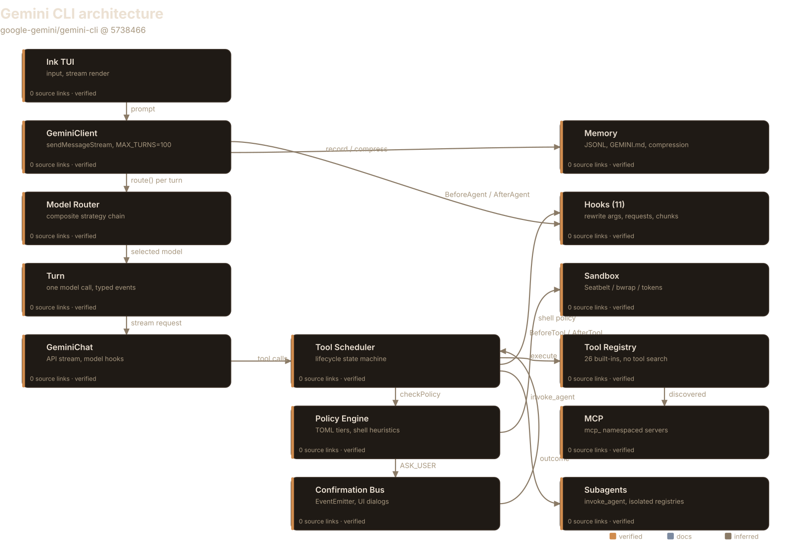
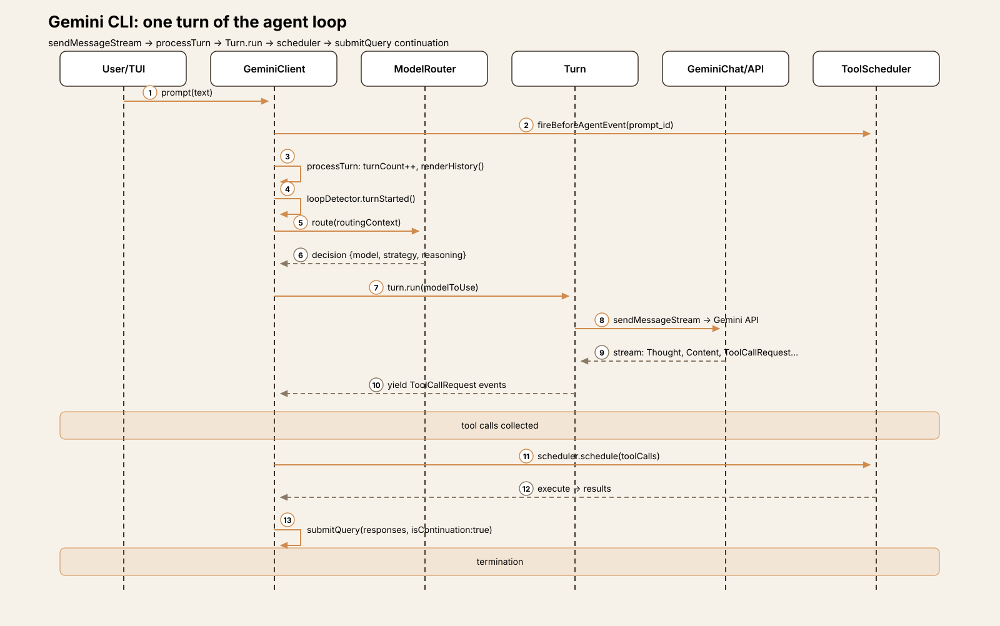
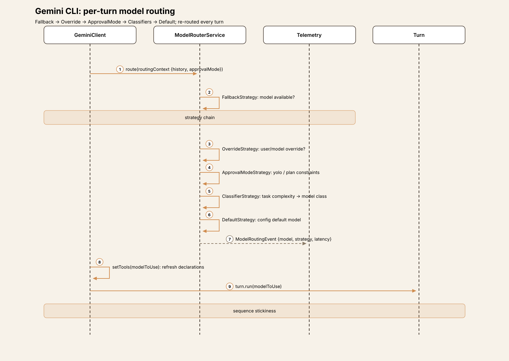
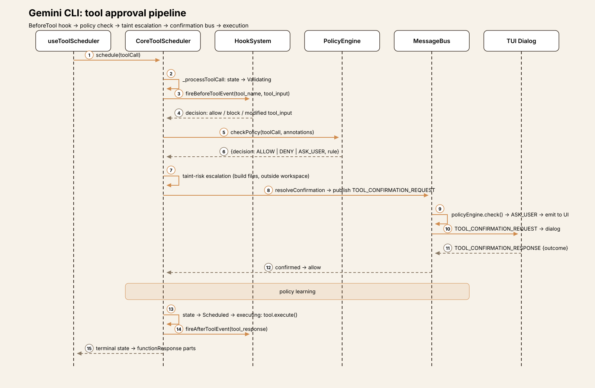
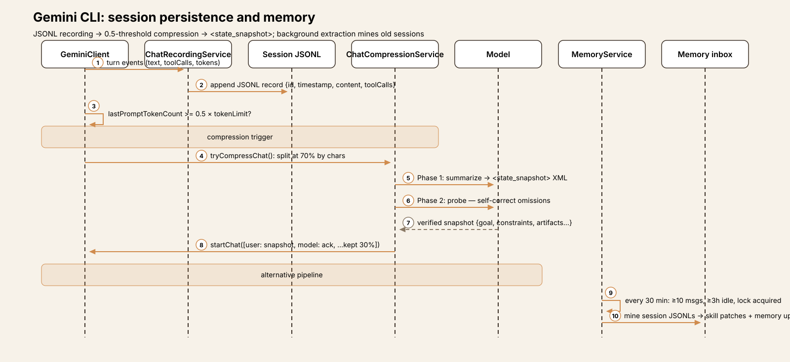
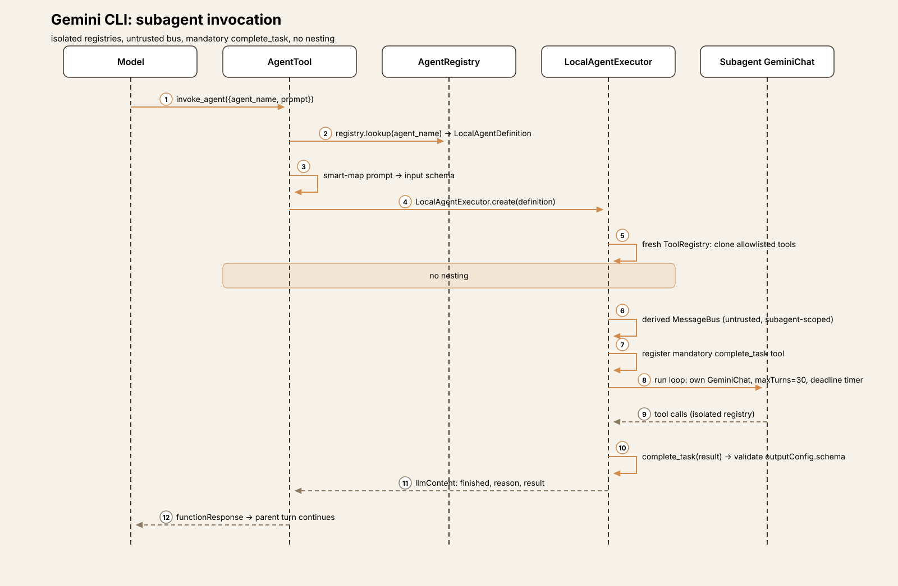

# Agent Harness Anatomy #10: Gemini CLI — the routed, policy-gated terminal agent

> **Series:** Agent Harness Anatomy — top-down dissections of real agent
> harnesses, grounded in verifiable source code. Every behavioral claim
> below carries a footnote to a pinned GitHub permalink; the full evidence
> lives in the endnotes.

## Version block

- **Repo:** [google-gemini/gemini-cli](https://github.com/google-gemini/gemini-cli)
- **Pinned:** tag `v0.63.0` → `573846625af9e93b3b968e0e0b86bb093a4c9b16` (2026-10-06)
- **Language:** TypeScript (npm workspaces monorepo)
- **License:** Apache-2.0
- **Claim under test:** "An open-source AI agent that brings the power of Gemini directly into your terminal"



## The mental model

Every CLI harness in this series so far has been a program with *one* model, *one* loop, and *one* policy. Gemini CLI breaks all three assumptions. It is Google's terminal coding agent — the third lab-built CLI in the series after Codex CLI — and its architecture is organized around **delegation**: a per-turn model router picks which model answers, a tool scheduler with explicit lifecycle states executes calls, a TOML policy engine with priority tiers decides what needs asking, and eleven hook types let extensions rewrite tool arguments, LLM requests, and even streamed responses mid-flight.[^1]

The governing idea: the core loop doesn't decide much. `GeminiClient.sendMessageStream` is a thin orchestrator — it checks turn budgets, runs loop detection, asks the router which model to use, and streams events.[^2] The intelligence lives in the surrounding machinery: the router's composite strategy chain (fallback → override → approval-mode → classifiers → default), the scheduler's Validating → Scheduled → executing → terminal lifecycle, and a confirmation bus that decouples policy decisions from the UI that renders them.[^3]

The tradeoff is machinery for control. Where pi has a loop and extensions, Gemini CLI has a router, a scheduler, a policy engine, a hook system, a context manager, a compression service, a recording service, and a background memory-extraction service — roughly 138,000 lines in `packages/core` alone.[^4] You get per-turn model selection, learned approval policies, and eleven interception points; you pay in the number of systems you must understand to predict what a turn will do.

## Package map

The repo is an npm workspaces monorepo. For this article five areas matter:[^5]

| Area | Role | Scale |
|---|---|---|
| `packages/core/src/core/` | The client: `GeminiClient`, `Turn`, `GeminiChat` — the loop | client.ts (1,313 lines), turn.ts, geminiChat.ts (1,881 lines) |
| `packages/core/src/scheduler/` | Tool execution: lifecycle scheduler, policy, confirmation | scheduler.ts (1,003 lines) |
| `packages/core/src/tools/` | 26 built-in tools, registry, MCP client | 39 tool files |
| `packages/core/src/policy/` + `safety/` + `sandbox/` | TOML policy engine, checkers, per-OS sandboxes | policies/*.toml |
| `packages/core/src/routing/` | Per-turn model router (composite strategies) | modelRouterService.ts |
| `packages/core/src/hooks/` | 11 hook event types, command + runtime hooks | hooks/types.ts |
| `packages/core/src/agents/` | Subagents: registry, `invoke_agent`, isolated executors | local-executor.ts |
| `packages/core/src/context/` + `services/` | Compression, recording, memory, context manager | chatCompressionService.ts |
| `packages/cli/src/` | Ink TUI, non-interactive mode, ACP, stream consumption | 364 files |

## The core loop

The loop lives in `GeminiClient.sendMessageStream` (`packages/core/src/core/client.ts:908`). Its shape:[^6]

```typescript
const MAX_TURNS = 100;  // client.ts:79

async *sendMessageStream(request, signal, prompt_id, turns = MAX_TURNS, ...) {
  // ... hooks, loop-detector reset ...
  const boundedTurns = Math.min(turns, MAX_TURNS);
  let turn = new Turn(this.getChat(), prompt_id);
  turn = yield* this.processTurn(request, signal, prompt_id, boundedTurns, ...);
  // ... AfterAgent hooks, continuation handling ...
}
```

`processTurn` (`client.ts:627`) does the per-turn work: increment the session turn counter (bail with `MaxSessionTurns` if exceeded), render history through the context manager, check for context overflow, consult the **loop detector**, then **route the model**:[^7]

```typescript
const router = this.config.getModelRouterService();
const decision = await router.route(routingContext);
modelToUse = decision.model;
// ... unless currentSequenceModel is sticky from a previous turn
```

The router itself is a composite strategy chain — order matters: `FallbackStrategy` → `OverrideStrategy` → `ApprovalModeStrategy` → `GemmaClassifierStrategy` (opt-in) → `ClassifierStrategy` → `NumericalClassifierStrategy` → `DefaultStrategy`.[^8] Every turn re-routes unless a sequence model is pinned, which means the model answering turn N+1 can differ from turn N — by design, not accident.

`Turn.run` (`core/turn.ts:271`) streams one model call and yields typed events: `Thought`, `Content`, `ToolCallRequest` (one per function call, accumulated in `pendingToolCalls`), `Citation`, `Finished`, `Retry`, `Error`.[^9] Function-call IDs are synthesized as `${name}__${rawCallId}` when the API doesn't supply one.[^10]

Tool calls don't execute in core. The CLI's `useGeminiStream` hook collects `ToolCallRequest` events, then `useToolScheduler.scheduleToolCalls` hands them to the core scheduler; when the batch completes, `handleCompletedTools` calls `submitQuery(responsesToSend, { isContinuation: true })`, which re-enters `sendMessageStream` with `functionResponse` parts.[^11] The loop is split across the package boundary: **core streams and decides, the CLI schedules and feeds back**.

Termination comes from five directions: no pending tool calls (plus a next-speaker LLM check — see trace), `MAX_TURNS` (100), the loop detector (repeated event patterns), `MaxSessionTurns`, or user abort.[^12] The next-speaker check is the subtle one: when a turn ends with no tool calls, a separate LLM call decides whether the *model* should continue ("Please continue.") or the turn is done.[^13] And if the model returns empty text after executing tools, the CLI auto-nudges: `"[System: You successfully executed a tool but returned an empty response. Please analyze the tool output...]"`.[^14]





## Trace one turn

Trace `Summarize the changes in this repo` through the interactive CLI:[^15]

1. **Input.** The Ink TUI captures the prompt; `submitQuery` calls `geminiClient.sendMessageStream(request, signal, prompt_id)`. `BeforeAgent` hooks fire once per `prompt_id` (dedup-guarded); a hook can stop the turn, block it, or inject `<hook_context>`.[^16]
2. **Turn budget.** `processTurn` increments `sessionTurnCount` and bails with `MaxSessionTurns` if the session cap is exceeded. The context manager renders history (or the legacy path compresses if over threshold). `boundedTurns = Math.min(turns, 100)`.[^17]
3. **Loop guard.** `loopDetector.turnStarted()` — repeated prompt patterns abort here with `LoopDetected` before the model is ever called.[^18]
4. **Route the model.** The composite strategy chain picks the model for *this* turn; the decision (model, source strategy, latency, reasoning) is telemetry-logged as a `ModelRoutingEvent`.[^19] `setTools(modelToUse)` refreshes model-dependent tool descriptions.
5. **Model call.** `Turn.run` → `GeminiChat.sendMessageStream` → the Gemini API. `BeforeModel` hooks can rewrite the outgoing request (model, config, contents); `AfterModel` hooks see each streamed chunk and can replace it.[^20] The model emits text plus a `run_shell_command` call (`git log --oneline -10`).
6. **Tool request.** `Turn` yields `ToolCallRequest`; the CLI collects it and `scheduleToolCalls` enqueues it in the core scheduler. The scheduler moves it through lifecycle states: `Validating` → (policy + confirmation) → `Scheduled` → executing → terminal.[^21]
7. **Approval.** `_processToolCall`: `BeforeTool` hook first (can rewrite args — flagged `inputModifiedByHook` — or force ask), then `checkPolicy` (ALLOW/DENY/ASK_USER from the TOML engine), then taint-risk escalation (build-file edits force ASK_USER), then `resolveConfirmation` over the message bus → the TUI dialog. "Always allow" publishes `UPDATE_POLICY`, persisting to the autosaved TOML.[^22]
8. **Execute and feed back.** The tool runs; output is truncated if over threshold and converted to `functionResponse` parts. `handleCompletedTools` calls `submitQuery(responses, {isContinuation: true})` → back to step 2 with `boundedTurns - 1`. When a turn ends with no tool calls, the next-speaker check decides: model continues or turn ends.[^23]



## Subsystem inventory

**Tool system.** 26 built-in tools in the main registry (`read_file`, `replace`, `write_file`, `run_shell_command`, `grep_search`, `glob`, `web_fetch`, `google_web_search`, `ask_user`, `write_todos`, `invoke_agent`, plan-mode tools, tracker tools, background-process tools, MCP resource tools).[^24] `ToolRegistry.sortTools()` orders by priority: 0 = built-in, 1 = project-discovered, 2 = MCP.[^25] There is **no tool search or dynamic retrieval** — every active tool is serialized into `getFunctionDeclarations()` and sent to the model on every turn.[^26] Every object-typed schema gets an injected `wait_for_previous` boolean so the model can force sequential execution.[^27] Tool declarations are model-family-aware: `CoreToolSet` maps families (`default-legacy`, `gemini-3`) to per-tool declaration overrides.[^28]

**Policy engine.** TOML rules with match dimensions (tool name/wildcards, args regex, annotations, approval-mode scoping, interactivity) sorted by priority — first match wins.[^29] Priority tiers are structural: Default=1 < Extension=2 < Workspace=3 < User=4 < Admin=5, so an admin rule always beats a user rule regardless of numeric priority.[^30] Bundled policies cover read-only allows, write asks, yolo/headless/plan-mode behavior, and a sandbox default.[^31] Shell commands get special treatment: wrappers stripped, compound commands split and each subcommand recursively checked, redirections downgrade ALLOW → ASK_USER, dangerous commands force ASK_USER.[^32] Extension-supplied policies are sanitized — ALLOW rules and yolo-mode rules are dropped.[^33]

**Confirmation bus.** `MessageBus` (an `EventEmitter`) decouples policy from UI: tools publish `TOOL_CONFIRMATION_REQUEST` with a correlation ID; the bus runs the policy engine first, then auto-responds (ALLOW/DENY) or emits to subscribers (the TUI dialog, ACP sessions).[^34] Subagent buses are *untrusted* — `forcedDecision` and server names are stripped before forwarding to the parent bus, preventing policy bypass.[^35] Confirmation requests time out after 30s, defaulting to ask.[^36]

**Safety checkers.** Named checkers attach to tool calls and run after the policy decision; failures fail closed to DENY.[^37] Two in-process checkers (`allowed-path`, `conseca`) plus external checkers spawned as child processes with a JSON protocol (5s timeout, any failure → DENY).[^38] **Conseca** is the notable one: a Gemini Flash model generates a least-privilege per-tool security policy from the conversation, then enforces it per call — an LLM-written, LLM-enforced policy. It's gated behind a setting, **default off**, and fail-open when disabled.[^39]

**Sandbox.** Per-OS managers: macOS Seatbelt (strict-allowlist SBPL profile, `(deny default)`), Linux bubblewrap (`--unshare-all`, `--ro-bind / /`), Windows restricted tokens + job objects via a C# helper.[^40] Sandbox TOML configures per-mode (plan/default/accepting_edits) network, readonly, and approved tools.[^41]

**Model router.** Covered in the loop section — the composite strategy chain is the distinctive mechanism. Worth adding: routing decisions are telemetry-logged with source strategy and reasoning, so routing is auditable after the fact.[^42]

**Memory.** Sessions persist as **JSONL** under `~/.gemini/tmp/<projectHash>/chats/` — one JSON object per line, full API parts, tool-call records with token summaries; `$rewindTo` records support history truncation on resume.[^43] Two compaction paths: the legacy `ChatCompressionService` (triggers at 0.5 × token limit, summarizes the oldest 70% into a structured `<state_snapshot>` XML with a two-pass self-correction probe, keeps the newest 30% verbatim)[^44] and the experimental opt-in `ContextManager` (65k-token budget, node aging, async snapshot pipeline).[^45] Cross-session memory is **GEMINI.md files in four tiers**: global → system instruction; extension + project → first-user-message bootstrap; per-directory → JIT injection into tool output on path access.[^46] No vector DB, no SQLite, no embeddings — memory is markdown concatenated into the prompt.[^47] A **background extraction service** mines old session JSONLs (every 30 min, ≥10 user messages, ≥3h idle, lock-coordinated across CLI instances) proposing skill patches and memory updates.[^48]



**Hooks.** 11 event types: `BeforeTool` / `AfterTool`, `BeforeAgent` / `AfterAgent`, `BeforeModel` / `AfterModel`, `BeforeToolSelection`, `Notification`, `SessionStart` / `SessionEnd`, `PreCompress`.[^49] Command hooks (shell subprocess, JSON over stdin, 60s timeout) or runtime hooks (in-process). They can block, rewrite tool args (re-validated), append `<hook_context>`, replace streamed LLM chunks, restrict the tool set per request, or stop the whole agent.[^50] Failures are non-fatal — logged, telemetry-recorded, execution continues.[^51] Project hooks are dropped in untrusted folders.[^52]

**Subagents.** The model spawns subagents through one tool, `invoke_agent` (`{agent_name, prompt}`).[^53] Each runs in a `LocalAgentExecutor` with **isolated registries** (fresh tool/prompt/resource registries cloned from the parent's allowlist), a derived untrusted message bus, and its own `GeminiChat`.[^54] **No nesting**: `Kind.Agent` tools are excluded from subagent registries.[^55] Every subagent must call the mandatory `complete_task` tool to terminate normally; output is schema-validated.[^56] Budgets: `maxTurns` (default 30), `maxTimeMinutes` (default 10, confirmation waits pause the clock), 60s grace period for final `complete_task`.[^57] User-authored agents are Markdown files with YAML frontmatter in `.gemini/agents/` (project, trust-gated with hash acknowledgement) or `~/.gemini/agents/`.[^58] Remote agents speak A2A.[^59]



**MCP.** Servers declared in settings (or contributed by extensions); `McpClientManager` owns one client per server (keyed by config hash).[^60] Discovered tools become `DiscoveredMCPTool`s namespaced `mcp_<server>_<tool>` (63-char API limit, `...` truncation), registered into the main tool registry — the model sees them as ordinary tools.[^61] `list_changed` notifications trigger re-discovery and registry swap.[^62] stdio servers are refused in untrusted folders; stdio env is sanitized with dangerous vars blocked.[^63]

**Skills.** `SKILL.md` files (frontmatter `name` + `description`, markdown body), discovered built-in → extension → user → project with precedence and trust gating.[^64] Two-stage loading: the system prompt lists name/description/location only; the model calls `activate_skill`, which (after user confirmation for non-built-ins) injects the full body wrapped in `<activated_skill>` tags.[^65] A background skill-extraction agent proposes *new* skills from session history — authoring, not execution.[^66]

**Interfaces.** Ink TUI (interactive), non-interactive `gemini -p` mode, ACP (agent-client protocol) sessions, an A2A server package, a programmatic SDK, and a VS Code IDE companion.[^67]

## What it deliberately omits

- **No tool search.** Every active tool rides every request. At 26 built-ins plus MCP servers, the context cost is real — and the codebase has no retrieval layer. (Contrast Goose, Hermes, OpenClaw.)
- **No vector memory.** Sessions are JSONL, memory is markdown. Semantic recall doesn't exist; the background extractor compensates with batch mining.
- **No multi-turn planning primitive.** Subagents are the composition unit; there's no plan-mode planner beyond the approval-mode gate and `write_todos` tracking.
- **YOLO is CLI-only.** It cannot be set from a settings file — a deliberate friction against persistent foot-guns.[^68]

## Comparison matrix row

| # | Dimension | Gemini CLI (v0.63.0) |
|---|---|---|
| 1 | Agent loop | `sendMessageStream` → `processTurn` → `Turn.run`; `MAX_TURNS=100`; per-turn model router; loop detector; next-speaker LLM check; BeforeAgent/AfterAgent hooks |
| 2 | Tool system | 26 built-ins; `ToolRegistry` with priority sort; **no tool search** — all tools sent every turn; `wait_for_previous` injected; model-family declaration overrides |
| 3 | Model providers | Gemini API via `@google/genai`; per-turn composite router (fallback → override → approval-mode → classifiers → default); sequence-model stickiness |
| 4 | Prompt construction | System prompt + tiered GEMINI.md injection; per-turn tool refresh; `BeforeModel` hooks can rewrite the request |
| 5 | Memory/session | JSONL session recording; legacy compression (0.5 threshold, `<state_snapshot>`, two-pass probe) + opt-in ContextManager; 4-tier GEMINI.md; background extraction service |
| 6 | Reasoning/planning | No separate planner; subagents via `invoke_agent` (isolated registries, `complete_task` mandatory, no nesting); `write_todos` tracking |
| 7 | Extensibility | MCP (namespaced `mcp_`); skills (two-stage `activate_skill`); 11 hook types; extensions contribute servers/skills/agents/hooks |
| 8 | Interfaces | Ink TUI; non-interactive CLI; ACP; A2A server; SDK; VS Code companion |
| 9 | Failure handling | Retry with backoff; loop detector; taint escalation; hook fail-open; compression-failure fallback to truncation |
| 10 | Security model | 4 approval modes; TOML policy engine (tiered priorities); confirmation bus; per-OS sandbox; Conseca (opt-in, default off); trust-gated everything |

## Endnotes

[^1]: `packages/core/src/routing/modelRouterService.ts:40-70` (strategy chain); `packages/core/src/scheduler/scheduler.ts:446` (lifecycle loop); `packages/core/src/policy/config.ts:70-89` (tiers); `packages/core/src/hooks/types.ts:43-52` (11 events).
[^2]: `packages/core/src/core/client.ts:908-975` (`sendMessageStream` orchestration).
[^3]: `packages/core/src/confirmation-bus/message-bus.ts:97-164` (bus flow).
[^4]: 479 non-test `.ts` files in `packages/core/src`, ~137,643 lines (counted at the pinned tag; includes blanks/comments).
[^5]: Package sizes counted at the pinned tag; `packages/cli` holds the TUI and stream consumption.
[^6]: `packages/core/src/core/client.ts:79` (`MAX_TURNS`); `client.ts:908` (`sendMessageStream` signature).
[^7]: `packages/core/src/core/client.ts:627-700` (`processTurn`: turn count, context render, loop detector).
[^8]: `packages/core/src/routing/modelRouterService.ts:40-70` (strategy order); `modelRouterService.ts:75-140` (`route()`).
[^9]: `packages/core/src/core/turn.ts:271-300` (`Turn.run` event loop); `turn.ts:254-270` (fields).
[^10]: `packages/core/src/core/turn.ts:470-480` (call ID synthesis).
[^11]: `packages/cli/src/ui/hooks/useGeminiStream.ts:1540-1640` (event consumption); `useGeminiStream.ts:1972-2190` (`handleCompletedTools` → `submitQuery` continuation).
[^12]: `packages/core/src/core/client.ts:636-650` (session turns, `MaxSessionTurns`); `client.ts:840-880` (loop detector in stream).
[^13]: `packages/core/src/core/client.ts:890-910` (`checkNextSpeaker`, "Please continue.").
[^14]: `packages/cli/src/ui/hooks/useGeminiStream.ts:1640-1665` (auto-nudge).
[^15]: Trace reconstructed from the code paths cited per step; no live run was performed.
[^16]: `packages/core/src/core/client.ts:165-216` (`fireBeforeAgentHookSafe`, dedup, `<hook_context>`).
[^17]: `packages/core/src/core/client.ts:627-660` (turn count, context render, `boundedTurns`).
[^18]: `packages/core/src/core/client.ts:760-775` (`loopDetector.turnStarted`).
[^19]: `packages/core/src/routing/modelRouterService.ts:75-140` (`route()`, `ModelRoutingEvent` telemetry).
[^20]: `packages/core/src/core/geminiChat.ts:992-1062` (`fireBeforeModelEvent`, `fireBeforeToolSelectionEvent`); `geminiChat.ts:1466-1482` (`fireAfterModelEvent`, chunk replacement).
[^21]: `packages/core/src/scheduler/scheduler.ts:446-560` (`_processQueue`, `_processNextItem`, lifecycle states).
[^22]: `packages/core/src/scheduler/scheduler.ts:628-760` (`_processToolCall`: hook → policy → taint → confirmation → policy update).
[^23]: `packages/cli/src/ui/hooks/useGeminiStream.ts:2185-2195` (continuation `submitQuery`).
[^24]: `packages/core/src/config/config.ts:4009-4123` (registration); `packages/core/src/tools/tool-names.ts:203-231` (name list; see recon for registry discrepancies).
[^25]: `packages/core/src/tools/tool-registry.ts:307-348` (`sortTools` priorities).
[^26]: Negative grep for `toolsearch|tool_search|search_tool` over `tools/`, `scheduler/`, `config/config.ts` — no hits; `tool-registry.ts:663-705` sends all active tools.
[^27]: `packages/core/src/tools/tools.ts:585-625` (`wait_for_previous` injection).
[^28]: `packages/core/src/tools/definitions/types.ts:21-44`, `coreTools.ts:69-77`, `resolver.ts:14-29` (model-family overrides).
[^29]: `packages/core/src/policy/policy-engine.ts:610-660` (`check`); `policy/types.ts:110-186` (match dimensions).
[^30]: `packages/core/src/policy/config.ts:70-89` (tier constants and composition).
[^31]: `packages/core/src/policy/policies/read-only.toml`, `write.toml`, `yolo.toml`, `non-interactive.toml`, `plan.toml`, `sandbox-default.toml`.
[^32]: `packages/core/src/policy/policy-engine.ts:365-606` (shell heuristics, subcommand recursion, redirection downgrade).
[^33]: `packages/core/src/policy/config.ts:236-280` (`loadExtensionPolicies` sanitization).
[^34]: `packages/core/src/confirmation-bus/message-bus.ts:18-24` (types); `message-bus.ts:97-164` (publish flow).
[^35]: `packages/core/src/confirmation-bus/message-bus.ts:44-90` (untrusted bus stripping).
[^36]: `packages/core/src/tools/tools.ts:359` (30s timeout, default ask).
[^37]: `packages/core/src/policy/types.ts:189-241` (`SafetyCheckerRule`); `safety/checker-runner.ts:99-104` (fail-closed).
[^38]: `packages/core/src/safety/protocol.ts:20-68` (external checker protocol); `safety/checker-runner.ts:114-236` (5s timeout, DENY on failure).
[^39]: `packages/core/src/safety/conseca/conseca.ts:60-116` (generate + enforce); `packages/cli/src/config/settingsSchema.ts:2007-2017` (default false); `policy/policies/conseca.toml:1-6` (priority 100).
[^40]: `packages/core/src/sandbox/macos/MacOsSandboxManager.ts:46`; `sandbox/linux/LinuxSandboxManager.ts:144`; `sandbox/windows/WindowsSandboxManager.ts:61`; `services/sandboxManager.ts:289` (noop fallback).
[^41]: `packages/core/src/policy/sandboxPolicyManager.ts:19-43` (per-mode config); `policy/policies/sandbox-default.toml`.
[^42]: `packages/core/src/routing/modelRouterService.ts:120-140` (`ModelRoutingEvent` logging).
[^43]: `packages/core/src/services/chatRecordingService.ts:480-564` (paths, JSONL format); `chatRecordingTypes.ts:44-103` (record shapes).
[^44]: `packages/core/src/context/chatCompressionService.ts:45` (0.5 threshold); `chatCompressionService.ts:269` (30% preserve); `prompts/snippets.ts:898-980` (`<state_snapshot>`); `chatCompressionService.ts:588-643` (two-pass probe).
[^45]: `packages/core/src/config/config.ts:1205-1206` (opt-in default off); `context/contextManager.ts:352-440` (65k budget, aging).
[^46]: `packages/core/src/tools/memoryTool.ts:11-12` (file names); `utils/memoryDiscovery.ts:317-427` (scopes); `config/config.ts:2590-2634` (tiered injection); `context/memoryContextManager.ts:125-158` (JIT).
[^47]: Negative grep for `sqlite|embedding|chroma|faiss` on memory/session paths — no hits.
[^48]: `packages/core/src/services/memoryService.ts:56-62` (cadence gates); `memoryService.ts:1133-1180` (lock coordination); `memoryService.ts:1372-1402` (outputs).
[^49]: `packages/core/src/hooks/types.ts:43-52` (enum); `hooks/types.ts:578-752` (per-event inputs).
[^50]: `packages/core/src/core/coreToolHookTriggers.ts:64-234` (tool hook powers); `core/geminiChat.ts:999-1045` (BeforeModel rewrite); `hooks/types.ts:130-211` (decisions).
[^51]: `packages/core/src/hooks/hookEventHandler.ts:389-404`; `hooks/hookSystem.ts:261-307` (safe defaults).
[^52]: `packages/core/src/hooks/hookRegistry.ts:178-185` (untrusted-folder drop).
[^53]: `packages/core/src/tools/tool-names.ts:191` (`invoke_agent`); `agents/agent-tool.ts:43-122` (`AgentTool`, prompt smart-mapping).
[^54]: `packages/core/src/agents/local-executor.ts:168-282` (isolated registries, derived bus).
[^55]: `packages/core/src/agents/local-executor.ts:206-213` (Agent-kind exclusion).
[^56]: `packages/core/src/agents/local-executor.ts:271-276` (mandatory `complete_task`, schema validation).
[^57]: `packages/core/src/agents/types.ts:54-66` (budgets); `agents/local-executor.ts:602-616` (deadline timer); `local-executor.ts:109` (grace period).
[^58]: `packages/core/src/agents/agentLoader.ts:87-115` (frontmatter schema); `agents/registry.ts:158-276` (load order); `registry.ts:173-202` (trust gating).
[^59]: `packages/core/src/agents/remote-invocation.ts`; `agents/auth-provider/`.
[^60]: `packages/core/src/config/config.ts:805-1077` (server config); `tools/mcp-client-manager.ts:305-408` (keyed clients, discovery).
[^61]: `packages/core/src/tools/mcp-tool.ts:501-538` (`DiscoveredMCPTool`); `mcp-tool.ts:541-573` (`generateValidName`, 63-char limit).
[^62]: `packages/core/src/tools/mcp-client.ts:698-768` (`refreshTools` on `list_changed`).
[^63]: `packages/core/src/tools/mcp-client.ts:2317` (stdio refused untrusted); `mcp-client.ts:2320-2365` (env sanitization).
[^64]: `packages/core/src/skills/skillLoader.ts:16-30` (`SkillDefinition`); `skills/skillManager.ts:54-111` (precedence); `skills/skillManager.ts:82-87` (trust gate).
[^65]: `packages/core/src/prompts/snippets.ts:314-325` (`renderAgentSkills`); `tools/activate-skill.ts:85-158` (confirmation, `<activated_skill>` injection).
[^66]: `packages/core/src/agents/skill-extraction-agent.ts:27-91`.
[^67]: `packages/cli/src/gemini.tsx` (TUI); `packages/cli/src/nonInteractiveCli.ts`; `packages/cli/src/acp/`; `packages/a2a-server/`; `packages/sdk/`; `packages/vscode-ide-companion/`.
[^68]: `packages/cli/src/config/settingsSchema.ts:238` (YOLO CLI-only).
