# Agent Harness Anatomy #4: Goose — the MCP-native agent that asks a judge

> **Series:** Agent Harness Anatomy — top-down dissections of real agent
> harnesses, grounded in verifiable source code. Every behavioral claim
> below carries a footnote to a pinned GitHub permalink; the full evidence
> lives in the endnotes.

## Version block

- **Repo:** [block/goose](https://github.com/block/goose)
- **Pinned:** tag `v1.53.0` → `76da81cb964b21cd096db739302329b40c2998b8` (2026-09-30)
- **Language:** Rust (cargo workspace) + Electron desktop
- **License:** Apache-2.0
- **Claim under test:** "your native open source AI agent — desktop app, CLI, and API — for code, workflows, and everything in between"
- **Scope:** this teardown covers the **CLI agent** (`crates/goose-cli` +
  `crates/goose`), the series' MCP-native axis. The Electron desktop
  (`ui/desktop/`) is noted where it hosts the cron loop; `goose-roaming`
  (P2P transport) was mapped but not deep-dived.[^1]

| Crate | `.rs` under `src/` | Role |
|---|---|---|
| `goose` | 339 files, 176,482 LOC | THE product crate: agent, extensions, session, config, gateway |
| `goose-cli` | 51 files, 28,625 LOC | CLI binary, session REPL, recipes, commands |
| `goose-provider-types` | 36 files, 30,822 LOC | Conversation/message types, Provider trait, canonical model registry |
| `goose-providers` | 26 files, 15,731 LOC | Provider implementations (36 static registrations + 48 declarative JSON) |
| `goose-local-inference` | 20 files, 10,347 LOC | On-device inference (llama.cpp/GGUF + MLX) |
| `goose-mcp` | 11 files, 6,084 LOC | MCP client crate + 4 bundled MCP servers |
| `goose-agent` | 6 files, 1,557 LOC | Generic state-machine (the NEW loop's skeleton) |
| `goose-context-management` | 7 files, 1,156 LOC | Language-agnostic compaction library |
| `goose-sdk` | 4 files, 2,834 LOC | Provider decision/bindings (uniffi for Python/Kotlin) |
| `goose-roaming` | 11 files, 2,197 LOC | P2P roaming transport (iroh-based; mapped, not deep-dived) |

Entry is the CLI binary at `crates/goose-cli/src/main.rs` →
`goose_cli::cli::cli()`; the agent loop lives at
`crates/goose/src/agents/agent.rs` (`Agent::reply`).[^1]

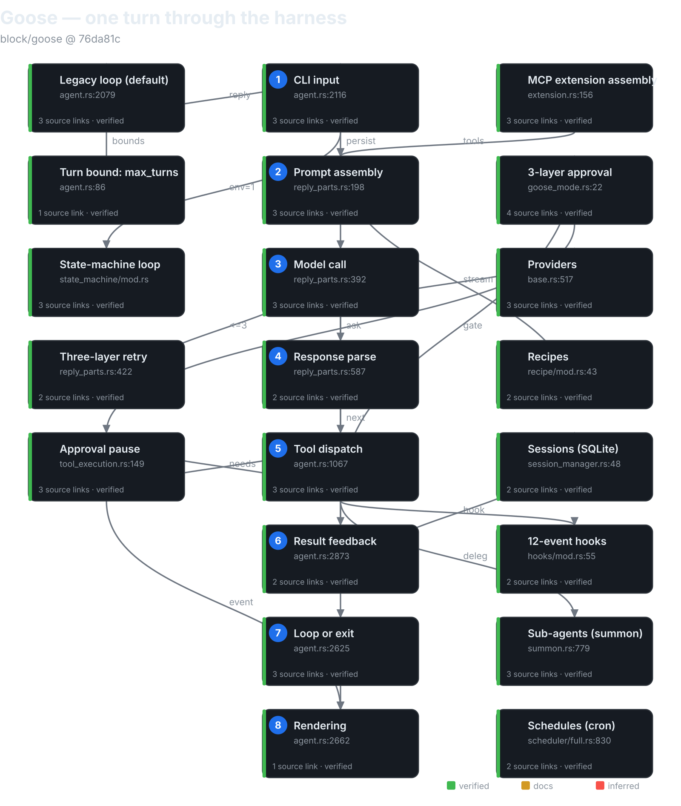

## The mental model

Goose is an **MCP-native, approval-gated agent runtime in Rust** — and it
is mid-migration between two agent loops. Every tool the agent sees,
built-in or third-party, arrives through the MCP client layer: "builtin"
means *in-process MCP over a tokio duplex*, not a function call. There is
no non-MCP tool path at all.[^2] The loop the CLI runs by default is a
6,382-line legacy `agent.rs`[^6]; the opt-in replacement is an effect-sourced
state machine enabled by `GOOSE_STATE_MACHINE=1` — and the repo's own
AGENTS.md documents the parity burden plainly: "Until the migration is
complete, changes to agent-loop behavior must be implemented and tested in
both paths."[^3]

Three inversions against the series so far. Against pi: where pi has 8
built-in tools (4 on by default) and a TypeScript extension API, goose's entire toolset is
assembled per-session from extension configs — the tool system *is* the
extension system. Against aider: where aider negotiates with the model
through text edit formats and remembers via git, goose speaks native tool
calls and remembers via SQLite — but keeps aider's model-awareness
philosophy, with an 8,160-entry model catalog zstd-bundled at build time
plus substring heuristics.[^4] Against Cline: where Cline's approval model
is user-driven policy plus diff previews, goose adds a second adaptive
layer — an **LLM judge** that classifies tool calls as read-only, labeled
`UNTRUSTED TOOL REQUEST DATA`, failing closed.[^5]

The governing tradeoff: goose pays Rust-scale engineering (two loops, five
inspectors, four extension transports) for a harness where the tool
contract is a *protocol* (MCP), not an API. If you're building a harness,
that's goose's thesis in one sentence: make everything a server, and the
agent becomes a client of its own capabilities.

## Package map

A layered cargo workspace, dependency direction running strictly
downward:[^1]

```
goose-provider-types  Provider trait, Message/Conversation, canonical registry
        ↑
goose-providers       36 static + 48 declarative provider registrations
goose-mcp             MCP client + 4 bundled servers
goose-agent           generic StateMachine: Operation/Inference/Step traits
goose-context-management  compaction library (summarize, token estimation)
        ↑
goose                 Agent, extensions, sessions, recipes, scheduler, gateway, hooks
        ↑
goose-cli             REPL session, commands, recipes CLI, schedule CLI
```

`crates/goose/src` key dirs: `agents/` (the loop + extensions + platform
tools), `session/` (SQLite session manager), `recipe/`, `scheduler/`,
`gateway/` (Telegram), `hooks/`, `config/` (`config.yaml`,
`permission.yaml`), `context_mgmt/`, `permission/` (inspectors),
`providers/` (registry, OAuth, inventory), `conversation/` (message types).

## The core loop

**Two loops; a migration in progress.** `Agent::reply()`
(`agent.rs:2079`) takes a `use_state_machine: bool`; the CLI passes
`goose::agents::state_machine::enabled()`, which is false unless
`GOOSE_STATE_MACHINE` is one of `1`, `true`, `TRUE`, `yes` — so the
default is the legacy loop.[^3]

### The legacy loop (default)

`Agent::reply` → `reply_impl` (preamble: elicitation interception,
state-machine dispatch, empty-message short-circuit, `SessionStart` /
`UserPromptSubmit` hooks, slash commands, final-output pre-check,
auto-compaction gate) → `reply_internal`, which runs a **plain `loop {}`**
inside an `async_stream::try_stream!`:[^6]

```rust
loop {
    if is_token_cancelled(&cancel_token) {
        break;
    }

    if can_drain_pending_steers {
        for message in self.drain_pending_steers(&session_config.id).await {
```

A "turn" is one provider round-trip plus tool-drain; `turns_taken`
increments per iteration except after empty-turn retries and stop-hook
denials, which don't consume budget. Termination: `max_turns` (recipe →
`GOOSE_MAX_TURNS` → **1000**, `DEFAULT_MAX_TURNS: u32 = 1000`) yields
`MAX_TURNS_MESSAGE` and breaks; cancellation (three check points);
provider refusal; credits/auth/network errors; at most 2 recovery
compactions; at most 3 empty-turn retries; a stop-hook denial cap of 8;
recipe retry exhaustion.[^7] There is no `max_iterations` symbol anywhere
in the agent or CLI crates — the bound is `max_turns`, full stop.[^7]

**Confirmation plugs in mid-turn.** `inspect_tools` splits requests into
`approved` / `needs_approval` / `denied`; for the middle group,
`handle_approval_tool_requests` registers a oneshot in the
`ToolConfirmationRouter`, yields an `ActionRequired` event, and **`await`s
— the loop genuinely pauses mid-iteration** until
`submit_tool_confirmation` delivers the verdict.[^8] (`handle_confirmation`
is dead — zero non-test callers, superseded by `submit_tool_confirmation`.
Providers can also route confirmation natively through the protocol via
`PermissionRouting::ActionRequired`.)[^8]

Retry is three layers: (a) provider pre-first-item retry (≤3, exponential
backoff 1s→30s, transient-only; auth errors get one credential refresh;
**mid-stream errors are not retried**); (b) recipe `RetryManager` (shell
success checks, an `on_failure` command, conversation reset to the
`initial_messages` snapshot); (c) micro-retries — empty-turn ×3,
compaction ×2, stop-hook ×8. Tool failures arrive as error `ToolResponse`
content, not exceptions.[^9] And one guard is theater: the
`RepetitionInspector` doom-loop guard is registered with `None`, so
`check_tool_call` always returns true, and `inspect` runs on throwaway
clones. The doom-loop protection readers expect is actually just
`max_turns`.[^9]

### The state-machine loop (opt-in)

Effect-sourced: every step produces `GooseEffect`s applied to the
persisted session by the `SessionManager` — the machine re-loads the
session each iteration, "an ordered, re-entrant pipeline over persisted
conversation state."[^10] The step order is fixed, and the LLM call is
**dead last**:

1. `EntryHookOperation` → 2. `SlashCommandOperation` → 3. `SteerOperation`
   → 4. `MaxTurnsOperation` → 5. `BangShellOperation` → 6.
   `CompactionOperation` (skipped if the provider `manages_own_context`)
   → 7. `ToolPairCompactionOperation` → 8. `ToolApprovalOperation` → 9.
   `DoctorOperation` → 10. `ProjectOperation` → 11. `SkillOperation` → 12.
   `RecipeOperation` → 13. `ToolExecutionOperation` → 14.
   `UnknownToolOperation` → 15. `RetryOperation` → 16. `StopHookOperation`
   → 17. `ExitOnErrorOperation` → **18. `Inference`** — which gathers
   `inference_tools`, `prompt_parts`, and `moim_parts` from *every*
   operation before calling the model.[^10]

Approval here is modeled as conversation effects: a `goose.executable`
boolean patched onto tool-request metadata. Two seams worth naming: the
legacy loop imports the new path's `MAX_TURNS_MESSAGE` (the old giant
leans on the new skeleton), and `Permission::Cancel` is normalized to
`DenyOnce` only in the state-machine path — approval is enforced twice,
differently, per the migration's parity burden.[^11] One more: the steer
queue can veto the loop's exit but cannot inject a steer before the first
provider round-trip.[^12]

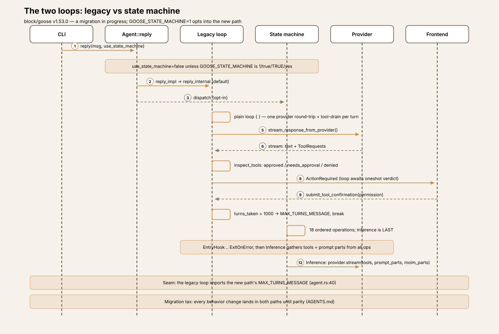

## One turn, end to end

Trace: the user types `list the files in src/ and summarize what this
project does` in the CLI, Auto mode, default extensions.

**① Input.** `Agent::reply` assigns a message ID; `reply_impl` finds no
elicitation content; `use_state_machine=false` skips the new path;
`SessionStart` / `UserPromptSubmit` hooks fire; `execute_command` returns
`Ok(None)` — not a slash command; the message is persisted via
`session_manager.add_message`.[^13]

**② Prompt assembly.** `reply_internal` → `prepare_reply_context` →
`prepare_tools_and_prompt`: tools are collected via `list_tools` from the
extension manager (including MCP servers), names are enforced unique, and
the system prompt is built with `PromptManager` from extension info plus
directory hints plus the goose mode. Toolshim vs native tools are split
per `model_config.toolshim`. A moim turn-context message (time, working
dir, compaction status, turn budget) is persisted as an agent-only user
message before the loop — skipped when the context limit is under 32k.[^14]

**③ Model call.** Loop iteration 1: `turns_taken` → 1; `1 > 1000` is false.
`stream_response_from_provider` → `provider.stream(&model_config,
system_prompt, messages, &tools)` — streaming, with pre-first-item
transient retries (≤3) on rate-limit/5xx/network. Text chunks yield
`AgentEvent::Message` live.[^15]

**④ Response parse.** `categorize_tool_requests` extracts the model's
`ToolRequest`s (say, a `shell` call — the developer extension's tools
are unprefixed), canonicalizes
model-mangled names (`recover_mangled_tool_name`), coerces arguments to
the advertised JSON schema, and dedupes tool-call IDs. Calls to
unadvertised tools become `invalid_request` errors — invalid tool calls
are *data*, not exceptions.[^16]

**⑤ Tool dispatch.** `inspect_tools` plus the permission split: a read-only
`ls` lands in `approved` → `dispatch_tool_call` → `PreToolUse` hooks fire
→ `extension_manager.dispatch_tool_call` runs it → `with_post_tool_hook`
wraps it (large-response spill + `PostToolUse` hooks). A mutating call
would instead hit `handle_approval_tool_requests`: a oneshot registered,
an `ActionRequired` event yielded, the loop paused until
`submit_tool_confirmation` delivers the verdict. Streams drain
concurrently.[^17]

**⑥ Result feedback.** Tool outputs attach as `ToolResponse` blocks on
user-role messages; request/response pairs go into `messages_to_add`,
persisted per message and appended to the conversation. Thinking blocks
ride on the first tool-call carrier message; unparseable calls become a
well-formed `"unparseable_tool_call"` placeholder so strict providers
never see malformed history. Large text outputs spill to an owner-only
temp file (200,000-char default) before feedback.[^18]

**⑦ Loop or exit.** Iteration 2: the model answers in text with no further
tool calls → `exit_chat = true`; the stop hook allows → `break`.
Otherwise the loop continues until `turns_taken > 1000`, cancellation, an
error arm, or the stop-hook cap.[^19]

**⑧ Rendering.** Nothing is printed by the loop itself — all output is
`AgentEvent`s (streamed text, `ActionRequired` prompts, `Usage` updates)
consumed by the CLI, the desktop, and the ACP frontends. Final summary
text accumulates in `last_assistant_text`.[^20]

## Subsystem inventory

- **MCP + extensions (the signature subsystem).** Configuration is
  `ExtensionConfig`, exactly four variants — `stdio`, `builtin`,
  `platform`, `streamable_http`. **No SSE**: leftover `sse` configs only
  emit a migrate-warning.[^21] They live under `extensions:` in
  `~/.config/goose/config.yaml` (`GOOSE_PATH_ROOT` overrides the root).
  Session startup resolves extensions for the new session, then
  `Agent::add_extensions_bulk` → `ExtensionManager::add_extension`
  (no-op on unchanged config), resolving secrets and envs against a
  31-key env denylist, then connecting per type: stdio spawns a subprocess
  (with an OSV malware check on npx/uvx invocations), builtin servers
  connect over **in-process tokio duplex**, platform extensions run
  in-process via the client factory, remote ones get an OAuth step-up
  wrapper with proactive token refresh.[^22]

  Tools are listed per client and namespaced `<ext>__<tool>` (unprefixed
  only for first-class platform tools), owner-tagged in
  `_meta.goose_extension` — the `__` prefix is a display name; true
  ownership is the `_meta` tag — cached with version invalidation on
  `tools/list_changed`, and dispatched back to the owning client by
  `resolve_tool_with_constraints` (with mangled-name recovery for
  `developer.shell` / `functions.*`).[^23] The bundled set in `goose-mcp`:
  autovisualiser (8 `render_*` tools), computercontroller (xlsx/docx/pdf
  plus a macOS-only `computer_control`), memory (4 tools), tutorial (1
  tool). Platform extensions: developer, summon, skills, analyze, tom,
  extensionmanager, apps, and scheduler default ON; todo, chatrecall,
  summarize, code_execution, and orchestrator default OFF (scheduler and
  orchestrator hidden).[^23]

  Discovery is where the docs overreach. `servers.json` still exists but
  is consumed **only by the docs website** — no runtime consumer. The
  repo's AGENTS.md refuses new directory entries pending migration to the
  official MCP Registry, and **no registry client exists in code**.
  `search_available_extensions` is config-local only.[^24] Permissions are
  keyed on prefixed tool *names*; `ToolInfo.permission` is dead code
  (defined once, referenced nowhere else); `manage_extensions` always
  requires approval and is blocked for subagents; an `available_tools`
  allowlist is enforced at list and dispatch time; removing an extension
  strips its per-tool permissions. There is no manifest permission model —
  restriction is host-side.[^25]

  The protocol layer: rmcp 3.4.1 is the protocol SDK; `goose-mcp` adds the
  four bundled servers, the spawn-function registry, and subprocess/PATH
  plumbing; the goose crate's `GooseClient` adds roots, elicitation
  (300s timeout, routed to the user), session-context `_meta` injection,
  and timeouts/cancellation.[^26] And the docs diverge in four places
  worth naming: `extensions-design.md` documents a fictional `Extension`
  trait (zero occurrences in code); docs say `goose mcp {name}` adds a
  builtin to a session — it runs the server standalone on stdio; docs name
  an `enable_extension` tool — the real tool is `manage_extensions`;
  "Smart Extension Recommendation" is just a local config listing.[^27]

  Contrast the series: Cline wraps MCP servers as native `server__tool`
  `AgentTool`s with per-server config; **goose inverts it — everything is
  an MCP server**, including builtins, and the agent's entire toolset is
  extension config. pi has 8 built-ins (4 on by default) plus a TS extension API; goose has
  no non-MCP tool path at all.[^2]

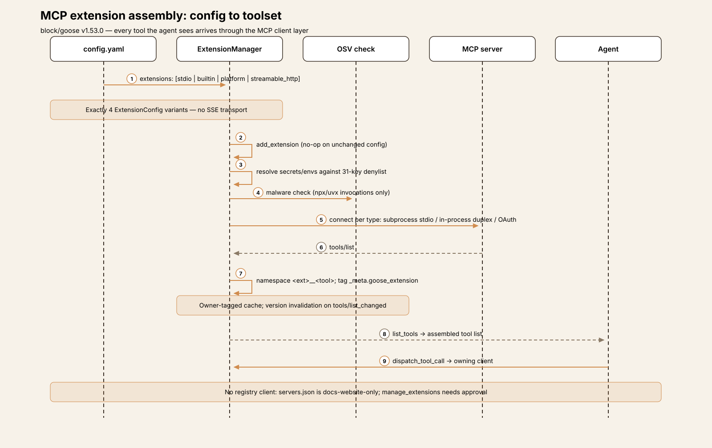

- **The approval model.** Three cooperating layers:

  **1. Modes.** `GooseMode ∈ {Auto, Approve, SmartApprove, Chat}`,
  default Auto (`GOOSE_MODE` config key; `/mode` switches mid-session).
  Auto approves, Approve asks on everything, SmartApprove asks only for
  sensitive calls, Chat runs no tools at all.[^29]
  **2. Permission levels.** `PermissionLevel ∈ {AlwaysAllow, AskBefore,
  NeverAllow}` per tool, persisted in `<config_dir>/permission.yaml`
  under `user:` and `smart_approve:` namespaces; lookup precedence is
  **NeverAllow > AlwaysAllow > AskBefore**, keyed by full tool name —
  removing an extension prunes its entries.[^30]
  **3. The inspector chain.** Registered in `Agent::new` in order:
  Security (malicious patterns), Egress (exfiltration destinations),
  Adversary (user-defined `adversary.md`, model-reviewed), Permission
  (the mode/permission decision table), Repetition (the inert doom-loop
  guard). Each emits `InspectionAction ∈ {Allow, Deny, RequireApproval}`.
  **Security can only escalate, never relax**: a Deny removes the request
  from approved *and* needs-approval; an Allow is explicitly a no-op on
  other inspectors' decisions — "don't override other inspectors'
  decisions."[^31]

  **SmartApprove's core is an LLM judge.** For tools with no cached
  verdict, goose asks the model itself whether each pending tool call is
  read-only — the requests are labeled `UNTRUSTED TOOL REQUEST DATA` and
  sent through a synthetic `platform__tool_by_tool_permission` tool.
  Non-read-only verdicts are cached name-wide as `AskBefore` in the
  `smart_approve:` namespace; **judge failure fails closed** (everything
  prompts). The code acknowledges the fox-guarding-henhouse shape with
  prompt-injection tests in-tree.[^32]

  The user prompt offers Allow / Always Allow / Deny / Cancel — but
  **"Always Allow" is withheld when a security inspector attached a
  warning**. `AlwaysDeny` is never offered in the CLI; its only producer
  is the Telegram gateway's "deny always" reply. And headless is strict:
  `Auto` auto-allows (with a warn log), but `Approve`/`SmartApprove` in
  non-interactive mode is a hard error — "This is an invalid
  configuration."[^33]

  Series comparison: `GooseMode` ≈ Cline's plan/act modes; per-tool
  `permission.yaml` ≈ Cline's per-tool allow-list — but the LLM judge
  plus the security inspectors are a second adaptive layer Cline doesn't
  have. Against aider: there is no git-undo safety net at all (verified
  negative) — safety is approval-gating plus inspectors. Against pi: the
  analogue of `beforeToolCall` is `HookEvent::PreToolUse` (exit code 2 or
  `{"decision":"block"}`), evaluated before dispatch in both loops — but
  plugin-loaded shell commands, not a user hook function.[^28][^33]

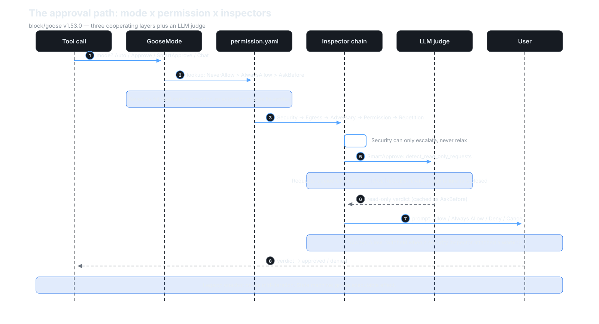

- **Providers.** The `Provider` trait has exactly one required behavioral
  method: `stream()`. `complete()` defaults to stream-plus-collect; only
  one provider in-tree overrides it. There is a single `Provider`
  trait — grep confirms it.[^34] The inventory: 36 static registrations
  (including feature-gated `aws_bedrock`, `sagemaker_tgi`, `local`), 48
  bundled declarative JSON definitions, and user custom providers from
  `~/.config/goose/custom_providers/` — four tiers (Preferred, Builtin,
  Declarative, Custom), with a selection chain from `--provider` flag
  through saved session, recipe, `GOOSE_PROVIDER` env, and config.[^35]

  The model catalog is **goose's aider-YAML analog at scale**: an
  8,160-entry models.dev snapshot zstd-bundled at build time, with a
  background ETag refresh that hot-swaps the registry at runtime. Name
  resolution is goose's substring-heuristics layer — version-suffix
  stripping, provider renames, Claude word-order swapping,
  `infer_provider_from_model` substring rules — plus hardcoded
  `inferred_thinking_mode` for Claude 4.5–5.x and name-regex matchers for
  reasoning models. **No model-name validation exists anywhere** on the
  `GOOSE_MODEL` path; and there is no aider-style hand-written YAML.[^36]

  Auth is env-var-first-then-keyring, with no mixing; four auth methods
  (`NoAuth`, `BearerToken`, `ApiKey`, `Custom`); OAuth via
  `configure_oauth` in six providers with a shared RFC 8628 device-flow
  helper; command-based auth for custom providers. One naming seam:
  `crates/goose/src/oauth/` is **MCP-server OAuth**, not provider auth —
  provider OAuth lives under `providers/oauth*.rs`.[^37]
  `goose-local-inference` puts llama.cpp/GGUF and MLX on-device inference
  behind provider name `"local"` — feature-gated, never default, no
  auto-activation, with its own tool-emulation (toolshim) and chat
  templates.[^38]

  Message types deserve a line: `MessageContentBlock` carries
  Thinking/RedactedThinking blocks (signature-aware stream coalescing);
  `ToolRequest` wraps `rmcp::model::CallToolRequestParams`, so invalid
  tool calls are *data*, not errors; harness annotations ride in
  `tool_meta._meta`; approval and elicitation are modeled as conversation
  blocks. Cost is estimated, never authoritative unless provider-reported.[^39]

  Philosophy: aider's (big model catalog + heuristics) with per-provider
  implementations — but unlike Cline's one generic AI-SDK adapter, goose
  statically registers 36 providers and adds a declarative JSON tier for the
  long tail.[^4]

- **Sessions.** SQLite (`<data_dir>/sessions/sessions.db`), messages as
  JSON blobs. The session record carries the id, working dir, an
  LLM-generated name, the session type, timestamps, extension data,
  usage/accumulated cost, the schedule id, **the full `Recipe` struct
  persisted on the session**, user recipe values, the conversation, the
  goose mode, the parent session id, and the provider/model.
  `SessionType` spans `User | Scheduled | SubAgent | Hidden | Terminal |
  Gateway | Acp` — resume lists only `User`. Resume via
  `goose session --resume` (by name or id, or the most recent `User`
  session); `--fork` copies messages into a new session. Cross-session
  recall is explicit — a `chatrecall` platform tool plus SQL full-text
  search — never automatic. Every message carries `user_visible` /
  `agent_visible` flags, which compaction and subagent summaries
  exploit.[^40]

- **Context management: compaction, not budgeting.** There is no
  token-budget allocator — the negative grep is clean. Auto-compaction
  triggers when `session.usage.total_tokens / context_limit > 0.8`
  (overridable via `GOOSE_AUTO_COMPACT_THRESHOLD`; ≤0 or ≥1 disables it;
  providers that `manages_own_context` skip it). The numerator prefers
  session metadata and falls back to a token-counter estimate — the code
  labels the source ("session metadata" vs "estimated"). The check runs
  before each reply in both loops; `/compact` triggers it manually.
  `compact_messages` runs one-shot model summarization, marks all
  original messages agent-invisible (kept user-visible for the UI),
  appends one agent-only summary plus a continuation nudge, preserves the
  latest user text, and persists via `replace_conversation` plus a
  `HistoryReplaced` event. An opt-in tool-pair summarization (default
  off) replaces the oldest 10 tool request/response pairs past a computed
  cutoff with per-pair summaries. The `goose-context-management` crate is
  a language-agnostic compaction library — and it is wrapped for
  Python/Kotlin through `goose-sdk`'s uniffi bindings.[^41]

- **Hooks.** Plugin-loaded lifecycle hooks: **12 events** (`PreToolUse`,
  `PreToolUseResult`, `PostToolUse`, `PostToolUseFailure`, `SessionStart`,
  `SessionEnd`, `UserPromptSubmit`, `BeforeReadFile`, `AfterFileEdit`,
  `BeforeShellExecution`, `AfterShellExecution`, `Stop`). Each enabled
  plugin contributes a `hooks/hooks.json`; only `command` actions are
  supported; the hook runs as a shell command with JSON-serialized
  `HookContext` on stdin and a 30-second default timeout. **Blocking
  semantics: exit code 2 or `{"decision":"block"}`; first denial wins.**
  `PreToolUse` runs before dispatch in both loops — goose's analogue of
  pi's `beforeToolCall`, but plugin-loaded shell commands rather than a
  user hook function. Hook errors never crash the host. Event-name casing
  is verified against a real shipped example: PascalCase, matching the
  `HookEvent` names exactly.[^42] One aspirational seam: the config module
  doc comment advertises "hot reloading of configuration changes," but
  there is no file watcher and no reload function anywhere in the config
  crate — the claim exists only in the comment.[^42]

- **Schedules.** In-process cron, not a daemon: a `Scheduler` wraps
  `tokio-cron-scheduler` behind a feature flag; jobs live in
  `<data_dir>/schedule.json`, and recipe files are copied (validated, ≤1
  MiB, mode `0o600`) into `scheduled_recipes/<job-id>.<ext>`. The cron
  dialect is 6-field (seconds first), local timezone, with 5-field
  auto-prefixing. On fire, the stored recipe copy is built into a
  `SessionType::Scheduled` session running **always in `GooseMode::Auto`
  — scheduled jobs never prompt**. Validation requires prompt-or-
  instructions, schema-valid parameters (no `user_prompt` params — they'd
  block headless), and a valid response JSON schema. The agent surface is
  the `scheduler__manage_schedule` platform tool; the CLI offers
  `goose schedule add|list|remove|sessions|run-now|cron-help`. The cron
  loop lives in the long-lived desktop/ACP process; a CLI `goose schedule`
  invocation builds a throwaway `Scheduler`. One seam: CLI help blesses
  `@hourly` shorthands that `create_cron_task` rejects with
  `CronParseError`.[^43]

- **Sub-agents.** The surface is the `delegate` tool in the `summon`
  platform extension (ad-hoc, source-based, and combined modes; `async:
  true` runs in the background with a `load(taskId)` handle). Execution
  is a full in-process `Agent` running `agent.reply(...)` recursively,
  with its own `SessionType::SubAgent` session and `parent_session_id`.
  **No nested delegation.** **Forced `GooseMode::Auto`** — the comment is
  explicit: *"Subagents must use Auto until get_agent_messages forwards
  ActionRequired messages to the parent. Until then, any mode that
  requires approval will hang."* Default max 25 turns
  (`GOOSE_SUBAGENT_MAX_TURNS`), system prompt from
  `prompts/subagent_system.md`, result extraction from the `final_output`
  tool output when the recipe has a response schema, else last/all
  text.[^44]

- **Gateway + ACP.** A remote messaging bridge pairs a messaging-platform
  user (pairing code) to goose sessions and relays chat ↔ agent,
  including approval prompts. **Only Telegram exists at this SHA** —
  `create_gateway` bails on anything else. The handler keeps per-user
  `SessionType::Gateway` sessions, and approvals are answered by chat
  text (`approve` / `approve always` / `deny` / `deny always` → `Permission`
  variants) — this is the **only producer of `AlwaysDeny`** in the whole
  codebase.[^45] Separately, `crates/goose/src/acp/` hosts an ACP (Agent
  Client Protocol) server — the desktop app drives the agent through this
  bridge — with live callers of `submit_tool_confirmation` at
  `acp/server.rs:1611` and `:421`.[^45]

## Extension points

Goose's extension surface is the broadest of the four harnesses so far —
and it operates at three altitudes: the protocol (MCP servers), the
declarative (recipes, schedules, hooks), and the programmatic (the
`Provider` trait itself).

### 1. Extension configs (MCP servers)

The primary axis. Four transports (`stdio`, `builtin`, `platform`,
`streamable_http`), declared in `config.yaml`, hot-added per session,
tools namespaced `<ext>__<tool>` with `_meta.goose_extension` ownership.
Bundled servers in `goose-mcp`; platform extensions toggled on/off by
default lists. The OSV malware check on npx/uvx-spawned servers is the
closest thing to install-time review in the series.[^21][^22]

**Start here:** `ExtensionConfig` in `crates/goose/src/agents/extension.rs`,
then `ExtensionManager::add_extension` for the connect-per-type logic.

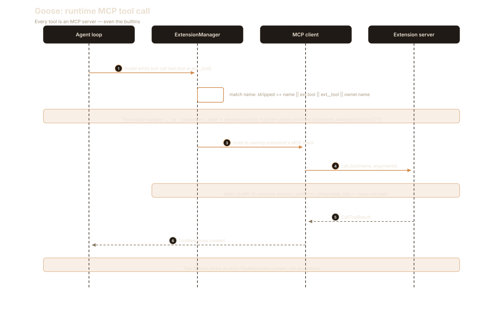

### 2. Plugin hooks (`hooks.json`)

Twelve lifecycle events, shell-command actions, JSON on stdin, exit-2
blocking. This is pi's `beforeToolCall` shape with plugin packaging: any
plugin directory can ship a `hooks.json` and intercept tool use, file
reads/edits, shell execution, session start/end, and the stop decision —
without touching Rust.[^42]

**Start here:** the shipped example at
`examples/plugins/hello-hooks/hooks/hooks.json`, then the engine in
`crates/goose/src/hooks/mod.rs`.

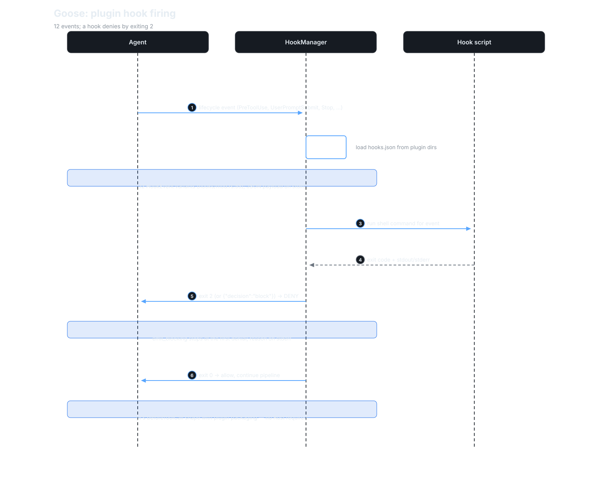

### 3. Recipes

Declarative YAML task files — goose's most distinctive axis, covered in
its own section below.[^46]

### 4. Schedules

Cron expressions over recipes: `goose schedule add` plus the
`scheduler__manage_schedule` tool, so the agent can schedule its own
future runs. Always `Auto` mode — a scheduled job is headless by
construction.[^43]

**Start here:** `crates/goose/src/scheduler/full.rs` — `Job::new_async_tz`
for the cron fire, `execute_job` for the recipe-to-session handoff.

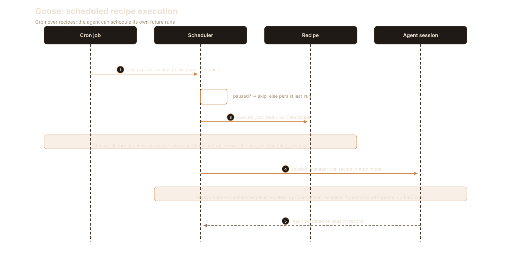

### 5. Sub-agents (`summon`)

The `delegate` tool with ad-hoc, source-based, and combined modes; async
background execution with `load(taskId)`; forced Auto; 25-turn default
budget; no nesting. Recursive in-process `Agent` — the child is a full
agent, not a prompt template.[^44]

**Start here:** `create_delegate_tool` in
`crates/goose/src/agents/platform_extensions/summon.rs:724`, then
`create_subagent_session` for the forced-Auto session birth.

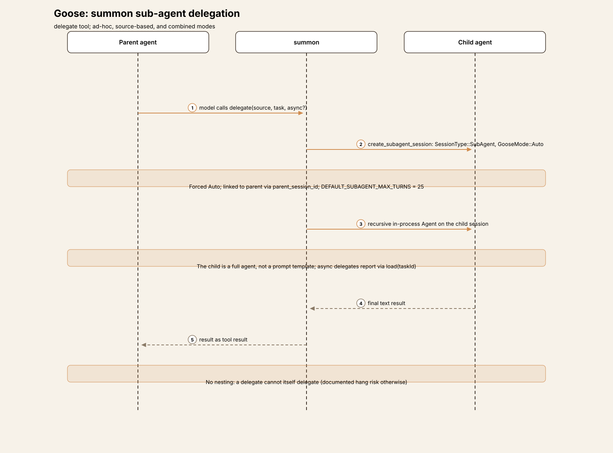

### 6. Skills

A skills platform extension (plus a state-machine `SkillOperation`),
with `SKILL.md` discovery — the same frontmatter-and-markdown shape pi
and Cline use.[^2]

**Start here:** `SkillOperation` in
`crates/goose/src/agents/state_machine/ops_skills.rs` — the `load_skill`
tool is the whole runtime; skills are advertised in the system prompt
and loaded on demand, never eagerly injected.

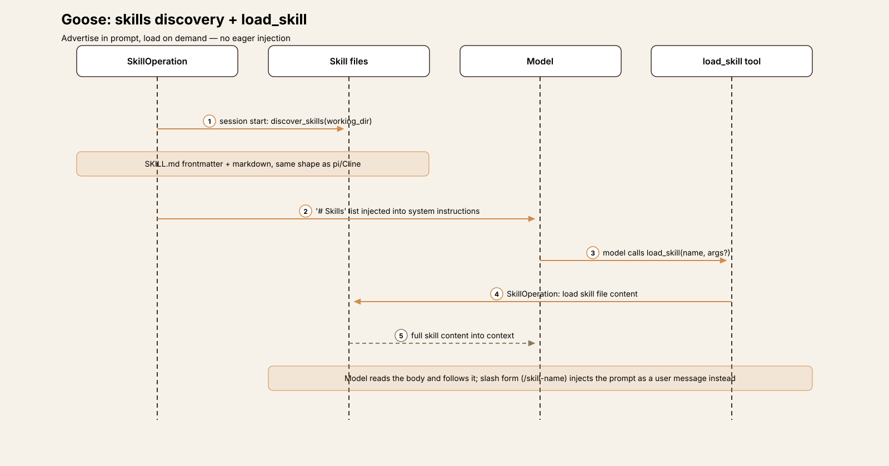

### 7. Custom providers

Two tiers below the 36 statically registered providers: 48 bundled declarative JSON
definitions for the long tail, and user-authored custom providers from
`~/.config/goose/custom_providers/` (with command-based auth). Adding a
provider to the long tail is a JSON file, not a Rust impl.[^35]

**Start here:** drop a JSON file in the `custom_providers` dir
(`config/declarative_providers.rs:22`) and copy the smallest bundled
definition as the template — no compilation involved.

### 8. The `Provider` trait

`stream()` is the only required method; everything else — `complete()`,
model recommendation, OAuth, thinking-effort plumbing, context ownership
— has defaults. Implementing a provider means implementing a stream.[^34]

**Start here:** `crates/goose-provider-types/src/base.rs:504`, then the
smallest hand-written impl for the idiom.

### 9. Slash commands and modes

`execute_command` intercepts slash input before the loop (`/mode`
switches `GooseMode` mid-session); the state machine models it as an
explicit `SlashCommandOperation`, step 2 of 18 — before compaction,
before approval, before inference.[^13][^29]

**Start here:** the intercept in `Agent::reply` (`agent.rs:2222`) —
slash input never reaches the model raw.

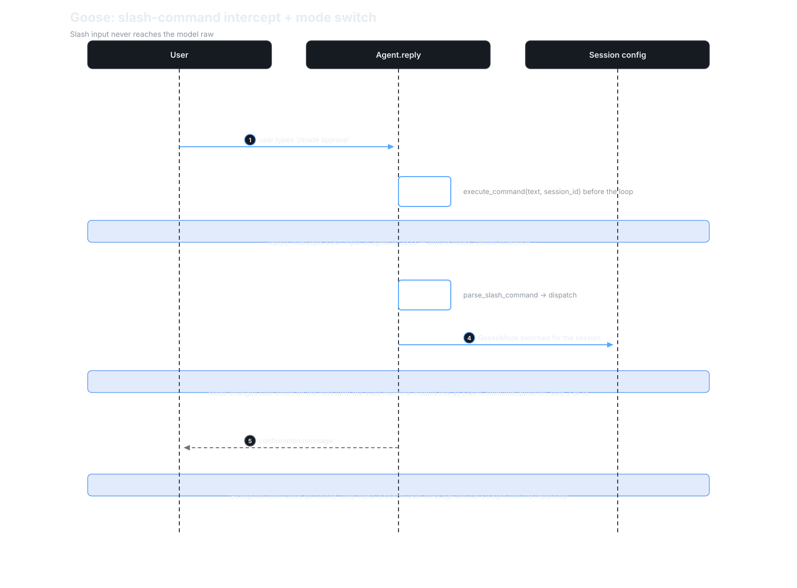

## Recipes: prompts as programs

Recipes clear the new-section bar. They are not a configuration axis and
not a subsystem of the loop — they are a first-class artifact type with
their own schema, lifecycle, security model, and scheduling integration,
and nothing in pi, aider, or Cline is like them.

A recipe is a declarative YAML (or JSON) task file. The schema requires a
semver `version`, a `title`, and a `description`; the options carry the
weight: `instructions` (injected as a system-prompt extension),
`prompt` (the first user message), `extensions` (a list of
`ExtensionConfig` — the recipe brings its own toolset),
`settings` (`goose_provider`, `goose_model`, `temperature`,
`max_turns` — the recipe picks the model), `activities`, `author`,
`parameters`, `response.json_schema` (which **materializes a
`final_output` tool** the agent must call), `sub_recipes` (delegation
targets for `summon`'s `delegate`), and `retry` configs.[^46]

Parameters are typed (`string | number | boolean | date | file |
select`), `required | optional | user_prompt`, templated with
Jinja-style `{{ var }}` via minijinja — and `file` parameters cannot have
defaults, explicitly "to prevent importing sensitive user files."[^46]
Execution (`goose run --recipe`) turns `instructions` into the system
prompt and `prompt` into the first user message; recipe settings override
the provider and model; the full recipe is **persisted on the session
record**, so a resumed session replays the same task definition. Every
parsed recipe is auto-augmented: the `analyze` platform extension when
builtin `developer` is present, and `summon` when `sub_recipes`
exist.[^46]

The security model is prompt-injection-aware at the file level:
`check_for_security_warnings` flags unicode tag characters in
instructions, prompt, and activities. Validation (for schedules)
requires prompt-or-instructions, schema-valid parameters, no
`user_prompt` params (they'd block headless), and a valid response
schema.[^46] The result: prompts become versioned, runnable, shareable,
schedulable programs — goose's most distinctive product idea, and the
axis its competitors would have to invent from scratch.

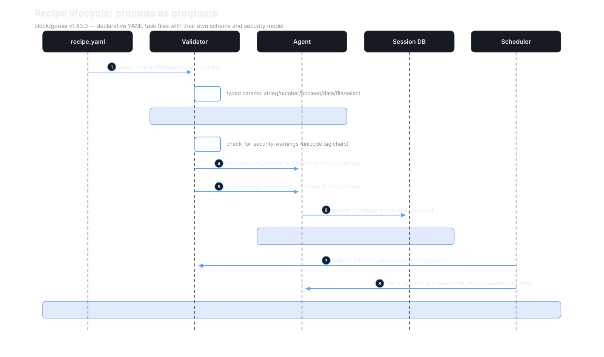

## Tradeoffs

- **MCP-everything vs native-wrap vs TS extensions.** pi wraps each MCP
  server tool in its own `ToolDefinition`; Cline mints them as first-class
  `AgentTool`s; goose makes *everything* a server — builtins included, over
  in-process duplex. The protocol is the extension API. The price: every
  tool call pays MCP serialization, and the "builtin" set is a config list
  you can break by editing YAML.[^2][^21]
- **LLM-judge approvals vs user-driven policies vs git-safety.** Cline
  asks the user constantly and makes asking cheap; aider never asks for
  chat files and lets git remember; pi hands you the hook. Goose asks an
  *LLM* whether the call is read-only, caches the verdict, and fails
  closed — adaptive where Cline is manual, and fox-guarding-henhouse in
  exactly the way the in-tree prompt-injection tests admit.[^5][^32]
- **Catalog + heuristics at three scales.** aider: 313-entry hand-written
  YAML. Cline: ~200k-line generated catalog behind one generic adapter,
  exact-ID resolution, no heuristics. Goose: 8,160-entry generated
  snapshot *plus* aider-style substring heuristics *plus* 36 statically
  registered providers. Three philosophies of "know your model," and goose
  picked all of them.[^4][^36]
- **Compaction without budgeting.** Goose never budgets tokens per
  subsystem — no allocator, no per-tool caps. It just compacts the whole
  conversation at 0.8 of the context limit and, optionally, summarizes
  old tool pairs. Simpler than a budget system; cruder too — a single
  huge tool output can eat the budget that compaction then has to
  recover.[^41]
- **Two loops, one env var.** The migration tax is real and documented:
  every behavior change lands twice until parity is declared. The
  dividend is a state machine where the LLM call is *dead last* — every
  policy, hook, and compaction decision is an ordered operation that runs
  before inference, auditable as effects on persisted state. The legacy
  loop can't offer that shape; the new one can't yet be the default.[^3][^10]
- **No undo, by omission.** aider auto-commits every turn; Cline stashes
  every turn under private refs. Goose has neither — no git safety net of
  any kind. The safety story is entirely *preventive* (modes, inspectors,
  judges, hooks), never *restorative*. That's a coherent bet, and the
  starkest contrast in the series.[^28]

## Deliberate omissions

- **No undo safety net.** The negative grep is clean — no git
  revert/reset/stash as a safety mechanism anywhere. aider's auto-commits
  and Cline's per-turn stash checkpoints simply don't exist; if the agent
  breaks your tree, your backups are your own.[^28]
- **No automatic repo map.** aider's PageRank-over-tree-sitter signature
  subsystem is absent — but goose keeps a tree-sitter **`analyze` platform
  extension** (directory, file, and call-graph views) that the agent
  invokes on demand. Map-as-tool instead of map-as-context.[^23]
- **No SSE transport.** Four extension transports, and SSE isn't one —
  leftover configs only emit a migrate-warning. Streamable HTTP is the
  remote story.[^21]
- **No MCP registry client.** AGENTS.md refuses new `servers.json`
  entries pending the official MCP Registry, but no registry client
  exists in code; `servers.json` is consumed only by the docs website.
  The migration is prose.[^24]
- **No model-name validation.** Any string is accepted as a model name;
  resolution is heuristics and fallbacks all the way down.[^36]
- **No command sandbox.** The OSV malware check runs when an
  npx/uvx extension is spawned (and fails open for unknown ecosystems);
  the developer extension's `shell` tool executes unsandboxed in the
  user's shell, like Cline, like aider — inside a Flatpak build it even
  routes commands to the host.[^22]
- **Telegram is the only gateway.** The gateway abstraction has exactly
  one implementation; `create_gateway` bails on anything else.[^45]

## Comparison matrix row

| # | Dimension | pi (v1.0.2) | aider (v0.86.2) | Cline (v4.1.22) | Goose (v1.53.0) |
|---|---|---|---|---|---|
| 1 | Agent loop | Event-sourced; inner + outer loops; no iteration cap | No tool-call loop; parse→apply→reflect; REPL + reflection (≤3) + retry | Host-independent SDK `AgentRuntime.execute`; `maxIterations: undefined` — bound is 5 identical tool calls | **Two loops, migration in progress**: legacy `agent.rs` plain `loop{}` (default, `max_turns`=1000) vs opt-in effect-sourced state machine (`GOOSE_STATE_MACHINE=1`), LLM call dead last [^3][^6][^7][^10] |
| 2 | Tool system | 8 built-ins (4 active by default) + registry; TypeBox validation; sequential/parallel | None — model emits SEARCH/REPLACE blocks | 9 built-ins (7 active in VS Code act mode) + MCP natives + team tools (SDK/CLI); sequential default, adjacent-parallel batching | **Entirely MCP-shaped**: every tool is an MCP server (builtins = in-process tokio duplex); `ext__tool` namespacing; no non-MCP path [^2][^21][^23] |
| 3 | Model providers | ~42 behind one `StreamFn` | litellm; 313-entry YAML + substring heuristics | 228 providers, one generic Vercel AI SDK adapter; exact-ID resolution | Single `Provider` trait (`stream()` required); 36 static + 48 declarative JSON + custom; 8,160-entry models.dev snapshot (zstd-bundled, ETag hot-swap) + substring heuristics; no name validation [^34][^35][^36] |
| 4 | Prompt construction | Structured sections, diffed per turn | Fixed wire order, synthetic user/assistant pairs, cache breakpoints | Template + placeholder replacement; `MessageBuilder` normalization | `PromptManager` from extension info + directory hints + goose mode; toolshim/native split per model; moim agent-only turn-context message [^14] |
| 5 | Memory/session | JSONL sessions; compaction | In-memory cur/done; background summarization; markdown log; git auto-commit | SQLite + file-backend; versioned whole-file JSON envelopes; auto + manual compaction | **SQLite** `sessions.db` + JSON blobs; full `Recipe` persisted on session record; explicit cross-session recall (chatrecall + SQL FTS); `user_visible`/`agent_visible` flags [^40] |
| 6 | Reasoning/planning | Thinking forwarded; no planner/sub-agents | Architect = sequential delegation with user gate | plan/act modes (differ by one tool); sub-agents + teams (SDK/CLI only) | GooseMode (Auto/Approve/SmartApprove/Chat); `summon` sub-agents (forced Auto, 25 turns, no nesting); **recipes** as declarative task programs; in-process cron schedules (always Auto) [^29][^44][^46][^43] |
| 7 | Extensibility | TS extensions, hooks, MCP, skills | 42 closed commands; no plugin API/MCP/skills | `AgentRuntimePlugin`, 7-callback hooks, file hooks, skills, MCP, sub-agents | **Broadest so far**: MCP extension configs (4 transports), 12-event plugin hooks, recipes, schedules, sub-agents, skills, custom providers, the `Provider` trait [^21][^42][^46][^43][^35][^34] |
| 8 | Interfaces | TUI / print / RPC / SDK on one event stream | prompt_toolkit CLI + streamlit GUI | VS Code webview over proto-bus gRPC (22 svcs/224 RPCs) + CLI host + npm SDK re-export | **Rust CLI REPL** + Electron desktop + **ACP bridge** + Telegram gateway; loop emits `AgentEvent`s; uniffi Python/Kotlin bindings via `goose-sdk` [^20][^45][^41] |
| 9 | Failure handling | Auto-retry, truncation guards, abort; no cap | Exp-backoff (60s); malformed edits reflected (≤3) | Provider retry 3×; output-limit recovery 3×; loop detection 3×/5× (reactive); mistake tracker 6; no host iteration cap | Three-layer retry (provider pre-first-item ≤3, recipe `RetryManager`, micro-retries); `max_turns`=1000; **repetition guard inert** (registered `None`) — the bound is turns, not loops [^7][^9] |
| 10 | Security model | Project trust + extension hooks; no approval UX | Boundary prompts; git auto-commit + `/undo`; no sandbox | Finest-grained: per-tool policies + webview UI + diff previews; commands prompt by default; no sandbox; per-turn stash checkpoints | **Modes × `permission.yaml` × 5-inspector chain** (security can only escalate); **LLM judge** for SmartApprove (UNTRUSTED-labeled, fail-closed); Always-Allow withheld on security warning; strict headless; **no undo** [^29][^30][^31][^32][^33][^28] |

## Endnotes

All notes are VERIFIED against `v1.53.0`
(`76da81cb964b21cd096db739302329b40c2998b8`) unless marked DOCS; line
anchors and file paths re-checked on 2026-10-07.
`GH` = `https://github.com/block/goose/blob/76da81cb964b21cd096db739302329b40c2998b8/`.

[^1]: Tag `v1.53.0`, SHA `76da81cb964b21cd096db739302329b40c2998b8`,
    committed 2026-09-30 14:19:01 -0400; Apache-2.0 (`LICENSE`); Rust
    cargo workspace (`members = ["crates/*"]`). All `.rs` files under
    `*/src` (in-tree test modules included): `goose` 339 files / 176,482 LOC, `goose-cli` 51 / 28,625,
    `goose-provider-types` 36 / 30,822, `goose-providers` 26 / 15,731,
    `goose-local-inference` 20 / 10,347, `goose-mcp` 11 / 6,084,
    `goose-agent` 6 / 1,557, `goose-context-management` 7 / 1,156,
    `goose-sdk` 4 / 2,834, `goose-sdk-types` 5 / 3,261,
    `goose-roaming` 11 / 2,197, `goose-download-manager` 1 / 690,
    `goose-acp-macros` 1 / 319. Entry: `crates/goose-cli/src/main.rs` →
    `goose_cli::cli::cli()`; the agent at
    [GH…/crates/goose/src/agents/agent.rs](https://github.com/block/goose/blob/76da81cb964b21cd096db739302329b40c2998b8/crates/goose/src/agents/agent.rs).
    Claim under test from `README.md`: "your native open source AI agent
    — desktop app, CLI, and API — for code, workflows, and everything in
    between." Scope: the CLI agent; the Electron desktop (`ui/desktop/`)
    is out of scope except as the cron-loop host; `goose-roaming` was
    mapped but not deep-dived.
[^2]: "Builtin" means in-process MCP: every tool the agent sees arrives
    through the MCP client layer; builtins connect over in-process tokio
    duplex rather than subprocess stdio (see [^22]). There is no
    non-MCP tool path — contrast pi's 8 native built-ins plus TS
    extension API.
[^3]: `Agent::reply()` at
    [GH…/crates/goose/src/agents/agent.rs#L2079](https://github.com/block/goose/blob/76da81cb964b21cd096db739302329b40c2998b8/crates/goose/src/agents/agent.rs#L2079)
    takes `use_state_machine: bool`; the CLI passes
    `goose::agents::state_machine::enabled()`
    (`crates/goose-cli/src/session/mod.rs:1456`), which is false unless
    `GOOSE_STATE_MACHINE` ∈ {`1`, `true`, `TRUE`, `yes`} at
    [GH…/crates/goose/src/agents/state_machine/mod.rs#L72-L76](https://github.com/block/goose/blob/76da81cb964b21cd096db739302329b40c2998b8/crates/goose/src/agents/state_machine/mod.rs#L72-L76).
    The repo's own `AGENTS.md:41-43`: "We are replacing the legacy agent
    loop in `crates/goose/src/agents/agent.rs` with the state machine in
    `crates/goose/src/agents/state_machine/`. … Until the migration is
    complete, changes to agent-loop behavior must be implemented and
    tested in both paths."
[^4]: aider's model-compat layer: a 313-entry `model-settings.yml` plus
    `apply_generic_model_settings` substring heuristics (Agent Harness
    Anatomy #2). Goose's analog: an 8,160-entry models.dev snapshot
    zstd-bundled at build time plus `infer_provider_from_model`
    substring rules — see [^36].
[^5]: SmartApprove's read-only classifier: the model judges its own
    pending tool calls, labeled `UNTRUSTED TOOL REQUEST DATA`, failing
    closed — see [^32].
[^6]: `Agent::reply` → `reply_impl` at
    [GH…/crates/goose/src/agents/agent.rs#L2109](https://github.com/block/goose/blob/76da81cb964b21cd096db739302329b40c2998b8/crates/goose/src/agents/agent.rs#L2109)
    → `reply_internal` at
    [L2455](https://github.com/block/goose/blob/76da81cb964b21cd096db739302329b40c2998b8/crates/goose/src/agents/agent.rs#L2455),
    which runs a plain `loop {}` inside `async_stream::try_stream!` at
    [L2625](https://github.com/block/goose/blob/76da81cb964b21cd096db739302329b40c2998b8/crates/goose/src/agents/agent.rs#L2625).
    `agent.rs` is 6,382 lines at this SHA.
[^7]: `DEFAULT_MAX_TURNS: u32 = 1000` at
    [GH…/crates/goose/src/agents/agent.rs#L86](https://github.com/block/goose/blob/76da81cb964b21cd096db739302329b40c2998b8/crates/goose/src/agents/agent.rs#L86);
    `turns_taken > max_turns` yields `MAX_TURNS_MESSAGE` and breaks.
    Other termination arms: cancellation (three check points), provider
    refusal, credits/auth/network errors, ≤2 recovery compactions, ≤3
    empty-turn retries (`MAX_EMPTY_TURN_RETRIES` at L89), stop-hook
    denial cap 8 (`DEFAULT_STOP_HOOK_BLOCK_CAP` at L87), recipe retry
    exhaustion. Negative finding: `grep -rln "max_iterations"
    crates/goose/src crates/goose-cli/src` → no matches at the pinned
    SHA — the bound is `max_turns`, full stop.
[^8]: `inspect_tools` splits requests into approved/needs_approval/denied
    at
    [GH…/crates/goose/src/agents/agent.rs#L2906-L2921](https://github.com/block/goose/blob/76da81cb964b21cd096db739302329b40c2998b8/crates/goose/src/agents/agent.rs#L2906-L2921);
    `handle_approval_tool_requests` at
    [GH…/crates/goose/src/agents/tool_execution.rs#L149](https://github.com/block/goose/blob/76da81cb964b21cd096db739302329b40c2998b8/crates/goose/src/agents/tool_execution.rs#L149)
    registers a oneshot in the `ToolConfirmationRouter`, yields
    `ActionRequired`, and awaits; `submit_tool_confirmation` at
    [GH…/crates/goose/src/agents/agent.rs#L1518](https://github.com/block/goose/blob/76da81cb964b21cd096db739302329b40c2998b8/crates/goose/src/agents/agent.rs#L1518)
    delivers the verdict. `handle_confirmation` at L1616 has zero
    non-test callers — dead, superseded. Providers can route
    confirmation natively via `PermissionRouting::ActionRequired` at
    [GH…/crates/goose-provider-types/src/base.rs#L341](https://github.com/block/goose/blob/76da81cb964b21cd096db739302329b40c2998b8/crates/goose-provider-types/src/base.rs#L341).
[^9]: Retry, three layers. (a) Provider pre-first-item: ≤3, exp backoff
    1s→30s, transient-only; auth gets one credential refresh;
    **mid-stream errors are not retried** — at
    [GH…/crates/goose/src/agents/reply_parts.rs#L422-L458](https://github.com/block/goose/blob/76da81cb964b21cd096db739302329b40c2998b8/crates/goose/src/agents/reply_parts.rs#L422-L458).
    (b) Recipe `RetryManager`: shell success checks, `on_failure`
    command, conversation reset to the `initial_messages` snapshot — at
    [GH…/crates/goose/src/agents/retry.rs#L92-L144](https://github.com/block/goose/blob/76da81cb964b21cd096db739302329b40c2998b8/crates/goose/src/agents/retry.rs#L92-L144).
    (c) Micro-retries: empty-turn ×3, compaction ×2, stop-hook ×8. Tool
    failures arrive as error `ToolResponse` content, not exceptions. The
    `RepetitionInspector` is inert in the legacy path: registered with
    `None` at
    [GH…/crates/goose/src/agents/agent.rs#L794](https://github.com/block/goose/blob/76da81cb964b21cd096db739302329b40c2998b8/crates/goose/src/agents/agent.rs#L794),
    so `check_tool_call` always returns true at
    [GH…/crates/goose/src/tool_monitor.rs#L59-L63](https://github.com/block/goose/blob/76da81cb964b21cd096db739302329b40c2998b8/crates/goose/src/tool_monitor.rs#L59-L63),
    and `inspect` runs on throwaway clones at
    [L108-L116](https://github.com/block/goose/blob/76da81cb964b21cd096db739302329b40c2998b8/crates/goose/src/tool_monitor.rs#L108-L116).
[^10]: The state machine is effect-sourced: steps produce `GooseEffect`s
    (`crates/goose/src/agents/state_machine/effects.rs`) applied to the
    persisted session by `SessionManager`
    (`state_machine/session.rs`); the machine re-loads the session each
    iteration — "an ordered, re-entrant pipeline over persisted
    conversation state" at
    [GH…/crates/goose/src/agents/state_machine/mod.rs#L1-L5](https://github.com/block/goose/blob/76da81cb964b21cd096db739302329b40c2998b8/crates/goose/src/agents/state_machine/mod.rs#L1-L5).
    The ~20 operations are wired in `Agent::create_state_machine`; the
    step order at
    [GH…/crates/goose/src/agents/agent.rs#L1687-L1766](https://github.com/block/goose/blob/76da81cb964b21cd096db739302329b40c2998b8/crates/goose/src/agents/agent.rs#L1687-L1766)
    puts `Inference` last, gathering `inference_tools`, `prompt_parts`,
    and `moim_parts` from every operation before the model call.
[^11]: Parity-burden seams. The legacy loop imports the new path's
    `MAX_TURNS_MESSAGE` at
    [GH…/crates/goose/src/agents/agent.rs#L40](https://github.com/block/goose/blob/76da81cb964b21cd096db739302329b40c2998b8/crates/goose/src/agents/agent.rs#L40)
    (← `state_machine/ops_maxturns.rs:14`). `Permission::Cancel` is
    normalized to `DenyOnce` only in the state-machine path at
    [GH…/crates/goose/src/agents/agent.rs#L1531-L1532](https://github.com/block/goose/blob/76da81cb964b21cd096db739302329b40c2998b8/crates/goose/src/agents/agent.rs#L1531-L1532).
    Legacy approval blocks on a per-request oneshot router at
    [GH…/crates/goose/src/agents/agent.rs#L2902-L2945](https://github.com/block/goose/blob/76da81cb964b21cd096db739302329b40c2998b8/crates/goose/src/agents/agent.rs#L2902-L2945);
    the state machine patches `goose.executable` metadata effects
    (`TOOL_EXECUTABLE_KEY`) at
    [GH…/crates/goose/src/agents/state_machine/ops_tool_approval.rs#L24](https://github.com/block/goose/blob/76da81cb964b21cd096db739302329b40c2998b8/crates/goose/src/agents/state_machine/ops_tool_approval.rs#L24)
    and
    [L285-L293](https://github.com/block/goose/blob/76da81cb964b21cd096db739302329b40c2998b8/crates/goose/src/agents/state_machine/ops_tool_approval.rs#L285-L293).
[^12]: The steer queue can veto the loop's exit at
    [GH…/crates/goose/src/agents/agent.rs#L3549-L3551](https://github.com/block/goose/blob/76da81cb964b21cd096db739302329b40c2998b8/crates/goose/src/agents/agent.rs#L3549-L3551),
    but steers cannot inject before the first provider round-trip at
    [L3303](https://github.com/block/goose/blob/76da81cb964b21cd096db739302329b40c2998b8/crates/goose/src/agents/agent.rs#L3303).
[^13]: Trace ①: message ID assigned at
    [GH…/crates/goose/src/agents/agent.rs#L2116](https://github.com/block/goose/blob/76da81cb964b21cd096db739302329b40c2998b8/crates/goose/src/agents/agent.rs#L2116);
    `use_state_machine=false` skips the new path at
    [L2166](https://github.com/block/goose/blob/76da81cb964b21cd096db739302329b40c2998b8/crates/goose/src/agents/agent.rs#L2166);
    `SessionStart` / `UserPromptSubmit` hooks fire at
    [L2210-L2229](https://github.com/block/goose/blob/76da81cb964b21cd096db739302329b40c2998b8/crates/goose/src/agents/agent.rs#L2210-L2229);
    `execute_command` returns `Ok(None)` — not a slash command — at
    [L2231](https://github.com/block/goose/blob/76da81cb964b21cd096db739302329b40c2998b8/crates/goose/src/agents/agent.rs#L2231);
    the message is persisted via `session_manager.add_message` at
    [L2346-L2352](https://github.com/block/goose/blob/76da81cb964b21cd096db739302329b40c2998b8/crates/goose/src/agents/agent.rs#L2346-L2352).
[^14]: Trace ②: `prepare_reply_context` at
    [GH…/crates/goose/src/agents/agent.rs#L845](https://github.com/block/goose/blob/76da81cb964b21cd096db739302329b40c2998b8/crates/goose/src/agents/agent.rs#L845)
    → `prepare_tools_and_prompt` at
    [GH…/crates/goose/src/agents/reply_parts.rs#L198](https://github.com/block/goose/blob/76da81cb964b21cd096db739302329b40c2998b8/crates/goose/src/agents/reply_parts.rs#L198):
    tools via `list_tools`, unique-name enforcement, system prompt from
    `PromptManager` (extension info + directory hints + goose mode) at
    [L219-L233](https://github.com/block/goose/blob/76da81cb964b21cd096db739302329b40c2998b8/crates/goose/src/agents/reply_parts.rs#L219-L233),
    toolshim/native split per `model_config.toolshim` at
    [L236-L244](https://github.com/block/goose/blob/76da81cb964b21cd096db739302329b40c2998b8/crates/goose/src/agents/reply_parts.rs#L236-L244).
    The moim agent-only turn-context message is persisted before the
    loop at
    [GH…/crates/goose/src/agents/agent.rs#L2602-L2622](https://github.com/block/goose/blob/76da81cb964b21cd096db739302329b40c2998b8/crates/goose/src/agents/agent.rs#L2602-L2622);
    skipped when the context limit is under 32k at
    [GH…/crates/goose/src/agents/moim.rs#L119-L121](https://github.com/block/goose/blob/76da81cb964b21cd096db739302329b40c2998b8/crates/goose/src/agents/moim.rs#L119-L121).
[^15]: Trace ③: `stream_response_from_provider` at
    [GH…/crates/goose/src/agents/reply_parts.rs#L342](https://github.com/block/goose/blob/76da81cb964b21cd096db739302329b40c2998b8/crates/goose/src/agents/reply_parts.rs#L342)
    → `provider.stream(&model_config, system_prompt, messages, &tools)`
    at
    [L392-L398](https://github.com/block/goose/blob/76da81cb964b21cd096db739302329b40c2998b8/crates/goose/src/agents/reply_parts.rs#L392-L398);
    pre-first-item transient retries (≤3) at [^9]. Text chunks yield
    `AgentEvent::Message` live at
    [GH…/crates/goose/src/agents/agent.rs#L2828](https://github.com/block/goose/blob/76da81cb964b21cd096db739302329b40c2998b8/crates/goose/src/agents/agent.rs#L2828).
[^16]: Trace ④: `categorize_tool_requests` at
    [GH…/crates/goose/src/agents/reply_parts.rs#L587](https://github.com/block/goose/blob/76da81cb964b21cd096db739302329b40c2998b8/crates/goose/src/agents/reply_parts.rs#L587);
    `recover_mangled_tool_name` at
    [L587-L603](https://github.com/block/goose/blob/76da81cb964b21cd096db739302329b40c2998b8/crates/goose/src/agents/reply_parts.rs#L587-L603);
    arguments coerced to the advertised JSON schema; tool-call IDs
    deduped; calls to unadvertised tools become `invalid_request` errors
    — invalid tool calls are data, not exceptions.
[^17]: Trace ⑤: `handle_approved_and_denied_tools` at
    [GH…/crates/goose/src/agents/agent.rs#L900](https://github.com/block/goose/blob/76da81cb964b21cd096db739302329b40c2998b8/crates/goose/src/agents/agent.rs#L900)
    → `dispatch_tool_call` at
    [L1067](https://github.com/block/goose/blob/76da81cb964b21cd096db739302329b40c2998b8/crates/goose/src/agents/agent.rs#L1067):
    `PreToolUse` hooks fire at
    [L1094-L1110](https://github.com/block/goose/blob/76da81cb964b21cd096db739302329b40c2998b8/crates/goose/src/agents/agent.rs#L1094-L1110),
    then `extension_manager.dispatch_tool_call` runs it at
    [L1168-L1174](https://github.com/block/goose/blob/76da81cb964b21cd096db739302329b40c2998b8/crates/goose/src/agents/agent.rs#L1168-L1174),
    wrapped by `with_post_tool_hook` (large-response spill +
    `PostToolUse` hooks) at
    [L688-L769](https://github.com/block/goose/blob/76da81cb964b21cd096db739302329b40c2998b8/crates/goose/src/agents/agent.rs#L688-L769).
    The approval path: `handle_approval_tool_requests` ([^8]). Streams
    drain concurrently at
    [GH…/crates/goose/src/agents/agent.rs#L2969-L3030](https://github.com/block/goose/blob/76da81cb964b21cd096db739302329b40c2998b8/crates/goose/src/agents/agent.rs#L2969-L3030).
[^18]: Trace ⑥: request/response pairs into `messages_to_add` at
    [GH…/crates/goose/src/agents/agent.rs#L3067-L3136](https://github.com/block/goose/blob/76da81cb964b21cd096db739302329b40c2998b8/crates/goose/src/agents/agent.rs#L3067-L3136),
    persisted per message at
    [L3501-L3505](https://github.com/block/goose/blob/76da81cb964b21cd096db739302329b40c2998b8/crates/goose/src/agents/agent.rs#L3501-L3505)
    and appended to the conversation at
    [L3506](https://github.com/block/goose/blob/76da81cb964b21cd096db739302329b40c2998b8/crates/goose/src/agents/agent.rs#L3506).
    Unparseable calls become a well-formed `"unparseable_tool_call"`
    placeholder at
    [L3097-L3109](https://github.com/block/goose/blob/76da81cb964b21cd096db739302329b40c2998b8/crates/goose/src/agents/agent.rs#L3097-L3109).
    Large text outputs spill to an owner-only temp file (200,000-char
    default) at
    [GH…/crates/goose/src/agents/large_response_handler.rs#L7-L13](https://github.com/block/goose/blob/76da81cb964b21cd096db739302329b40c2998b8/crates/goose/src/agents/large_response_handler.rs#L7-L13).
[^19]: Trace ⑦: `exit_chat = true` at
    [GH…/crates/goose/src/agents/agent.rs#L3444](https://github.com/block/goose/blob/76da81cb964b21cd096db739302329b40c2998b8/crates/goose/src/agents/agent.rs#L3444);
    the stop hook allows → `break`. Otherwise the loop continues until
    `turns_taken > 1000`, cancellation, an error arm, or the stop-hook
    cap (see [^7]).
[^20]: Trace ⑧: all output is `AgentEvent`s consumed by the CLI, the
    desktop, and the ACP frontends. Final summary text accumulates in
    `last_assistant_text` at
    [GH…/crates/goose/src/agents/agent.rs#L3598-L3606](https://github.com/block/goose/blob/76da81cb964b21cd096db739302329b40c2998b8/crates/goose/src/agents/agent.rs#L3598-L3606).
[^21]: `ExtensionConfig` at
    [GH…/crates/goose/src/agents/extension.rs#L156](https://github.com/block/goose/blob/76da81cb964b21cd096db739302329b40c2998b8/crates/goose/src/agents/extension.rs#L156):
    exactly four variants — `stdio`, `builtin`, `platform`,
    `streamable_http`. Negative finding: `grep -rn '"sse"\|Sse'
    crates/goose/src/agents/ crates/goose/src/config/extensions.rs` →
    only the migrate-warning and an ACP schema-generator bin — no SSE
    transport at the pinned SHA. Config lives under `extensions:` in
    `~/.config/goose/config.yaml` at
    [GH…/crates/goose/src/config/extensions.rs#L13](https://github.com/block/goose/blob/76da81cb964b21cd096db739302329b40c2998b8/crates/goose/src/config/extensions.rs#L13)
    (`GOOSE_PATH_ROOT` overrides at
    [GH…/crates/goose/src/config/paths.rs#L33](https://github.com/block/goose/blob/76da81cb964b21cd096db739302329b40c2998b8/crates/goose/src/config/paths.rs#L33)).
[^22]: `resolve_extensions_for_new_session` at
    [GH…/crates/goose/src/config/extensions.rs#L303](https://github.com/block/goose/blob/76da81cb964b21cd096db739302329b40c2998b8/crates/goose/src/config/extensions.rs#L303)
    → `Agent::add_extensions_bulk` →
    `ExtensionManager::add_extension` at
    [GH…/crates/goose/src/agents/extension_manager/mod.rs#L470](https://github.com/block/goose/blob/76da81cb964b21cd096db739302329b40c2998b8/crates/goose/src/agents/extension_manager/mod.rs#L470)
    (no-op on unchanged config), resolving secrets/envs against a 31-key
    env denylist, then connecting per type: stdio spawns a subprocess
    with an OSV malware check on npx/uvx at
    [GH…/crates/goose/src/agents/extension_malware_check.rs#L44](https://github.com/block/goose/blob/76da81cb964b21cd096db739302329b40c2998b8/crates/goose/src/agents/extension_malware_check.rs#L44);
    builtin servers connect over in-process tokio duplex at
    [GH…/crates/goose/src/agents/extension_manager/builtin.rs#L10](https://github.com/block/goose/blob/76da81cb964b21cd096db739302329b40c2998b8/crates/goose/src/agents/extension_manager/builtin.rs#L10);
    platform extensions run in-process via the client factory; remote
    ones get an OAuth step-up wrapper with proactive token refresh at
    [GH…/crates/goose/src/agents/extension_manager/streamable_http.rs#L343](https://github.com/block/goose/blob/76da81cb964b21cd096db739302329b40c2998b8/crates/goose/src/agents/extension_manager/streamable_http.rs#L343)
    and
    [L657](https://github.com/block/goose/blob/76da81cb964b21cd096db739302329b40c2998b8/crates/goose/src/agents/extension_manager/streamable_http.rs#L657).
[^23]: Namespacing at
    [GH…/crates/goose/src/agents/extension_manager/mod.rs#L244](https://github.com/block/goose/blob/76da81cb964b21cd096db739302329b40c2998b8/crates/goose/src/agents/extension_manager/mod.rs#L244):
    tools prefixed `<ext>__<tool>`, owner-tagged in
    `_meta.goose_extension`, cached with version invalidation on
    `tools/list_changed`, dispatched by
    `resolve_tool_with_constraints` at
    [L1140](https://github.com/block/goose/blob/76da81cb964b21cd096db739302329b40c2998b8/crates/goose/src/agents/extension_manager/mod.rs#L1140)
    with mangled-name recovery at
    [L262](https://github.com/block/goose/blob/76da81cb964b21cd096db739302329b40c2998b8/crates/goose/src/agents/extension_manager/mod.rs#L262).
    Bundled set at
    [GH…/crates/goose-mcp/src/lib.rs#L80](https://github.com/block/goose/blob/76da81cb964b21cd096db739302329b40c2998b8/crates/goose-mcp/src/lib.rs#L80):
    autovisualiser (8 `render_*` tools), computercontroller (xlsx/docx/pdf
    + macOS-only `computer_control`), memory (4 tools), tutorial (1
    tool). Platform extensions default-ON: developer, summon, skills,
    analyze (a tree-sitter directory/file/call-graph tool the agent
    invokes on demand — map-as-tool, not map-as-context), tom,
    extensionmanager, apps, scheduler; default-OFF: todo, chatrecall,
    summarize, code_execution, orchestrator (scheduler and orchestrator
    hidden).
[^24]: `servers.json` has no runtime consumer: `grep -rn
    "servers.json\|fetchMCPServers" crates/ ui/desktop/src
    documentation/` → only `documentation/src/` (the docs website).
    Negative finding: `grep -rni "registry" crates/goose/src
    crates/goose-cli/src crates/goose-mcp/src` → only
    `ActiveRunRegistry`, provider registries, `BUILTIN_REGISTRY`, and
    `register_*` functions — nothing referencing the official MCP
    Registry. The repo's AGENTS.md refuses new `servers.json` entries
    pending that migration. `search_available_extensions` is
    config-local only at
    [GH…/crates/goose/src/agents/platform_extensions/ext_manager.rs#L107-L124](https://github.com/block/goose/blob/76da81cb964b21cd096db739302329b40c2998b8/crates/goose/src/agents/platform_extensions/ext_manager.rs#L107-L124).
[^25]: `ToolInfo.permission` is dead code: defined at
    [GH…/crates/goose/src/agents/extension.rs#L569](https://github.com/block/goose/blob/76da81cb964b21cd096db739302329b40c2998b8/crates/goose/src/agents/extension.rs#L569),
    zero other references repo-wide. `manage_extensions` always requires
    approval and is blocked for subagents; the `available_tools`
    allowlist is enforced at list and dispatch time; removing an
    extension prunes its per-tool permissions at
    [GH…/crates/goose/src/config/permission.rs#L233-L251](https://github.com/block/goose/blob/76da81cb964b21cd096db739302329b40c2998b8/crates/goose/src/config/permission.rs#L233-L251).
[^26]: rmcp 3.4.1 is the protocol SDK (workspace `Cargo.toml:23`);
    `goose-mcp` adds the four bundled servers, the spawn-function
    registry, `mcp_server_runner`, and subprocess/PATH plumbing. The
    goose crate's `GooseClient` (roots, elicitation→user with 300s
    timeout, session-context `_meta` injection, timeouts/cancellation)
    at
    [GH…/crates/goose/src/agents/mcp_client.rs#L74-L924](https://github.com/block/goose/blob/76da81cb964b21cd096db739302329b40c2998b8/crates/goose/src/agents/mcp_client.rs#L74-L924).
[^27]: Docs-vs-code, all VERIFIED. `documentation/docs/goose-architecture/extensions-design.md`
    documents an `Extension` trait — `grep -rn "trait Extension"
    crates/goose/src crates/goose-mcp/src` → zero hits. Docs say
    `goose mcp {name}` adds a builtin to a session; it runs the server
    standalone on stdio. Docs name an `enable_extension` tool; the real
    tool is `manage_extensions`. "Smart Extension Recommendation" is a
    local config listing.
[^28]: No undo safety net. Negative finding: `grep` over
    `crates/goose/src` for `git.*(revert|reset|stash)` as a safety
    mechanism → nothing at the pinned SHA. aider auto-commits every turn
    and Cline stashes every turn under private refs; goose has neither —
    safety is entirely preventive (modes, inspectors, judges, hooks),
    never restorative.
[^29]: `GooseMode` at
    [GH…/crates/goose-provider-types/src/goose_mode.rs#L22-L32](https://github.com/block/goose/blob/76da81cb964b21cd096db739302329b40c2998b8/crates/goose-provider-types/src/goose_mode.rs#L22-L32):
    `Auto` (default; "Automatically approve tool calls"), `Approve`
    ("Ask before every tool call"), `SmartApprove` ("Ask only for
    sensitive tool calls"), `Chat` ("Chat only, no tool calls"). Config
    key `GOOSE_MODE` at
    [GH…/crates/goose/src/config/base.rs#L1263](https://github.com/block/goose/blob/76da81cb964b21cd096db739302329b40c2998b8/crates/goose/src/config/base.rs#L1263);
    `/mode` switches mid-session at
    [GH…/crates/goose-cli/src/session/input.rs#L229-L295](https://github.com/block/goose/blob/76da81cb964b21cd096db739302329b40c2998b8/crates/goose-cli/src/session/input.rs#L229-L295).
[^30]: `PermissionLevel` at
    [GH…/crates/goose/src/config/permission.rs#L16-L23](https://github.com/block/goose/blob/76da81cb964b21cd096db739302329b40c2998b8/crates/goose/src/config/permission.rs#L16-L23):
    `AlwaysAllow` / `AskBefore` / `NeverAllow`, persisted in
    `<config_dir>/permission.yaml` under `user:` and `smart_approve:`
    namespaces; lookup precedence **NeverAllow > AlwaysAllow >
    AskBefore** at
    [L61-L62](https://github.com/block/goose/blob/76da81cb964b21cd096db739302329b40c2998b8/crates/goose/src/config/permission.rs#L61-L62)
    and
    [L137-L160](https://github.com/block/goose/blob/76da81cb964b21cd096db739302329b40c2998b8/crates/goose/src/config/permission.rs#L137-L160),
    keyed by full tool name.
[^31]: Inspectors registered in `Agent::new` in order at
    [GH…/crates/goose/src/agents/agent.rs#L777-L794](https://github.com/block/goose/blob/76da81cb964b21cd096db739302329b40c2998b8/crates/goose/src/agents/agent.rs#L777-L794):
    Security, Egress, Adversary (`adversary.md`, model-reviewed),
    Permission (decision table at
    [GH…/crates/goose/src/permission/permission_inspector.rs#L144](https://github.com/block/goose/blob/76da81cb964b21cd096db739302329b40c2998b8/crates/goose/src/permission/permission_inspector.rs#L144)),
    Repetition. Each emits `InspectionAction ∈ {Allow, Deny,
    RequireApproval}` at
    [GH…/crates/goose/src/tool_inspection.rs#L22-L32](https://github.com/block/goose/blob/76da81cb964b21cd096db739302329b40c2998b8/crates/goose/src/tool_inspection.rs#L22-L32).
    Security can only escalate, never relax: a Deny removes the request
    from approved *and* needs-approval; an Allow is explicitly "don't
    override other inspectors' decisions — if it's already denied or
    needs approval, leave it that way" at
    [GH…/crates/goose/src/tool_inspection.rs#L214-L258](https://github.com/block/goose/blob/76da81cb964b21cd096db739302329b40c2998b8/crates/goose/src/tool_inspection.rs#L214-L258).
[^32]: SmartApprove's LLM judge: `detect_read_only_requests` at
    [GH…/crates/goose/src/permission/permission_judge.rs#L145-L184](https://github.com/block/goose/blob/76da81cb964b21cd096db739302329b40c2998b8/crates/goose/src/permission/permission_judge.rs#L145-L184);
    requests labeled `"UNTRUSTED TOOL REQUEST DATA (JSON):\n{requests}"`
    at
    [L113](https://github.com/block/goose/blob/76da81cb964b21cd096db739302329b40c2998b8/crates/goose/src/permission/permission_judge.rs#L113),
    judged through a synthetic `platform__tool_by_tool_permission`
    tool. Non-read-only verdicts are cached name-wide as `AskBefore` in
    the `smart_approve:` namespace; judge failure fails closed
    (everything prompts). The fox-guarding-henhouse shape is
    acknowledged with prompt-injection tests in-tree at
    [GH…/crates/goose/src/permission/permission_judge.rs#L95-L130](https://github.com/block/goose/blob/76da81cb964b21cd096db739302329b40c2998b8/crates/goose/src/permission/permission_judge.rs#L95-L130).
[^33]: `prompt_tool_confirmation` at
    [GH…/crates/goose-cli/src/session/mod.rs#L2165-L2214](https://github.com/block/goose/blob/76da81cb964b21cd096db739302329b40c2998b8/crates/goose-cli/src/session/mod.rs#L2165-L2214)
    offers Allow / Always Allow / Deny / Cancel — but "Always Allow" is
    withheld when a security inspector attached a warning at
    [L2197-L2203](https://github.com/block/goose/blob/76da81cb964b21cd096db739302329b40c2998b8/crates/goose-cli/src/session/mod.rs#L2197-L2203).
    `AlwaysDeny` is never offered in the CLI; its only producer is the
    Telegram gateway's "deny always" reply at
    [GH…/crates/goose/src/gateway/handler.rs#L216-L227](https://github.com/block/goose/blob/76da81cb964b21cd096db739302329b40c2998b8/crates/goose/src/gateway/handler.rs#L216-L227).
    Headless is strict: `Auto` auto-allows (with a warn log);
    `Approve`/`SmartApprove` in non-interactive mode is a hard error —
    "This is an invalid configuration" — at
    [GH…/crates/goose-cli/src/session/mod.rs#L1367-L1392](https://github.com/block/goose/blob/76da81cb964b21cd096db739302329b40c2998b8/crates/goose-cli/src/session/mod.rs#L1367-L1392).
[^34]: The `Provider` trait at
    [GH…/crates/goose-provider-types/src/base.rs#L504](https://github.com/block/goose/blob/76da81cb964b21cd096db739302329b40c2998b8/crates/goose-provider-types/src/base.rs#L504):
    `stream()` is the only required behavioral method; `complete()`
    defaults to stream-plus-`collect_stream`, overridden only at
    [GH…/crates/goose/src/providers/githubcopilot.rs#L621](https://github.com/block/goose/blob/76da81cb964b21cd096db739302329b40c2998b8/crates/goose/src/providers/githubcopilot.rs#L621).
    Negative finding: `grep "pub trait Provider\b"
    crates/goose-provider-types/src` → exactly one hit — a single trait.
[^35]: 36 static registrations (unique `register::<…>` /
    `register_with_inventory::<…>` calls in `init_registry`) at
    [GH…/crates/goose/src/providers/init.rs#L58-L231](https://github.com/block/goose/blob/76da81cb964b21cd096db739302329b40c2998b8/crates/goose/src/providers/init.rs#L58-L231)
    (incl. feature-gated `aws_bedrock`, `sagemaker_tgi`, `local`) + 48
    bundled declarative JSON definitions + user custom providers from
    `~/.config/goose/custom_providers/`. Four tiers
    (Preferred/Builtin/Declarative/Custom); selection chain
    (`--provider` flag → saved session → recipe → `GOOSE_PROVIDER` env >
    `active_provider` config > legacy param) at
    [GH…/crates/goose-cli/src/session/builder.rs#L291-L447](https://github.com/block/goose/blob/76da81cb964b21cd096db739302329b40c2998b8/crates/goose-cli/src/session/builder.rs#L291-L447).
[^36]: The model catalog: an **8,160-entry models.dev snapshot**
    zstd-bundled at build time at
    [GH…/crates/goose-provider-types/src/canonical/models_dev.rs#L36-L49](https://github.com/block/goose/blob/76da81cb964b21cd096db739302329b40c2998b8/crates/goose-provider-types/src/canonical/models_dev.rs#L36-L49)
    (`build.rs:1-11`), with a background ETag refresh that hot-swaps the
    registry at runtime at
    [GH…/crates/goose/src/model_catalog.rs#L4-L20](https://github.com/block/goose/blob/76da81cb964b21cd096db739302329b40c2998b8/crates/goose/src/model_catalog.rs#L4-L20).
    Name resolution at
    [GH…/crates/goose-provider-types/src/canonical/name_builder.rs#L24-L258](https://github.com/block/goose/blob/76da81cb964b21cd096db739302329b40c2998b8/crates/goose-provider-types/src/canonical/name_builder.rs#L24-L258):
    version-suffix stripping, provider renames, Claude word-order
    swapping, `infer_provider_from_model` substring rules; hardcoded
    `inferred_thinking_mode` for Claude 4.5–5.x plus name-regex matchers
    (`is_openai_responses_model`, `is_xai_reasoning_model`, glm-5.3 /
    kimi-k3 segment matchers). Negative findings: no model-name
    validation anywhere on the `GOOSE_MODEL` path (`grep -ri "unknown
    model|invalid model|not a known model|unsupported model"
    crates/goose/src crates/goose-cli/src` → only dictation/whisper and
    ACP param errors); no aider-style hand-written YAML (`*.yaml` model
    files under `crates/goose-provider-types/src/canonical/` and
    `crates/goose-providers/src/` → none).
[^37]: Auth: env-var-first-then-keyring, no mixing, at
    [GH…/crates/goose/src/config/base.rs#L912-L941](https://github.com/block/goose/blob/76da81cb964b21cd096db739302329b40c2998b8/crates/goose/src/config/base.rs#L912-L941);
    `AuthMethod::{NoAuth, BearerToken, ApiKey, Custom}`; `configure_oauth`
    in six providers (chatgpt_codex, gemini_oauth, githubcopilot,
    kimicode, muse_code, xai_oauth) with a shared RFC 8628 device-flow
    helper; command-based auth for custom providers. Naming seam:
    `crates/goose/src/oauth/` is **MCP-server OAuth**, not provider auth
    — provider OAuth lives in `providers/oauth*.rs`.
[^38]: `goose-local-inference`: llama.cpp/GGUF + MLX on-device inference
    behind provider name `"local"` — feature-gated, never default, no
    auto-activation — with its own tool-emulation (toolshim) and chat
    templates.
[^39]: `MessageContentBlock` carries Thinking/RedactedThinking blocks
    (signature-aware stream coalescing); `ToolRequest` wraps
    `rmcp::model::CallToolRequestParams`, so invalid tool calls are
    *data*, not errors; harness annotations ride in
    `tool_meta._meta`; approval and elicitation are modeled as
    conversation blocks at
    [GH…/crates/goose-provider-types/src/conversation/message.rs#L133-L330](https://github.com/block/goose/blob/76da81cb964b21cd096db739302329b40c2998b8/crates/goose-provider-types/src/conversation/message.rs#L133-L330).
    Cost is estimated, never authoritative unless provider-reported, at
    [GH…/crates/goose/src/providers/usage_estimator.rs#L9-L20](https://github.com/block/goose/blob/76da81cb964b21cd096db739302329b40c2998b8/crates/goose/src/providers/usage_estimator.rs#L9-L20).
[^40]: SQLite at `<data_dir>/sessions/sessions.db` —
    [GH…/crates/goose/src/session/session_manager.rs#L29-L30](https://github.com/block/goose/blob/76da81cb964b21cd096db739302329b40c2998b8/crates/goose/src/session/session_manager.rs#L29-L30)
    and
    [L714-L720](https://github.com/block/goose/blob/76da81cb964b21cd096db739302329b40c2998b8/crates/goose/src/session/session_manager.rs#L714-L720);
    messages as JSON blobs. The session record at
    [L63-L99](https://github.com/block/goose/blob/76da81cb964b21cd096db739302329b40c2998b8/crates/goose/src/session/session_manager.rs#L63-L99)
    carries the id, working dir, LLM-generated name (`session_naming.rs`),
    `SessionType`, timestamps, extension data, usage/accumulated cost,
    schedule id, **the full `Recipe` struct**, user recipe values, the
    conversation, the goose mode, the parent session id, and the
    provider/model. `SessionType` at
    [L48-L57](https://github.com/block/goose/blob/76da81cb964b21cd096db739302329b40c2998b8/crates/goose/src/session/session_manager.rs#L48-L57):
    `User | Scheduled | SubAgent | Hidden | Terminal | Gateway | Acp` —
    resume lists only `User`. Resume/fork at
    [GH…/crates/goose-cli/src/cli.rs#L404-L470](https://github.com/block/goose/blob/76da81cb964b21cd096db739302329b40c2998b8/crates/goose-cli/src/cli.rs#L404-L470)
    and
    [L933-L968](https://github.com/block/goose/blob/76da81cb964b21cd096db739302329b40c2998b8/crates/goose-cli/src/cli.rs#L933-L968).
    Cross-session recall is explicit: the `chatrecall` platform tool
    (loads another session's first/last messages) plus
    `chat_history_search.rs` (SQL full-text search) — never automatic.
    Every message carries `user_visible` / `agent_visible` flags, which
    compaction and subagent summaries exploit.
[^41]: No token-budget allocator. Negative finding: `grep -i
    "budget|quota|allocat" crates/goose/src/context_mgmt/
    crates/goose-context-management/src/` → no matches. Auto-compaction
    triggers when `session.usage.total_tokens / context_limit > 0.8`:
    `DEFAULT_COMPACTION_THRESHOLD: f64 = 0.8` at
    [GH…/crates/goose-context-management/src/lib.rs#L32](https://github.com/block/goose/blob/76da81cb964b21cd096db739302329b40c2998b8/crates/goose-context-management/src/lib.rs#L32);
    the check at
    [GH…/crates/goose/src/context_mgmt/mod.rs#L224-L269](https://github.com/block/goose/blob/76da81cb964b21cd096db739302329b40c2998b8/crates/goose/src/context_mgmt/mod.rs#L224-L269)
    prefers `session.usage.total_tokens` ("session metadata") and falls
    back to a token-counter estimate ("estimated"); overridable via
    `GOOSE_AUTO_COMPACT_THRESHOLD` (≤0 or ≥1 disables); providers with
    `manages_own_context` skip it. Checked before each reply (legacy at
    [GH…/crates/goose/src/agents/agent.rs#L2365-L2368](https://github.com/block/goose/blob/76da81cb964b21cd096db739302329b40c2998b8/crates/goose/src/agents/agent.rs#L2365-L2368),
    state machine at `ops_compaction.rs:197`); manual via `/compact` at
    [GH…/crates/goose-cli/src/session/mod.rs#L1254-L1264](https://github.com/block/goose/blob/76da81cb964b21cd096db739302329b40c2998b8/crates/goose-cli/src/session/mod.rs#L1254-L1264).
    `compact_messages` at
    [GH…/crates/goose/src/context_mgmt/mod.rs#L70-L222](https://github.com/block/goose/blob/76da81cb964b21cd096db739302329b40c2998b8/crates/goose/src/context_mgmt/mod.rs#L70-L222):
    one-shot model summarization (`goose-context-management::summarize`),
    all original messages marked agent-invisible (kept user-visible for
    the UI), one agent-only summary appended plus a continuation nudge,
    latest user text preserved, persisted via `replace_conversation` +
    `AgentEvent::HistoryReplaced`. Opt-in tool-pair summarization
    (`GOOSE_TOOL_PAIR_SUMMARIZATION`, default false): oldest 10 tool
    request/response pairs past `clamp(3 * (limit*threshold) / 20000, 10,
    500)` at
    [GH…/crates/goose/src/context_mgmt/mod.rs#L366-L374](https://github.com/block/goose/blob/76da81cb964b21cd096db739302329b40c2998b8/crates/goose/src/context_mgmt/mod.rs#L366-L374)
    replaced by one agent-only summary each. The
    `goose-context-management` crate is a language-agnostic compaction
    library — cross-language (Python/Kotlin) access is exposed through
    `goose-sdk`'s uniffi bindings (code comment at
    `crates/goose-context-management/src/lib.rs:9-12`; `goose-sdk`
    ships the bindgen binary and `bindings.rs`).
[^42]: Twelve hook events at
    [GH…/crates/goose/src/hooks/mod.rs#L55-L68](https://github.com/block/goose/blob/76da81cb964b21cd096db739302329b40c2998b8/crates/goose/src/hooks/mod.rs#L55-L68):
    `PreToolUse`, `PreToolUseResult`, `PostToolUse`,
    `PostToolUseFailure`, `SessionStart`, `SessionEnd`,
    `UserPromptSubmit`, `BeforeReadFile`, `AfterFileEdit`,
    `BeforeShellExecution`, `AfterShellExecution`, `Stop`. Each enabled
    plugin contributes `hooks/hooks.json` at
    [L425-L472](https://github.com/block/goose/blob/76da81cb964b21cd096db739302329b40c2998b8/crates/goose/src/hooks/mod.rs#L425-L472);
    only `command` actions are supported; the hook runs as a shell
    command with JSON-serialized `HookContext` on stdin and a 30-second
    default timeout (`DEFAULT_HOOK_TIMEOUT_SECS` at L44). **Blocking:
    exit code 2 or `{"decision":"block"}`; first denial wins**
    (`emit_blocking` at
    [L703-L706](https://github.com/block/goose/blob/76da81cb964b21cd096db739302329b40c2998b8/crates/goose/src/hooks/mod.rs#L703-L706)).
    `PreToolUse` runs before dispatch in both loops — at
    [GH…/crates/goose/src/agents/agent.rs#L1103](https://github.com/block/goose/blob/76da81cb964b21cd096db739302329b40c2998b8/crates/goose/src/agents/agent.rs#L1103)
    and
    [GH…/crates/goose/src/agents/state_machine/ops_toolcalling.rs#L128](https://github.com/block/goose/blob/76da81cb964b21cd096db739302329b40c2998b8/crates/goose/src/agents/state_machine/ops_toolcalling.rs#L128).
    Hook errors never crash the host at
    [GH…/crates/goose/src/hooks/mod.rs#L517-L520](https://github.com/block/goose/blob/76da81cb964b21cd096db739302329b40c2998b8/crates/goose/src/hooks/mod.rs#L517-L520).
    Event-name casing verified against the shipped example at
    `examples/plugins/hello-hooks/hooks/hooks.json` — PascalCase
    (`SessionStart`, `UserPromptSubmit`, `PreToolUse`), matching
    `HookEvent::name()` exactly. Aspirational seam: the config module doc
    comment advertises "hot reloading of configuration changes"
    (`crates/goose/src/config/base.rs:80`), but there is no file watcher
    and no reload function anywhere in `crates/goose/src/config/` — the
    claim exists only in the comment.
[^43]: The `Scheduler` at
    [GH…/crates/goose/src/scheduler/full.rs](https://github.com/block/goose/blob/76da81cb964b21cd096db739302329b40c2998b8/crates/goose/src/scheduler/full.rs)
    (behind `feature = "scheduler"`) wraps `tokio-cron-scheduler`; jobs
    in `<data_dir>/schedule.json`; recipe files copied (validated, ≤1
    MiB, mode `0o600`) to `scheduled_recipes/<job-id>.<ext>` at
    [GH…/crates/goose/src/scheduler/common.rs#L13](https://github.com/block/goose/blob/76da81cb964b21cd096db739302329b40c2998b8/crates/goose/src/scheduler/common.rs#L13),
    [L96-L106](https://github.com/block/goose/blob/76da81cb964b21cd096db739302329b40c2998b8/crates/goose/src/scheduler/common.rs#L96-L106),
    and
    [GH…/crates/goose/src/scheduler/full.rs#L290-L315](https://github.com/block/goose/blob/76da81cb964b21cd096db739302329b40c2998b8/crates/goose/src/scheduler/full.rs#L290-L315).
    Cron dialect is 6-field (seconds first), local timezone, 5-field
    auto-prefixed at
    [GH…/crates/goose/src/scheduler/full.rs#L138-L165](https://github.com/block/goose/blob/76da81cb964b21cd096db739302329b40c2998b8/crates/goose/src/scheduler/full.rs#L138-L165).
    On fire, `execute_job` at
    [L830](https://github.com/block/goose/blob/76da81cb964b21cd096db739302329b40c2998b8/crates/goose/src/scheduler/full.rs#L830)
    builds the recipe from the stored copy into a
    `SessionType::Scheduled` session running **always in
    `GooseMode::Auto`** — scheduled jobs never prompt — at
    [L868-L885](https://github.com/block/goose/blob/76da81cb964b21cd096db739302329b40c2998b8/crates/goose/src/scheduler/full.rs#L868-L885).
    Validation at
    [GH…/crates/goose/src/recipe/validate_recipe.rs#L379-L414](https://github.com/block/goose/blob/76da81cb964b21cd096db739302329b40c2998b8/crates/goose/src/recipe/validate_recipe.rs#L379-L414)
    requires prompt-or-instructions, schema-valid parameters (no
    `user_prompt` params — they'd block headless), and a valid response
    JSON schema. Agent surface: the `scheduler__manage_schedule` platform
    tool at
    [GH…/crates/goose/src/agents/schedule_tool.rs#L76-L116](https://github.com/block/goose/blob/76da81cb964b21cd096db739302329b40c2998b8/crates/goose/src/agents/schedule_tool.rs#L76-L116);
    CLI: `goose schedule add|list|remove|sessions|run-now|cron-help` at
    [GH…/crates/goose-cli/src/cli.rs#L628-L660](https://github.com/block/goose/blob/76da81cb964b21cd096db739302329b40c2998b8/crates/goose-cli/src/cli.rs#L628-L660).
    The cron loop lives in the long-lived desktop/ACP process at
    [GH…/crates/goose/src/acp/server_factory.rs#L74](https://github.com/block/goose/blob/76da81cb964b21cd096db739302329b40c2998b8/crates/goose/src/acp/server_factory.rs#L74);
    a CLI `goose schedule` invocation builds a throwaway `Scheduler`.
    Seam: CLI help blesses `@hourly` shorthands at
    [GH…/crates/goose-cli/src/cli.rs#L642](https://github.com/block/goose/blob/76da81cb964b21cd096db739302329b40c2998b8/crates/goose-cli/src/cli.rs#L642)
    that `create_cron_task` rejects with `CronParseError`.
[^44]: The `delegate` tool in the `summon` platform extension at
    [GH…/crates/goose/src/agents/platform_extensions/summon.rs#L777-L794](https://github.com/block/goose/blob/76da81cb964b21cd096db739302329b40c2998b8/crates/goose/src/agents/platform_extensions/summon.rs#L777-L794)
    (ad-hoc, source-based, and combined modes; `async: true` runs in the
    background with a `load(taskId)` handle). Execution is a full
    in-process `Agent` running `agent.reply(...)` recursively at
    [GH…/crates/goose/src/agents/subagent_handler.rs#L46-L62](https://github.com/block/goose/blob/76da81cb964b21cd096db739302329b40c2998b8/crates/goose/src/agents/subagent_handler.rs#L46-L62),
    with its own `SessionType::SubAgent` session and `parent_session_id`
    at
    [GH…/crates/goose/src/agents/platform_extensions/summon.rs#L610-L631](https://github.com/block/goose/blob/76da81cb964b21cd096db739302329b40c2998b8/crates/goose/src/agents/platform_extensions/summon.rs#L610-L631).
    **No nested delegation** at
    [GH…/crates/goose/src/agents/platform_extensions/summon.rs#L2155-L2168](https://github.com/block/goose/blob/76da81cb964b21cd096db739302329b40c2998b8/crates/goose/src/agents/platform_extensions/summon.rs#L2155-L2168).
    **Forced `GooseMode::Auto`** at
    [GH…/crates/goose/src/agents/platform_extensions/summon.rs#L1393-L1400](https://github.com/block/goose/blob/76da81cb964b21cd096db739302329b40c2998b8/crates/goose/src/agents/platform_extensions/summon.rs#L1393-L1400):
    *"Subagents must use Auto until get_agent_messages forwards
    ActionRequired messages to the parent. Until then, any mode that
    requires approval will hang."* Config: `TaskConfig` at
    [GH…/crates/goose/src/agents/subagent_task_config.rs#L13-L33](https://github.com/block/goose/blob/76da81cb964b21cd096db739302329b40c2998b8/crates/goose/src/agents/subagent_task_config.rs#L13-L33);
    `max_turns` default **25** (`GOOSE_SUBAGENT_MAX_TURNS`); system prompt
    from `prompts/subagent_system.md`; result extraction from the
    `final_output` tool output when the recipe has a response schema,
    else last/all text, at
    [GH…/crates/goose/src/agents/subagent_handler.rs#L64-L104](https://github.com/block/goose/blob/76da81cb964b21cd096db739302329b40c2998b8/crates/goose/src/agents/subagent_handler.rs#L64-L104)
    and
    [L264-L275](https://github.com/block/goose/blob/76da81cb964b21cd096db739302329b40c2998b8/crates/goose/src/agents/subagent_handler.rs#L264-L275).
[^45]: The gateway at
    [GH…/crates/goose/src/gateway/mod.rs#L14-L100](https://github.com/block/goose/blob/76da81cb964b21cd096db739302329b40c2998b8/crates/goose/src/gateway/mod.rs#L14-L100):
    **only Telegram exists at this SHA** — `create_gateway` bails on
    anything else at
    [L95-L100](https://github.com/block/goose/blob/76da81cb964b21cd096db739302329b40c2998b8/crates/goose/src/gateway/mod.rs#L95-L100).
    `GatewayHandler` at
    [GH…/crates/goose/src/gateway/handler.rs#L52](https://github.com/block/goose/blob/76da81cb964b21cd096db739302329b40c2998b8/crates/goose/src/gateway/handler.rs#L52):
    per-user `SessionType::Gateway` sessions; approvals answered by chat
    text (`approve` / `approve always` / `deny` / `deny always` →
    `Permission` variants) at
    [L216-L227](https://github.com/block/goose/blob/76da81cb964b21cd096db739302329b40c2998b8/crates/goose/src/gateway/handler.rs#L216-L227)
    — the **only producer of `AlwaysDeny`** in the codebase. The ACP
    bridge at `crates/goose/src/acp/` hosts an ACP server (the desktop
    app drives the agent through it), with live callers of
    `submit_tool_confirmation` at
    [GH…/crates/goose/src/acp/server.rs#L1611](https://github.com/block/goose/blob/76da81cb964b21cd096db739302329b40c2998b8/crates/goose/src/acp/server.rs#L1611)
    and
    [L421](https://github.com/block/goose/blob/76da81cb964b21cd096db739302329b40c2998b8/crates/goose/src/acp/server.rs#L421).
[^46]: The `Recipe` schema at
    [GH…/crates/goose/src/recipe/mod.rs#L43-L87](https://github.com/block/goose/blob/76da81cb964b21cd096db739302329b40c2998b8/crates/goose/src/recipe/mod.rs#L43-L87):
    required semver `version`, `title`, `description`; optional
    `instructions` (system-prompt extension), `prompt` (first user
    message), `extensions` (list of `ExtensionConfig`),
    `settings` (`goose_provider`, `goose_model`, `temperature`,
    `max_turns`), `activities`, `author`, `parameters`,
    `response.json_schema` (materializes a `final_output` tool),
    `sub_recipes`, `retry`. Parameters are typed (`string | number |
    boolean | date | file | select`), `required | optional |
    user_prompt`, templated with Jinja-style `{{ var }}` via minijinja;
    `file` parameters cannot have defaults — "to prevent importing
    sensitive user files" — at
    [L167-L170](https://github.com/block/goose/blob/76da81cb964b21cd096db739302329b40c2998b8/crates/goose/src/recipe/mod.rs#L167-L170).
    Execution (`goose run --recipe`) at
    [GH…/crates/goose-cli/src/recipes/extract_from_cli.rs#L11-L61](https://github.com/block/goose/blob/76da81cb964b21cd096db739302329b40c2998b8/crates/goose-cli/src/recipes/extract_from_cli.rs#L11-L61);
    the full recipe is persisted on the session record at
    [GH…/crates/goose-cli/src/session/builder.rs#L808-L815](https://github.com/block/goose/blob/76da81cb964b21cd096db739302329b40c2998b8/crates/goose-cli/src/session/builder.rs#L808-L815).
    Auto-augmentation at
    [GH…/crates/goose/src/recipe/mod.rs#L231-L271](https://github.com/block/goose/blob/76da81cb964b21cd096db739302329b40c2998b8/crates/goose/src/recipe/mod.rs#L231-L271)
    and
    [L338-L339](https://github.com/block/goose/blob/76da81cb964b21cd096db739302329b40c2998b8/crates/goose/src/recipe/mod.rs#L338-L339)
    (the `analyze` platform extension when builtin `developer` is
    present; `summon` when `sub_recipes` exist). Security:
    `check_for_security_warnings` flags unicode tag characters
    (prompt-injection markers) in instructions/prompt/activities at
    [GH…/crates/goose/src/recipe/mod.rs#L274-L292](https://github.com/block/goose/blob/76da81cb964b21cd096db739302329b40c2998b8/crates/goose/src/recipe/mod.rs#L274-L292).
