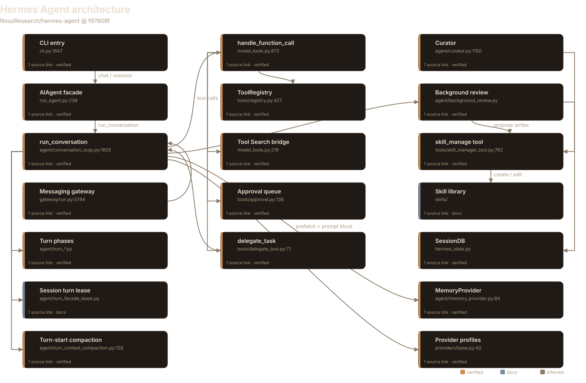
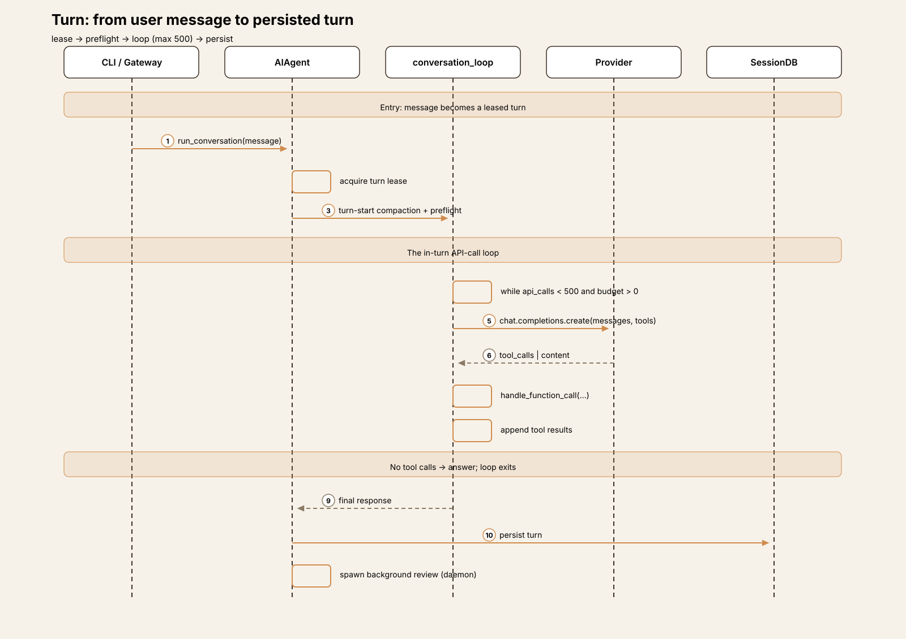
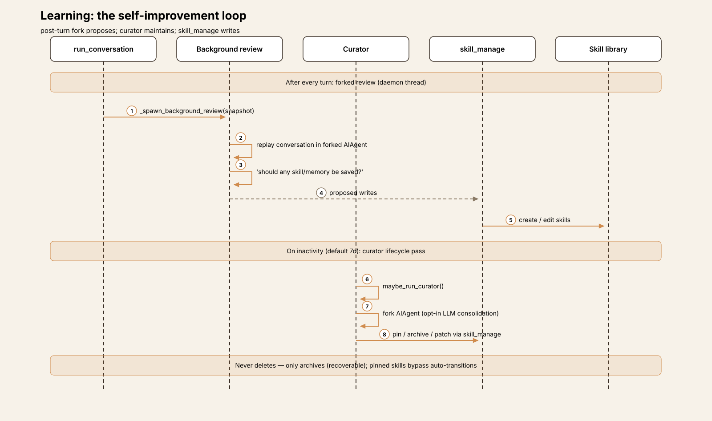
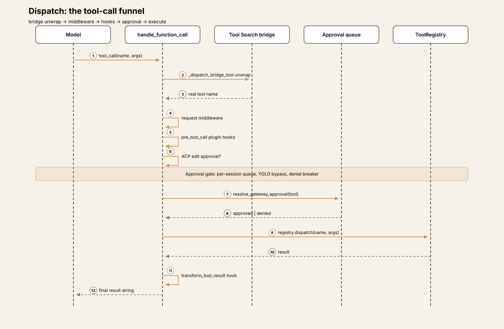
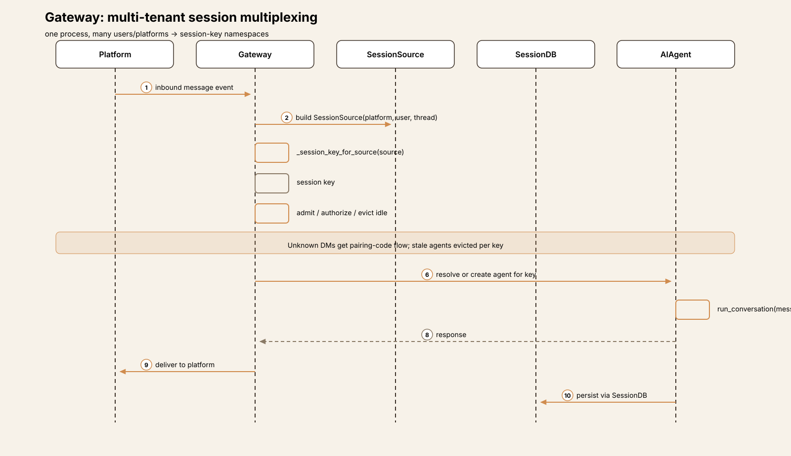
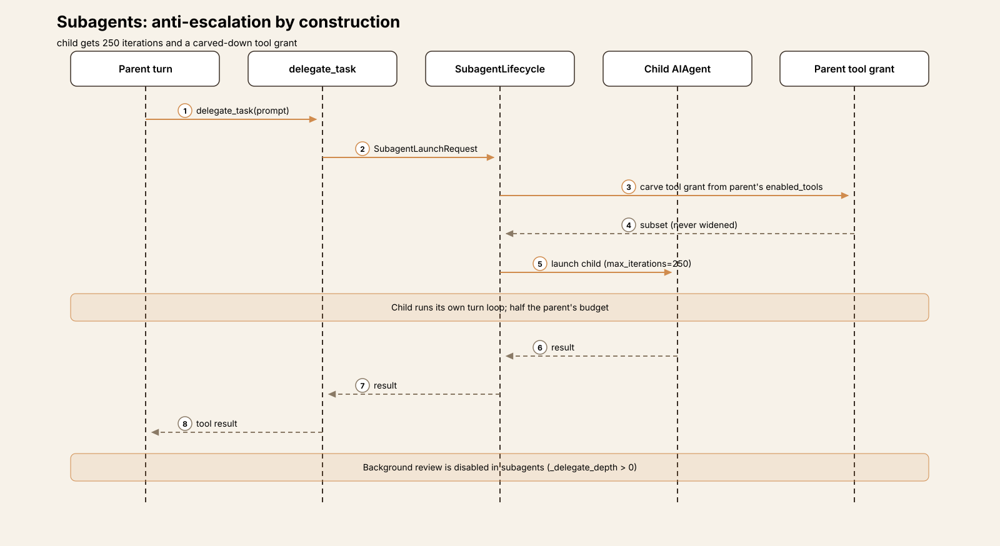

# Agent Harness Anatomy #8: Hermes Agent — the self-improving agent

> **Series:** Agent Harness Anatomy — top-down dissections of real agent harnesses, grounded in verifiable source code. Every behavioral claim below carries a footnote to a pinned GitHub permalink; the full evidence lives in the endnotes.

## Version block

- **Repo:** [NousResearch/hermes-agent](https://github.com/NousResearch/hermes-agent)
- **Pinned:** tag `v2026.9.24` → `f97608f178d1ffeca59860195ab7da295f7c8e5f` (2026-09-24)
- **Language:** Python (uv-managed); a TypeScript TUI alongside
- **License:** MIT
- **Claim under test:** "The agent that grows with you" — the self-improving AI agent.

Hermes Agent is the largest harness this series has covered by star count — over 250,000 at the time of analysis — and the first whose headline claim is not about how it *acts* but about how it *learns*. The README promises "the only agent with a built-in learning loop": it creates skills from experience, improves them during use, nudges itself to persist knowledge, and searches its own past conversations.[^1][^3] The interesting question is what "self-improving" means in code. It turns out to mean two concrete mechanisms — a post-turn forked review daemon and an inactivity-triggered skill curator — wrapped around an otherwise conventional synchronous tool-calling loop.[^9][^11]



## The mental model

Hermes is a **multi-tenant agent with a learning loop bolted onto a synchronous core**. One gateway process multiplexes Telegram, Discord, WhatsApp, Slack, and Signal users into session-key namespaces; each session runs the same turn loop: take a lease, compact preemptively, call the model up to 500 times, dispatch tools through a single funnel, persist to SQLite, and then — the distinctive part — fork the agent in a background thread to decide what the turn just taught it.[^5][^6][^20] A second, slower loop — the curator — wakes on inactivity (default: 7 days idle) to pin, archive, or consolidate skills. It never deletes; archival is recoverable by design.[^12]

The governing tradeoff: Hermes buys long-horizon self-maintenance at the cost of running extra agent loops nobody asked for. Every turn potentially spawns a second model call (the review fork); every idle week potentially spawns a third (the curator). The bet is that an agent which curates its own skills compounds — and that the compounding is worth the tokens.

## Package map

The repo is large (~15,000 files at the pinned tag, including docs and locales). The harness core is Python at the root and in a handful of directories:[^2]

| Location | Role | Size |
|---|---|---|
| `run_agent.py`, `cli.py` | Public facade (`AIAgent`) and the real CLI[^4] | ~1,600 + ~1,800 lines |
| `agent/` | The harness core: turn loop, turn phases, tools dispatch support, skills, memory, curator, review | 254 files |
| `tools/`, `model_tools.py`, `toolsets.py` | Tool registry, dispatch funnel, toolsets, approval | ~120 files |
| `gateway/` | Messaging multiplexing: session keys, admit/evict, per-platform adapters | ~40 files |
| `hermes_state*.py` | `SessionDB`: ~30 SQLite/WAL mixins — sessions, messages, FTS5, titles, timeline | 30 files |
| `skills/`, `plugins/`, `providers/` | Bundled skills, plugin catalog, provider profiles (~40 providers as plugins) | — |

## The core loop

Despite the filename, `agent/conversation_loop.py::run_conversation` runs *one* turn — the loop over turns lives in the gateway and CLI session drivers. The in-turn loop is synchronous and explicit:

```
while (s.api_call_count < agent.max_iterations
       and agent.iteration_budget.remaining > 0) \
        or agent._budget_grace_call:
    if self._interrupt_requested: break
    response = client.chat.completions.create(...)
    ...
```

`max_iterations` defaults to 500 and is shared with subagents (children get 250).[^26] Each phase of an iteration is its own sibling module — `turn_preflight`, `turn_request_assembly`, `turn_tool_round`, `turn_overflow`, `turn_context_compaction`, `turn_stop_gates`, `turn_finalizer` — so a change to overflow handling touches one file, not the loop.[^7] Messages are OpenAI-format dicts; reasoning content rides in `assistant_msg["reasoning"]`.

The loop's load-bearing invariant is **prompt-cache stability**: the system prompt is byte-stable for the life of a conversation. The only context mutation allowed mid-conversation is compression — anything that must inject content (skill invocations, subdirectory hints) rides a user message or a tool result, never the system prompt.[^8] This is why skill slash commands build a *user message* rather than appending to the system prompt: the prefix cache must never break.



## The learning loop

This is the article's center. Two mechanisms, on two timescales:

### After every turn: the background review

`AIAgent._spawn_background_review` may fork the agent in a daemon thread that replays the conversation snapshot and asks a single question: *"should any skill/memory be saved or updated?"* Writes go straight to the memory and skill stores; the main conversation and its prompt cache are never touched. The fork inherits the parent's live runtime — provider, model, credentials, cached system prompt — so it hits the same prefix cache, and it runs under a dispatch-side tool whitelist.[^10] There are gates: reviews are settings-gated, never run inside subagents (`_delegate_depth > 0`), and a review whose runtime is the managed local model is deferred to machine idle rather than hitting the user's GPU mid-session.

### On inactivity: the curator

`agent/curator.py` is a background skill-maintenance orchestrator with no cron daemon: when the agent is idle and the last run is older than the interval (default 7 days), `maybe_run_curator()` auto-transitions skill lifecycle states and optionally forks an agent that may pin, archive, consolidate, or patch skills through `skill_manage`. The invariants are conservative: only curator-managed skills are touched; never delete, only archive (recoverable); pinned skills bypass all auto-transitions; scheduler state persists in `.curator_state`. The LLM consolidation fork is opt-in — the deterministic inactivity prune always runs.

The write path that closes the loop is the `skill_manage` tool itself: the agent creates, edits, and archives skills at runtime, in the agentskills.io-compatible `SKILL.md` + frontmatter format.[^13] Review proposes, curator maintains, `skill_manage` writes — that is the entire "self-improving" claim, mechanized.



## The tool system

Tools self-register at import: every `tools/*.py` calls `tools.registry.register()`, and a `ToolEntry` binds name, toolset, JSON Schema, handler, and guard function. Schemas are validated at registration, not at request time. A handful of high-volume agent-native calls (memory, session, delegate, skill) skip the registry entirely and dispatch through an inline executors table.[^30][^14] `handle_function_call` is the single dispatch funnel: Tool Search bridge unwrap → connector dispatch → request middleware → plugin `pre_tool_call` hooks → ACP edit approval → execution middleware → `registry.dispatch` → the `transform_tool_result` hook (fail-open).[^15]

Two decisions stand out. First, the **Tool Search bridge**: with 100+ tools, the model sees only `tool_search`, `tool_describe`, and `tool_call`; the real catalog assembles on demand. The prompt stays small no matter how many tools exist.[^16] Second, **MCP discovery is deliberately deferred out of import** — it once blocked the gateway event loop for up to 120 seconds on slow servers, so each entry point now runs it at startup, in a thread.[^17]

Approvals are per-session: a gateway approval queue with a YOLO-mode bypass and a denial breaker that counts refusals per session.[^18] Toolsets (`_HERMES_CORE_TOOLS` shared across CLI and all platforms) group tools for enable/disable, with webhook payloads restricted to a safe subset.[^19]



## The gateway

The gateway is a full multi-tenant multiplexer. Every inbound message becomes a `SessionSource` (platform, user/chat/thread ids, profile); `_session_key_for_source` derives the session key, honoring per-user grouping, thread namespaces, and profiles. Per key: agent admit/authorize/evict, per-session toolsets and approvals, idle eviction. Unknown DMs get a pairing-code flow; Telegram forum topics get thread-id recovery before key derivation (with a documented footgun where `/model` overrides can miss the recovered key).



## One turn, end to end

Trace: the user sends `Summarize what we decided about the API rate limits yesterday`.

**① Input.** From the CLI, `fire.Fire(main)` parses the message; from Telegram, the gateway maps the inbound event to a `SessionSource` and derives the session key. Either way the message lands in `AIAgent.run_conversation`, which stamps the turn boundary on every envelope.

**② Lease.** The session turn lease is acquired (`turn_facade_lease.py`) — concurrent prompts against the same session serialize on the lease instead of interleaving.[^28]

**③ Preflight.** Turn-start compaction and compression run *before* any model call: make room first, hope later. Overflow and truncation are separate recovery verdicts for later, not here.[^25]

**④ Prompt assembly.** The system prompt is byte-stable — rebuilt never, mid-turn. Tool schemas come from `get_tool_definitions` (memoized, generation-keyed); with a large catalog the model sees only the Tool Search bridge and schemas assemble on demand.

**⑤ Model call.** The provider profile's transport sends the OpenAI-format messages (`chat_completions` default; `codex_responses` for openai-codex, copilot, and friends). Reasoning lands in `assistant_msg["reasoning"]`. Our question needs yesterday, so the model calls `session_search`.[^24]

**⑥ Dispatch.** `handle_function_call` runs the funnel — bridge unwrap, middleware, plugin hooks, ACP approval — then the gateway approval queue: without approval (or YOLO), the tool waits. Approved, `session_search` runs FTS5 over the message index (custom CJK bigram tokenizer included) and returns yesterday's thread.[^22][^29]

**⑦ Answer.** Guardrails watch for identical-call loops between iterations; the interrupt flag is checked every iteration. The model answers from the search results with no further tool calls, and the API-call loop exits.

**⑧ Learn.** The turn persists to SessionDB (SQLite/WAL), then `_spawn_background_review` forks the agent in a daemon thread to replay the turn: *should any skill or memory be saved?* Writes land directly in the memory and skill stores, prompt cache untouched. The curator's slower pass — pin, archive, consolidate, never delete — waits for idleness.

The tradeoff visible across all eight steps: Hermes spends model calls to save future model calls. The review fork, the curator, the FTS5 index, the skill lifecycle — every piece assumes that an agent which maintains itself outperforms one that merely remembers.



## Subsystem inventory

| Subsystem | What it does | Key file |
|---|---|---|
| Turn loop | One synchronous turn; `max_iterations` 500; per-phase sibling modules | `agent/conversation_loop.py` |
| Turn lease | Serializes concurrent prompts per session | `agent/turn_facade_lease.py` |
| Background review | Post-turn forked review daemon; proposes skill/memory writes | `agent/background_review.py` |
| Curator | Inactivity-triggered skill lifecycle; archive-never-delete | `agent/curator.py` |
| Tool registry | Import-time self-registration; schema validated at registration | `tools/registry.py` |
| Dispatch funnel | Bridge unwrap → middleware → hooks → ACP approval → execute | `model_tools.py` |
| Tool Search bridge | Catalog-on-demand for 100+ tools; keeps the prompt small | `model_tools.py:219` |
| Approval | Per-session gateway queue, YOLO bypass, denial breaker | `tools/approval.py` |
| Subagents | `delegate_task`; 250 iterations; tool grant carved from parent[^27] | `tools/delegate_tool.py` |
| Gateway | Multi-tenant session-key multiplexing across platforms | `gateway/run.py` |
| SessionDB | SQLite/WAL, ~30 mixins: sessions, messages, titles, timeline | `hermes_state.py` |
| FTS5 search | Custom CJK bigram tokenizer; `session_search` cross-session recall | `hermes_state_fts.py` |
| Memory | Provider ABC — honcho is a plugin, not a table | `agent/memory_provider.py` |
| Providers | ~40 providers as plugins; `chat_completions` / `codex_responses` | `providers/base.py` |
| Compaction | Turn-start proactive; overflow vs truncation verdict machines | `agent/turn_context_compaction.py` |
| Skills | `SKILL.md` + frontmatter; invoked via user message, never system prompt | `skills/` |

## Extension points in depth

### Plugins

Providers are plugins — adding one is a directory under `plugins/model-providers/`, discovered lazily by the registry. The dispatch funnel exposes `pre_tool_call` plugin hooks and a fail-open `transform_tool_result` hook, so extensions can intercept tools without forking the loop.

### Memory providers

Memory is an ABC (`prefetch`, `system_prompt_block`, `get_tool_schemas`, `handle_tool_call`) with builtin, honcho, and hindsight implementations. Swapping in a new memory backend is a provider, not a schema migration.[^23]

### Skills

Skills are `SKILL.md` + YAML frontmatter, agentskills.io compatible, loadable from bundled, config, and external directories with platform/env/apps matching. The agent itself can write them at runtime through `skill_manage` — the extension point and the learning loop are the same mechanism.

## Deliberate omissions

This teardown covers the turn loop, the learning loop, tools, gateway, sessions, and providers. It does not cover the TUI, the ACP adapter, the cron subsystem's job definitions, or the eval harnesses (`batch_runner.py`, `mini_swe_runner.py`) beyond noting they exist as first-class entry points with JSONL-native trajectories. The Tool Gateway's hosted backends (Firecrawl, FAL, Browser Use) are product surface, not harness architecture, and are out of scope.

## Comparison matrix row

| # | Dimension | Hermes Agent (v2026.9.24) |
|---|---|---|
| 1 | Agent loop | Synchronous one-turn `run_conversation`; `max_iterations` 500 (subagents 250); per-phase sibling modules; interrupt-checked |
| 2 | Tool system | Import-time self-registration; single `handle_function_call` funnel; Tool Search bridge collapses 100+ tools out of the prompt; MCP discovery deferred out of import |
| 3 | Model providers | ~40 providers as lazily-discovered plugins; `ProviderProfile` with `chat_completions` / `codex_responses` API modes |
| 4 | Prompt construction | Byte-stable system prompt (prefix-cache invariant); skill invocations ride user messages; tool schemas memoized per registry generation |
| 5 | Memory/session | SQLite/WAL `SessionDB` (~30 mixins)[^21]; FTS5 with custom CJK bigram tokenizer; `session_search` cross-session recall; memory as provider ABC |
| 6 | Reasoning/planning | No separate planner; subagents via `delegate_task` with anti-escalation (carved tool grant); background review proposes skill/memory writes after every turn |
| 7 | Extensibility | Plugin providers, `pre_tool_call` / `transform_tool_result` hooks, memory providers, runtime `skill_manage` writes |
| 8 | Interfaces | CLI + multi-tenant messaging gateway (Telegram/Discord/WhatsApp/Slack/Signal) + TUI + ACP; session-key namespaces per user/thread/profile |
| 9 | Failure handling | Overflow vs truncation as separate verdict machines; identical-call guardrails; denial breaker on approvals; curator never deletes, only archives |
| 10 | Security model | Per-session gateway approval queue + YOLO bypass; ACP edit approval (ContextVar-bound); subagent tool grants carved from parent, never widened |

## Endnotes

All notes are VERIFIED against `v2026.9.24` (`f97608f178d1ffeca59860195ab7da295f7c8e5f`) unless marked DOCS. `GH` = `https://github.com/NousResearch/hermes-agent/blob/f97608f178d1ffeca59860195ab7da295f7c8e5f/`.

[^1]: Repo description "The agent that grows with you", 251,642 stars, MIT license — GitHub API 2026-10-06.

[^2]: Pin verified via GitHub API 2026-10-06: tag v2026.9.24 resolves to f97608f178d1ffeca59860195ab7da295f7c8e5f, committed 2026-09-24T10:08:47Z; ~15,075 files at the tag.

[^3]: "The only agent with a built-in learning loop" — GH…/README.md#L19 (DOCS).

[^4]: AIAgent facade — GH…/run_agent.py#L239; ~60 init params per the signature at L293.

[^5]: run_conversation runs one turn — GH…/agent/conversation_loop.py#L1605.

[^6]: In-turn loop with max_iterations default 500 — GH…/agent/conversation_loop.py#L1546.

[^7]: Per-phase sibling modules documented in GH…/agent/AGENTS.md (DOCS).

[^8]: Prompt-caching invariant: byte-stable system prompt; injections ride user messages or tool results — GH…/agent/AGENTS.md (DOCS).

[^9]: Background review: post-turn forked daemon — GH…/agent/background_review.py (module docstring).

[^10]: _spawn_background_review gates (settings, subagent depth, idle deferral) — GH…/run_agent.py#L787.

[^11]: Curator: inactivity-triggered skill maintenance — GH…/agent/curator.py (module docstring).

[^12]: Curator defaults: 7-day interval, archive-never-delete, opt-in LLM consolidation — GH…/agent/curator.py#L28.

[^13]: skill_manage tool — GH…/tools/skill_manager_tool.py#L762.

[^14]: Import-time self-registration; ToolRegistry — GH…/tools/registry.py#L427, register() at L662.

[^15]: handle_function_call dispatch funnel — GH…/model_tools.py#L872.

[^16]: Tool Search bridge — GH…/model_tools.py#L219.

[^17]: MCP discovery deliberately deferred out of import — GH…/model_tools.py#L151 (see #16856, 120s gateway heartbeat block).

[^18]: Gateway approval queue — GH…/tools/approval.py#L138.

[^19]: Toolsets; _HERMES_CORE_TOOLS — GH…/toolsets.py#L13.

[^20]: Gateway session key derivation — GH…/gateway/run.py#L3933.

[^21]: SessionDB facade — GH…/hermes_state.py.

[^22]: FTS5 with CJK bigram tokenizer — GH…/hermes_state_fts.py#L46.

[^23]: MemoryProvider ABC — GH…/agent/memory_provider.py#L84.

[^24]: ProviderProfile — GH…/providers/base.py#L42.

[^25]: Turn-start compaction — GH…/agent/turn_context_compaction.py#L128.

[^26]: delegate_task iterations — GH…/tools/delegate_tool.py#L71.

[^27]: Subagent tool-grant carving — GH…/model_tools.py#L826.

[^28]: Session turn lease — GH…/agent/turn_facade_lease.py#L72.

[^29]: session_search tool — GH…/tools/session_search_tool.py#L619.

[^30]: Inline tool executors table — GH…/agent/inline_tool_executors.py.
