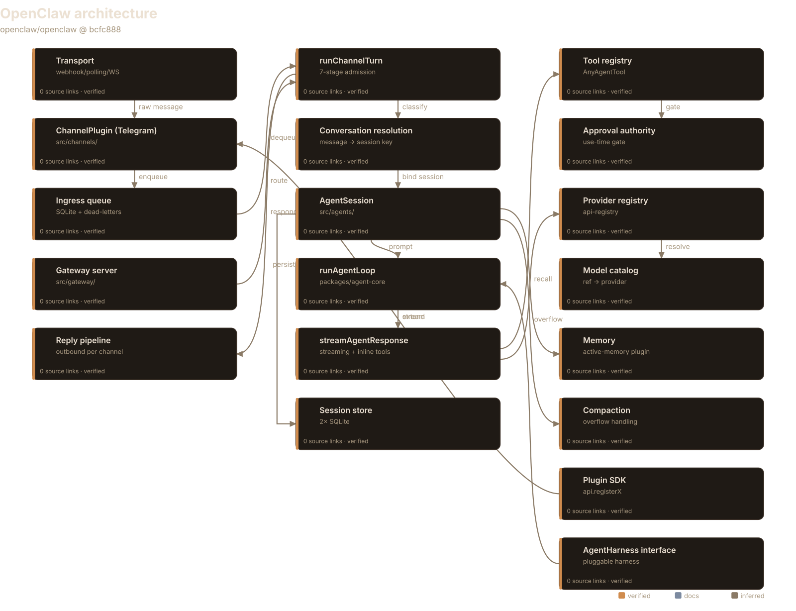
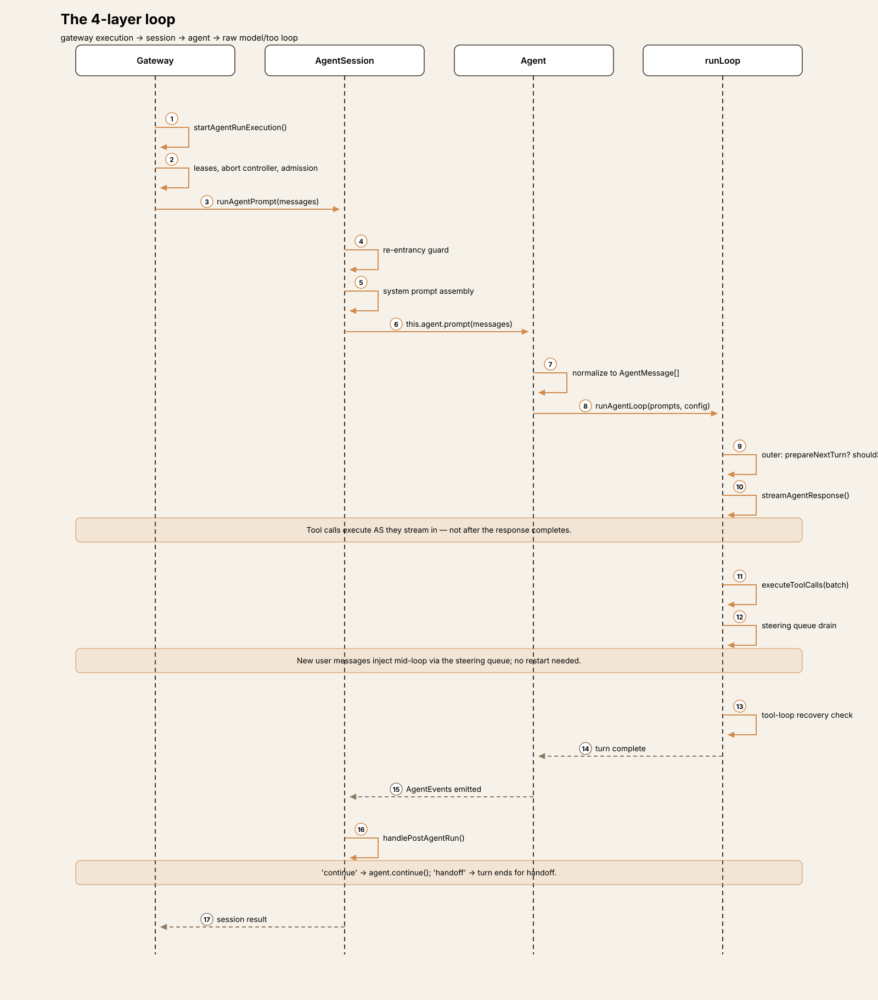
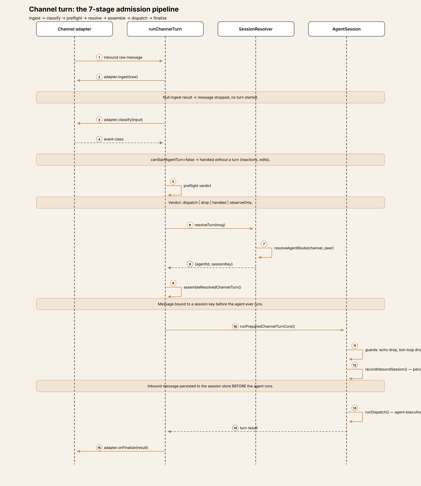
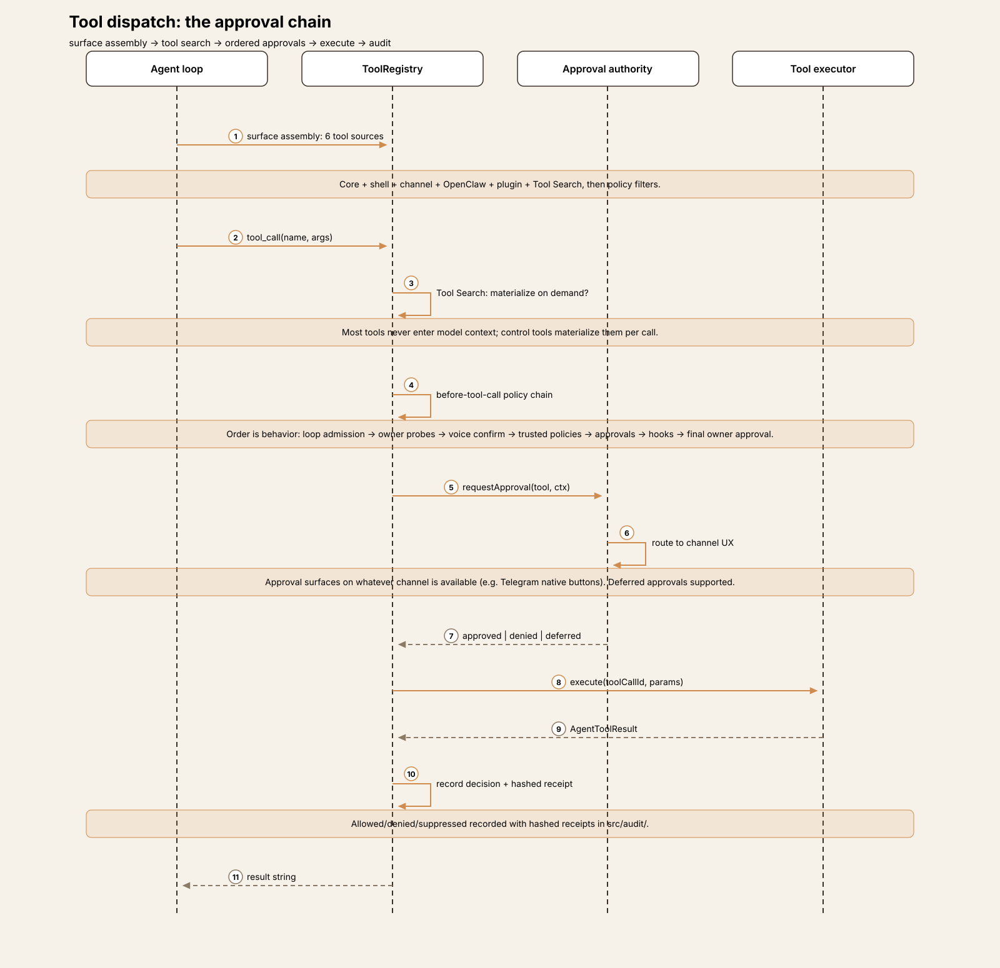
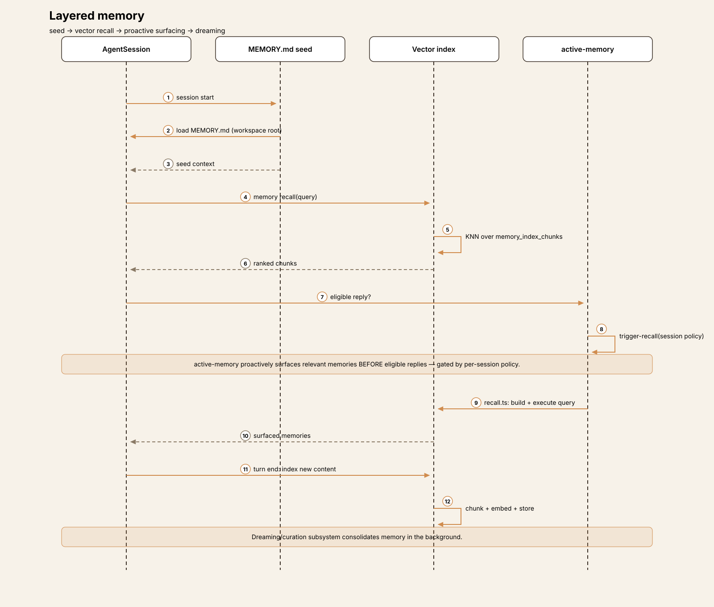
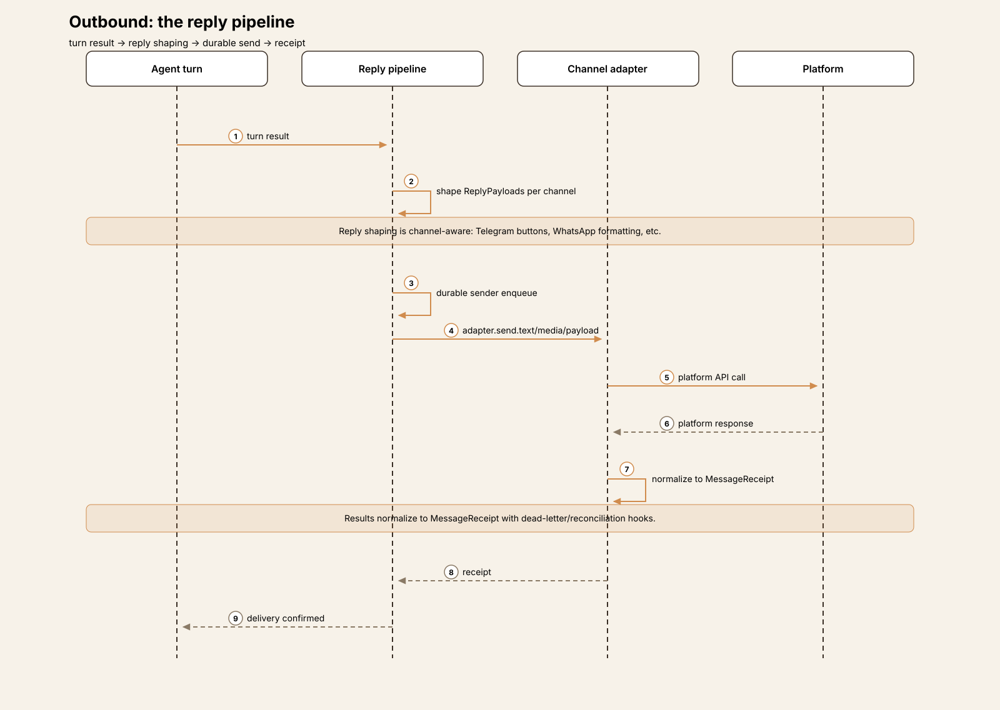

# Agent Harness Anatomy #9: OpenClaw — the channel-first gateway

> **Series:** Agent Harness Anatomy — top-down dissections of real agent
> harnesses, grounded in verifiable source code. Every behavioral claim
> below carries a footnote to a pinned GitHub permalink; the full evidence
> lives in the endnotes.

## Version block

- **Repo:** [openclaw/openclaw](https://github.com/openclaw/openclaw)
- **Pinned:** tag `v2026.9.9` → `bcfc88812a35243893585dbeca87ca41b48272ca` (2026-10-08)
- **Language:** TypeScript (pnpm monorepo)
- **Claim under test:** "Multi-channel AI gateway with extensible messaging integrations"

## The mental model

Every harness in this series so far has been a program you run: a terminal
app, an IDE extension, a CLI. OpenClaw inverts the relationship. It is a
**long-running gateway server** that *hosts* agent turns, and the primary
way you talk to it is through messaging channels — WhatsApp, Telegram,
Discord, Signal, Slack — not a terminal.[^1] The CLI and web UI are
secondary surfaces on a system whose core abstraction is the *inbound
message*, not the prompt.

The architecture follows from that inversion. Where pi has a loop and a
TUI, OpenClaw has four nested loop layers, a staged message-admission
pipeline, a durable ingress queue with dead-letters, per-channel session
binding, and a pluggable harness interface that can dispatch turns to
*non-OpenClaw* harnesses.[^2] It is the broadest harness in the series by a
wide margin — ~100 bundled extensions, 550+ config schema files — and the
only one whose distinctive question is not "how does the loop work" but
"how does a WhatsApp message become an agent turn."[^3]

The governing tradeoff: OpenClaw pays for its breadth with machinery.
Every message traverses ingest → classify → preflight → resolve → assemble
→ dispatch → finalize before the model ever sees it.[^4] You get a
multi-tenant, multi-channel agent platform; you pay in pipeline stages,
session-binding policy, and operational surface. If you're building a
harness, that's OpenClaw's thesis in one sentence: the channel is the
product, the loop is a component.

## Package map

The repo is a pnpm monorepo. For this article five areas matter:[^5]

| Area | Role |
|---|---|
| `packages/agent-core/` | The model-agnostic loop: `runLoop`, `Agent` class, event types |
| `packages/llm-core/` + `packages/ai/` | Provider type contracts and the API registry |
| `src/agents/` | Session orchestration, tool surface, harness lifecycle, embedded runner |
| `src/channels/` | Channel framework: admission pipeline, ingress queue, session binding |
| `src/gateway/` | The long-running server: receive/send, reply pipeline, boot |
| `extensions/` | ~100 bundled plugins: channels, providers, utilities |

Everything else (`apps/`, `ui/`, `crates/`, `deploy/`, …) is out of scope
for the core trace. The lineage, per `VISION.md`, runs Warelay →
Clawdbot → Moltbot → OpenClaw.[^6]

## The core loop

The loop is deliberately factored into **four nested layers**, each adding
orchestration around the one below. This is the most layered loop
architecture in the series.

**Layer 1 — `runLoop()`, the raw model→tool loop.** Lives in the
model-agnostic `@openclaw/agent-core` package, which knows nothing about
channels or gateways.[^7] Two nested `while` loops: the outer iterates
turns, the inner runs while tool calls or steering messages remain.[^8]
Each inner iteration streams the model response and executes tool calls
*as they arrive in the stream* — not after the response completes — via
`streamAgentResponse` with async tool-batch scheduling.[^9] New user
messages can be injected mid-loop through the steering queue without
restarting it.[^10] Each outer iteration consults two hooks,
`prepareNextTurn` and `shouldStopAfterTurn` — there is no hard max-turn
counter in agent-core itself; loop control is delegated to
configuration.[^11] A tool-loop recovery detector watches for pathological
tool-call cycles and intervenes.[^12]

**Layer 2 — the `Agent` class, transcript ownership.**
`packages/agent-core/src/agent.ts` (`export class Agent`, 724 lines)
owns the mutable message state, the steering queue, and the follow-up
queue, and emits typed `AgentEvent`s.[^13] `prompt()` normalizes input and
runs the loop; `continue()` resumes from the transcript tail (which must
end in user or tool-result, never assistant).[^14]

**Layer 3 — `AgentSession`, the session orchestrator.** A mixin chain
(`AgentSession` → `AgentSessionTree` → … → `AgentSessionBase`) adding
prompting, execution, compaction, extensions, and inspection.[^15]
`runAgentPrompt` guards re-entrancy, runs the prepared loop, then handles
post-run directives: `"continue"` runs the agent again, `"handoff"` ends
the turn for handoff.[^16] Execution adds auto-retry with exponential
backoff — retryable on rate-limit and server errors, *not* on context
overflow, which routes to compaction instead.[^17]

**Layer 4 — gateway execution.** The session run is wrapped in operational
machinery: prepared model-runtime leases, per-run abort controllers,
lifecycle generation assertions, and work-admission continuations.[^18]
The `src/gateway/agent-turn/` directory holds 54 files covering admission
control, dedupe, restart recovery, subagent runs, and terminal outcome
production — the loop's execution environment, not the loop itself.

**The notable abstraction: `AgentHarness`.** OpenClaw defines a pluggable
harness interface — `runAttempt(params)` — and the lifecycle code
explicitly handles "Non-OpenClaw harnesses," giving them child run
traces.[^19] The gateway can dispatch turns to *other* agent harnesses
through this contract. No other teardown in the series has a
harness-abstraction layer; here the harness is itself hostable.

## One turn, end to end

Trace: a Telegram message reading `summarize today's standup notes`
arrives while the gateway is running.

**① Ingress.** The Telegram channel plugin — built with
`createChatChannelPlugin()`, composing ~25 optional adapters (security,
pairing, threading, outbound, …) rather than written from
scratch[^20] — receives the raw update through its transport (long-poll
or webhook) and calls the SDK entry `runChannelInboundEvent`, a thin
wrapper over the admission pipeline.[^21] Channels run **in-process**
inside the gateway; each channel's `startAccount` opens its own transport
to the platform.[^22]

**② Admission.** Every inbound message traverses `runChannelTurn`'s staged
pipeline: **ingest** (channel-specific raw → normalized input; null →
drop) → **classify** (event class; non-turn events like reactions are
handled without starting a turn) → **preflight** (admission verdict:
`dispatch` | `drop` | `handled` | `observeOnly`) → **resolveTurn** →
**assemble** (binds the message to a session key via route resolution) →
**dispatch** → **finalize**.[^4] This is a message-processing architecture
grafted onto an agent loop — nothing in the previous eight teardowns looks
like it.

**③ Persistence before execution.** The dispatch core,
`runPreparedChannelTurnCore`, applies guards first (outbound-echo drop,
bot-loop protection), then **persists the inbound message to the session
store before the agent runs** — the turn is durable before it is
executed.[^23] For reliability, channels may enqueue into a SQLite-backed
ingress queue instead of calling the turn runner directly; the drain
claims leases with per-lane serialization, retry, dead-letter, and a stall
watchdog for at-least-once ordered delivery.[^24]

**④ Session binding.** Route resolution maps the channel, account, and peer
to an agent ID and session key; conversation resolution and thread
bindings attach the message to the right conversation, with multi-account
channels resolving to separate sessions.[^25]

**⑤ Execution.** The gateway's agent-turn layer provides the dispatch
function, which runs the four-layer loop described above against the
bound session — history loaded from the per-agent SQLite store, replay
validated, context-window limited, assembled by the context engine.[^26]

**⑥ Reply.** Agent output becomes `ReplyPayload`s shaped per channel by
the reply pipeline, sent through a durable sender, and normalized to
`MessageReceipt`s with dead-letter and reconciliation hooks.[^27] Approval
prompts, where needed, surface as native channel UI — Telegram inline
buttons, for example.[^28]

The tradeoff of the pipeline: every message pays the admission cost even
when the verdict is trivially `dispatch` — but the gateway gains uniform
policy enforcement, durability, and multi-tenancy. A single-user CLI
harness would never build this; a messaging platform must.

## Subsystem inventory

- **Tools.** The `AnyAgentTool` type (TypeBox params, display metadata,
  catalog mode, execution timeouts, before-call param hooks) is registered
  through a registrar supporting static declarations *and* runtime tool
  factories.[^29] The effective tool surface merges six sources — core,
  shell, channel, OpenClaw, plugin, and Tool Search — then applies
  sandbox, profile, provider, sender, group, and sub-agent policy
  filters.[^30] Channel plugins contribute channel-owned agent tools
  through the `agentTools` adapter.[^20]
- **Tool Search catalog.** Most tools never enter the model context. The
  model uses control tools, and a per-call executor materializes searched
  tools on demand — a retrieval layer *inside* the tool system.[^30]
- **Approvals.** An explicitly ordered policy chain where ordering is
  behavior: loop admission → owner probes → voice confirmation → trusted
  policies → approvals → normal hooks → final owner approval.[^31] The
  gateway adds a use-time authority gate bound to the run's *delegated
  authority*, not just the tool name; decisions are audited with hashed
  receipts, and plugins can request deferred approvals.[^32]
- **Providers.** `packages/llm-core` defines the transport-adapter contract
  (`stream` / `streamSimple` returning a normalized async-iterable event
  stream); `packages/ai`'s registry maps API IDs to providers, with
  built-in transports and per-vendor extensions declaring auth, model
  catalogs, and thinking policies.[^33] The agent loop consumes streaming
  by default; `modelFallback` is last-resort chain resolution, never
  runtime failover on error.[^34]
- **Sessions and state.** Two SQLite databases via `node:sqlite`, no
  external server: a shared state DB (cross-agent state, append-only
  `session_state_events` with per-agent cursors, lease/worker mutual
  exclusion) and a per-agent DB holding the authoritative conversation
  history as `session_nodes` → `session_windows` →
  `transcript_events` (append-only, `(session_id, seq)` keyed, with
  compressed blobs and FTS indexing).[^35]
- **Memory.** Layered: a canonical `MEMORY.md` seed loaded at session
  start, a vector/keyword index in the agent DB, and the bundled
  `active-memory` plugin that proactively surfaces relevant memories
  before eligible replies, gated by per-session policy — plus a
  dreaming/curation subsystem.[^36]
- **Config.** A 550-file schema-driven system with dot-notation access,
  prototype-pollution guards, and wizard flows; model config supports
  merge/replace modes over a provider map.[^37]

## Extension points

OpenClaw's extension model is the most formal in the series: a
**capability-typed plugin system** where plugins register capabilities
through `api.registerX` — providers, channels, embeddings, speech,
media generation, web fetch, gateway discovery, migrations — and are
classified by shape (single-capability, hybrid, hook-only).[^3] Each
extension carries an `openclaw.plugin.json` manifest (id, categories,
activation policy, config schema, doctor contract); the Telegram manifest
declares `activation.onStartup: false`, keeping heavy channel imports off
the startup hot path via lazy specifiers.[^38] Heavy modules stay lazy
throughout the runtime.[^39]

Skills deserve a callout because they invert the Hermes pattern: in
OpenClaw, skills are **instruction packs, not tools**. Named folders under
`skills/` hold `SKILL.md` files with YAML frontmatter; they flow into runs
through the prompt system (`skillsSnapshot`, instruction-delivery caches)
and user-invocable chat commands, steering the model *toward* real tools
rather than being callable themselves.[^40] The gateway even supports
skill authoring as a first-class flow.[^41]

## Deliberate omissions

There is no runtime model failover — `modelFallback` resolves a chain at
configuration time and never switches providers mid-run on error.[^34]
The agent-core loop has no built-in iteration cap; control is delegated
to the `shouldStopAfterTurn` hook and the gateway's retry budgets.[^11]
And the `AgentHarness` interface notwithstanding, no non-OpenClaw harness
implementations ship bundled — it is a contract awaiting implementations,
not a working multi-harness router today.[^19]

Read the omissions as scope discipline: OpenClaw's complexity budget is
spent on channels, admission, and multi-tenancy. The loop itself stays
delegated and hook-driven rather than opinionated.

## Comparison matrix row

| # | Dimension | OpenClaw (v2026.9.9) |
|---|---|---|
| 1 | Agent loop | 4 nested layers; streaming tool exec; steering injection; hook-driven stop (no hard cap) [^8][^11] |
| 2 | Tool system | `AnyAgentTool` registry + factories; 6-source surface merge; Tool Search catalog [^29][^30] |
| 3 | Model providers | `llm-core` transport contract; api-registry; per-vendor extensions; no runtime failover [^33][^34] |
| 4 | Prompt construction | Context-engine assembly; skills via prompt system; session-bound [^26][^40] |
| 5 | Memory/session | 2× SQLite; `session_nodes`→`windows`→`transcript_events`; layered memory + active recall [^35][^36] |
| 6 | Reasoning/planning | Subagents via harness; tool-loop recovery; retry budgets [^12][^19] |
| 7 | Extensibility | Capability-typed plugins (`api.registerX`); ~100 bundled; lazy loading [^3][^39] |
| 8 | Interfaces | **Channel-first**: ~25 channel adapters; Telegram template; CLI/UI secondary [^1][^20] |
| 9 | Failure handling | Ingress dead-letters; retry with backoff; compaction on overflow (never retry) [^24][^17] |
| 10 | Security model | Staged admission verdicts; ordered approval chain; hashed-receipt audit; delegated authority [^4][^31][^32] |

## Endnotes

All notes VERIFIED against `v2026.9.9`
(`bcfc88812a35243893585dbeca87ca41b48272ca`).
`GH` = `https://github.com/openclaw/openclaw/blob/bcfc88812a35243893585dbeca87ca41b48272ca/`.

[^1]: Package tagline in
    [GH…/package.json](https://github.com/openclaw/openclaw/blob/bcfc88812a35243893585dbeca87ca41b48272ca/package.json)
    (`"description": "Multi-channel AI gateway with extensible messaging integrations"`).
[^2]: `AgentHarness` interface with `runAttempt` at
    [GH…/src/agents/harness/types.ts#L437](https://github.com/openclaw/openclaw/blob/bcfc88812a35243893585dbeca87ca41b48272ca/src/agents/harness/types.ts#L437);
    non-OpenClaw harness handling at
    [GH…/src/agents/harness/lifecycle.ts#L300](https://github.com/openclaw/openclaw/blob/bcfc88812a35243893585dbeca87ca41b48272ca/src/agents/harness/lifecycle.ts#L300).
[^3]: Capability registration model documented in `docs/plugins/architecture.md`
    ([GH…/docs/plugins/architecture.md](https://github.com/openclaw/openclaw/blob/bcfc88812a35243893585dbeca87ca41b48272ca/docs/plugins/architecture.md));
    ~100 extensions under
    [GH…/extensions/](https://github.com/openclaw/openclaw/blob/bcfc88812a35243893585dbeca87ca41b48272ca/extensions/);
    550+ files under
    [GH…/src/config/](https://github.com/openclaw/openclaw/blob/bcfc88812a35243893585dbeca87ca41b48272ca/src/config/).
[^4]: `runChannelTurn` staged pipeline at
    [GH…/src/channels/turn/run-channel-turn.ts#L146](https://github.com/openclaw/openclaw/blob/bcfc88812a35243893585dbeca87ca41b48272ca/src/channels/turn/run-channel-turn.ts#L146)
    (ingest → classify → preflight → resolveTurn → assemble → dispatch → finalize).
[^5]: Monorepo layout: `packages/agent-core`, `packages/llm-core`, `packages/ai`
    ([GH…/packages/](https://github.com/openclaw/openclaw/blob/bcfc88812a35243893585dbeca87ca41b48272ca/packages/));
    `src/agents`, `src/channels`, `src/gateway`
    ([GH…/src/](https://github.com/openclaw/openclaw/blob/bcfc88812a35243893585dbeca87ca41b48272ca/src/)).
[^6]: Lineage in
    [GH…/VISION.md#L13](https://github.com/openclaw/openclaw/blob/bcfc88812a35243893585dbeca87ca41b48272ca/VISION.md#L13)
    ("Warelay -> Clawdbot -> Moltbot -> OpenClaw").
[^7]: `async function runLoop` at
    [GH…/packages/agent-core/src/agent-loop.ts#L141](https://github.com/openclaw/openclaw/blob/bcfc88812a35243893585dbeca87ca41b48272ca/packages/agent-core/src/agent-loop.ts#L141);
    public wrappers `runAgentLoop` / `runAgentLoopContinue` at L68/L81.
[^8]: Nested `while` structure in `runLoop`
    ([GH…/agent-loop.ts#L141](https://github.com/openclaw/openclaw/blob/bcfc88812a35243893585dbeca87ca41b48272ca/packages/agent-core/src/agent-loop.ts#L141)).
[^9]: `streamAgentResponse` in
    [GH…/packages/agent-core/src/agent-stream-response.ts](https://github.com/openclaw/openclaw/blob/bcfc88812a35243893585dbeca87ca41b48272ca/packages/agent-core/src/agent-stream-response.ts)
    executes tool calls as they stream in, with async batch scheduling.
[^10]: Steering via `pendingMessages` / `getSteeringMessages` /
    `commitPendingMessages` in
    [GH…/packages/agent-core/src/agent-loop.ts](https://github.com/openclaw/openclaw/blob/bcfc88812a35243893585dbeca87ca41b48272ca/packages/agent-core/src/agent-loop.ts).
[^11]: Outer-loop hooks `config.prepareNextTurn?.()` and
    `config.shouldStopAfterTurn?.()` consulted per iteration in
    [GH…/packages/agent-core/src/agent-loop.ts](https://github.com/openclaw/openclaw/blob/bcfc88812a35243893585dbeca87ca41b48272ca/packages/agent-core/src/agent-loop.ts);
    no hard max-turn counter in agent-core (negative finding: grep for
    `maxTurns|maxIterations` in `packages/agent-core/src` returns nothing).
[^12]: Tool-loop recovery via `toolLoopRecoveryState.criticalToolLoopSeen`
    in
    [GH…/packages/agent-core/src/agent-loop.ts](https://github.com/openclaw/openclaw/blob/bcfc88812a35243893585dbeca87ca41b48272ca/packages/agent-core/src/agent-loop.ts).
[^13]: `export class Agent` at
    [GH…/packages/agent-core/src/agent.ts#L270](https://github.com/openclaw/openclaw/blob/bcfc88812a35243893585dbeca87ca41b48272ca/packages/agent-core/src/agent.ts#L270)
    (724-line file).
[^14]: `prompt()` / `continue()` transcript-tail requirements in
    [GH…/packages/agent-core/src/agent.ts](https://github.com/openclaw/openclaw/blob/bcfc88812a35243893585dbeca87ca41b48272ca/packages/agent-core/src/agent.ts).
[^15]: Mixin chain `AgentSession` → `AgentSessionTree` → `AgentSessionBase`
    in
    [GH…/src/agents/sessions/](https://github.com/openclaw/openclaw/blob/bcfc88812a35243893585dbeca87ca41b48272ca/src/agents/sessions/).
[^16]: `runAgentPrompt` re-entrancy guard and post-run `"continue"` /
    `"handoff"` handling in
    [GH…/src/agents/sessions/agent-session-prompting.ts](https://github.com/openclaw/openclaw/blob/bcfc88812a35243893585dbeca87ca41b48272ca/src/agents/sessions/agent-session-prompting.ts).
[^17]: Auto-retry with exponential backoff; retryable on rate-limit/server
    errors, context overflow → compaction, in
    [GH…/src/agents/sessions/agent-session-execution.ts](https://github.com/openclaw/openclaw/blob/bcfc88812a35243893585dbeca87ca41b48272ca/src/agents/sessions/agent-session-execution.ts).
[^18]: `startAgentRunExecution` at
    [GH…/src/gateway/agent-turn/agent-run-execution-phase.ts#L70](https://github.com/openclaw/openclaw/blob/bcfc88812a35243893585dbeca87ca41b48272ca/src/gateway/agent-turn/agent-run-execution-phase.ts#L70);
    54 files under
    [GH…/src/gateway/agent-turn/](https://github.com/openclaw/openclaw/blob/bcfc88812a35243893585dbeca87ca41b48272ca/src/gateway/agent-turn/).
[^19]: Same as [^2].
[^20]: `createChatChannelPlugin()` at
    [GH…/src/plugin-sdk/core.ts#L734](https://github.com/openclaw/openclaw/blob/bcfc88812a35243893585dbeca87ca41b48272ca/src/plugin-sdk/core.ts#L734);
    `ChannelPlugin` contract (~25 adapters) at
    [GH…/src/channels/plugins/types.plugin.ts#L48](https://github.com/openclaw/openclaw/blob/bcfc88812a35243893585dbeca87ca41b48272ca/src/channels/plugins/types.plugin.ts#L48);
    channel-owned agent tools via the `agentTools` adapter.
[^21]: `runChannelInboundEvent` at
    [GH…/src/plugin-sdk/channel-inbound.ts#L240](https://github.com/openclaw/openclaw/blob/bcfc88812a35243893585dbeca87ca41b48272ca/src/plugin-sdk/channel-inbound.ts#L240).
[^22]: Channels run in-process; `startAccount` lifecycle seam in
    [GH…/src/gateway/server-channels.ts](https://github.com/openclaw/openclaw/blob/bcfc88812a35243893585dbeca87ca41b48272ca/src/gateway/server-channels.ts).
[^23]: `runPreparedChannelTurnCore` at
    [GH…/src/channels/turn/execution.ts#L208](https://github.com/openclaw/openclaw/blob/bcfc88812a35243893585dbeca87ca41b48272ca/src/channels/turn/execution.ts#L208)
    (guards → `recordInboundSession` → `params.runDispatch()`).
[^24]: SQLite-backed `ChannelIngressQueue` in
    [GH…/src/channels/message/ingress-queue.ts](https://github.com/openclaw/openclaw/blob/bcfc88812a35243893585dbeca87ca41b48272ca/src/channels/message/ingress-queue.ts);
    drain with claim leases, per-lane serialization, retry/dead-letter in
    `src/channels/message/ingress-drain.ts`.
[^25]: Route resolution `resolveAgentRoute` in
    [GH…/src/routing/resolve-route.ts](https://github.com/openclaw/openclaw/blob/bcfc88812a35243893585dbeca87ca41b48272ca/src/routing/resolve-route.ts);
    conversation resolution in
    [GH…/src/channels/conversation-resolution.ts](https://github.com/openclaw/openclaw/blob/bcfc88812a35243893585dbeca87ca41b48272ca/src/channels/conversation-resolution.ts).
[^26]: History preparation: `prepareEmbeddedAttemptHistory` in
    [GH…/src/agents/embedded-agent-runner/run/attempt-history-prepare.ts](https://github.com/openclaw/openclaw/blob/bcfc88812a35243893585dbeca87ca41b48272ca/src/agents/embedded-agent-runner/run/attempt-history-prepare.ts);
    retry budget `BASE_RUN_RETRY_ITERATIONS = 24` in
    [GH…/src/agents/embedded-agent-runner/run/helpers.ts#L51](https://github.com/openclaw/openclaw/blob/bcfc88812a35243893585dbeca87ca41b48272ca/src/agents/embedded-agent-runner/run/helpers.ts#L51).
[^27]: Reply pipeline in
    [GH…/src/channels/message/reply-pipeline.ts](https://github.com/openclaw/openclaw/blob/bcfc88812a35243893585dbeca87ca41b48272ca/src/channels/message/reply-pipeline.ts);
    `MessageReceipt` normalization in `src/channels/message/receipt.ts`.
[^28]: Telegram native approval UI in
    [GH…/extensions/telegram/src/approval-native.ts](https://github.com/openclaw/openclaw/blob/bcfc88812a35243893585dbeca87ca41b48272ca/extensions/telegram/src/approval-native.ts).
[^29]: `AnyAgentTool` type at
    [GH…/src/agents/tools/common.ts#L53](https://github.com/openclaw/openclaw/blob/bcfc88812a35243893585dbeca87ca41b48272ca/src/agents/tools/common.ts#L53);
    registry via `createToolHookRegistrars` in
    [GH…/src/plugins/registry-registrars-tools-hooks.ts](https://github.com/openclaw/openclaw/blob/bcfc88812a35243893585dbeca87ca41b48272ca/src/plugins/registry-registrars-tools-hooks.ts).
[^30]: Surface assembly merging six tool sources plus policy filters in
    [GH…/src/agents/agent-tools.ts](https://github.com/openclaw/openclaw/blob/bcfc88812a35243893585dbeca87ca41b48272ca/src/agents/agent-tools.ts);
    Tool Search on-demand materialization via
    `attempt-tool-search-executor.ts`.
[^31]: Approval policy chain ordering ("ordering is behavior") at
    [GH…/src/agents/agent-tools.before-tool-call.policy.ts#L4](https://github.com/openclaw/openclaw/blob/bcfc88812a35243893585dbeca87ca41b48272ca/src/agents/agent-tools.before-tool-call.policy.ts#L4).
[^32]: Gateway approval authority at
    [GH…/src/gateway/agent-runtime-approval-authority.ts#L11](https://github.com/openclaw/openclaw/blob/bcfc88812a35243893585dbeca87ca41b48272ca/src/gateway/agent-runtime-approval-authority.ts#L11);
    hashed-receipt audit in `src/audit/`.
[^33]: `packages/llm-core/src/types.ts` (`StreamFunction`, provider
    contracts); registry `createApiRegistry` in
    [GH…/packages/ai/src/api-registry.ts](https://github.com/openclaw/openclaw/blob/bcfc88812a35243893585dbeca87ca41b48272ca/packages/ai/src/api-registry.ts);
    stream facade in
    [GH…/src/llm/stream.ts](https://github.com/openclaw/openclaw/blob/bcfc88812a35243893585dbeca87ca41b48272ca/src/llm/stream.ts).
[^34]: `modelFallback` as last-resort chain resolution, never runtime
    failover, in the provider/model configuration
    ([GH…/src/llm/](https://github.com/openclaw/openclaw/blob/bcfc88812a35243893585dbeca87ca41b48272ca/src/llm/)).
[^35]: Shared state schema in
    [GH…/src/state/openclaw-state-schema.sql](https://github.com/openclaw/openclaw/blob/bcfc88812a35243893585dbeca87ca41b48272ca/src/state/openclaw-state-schema.sql);
    per-agent schema in
    [GH…/src/state/openclaw-agent-schema.sql](https://github.com/openclaw/openclaw/blob/bcfc88812a35243893585dbeca87ca41b48272ca/src/state/openclaw-agent-schema.sql)
    (`session_nodes`, `session_windows`, `transcript_events`); Kysely over
    `node:sqlite` in
    [GH…/src/infra/kysely-sync.ts](https://github.com/openclaw/openclaw/blob/bcfc88812a35243893585dbeca87ca41b48272ca/src/infra/kysely-sync.ts).
[^36]: `CANONICAL_ROOT_MEMORY_FILENAME = "MEMORY.md"` in
    [GH…/src/memory/root-memory-files.ts#L7](https://github.com/openclaw/openclaw/blob/bcfc88812a35243893585dbeca87ca41b48272ca/src/memory/root-memory-files.ts#L7);
    `active-memory` plugin entry in
    [GH…/extensions/active-memory/index.ts](https://github.com/openclaw/openclaw/blob/bcfc88812a35243893585dbeca87ca41b48272ca/extensions/active-memory/index.ts).
[^37]: 550+ files under
    [GH…/src/config/](https://github.com/openclaw/openclaw/blob/bcfc88812a35243893585dbeca87ca41b48272ca/src/config/);
    central accessor `getRuntimeConfig()` in `src/config/config.js`.
[^38]: Telegram manifest at
    [GH…/extensions/telegram/openclaw.plugin.json](https://github.com/openclaw/openclaw/blob/bcfc88812a35243893585dbeca87ca41b48272ca/extensions/telegram/openclaw.plugin.json)
    (`activation.onStartup: false`); bundled entry via
    `defineBundledChannelEntry` in
    [GH…/extensions/telegram/index.ts#L4](https://github.com/openclaw/openclaw/blob/bcfc88812a35243893585dbeca87ca41b48272ca/extensions/telegram/index.ts#L4).
[^39]: Lazy runtime modules via `createLazyRuntimeModule` in
    [GH…/src/plugin-sdk/lazy-runtime.ts](https://github.com/openclaw/openclaw/blob/bcfc88812a35243893585dbeca87ca41b48272ca/src/plugin-sdk/lazy-runtime.ts).
[^40]: Skills as prompt-delivered instruction packs:
    `skillsSnapshot` and `createSkillInstructionDeliveryCache` in
    `src/skills/`; lifecycle under
    [GH…/src/skills/](https://github.com/openclaw/openclaw/blob/bcfc88812a35243893585dbeca87ca41b48272ca/src/skills/).
[^41]: Gateway skill authoring via `prepareGatewaySkillAuthoring` in
    [GH…/src/gateway/skill-library-authoring.ts](https://github.com/openclaw/openclaw/blob/bcfc88812a35243893585dbeca87ca41b48272ca/src/gateway/skill-library-authoring.ts).

---

*Next in the series: teardown #10 — the shortlist continues.*
