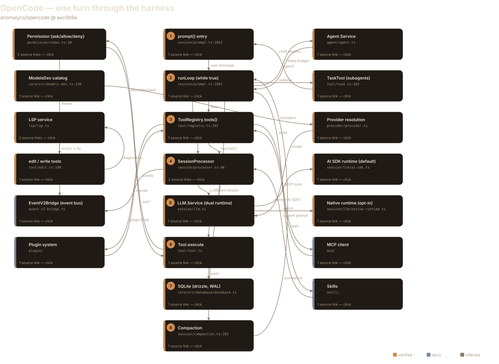
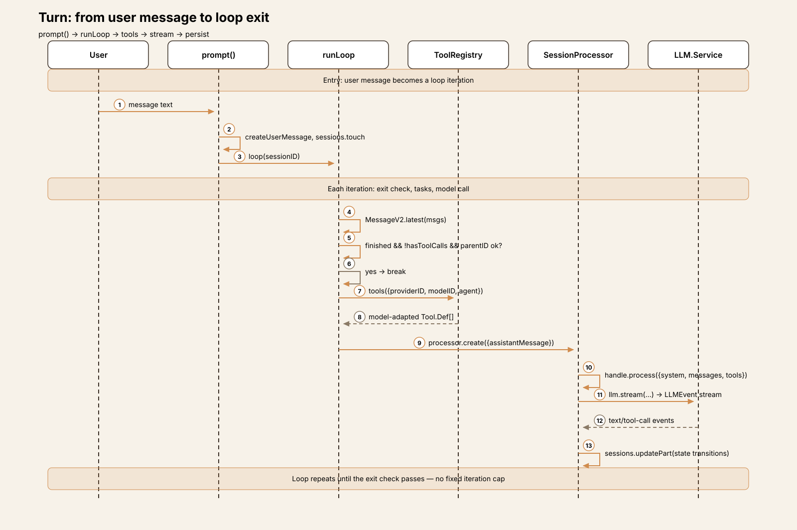
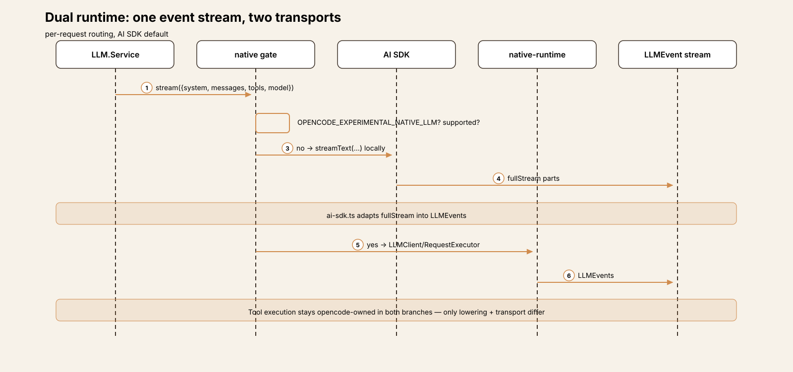
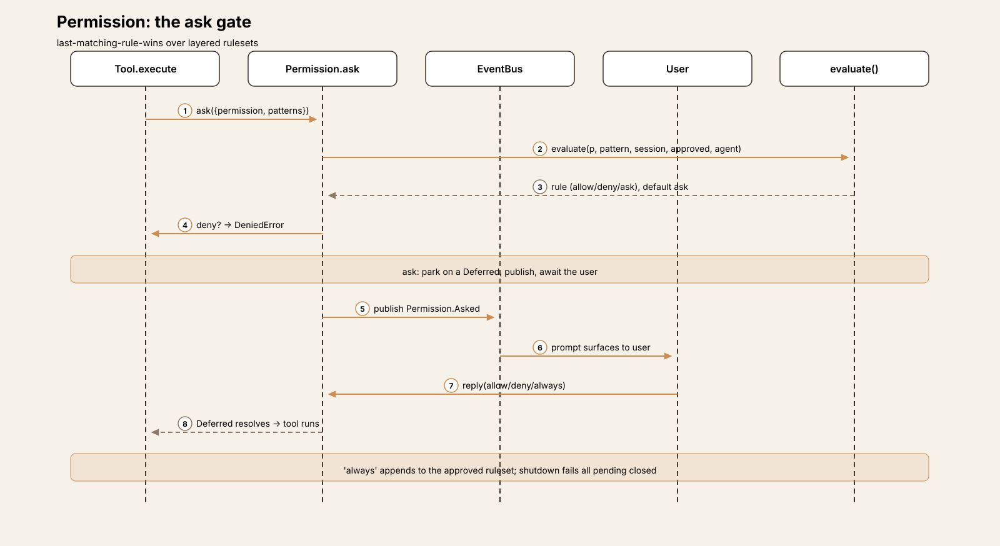
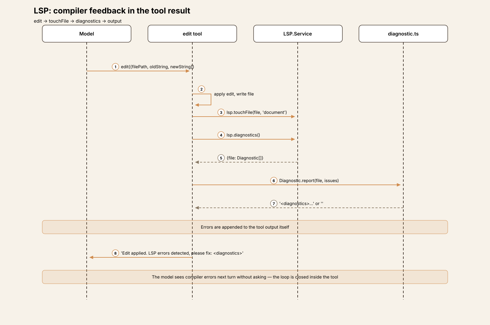
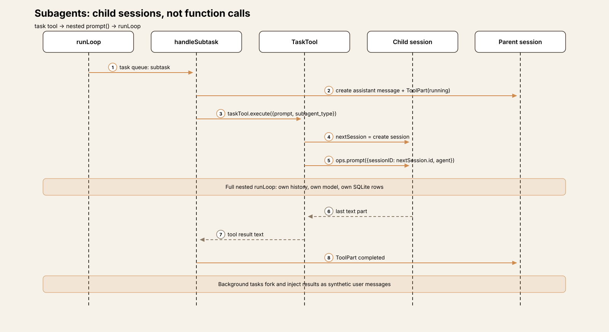

# Agent Harness Anatomy #7: OpenCode — the dual-runtime coding agent

> **Series:** Agent Harness Anatomy — top-down dissections of real agent
> harnesses, grounded in verifiable source code. Every behavioral claim
> below carries a footnote to a pinned GitHub permalink; the full evidence
> lives in the endnotes.

## Version block

- **Repo:** [anomalyco/opencode](https://github.com/anomalyco/opencode)

- **Pinned:** tag `v1.18.34` → `aec0b9a6d8898f68f923aaf08b7306d931fd9d76` (2026-09-30)

- **Language:** TypeScript, Bun runtime; Effect-based dependency injection throughout

- **License:** MIT

- **Claim under test:** "The open source coding agent."

OpenCode is the fastest-growing harness this series has covered — over
210,000 stars at the time of analysis — and the first one built on
**Effect**, the typed functional-effects library for TypeScript.
That choice shapes everything: services are Effect tags, errors are typed
values, and the agent loop is an Effect program. The interesting question
is not whether Effect works here (it does), but what it buys a coding
agent: cancellation, resource safety, and a permission system built on
deferred effects rather than callbacks.[^1][^2]

## The mental model

OpenCode is a **dual-runtime coding agent**: one session loop, one
tool system, one SQLite store — and *two* LLM transports underneath.
The default path runs the Vercel AI SDK locally (`streamText`); an
opt-in native runtime lowers the same request to OpenCode's own
`@opencode-ai/llm` client. Both converge on a single
`LLMEvent` stream that the session processor consumes, so the loop
never knows which transport ran.[^12] The loop itself is almost
provocatively simple: `runLoop` spins `while (true)` and exits
only when the model stops *and* there are no pending tool calls
*and* the last assistant message is a direct child of the user
message — a "stop" with tool calls present does not exit, so tool results
always flow back into the loop.[^5][^6]

The governing tradeoff: OpenCode buys model-adaptivity and transport
optionality at the cost of indirection. The tool set is rebuilt *per
request* for the exact model in play — GPT-family models get
`apply_patch` instead of `edit`+`write` — and the
provider catalog is fetched live from a network API rather than vendored,
so the harness never ships a stale model list but cannot start offline
with full provider knowledge.[^9][^15]

## Package map

A Bun monorepo. Three packages matter:[^3]

| Package | Role | Contents |

|---|---|---|

| `packages/opencode` | The harness core | session loop, tool registry, permission system, LSP, providers, subagents, compaction, MCP, skills |

| `packages/app` | The terminal UI | SolidJS TUI rendering session state from the SQLite store |

| `packages/core` | Shared substrate | database (Drizzle/Effect, WAL), auth, config, logging |

Cross-cutting: every service is an Effect `Tag`
(`SessionProcessor.tag`, `LLM.tag`,
`Database.tag`…), composed through layers — so the entire harness
is a dependency graph the type checker can see.[^4]

## The core loop

`runLoop` (`packages/opencode/src/session/prompt.ts:1081`) is
the whole game in ~80 lines. It reads the session's messages fresh each
iteration — filtering compacted messages, taking
`MessageV2.latest()` — and the exit check is a three-part
conjunction: the last assistant message finished with a non-tool-calls
reason, there are no pending tool calls, and its `parentID` is the
user message.[^5][^6] There is no iteration counter anywhere in the
loop. The only numeric bound is `maxSteps`, which defaults to
`Infinity`; when a configured step limit is reached, OpenCode does
not kill the loop — it injects `MAX_STEPS_PROMPT`, telling the
model to wrap up gracefully.[^7]

Before each model call, the loop drains a task queue: subtasks become
child sessions, compactions get processed, and context overflow triggers
`compaction.create({ auto: true })`.[^21] Entry is through
`prompt()`, which creates the user message, touches the session,
and runs everything inside `state.ensureRunning` so concurrent
prompts serialize on the session rather than interleaving.[^8]

## The dual LLM runtime

This is OpenCode's most distinctive architectural decision. The boundary
is documented in `packages/opencode/src/session/llm/AGENTS.md`: two
runtimes, one event stream.[^12]

- **Default — Vercel AI SDK.** `ai-sdk.ts` runs
`streamText()` locally and adapts `fullStream` parts into
`LLMEvent`s. The SDK executes tools if configured, but OpenCode
adapts the stream into its own event model and keeps tool execution in
its own hands.[^13]

- **Opt-in — native runtime.** Behind
`OPENCODE_EXPERIMENTAL_NATIVE_LLM`, the request is lowered to an
`@opencode-ai/llm` `LLMRequest` and executed via
`LLMClient`/`RequestExecutor` — OpenCode's own transport,
no Vercel SDK in the path.[^14]

Routing is per-request inside `LLM.Service`, and the processor
below only ever sees `LLMEvent`s. The provider catalog feeding
model selection is not vendored at all: it is fetched from
`https://models.opencode.ai/api.json`, cached locally with
locking, and refreshed periodically — the harness adapts to new models
without a release.[^15]

## Model-adaptive tools

`ToolRegistry.tools()` rebuilds the tool set for the exact
provider/model/agent on every request. The sharpest edge: when
`usePatch` is true (GPT-family models), the registry returns
`apply_patch` *instead of* `edit` and
`write` — the model's editing affordance is swapped wholesale,
not just re-described.[^9] The
`tool.definition` plugin hook can rewrite any tool's description
or parameters before the model sees it, and MCP plus plugin tools join
the built-in registry dynamically.[^10]
(`websearch` is gated to the opencode provider only — a quiet
reminder that the tool set is also a product surface.)[^11]

## The permission model

Every tool call passes through `Permission.ask`. Rules layer —
session, approved, agent config — and evaluation is
**last-matching-rule-wins**, with a default of
`ask`.[^16] The `ask` path is
pure Effect: publish `Permission.Asked` on the session bus, park on
a `Deferred`, and resume when the user replies. Shutdown rejects
all pending requests closed rather than leaving them hanging.[^17]
Answering "always" appends the pattern to the approved ruleset, so the
permission model learns within a session.

## LSP feedback, for free

After `edit` or `write` applies, the tool touches the file
in the LSP service, pulls diagnostics, and appends any errors to its own
output: *"Edit applied. LSP errors detected in this file, please fix
them."*[^18][^19]
Only errors are reported (warnings stay silent), capped at 20 per file —
the compiler feedback loop is closed *inside the tool result*, so
the model self-corrects on the next turn without any harness-level retry
logic.

## One turn, end to end

Trace: the user sends `Add a retry loop to the fetch call in src/api.ts`
to a session.

**① Input.** `SessionPrompt.prompt()`
(`session/prompt.ts:1052`) runs `revert.cleanup`, creates
the user message, touches the session, and enters `loop()` — which
runs the turn inside `state.ensureRunning` so concurrent prompts
serialize on the session.[^8]

**② Loop.** `runLoop` (`session/prompt.ts:1081`)
spins `while (true)`. Each iteration: filter compacted messages,
take `MessageV2.latest()`, and run the three-part exit check —
finished with a non-tool-calls reason, no pending tool calls, and
`parentID` equal to the user message. A "stop" with tool calls
present does *not* exit. The task queue drains first (subtasks,
compactions, overflow), then the agent resolves and `maxSteps`
(default `Infinity`) is computed; the final configured step
injects `MAX_STEPS_PROMPT` asking the model to wrap up rather
than hard-killing execution.[^5][^6][^7]

**③ Tools.** `ToolRegistry.tools()`
(`tool/registry.ts:291`) builds the tool set for this exact model:
GPT-family models get `apply_patch` instead of
`edit`+`write`; the `tool.definition` plugin
hook can rewrite any definition; MCP and plugin tools join
dynamically.[^9][^10]

**④ Stream.** `SessionProcessor.create()`
snapshots the working tree *before* the model call — because the AI
SDK may execute tools before emitting events — and builds the
`ProcessorContext` (toolcall map, abort flag, compaction
flag).[^25] `handle.process()`
(`session/processor.ts:641`) then calls `LLM.Service`
with the assembled system prompt (environment, instructions, MCP servers,
skills), the message history, and the resolved tools.[^26][^27]

**⑤ Model.** `LLM.Service` routes per request:
default is the Vercel AI SDK (`streamText`, `fullStream`
adapted to `LLMEvent`s); with
`OPENCODE_EXPERIMENTAL_NATIVE_LLM` it lowers to the native
`@opencode-ai/llm` transport. Both converge on one
`LLMEvent` stream, so the processor never knows which transport
ran. Model and provider resolve against the live ModelsDev
catalog.[^12][^13][^14][^15]

**⑥ Execute.** Each tool call hits the permission gate:
`evaluate()` applies last-matching-rule-wins over the layered
rulesets, defaulting to `ask`; a deny fails fast, an ask parks on
a `Deferred` until the user replies.[^16][^17]
After `edit`/`write`, LSP diagnostics are appended to
the tool's own output so the model sees compiler errors next
turn.[^18]

**⑦ Persist.** Every message and part lands in SQLite
(Drizzle/Effect, WAL mode) via `sessions.updateMessage` /
`updatePart`.[^20] The loop holds no
conversation state in memory across turns — each iteration re-reads the
working set, which is what makes interrupt, compaction, and multi-surface
(TUI / `serve` / ACP) concurrency safe.

**⑧ Compact.** Each iteration checks
`compaction.isOverflow` against the model's context budget; on
overflow, `compaction.create({ auto: true })` summarizes the head
and keeps a token-estimated recent tail. After the loop breaks,
`compaction.prune()` runs forked in the background.[^21]
Termination itself is model-driven — there is no fixed iteration cap
unless the agent config sets one.

The tradeoff visible across all eight steps: OpenCode keeps the loop
dumb and pushes intelligence into the seams — model-adapted tools,
deferred permission effects, in-tool LSP feedback — but every seam is
another per-request computation, and the harness trusts the model to know
when it is done.

## Subsystem inventory

| Subsystem | What it does | Key file |

|---|---|---|

| Session loop | `prompt()` entry, `runLoop` `while(true)`, task queue, model-driven exit | `session/prompt.ts` |

| Stream processor | Pre-capture, `ProcessorContext`, `LLMEvent` → part state transitions | `session/processor.ts` |

| Dual LLM runtime | AI SDK default + opt-in native `@opencode-ai/llm`; one `LLMEvent` stream | `session/llm/` |

| Tool registry | Per-request, model-adapted tool sets; `tool.definition` plugin hook | `tool/registry.ts` |

| Permissions | Last-matching-rule-wins; `ask` via `Deferred`; shutdown fails closed | `permission/index.ts` |

| LSP | Diagnostics appended to edit/write output; errors only, cap 20/file | `lsp/`, `tool/edit.ts` |

| Subagents | Child sessions with nested `runLoop`; background tasks inject synthetic user messages | `tool/task.ts` |

| Compaction | Per-iteration overflow check; summarize head, keep token-budgeted tail | `session/compaction.ts` |

| Providers | Live ModelsDev catalog, cached with locking + periodic refresh | `provider/` |

| Storage | SQLite via Drizzle/Effect; WAL mode; migrations | `packages/core/src/database/` |

| Event bus | Session-scoped pub/sub: `Permission.Asked`, message/part updates | `session/bus.ts` |

| Skills & instructions | Assembled into the system prompt per turn | `skill/`, `session/instructions.ts` |

| MCP | Servers contribute tools dynamically to the registry | `mcp/` |

## Extension points in depth

### Plugins

The `tool.definition` hook lets plugins rewrite tool
descriptions and parameters before the model sees them — the tool set is
a negotiated surface, not a fixed list.[^10]
Combined with dynamic MCP and plugin tool registration, OpenCode's
extension story is: bring your own tools, reshape the builtins, and the
loop will not notice the difference.

### Agents

Subagents are full child sessions — separate message history, own nested
`runLoop`, own SQLite rows — spawned through the `task`
tool.[^22] Background tasks fork and
inject their completion back into the parent as synthetic user messages,
so async work re-enters the loop through the same door as human
input.[^23]

### Events

The session bus (`session/bus.ts`) is the coordination spine:
permission prompts, message and part updates all publish here, and every
surface — TUI, `serve`, ACP — subscribes to the same
events.[^24]

## Deliberate omissions

This teardown covers the TUI-driven loop, the tool system, permissions,
LSP, providers, subagents, and compaction. It does not cover the
`opencode serve` control plane, the ACP surfaces, or the
`app` package's SolidJS rendering — each deserves its own
pass. The provider catalog's network dependency (offline behavior,
cache-invalidation edge cases) is noted but not stress-tested.

## Comparison matrix row

| # | Dimension | OpenCode (v1.18.34) |

|---|---|---|

| 1 | Agent loop | `runLoop` `while(true)`; model-driven exit (finish reason + no tool calls + parentID); `maxSteps` defaults `Infinity`, wrap-up prompt instead of kill |

| 2 | Tool system | Per-request model-adapted registry; GPT gets `apply_patch` instead of `edit`/`write`; `tool.definition` plugin hook; MCP + plugin tools dynamic |

| 3 | Model providers | Live ModelsDev catalog (fetched, cached, refreshed); dual runtime — Vercel AI SDK default, opt-in native `@opencode-ai/llm`; one `LLMEvent` stream |

| 4 | Prompt construction | System prompt assembled per turn: environment + instructions + MCP + skills; working tree pre-captured before the model call |

| 5 | Memory/session | SQLite (Drizzle/Effect, WAL); no in-memory conversation state across turns; per-iteration overflow check → summarize head, keep token-budgeted tail |

| 6 | Reasoning/planning | Subagents as child sessions with nested loops; background tasks inject synthetic user messages; no separate planner |

| 7 | Extensibility | Plugin tool-definition hook, MCP, skills, subagents, permission rulesets; Effect `Tag` DI throughout |

| 8 | Interfaces | TUI (SolidJS) / `serve` / ACP — all subscribe to the session bus; SQLite as the shared substrate |

| 9 | Failure handling | LSP diagnostics in tool output (self-correct next turn); permission deny fails fast; shutdown fails pending asks closed |

| 10 | Security model | Permission gate per tool call: last-matching-rule-wins, default `ask`, deferred user reply; no OS sandbox in the loop |

## Endnotes

All notes are VERIFIED against `v1.18.34`
(`aec0b9a6d8898f68f923aaf08b7306d931fd9d76`) unless marked otherwise.
`GH` = `https://github.com/anomalyco/opencode/blob/aec0b9a6d8898f68f923aaf08b7306d931fd9d76/`.

[^1]: Pin verified via GitHub API 2026-10-06: tag `v1.18.34` resolves to
`aec0b9a6d8898f68f923aaf08b7306d931fd9d76`, committed
2026-09-30T22:39:32Z.

[^2]: Repo description "The open source coding agent.", 212,009 stars,
MIT license — GitHub API 2026-10-06.

[^3]: Monorepo layout: `packages/opencode` (harness core),
`packages/app` (TUI), `packages/core` (shared:
database, auth, config) — top-level `packages/` directory at the
pinned SHA.

[^4]: Effect `Tag` services: `SessionProcessor.tag`
([GH…/session/processor.ts](https://github.com/anomalyco/opencode/blob/aec0b9a6d8898f68f923aaf08b7306d931fd9d76/packages/opencode/src/session/processor.ts)),
`LLM.tag` ([GH…/session/llm/index.ts](https://github.com/anomalyco/opencode/blob/aec0b9a6d8898f68f923aaf08b7306d931fd9d76/packages/opencode/src/session/llm/index.ts)),
`Database.tag`
([GH…/core/src/database/database.ts](https://github.com/anomalyco/opencode/blob/aec0b9a6d8898f68f923aaf08b7306d931fd9d76/packages/core/src/database/database.ts)).

[^5]: `runLoop` at
[GH…/session/prompt.ts#L1081](https://github.com/anomalyco/opencode/blob/aec0b9a6d8898f68f923aaf08b7306d931fd9d76/packages/opencode/src/session/prompt.ts#L1081);
`while (true)` at L1095.

[^6]: Exit check: last assistant message `finish` reason is not
`"tool-calls"`, no pending tool calls, and
`parentID` equals the user message ID —
[GH…/session/prompt.ts#L1100](https://github.com/anomalyco/opencode/blob/aec0b9a6d8898f68f923aaf08b7306d931fd9d76/packages/opencode/src/session/prompt.ts#L1100).

[^7]: `maxSteps = agent.steps ?? Infinity`; on reaching it,
`MAX_STEPS_PROMPT` is injected asking the model to wrap up —
[GH…/session/prompt.ts#L1140](https://github.com/anomalyco/opencode/blob/aec0b9a6d8898f68f923aaf08b7306d931fd9d76/packages/opencode/src/session/prompt.ts#L1140).

[^8]: `prompt()` at
[GH…/session/prompt.ts#L1052](https://github.com/anomalyco/opencode/blob/aec0b9a6d8898f68f923aaf08b7306d931fd9d76/packages/opencode/src/session/prompt.ts#L1052):
`revert.cleanup`, `createUserMessage`,
`sessions.touch`, then `loop()` inside
`state.ensureRunning`.

[^9]: `ToolRegistry.tools()` at
[GH…/tool/registry.ts#L291](https://github.com/anomalyco/opencode/blob/aec0b9a6d8898f68f923aaf08b7306d931fd9d76/packages/opencode/src/tool/registry.ts#L291);
`usePatch` swaps `apply_patch` for
`edit`+`write` on GPT-family models.

[^10]: `tool.definition` plugin hook applied in
`ToolRegistry.tools()` —
[GH…/tool/registry.ts#L310](https://github.com/anomalyco/opencode/blob/aec0b9a6d8898f68f923aaf08b7306d931fd9d76/packages/opencode/src/tool/registry.ts#L310);
MCP and plugin tools registered dynamically.

[^11]: `websearch` gated to the opencode provider —
[GH…/tool/registry.ts#L295](https://github.com/anomalyco/opencode/blob/aec0b9a6d8898f68f923aaf08b7306d931fd9d76/packages/opencode/src/tool/registry.ts#L295).

[^12]: Dual-runtime boundary documented in
[GH…/session/llm/AGENTS.md](https://github.com/anomalyco/opencode/blob/aec0b9a6d8898f68f923aaf08b7306d931fd9d76/packages/opencode/src/session/llm/AGENTS.md):
AI SDK default, native opt-in, one `LLMEvent` stream.

[^13]: AI SDK path: `streamText()` with `fullStream` adapted
to `LLMEvent`s —
[GH…/session/llm/ai-sdk.ts](https://github.com/anomalyco/opencode/blob/aec0b9a6d8898f68f923aaf08b7306d931fd9d76/packages/opencode/src/session/llm/ai-sdk.ts).

[^14]: Native gate: `OPENCODE_EXPERIMENTAL_NATIVE_LLM` plus
native-runtime availability; lowers to `@opencode-ai/llm`
`LLMRequest` via `LLMClient`/`RequestExecutor` —
[GH…/session/llm/native-runtime.ts](https://github.com/anomalyco/opencode/blob/aec0b9a6d8898f68f923aaf08b7306d931fd9d76/packages/opencode/src/session/llm/native-runtime.ts).

[^15]: Provider catalog fetched from
`https://models.opencode.ai/api.json`, cached locally with
locking and periodic refresh —
[GH…/provider/models.ts](https://github.com/anomalyco/opencode/blob/aec0b9a6d8898f68f923aaf08b7306d931fd9d76/packages/opencode/src/provider/models.ts).

[^16]: Permission rules: last-matching-rule-wins, default `ask` —
[GH…/permission/index.ts#L28](https://github.com/anomalyco/opencode/blob/aec0b9a6d8898f68f923aaf08b7306d931fd9d76/packages/opencode/src/permission/index.ts#L28).

[^17]: `ask` publishes `Permission.Asked` and parks on a
`Deferred`; shutdown rejects pending requests —
[GH…/permission/index.ts#L67](https://github.com/anomalyco/opencode/blob/aec0b9a6d8898f68f923aaf08b7306d931fd9d76/packages/opencode/src/permission/index.ts#L67).

[^18]: LSP diagnostics appended in `edit` —
[GH…/tool/edit.ts#L198](https://github.com/anomalyco/opencode/blob/aec0b9a6d8898f68f923aaf08b7306d931fd9d76/packages/opencode/src/tool/edit.ts#L198).

[^19]: Same in `write`
([GH…/tool/write.ts#L76](https://github.com/anomalyco/opencode/blob/aec0b9a6d8898f68f923aaf08b7306d931fd9d76/packages/opencode/src/tool/write.ts#L76));
errors only, capped at 20 per file —
[GH…/lsp/diagnostic.ts#L14](https://github.com/anomalyco/opencode/blob/aec0b9a6d8898f68f923aaf08b7306d931fd9d76/packages/opencode/src/lsp/diagnostic.ts#L14).

[^20]: SQLite via Drizzle/Effect, WAL mode, `synchronous = NORMAL` —
[GH…/core/src/database/database.ts#L27](https://github.com/anomalyco/opencode/blob/aec0b9a6d8898f68f923aaf08b7306d931fd9d76/packages/core/src/database/database.ts#L27).

[^21]: Per-iteration overflow check → `compaction.create({ auto: true })`;
`compaction.prune()` forked in background after the loop —
[GH…/session/compaction.ts#L203](https://github.com/anomalyco/opencode/blob/aec0b9a6d8898f68f923aaf08b7306d931fd9d76/packages/opencode/src/session/compaction.ts#L203).

[^22]: Subagent = child session with nested `runLoop` —
[GH…/tool/task.ts](https://github.com/anomalyco/opencode/blob/aec0b9a6d8898f68f923aaf08b7306d931fd9d76/packages/opencode/src/tool/task.ts) and
[GH…/session/prompt.ts#L255](https://github.com/anomalyco/opencode/blob/aec0b9a6d8898f68f923aaf08b7306d931fd9d76/packages/opencode/src/session/prompt.ts#L255).

[^23]: Background task completion injected as synthetic user messages —
[GH…/session/prompt.ts#L1120](https://github.com/anomalyco/opencode/blob/aec0b9a6d8898f68f923aaf08b7306d931fd9d76/packages/opencode/src/session/prompt.ts#L1120).

[^24]: Session bus events: `Permission.Asked`, message/part updates —
[GH…/session/bus.ts](https://github.com/anomalyco/opencode/blob/aec0b9a6d8898f68f923aaf08b7306d931fd9d76/packages/opencode/src/session/bus.ts).

[^25]: `SessionProcessor.create()` pre-captures the working tree —
[GH…/session/processor.ts#L98](https://github.com/anomalyco/opencode/blob/aec0b9a6d8898f68f923aaf08b7306d931fd9d76/packages/opencode/src/session/processor.ts#L98).

[^26]: `handle.process()` calls `LLM.Service` —
[GH…/session/processor.ts#L641](https://github.com/anomalyco/opencode/blob/aec0b9a6d8898f68f923aaf08b7306d931fd9d76/packages/opencode/src/session/processor.ts#L641).

[^27]: System prompt: environment, instructions, MCP servers, skills —
[GH…/session/system.ts](https://github.com/anomalyco/opencode/blob/aec0b9a6d8898f68f923aaf08b7306d931fd9d76/packages/opencode/src/session/system.ts).

