# Agent Harness Anatomy #6: OpenHands — the event-sourced agent SDK

> **Series:** Agent Harness Anatomy — top-down dissections of real agent
> harnesses, grounded in verifiable source code. Every behavioral claim
> below carries a footnote to a pinned GitHub permalink; the full evidence
> lives in the endnotes.

## Version block

- **Repo:** [OpenHands/software-agent-sdk](https://github.com/OpenHands/software-agent-sdk)
- **Pinned:** tag `v1.53.0` → `54daf056bd863bb46f922a2fe9324dd736b37ff6` (2026-10-05)
- **Language:** Python (uv workspace; TypeScript client alongside)
- **License:** MIT
- **Claim under test:** "a clean, modular SDK for building AI agents with OpenHands V1"

A scope correction before anything else: if you go looking for the agent at
`OpenHands/OpenHands`, you will find **Agent Canvas** — a control center for
running *other* agents (Claude Code, Codex, Gemini, ACP agents).[^1] The
org renamed `All-Hands-AI` to `OpenHands`, and the old agent repo pivoted.
The event-driven harness this series set out to dissect — the event bus,
the microagents, the loop — moved to `software-agent-sdk`, released the
morning of this analysis. Everything below is pinned to that repo.

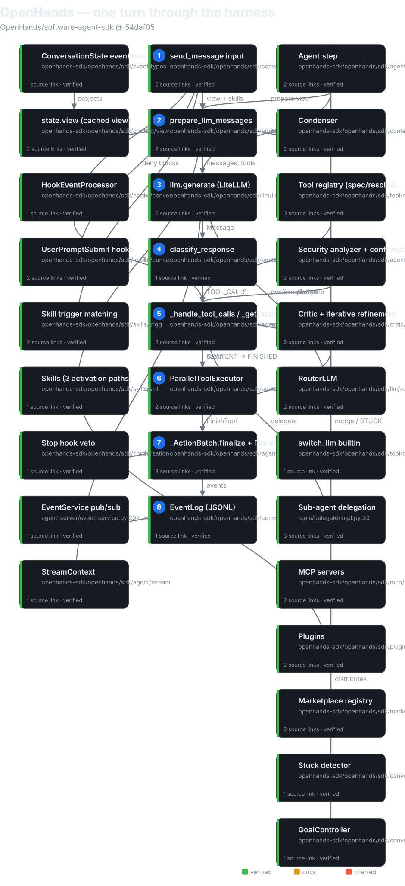

## The mental model

OpenHands is not a CLI with a loop bolted on. It is an **event-sourced agent
SDK**: everything that happens — user messages, tool calls, tool results,
errors, hook decisions, condensation, interrupts — is a typed event in a
persistent tree, and the model never sees the raw stream. It sees a cached,
incrementally maintained **view** with enforced invariants (observation
uniqueness, tool-call matching, batch atomicity).[^2] The loop itself is
almost boring: `LocalConversation._run` → `Agent.step` → classify the
response (tool calls? content? reasoning only? empty?) → run the tool batch
→ feed observations back → repeat until finished.[^3] All the interesting
machinery attaches to the *event stream*, not the loop: hooks are an
event-stream interceptor that wraps the `on_event` callback,[^4] the critic
scores events and can veto termination,[^5] the agent-server fans events
over pub/sub to REST and WebSocket clients.[^6]

The governing tradeoff: OpenHands buys uniformity at the cost of
indirection. One event type system serves the loop, the hooks, the
persistence layer, the streaming protocol, and the server fan-out — so
every subsystem speaks the same language, but nothing is a direct function
call and the "simple" path through the code always passes through the
stream. If you're building a harness, that's OpenHands' thesis in one
sentence: make the event log the substrate, and let the loop be dumb.

## Package map

The repo is a uv-workspace monorepo. Four Python packages matter:[^7]

| Package | Role | Size |
|---|---|---|
| `openhands-sdk` | The harness core: loop, events, conversation, LLM, tools, hooks, skills, security, context/condenser, MCP, critic, marketplace, extensions, automation | 303 files, ~77k lines |
| `openhands-tools` | Built-in tool implementations (`terminal`, `file_editor`, `delegate`, `browser_use`, …) | 93 files, ~17k lines |
| `openhands-workspace` | Workspace implementations (local/remote/git execution environments) | 14 files, ~3k lines |
| `openhands-agent-server` | Server runtime: REST/WebSocket API, conversation orchestration, event service, sandbox lifecycle | 89 files, ~33k lines |

Plus `clients/typescript/` — a browser-compatible client mirroring the
agent-server API. Line counts include blanks and comments; they are
order-of-magnitude, not precision instruments.

The dependency direction is enforced by design: the SDK never imports
`openhands-tools`. A `Tool` in the SDK is a *spec* — a wire contract with a
name and parameters — resolved to implementations at runtime through a
registry.[^8] The core can be embedded without dragging any tool
implementation along.

## The event bus and the view

This section is earned: the pi template's "core loop" section cannot hold
this material, because hooks, streaming, persistence, and the server
fan-out all attach to the event stream, not the loop.

There are five event types and nothing else:
`EventType = Literal["action", "observation", "message", "system_prompt", "agent_error"]`,
with sources `agent`, `user`, `environment`, or `hook`.[^9] Events form a
tree (`parent_id`, root sentinel `"__root__"`).[^10] The base class is
abstract; `LLMConvertibleEvent` marks the ones renderable into model
messages: `ActionEvent` (a tool call — payload, thought, reasoning, tool
name, call id, security risk, summary, critic result), `MessageEvent`,
`ObservationEvent` (a tool result; `UserRejectObservation` when the user or
a hook denied it; `AgentErrorEvent` when a tool raised), and
`SystemPromptEvent`.[^11] Everything else rides alongside but never reaches
the model: `Condensation` / `CondensationRequest` /
`CondensationSummaryEvent`, `ConversationStateUpdateEvent`,
`HookExecutionEvent`, `LLMCompletionLogEvent`, `StreamingDeltaEvent`,
`TokenEvent`, `InterruptEvent`, `PauseEvent`, `ACPToolCallEvent`.[^12]

Producers and consumers: the agent emits action/message/observation/error
events through the `on_event` callback (which persists and broadcasts);
tools produce observations; hooks produce `HookExecutionEvent`s; user
actions produce interrupts and pauses; the condenser produces condensation
events.[^13] The conversation's `state.view` incrementally maintains the
LLM-visible projection of that stream — a cached view object, not a
re-render, with a code comment referencing the design issue.[^14] View
*properties* enforce invariants on what the model is allowed to see:
observation uniqueness, tool-call matching, batch and tool-loop
atomicity.[^15]

Two consequences fall out of this design. First, **hooks are stream
interceptors, not loop gates.** `HookEventProcessor` wraps `on_event`, so a
hook sees every event as it flows and can act on it — `PreToolUse` fires
when an `ActionEvent` passes through; denying marks the action blocked in
state, and the batch executor partitions it out and emits a
`UserRejectObservation` with `rejection_source="hook"` instead of
executing.[^16] Second, **streaming is slot-minting.** `StreamContext`
mints event IDs for streamed items so clients can retire slots;
`StreamingDeltaEvent` carries the deltas; token IDs become `TokenEvent`s
when the provider returns them.[^17]

The tradeoff of event-sourcing everything: the log is the single source of
truth for the loop, the UI, the persistence layer, and the server — but the
event schema is the de-facto API contract, and every new event type is a
versioning decision. OpenHands chose the substrate pi only used for
rendering (pi's `AgentEvent` stream feeds the TUI; here it feeds the
*loop*), and paid for it in indirection.

## The core loop

Two functions, sync and async twins: `LocalConversation.run()` /
`arun()` drive `_run()` / `_arun()`, each a `while True:` loop holding the
conversation state lock.[^18] The loop body, quoted from `_run`
(`local_conversation.py:1917`):

```python
while True:
    with self._state:
        if self._state.execution_status in [PAUSED, STUCK]:
            break
        # Handle stop hooks on FINISHED
        if self._state.execution_status == FINISHED:
            if self._hook_processor is not None:
                should_stop, feedback = self._hook_processor.run_stop(
                    reason="agent_finished"
                )
                if not should_stop:
                    # ...inject feedback as an environment message...
                    self._state.execution_status = RUNNING
                    continue
            break
        if self._check_stuck_or_nudge():
            continue
        # ...clear WAITING_FOR_CONFIRMATION after user approval...
        try:
            self.agent.step(self, on_event=self._on_event, on_token=self._on_token)
        finally:
            ...
        iteration += 1
        if ... WAITING_FOR_CONFIRMATION: break
        if budget exceeded: emit MaxBudgetReached; break
        if iteration >= self.max_iteration_per_run:  # default 500
            emit ConversationErrorEvent(code="MaxIterationsReached"); break
```

Termination conditions, exhaustively: `FINISHED` (and the stop hooks allow
it — a Stop hook can deny and flip the status back to `RUNNING`, with a
documented race: clients must treat `FINISHED` as a hint, not a
guarantee),[^19] `PAUSED`, `STUCK`, `WAITING_FOR_CONFIRMATION`, budget
exceeded, `max_iteration_per_run` (default 500) → `MaxIterationsReached`,
or an error.[^20] Interrupts cancel the tracked run task; `asyncio`
cancellation propagates through the LLM stream into the agent step and out
to the loop, landing in `PAUSED` with an `InterruptEvent`.[^21]

`Agent.step()` (`agent.py:693`, async twin `astep` at 898) does one model
round-trip plus tool execution:[^22]

1. Pending (unconfirmed) actions execute first — confirmation mode queues
   actions and the next step runs them (`ConversationState.get_unmatched_actions`).
2. A hook-blocked user message (`UserPromptSubmit` deny) → `FINISHED`, skip.
3. `prepare_llm_messages(state.view, condenser, llm)` builds the model
   input from the cached view — never from the raw event list.[^23]
4. `Condensation` short-circuits; non-multimodal image handling.
5. `llm.generate(...)` with `add_security_risk_prediction=True` — the model
   is asked to self-label each action's security risk.[^24]
6. Malformed function call → user-role error `MessageEvent`, loop
   continues. Content-policy violation → deterministic nudge, loop
   continues. `LLMMalformedConversationHistoryError` → condensation
   recovery. `LLMContextWindowExceedError` → `CondensationRequest` event
   (if the condenser handles requests) else raise.[^25]

Response dispatch is a **pure function** — no side effects, no logging, no
mutation:[^26]

```python
def classify_response(message: Message) -> LLMResponseType:
    """Decision priority (first match wins):
      1. TOOL_CALLS  — message contains tool calls
      2. CONTENT     — message contains non-blank TextContent
      3. REASONING_ONLY — message has reasoning but no visible content
      4. EMPTY       — nothing useful
    """
```

`TOOL_CALLS` → `_handle_tool_calls`: each call is validated and normalized
(`_get_action_event`, `agent.py:1311`) — argument parsing, tool lookup,
Pydantic validation, security-risk extraction, critic evaluation — then the
confirmation gate (`_requires_user_confirmation`), then `_execute_actions`.
The async path runs each tool in its own thread via `run_in_executor` +
`asyncio.gather` (`parallel_executor.py`, bounded by
`tool_concurrency_limit`).[^27] `CONTENT` → `_handle_content_response`:
emit a `MessageEvent`, status `FINISHED` ("awaits user input").
`REASONING_ONLY` / `EMPTY` → emit plus a corrective nudge from
`source="environment"`.[^28]

Finish semantics live in `_ActionBatch.finalize` (`agent.py:380`): a
`FinishTool` action truncates the batch (later calls in the same batch are
discarded), and either the iterative-refinement check injects a followup
user message (keeping the loop going) or the status flips to
`FINISHED`.[^29]

Note the deliberate absence of a turn counter in the pi sense: OpenHands
*does* cap iterations (500 per run), unlike pi's trust-the-model design —
but the cap is generous and the budget is the tighter bound in practice.
The `GoalController` (`conversation/goal/controller.py:78`) is **not** the
main loop: it is the transport-agnostic brain of the `/goal` loop — after
each agent run, an LLM judge (`goal/judge.py`) scores completion and
returns `GoalContinue` (followup prompt) or `GoalDone` (complete/capped),
driven by sync `run_goal` or an async agent-server task.[^30]

## The critic and iterative refinement

This section is earned: none of the other five harnesses has a post-hoc
quality judge wired into termination, and it changes what "finish" means.

A critic scores the quality of the agent's work from its events (plus an
optional git patch) and returns a `CriticResult`:
`CriticBase.evaluate(events, git_patch)` (`critic/base.py:83`).[^31] Two
evaluation modes: `finish_and_message` (evaluate on `FinishAction` and
agent messages; the default) versus `all_actions` (every action; slow).
Implementations include `AgentFinishedCritic`, `EmptyPatchCritic`,
`PassCritic`, and an API critic with a rubric taxonomy
(`critic/impl/api/`).[^32] The critic also scores individual tool calls
during dispatch: `_get_action_event` calls `_evaluate_with_critic` when
`_should_evaluate_with_critic(action)` (`critic_mixin.py`), and the result
rides on the `ActionEvent` itself.[^33]

The loop integration is the interesting part. With `iterative_refinement`
configured, `_ActionBatch.finalize` calls `check_iterative_refinement`
after `FinishTool`: score below threshold → inject a followup prompt as a
user-role `MessageEvent` and keep the loop going *instead of* setting
`FINISHED`.[^34] Termination is no longer "the model said it's done" — it's
"the model said it's done *and the critic agrees*." The failure mode this
invites is obvious: a harsh critic and a compliant model can orbit each
other indefinitely, bounded only by the iteration cap and the budget. That
is the price of judging your own homework inside the loop.

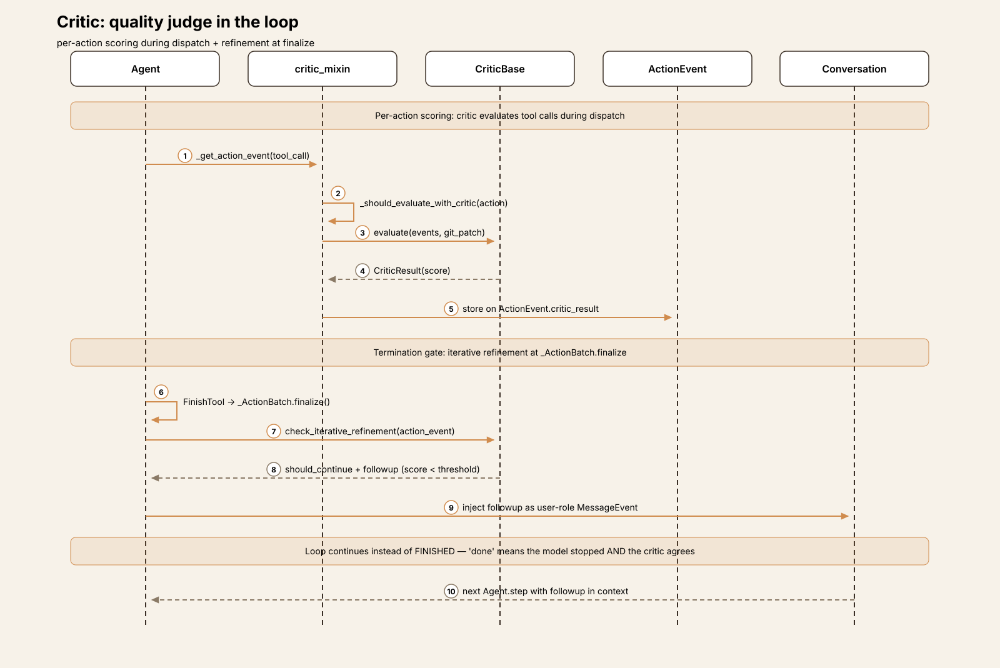

## One turn, end to end

Trace: the user sends `fix the failing test in tests/test_auth.py` to a
`LocalConversation`.

**① Input.** `LocalConversation.send_message()` (`local_conversation.py:1807`)
resets `FINISHED`/`STUCK` to `IDLE`, runs `UserPromptSubmit` hooks through
`HookEventProcessor.on_event` — a deny blocks the message entirely — then
matches skill triggers (`agent_context.get_user_message_suffix`; matched
names recorded in `state.activated_knowledge_skills`), and emits the user
`MessageEvent` before entering `run()`.[^35] A blocked message surfaces in
`_step` via `state.pop_blocked_message` → `FINISHED`, skipping processing:
the hook veto happens before the model is ever consulted.[^36]

**② Prompt assembly.** `prepare_llm_messages(state.view, condenser, llm)`
(`agent/utils.py:564`) builds the model input from the cached incremental
view — the raw event list is never serialized directly.[^37] The system
prompt carries `AgentContext._resolve_dynamic_data()` output, including the
`<available_skills>` block listing every AgentSkills-format skill (name,
description truncated to 1024 chars per the AgentSkills spec, location),
so the model knows what it can read on demand.[^38] Tool declarations come
from the registry: SDK builtins (`finish`, `think`, `switch_llm`,
`invoke_skill`, …) plus the default exec set (`terminal`, `file_editor`,
`task_tracker`), resolved to implementations at runtime.[^39]

**③ Model call.** `Agent._step` calls `llm.generate(messages, tools,
add_security_risk_prediction=True, on_token=stream.token_callback)`.
`LLM` is a frozen Pydantic model wrapping LiteLLM
(`litellm.completion`/`acompletion`); it dispatches between Chat
Completions and the Responses API per model (`uses_responses_api`).[^40]
The `add_security_risk_prediction` flag asks the model to self-label each
action's security risk — the first of three cooperating safety
mechanisms.[^41]

**④ Response parsing.** `classify_response` sees tool calls (say,
`terminal` to run pytest, `file_editor` to view the test) →
`TOOL_CALLS`.[^26] Had the model answered in prose, `CONTENT` would emit a
`MessageEvent` and finish the turn ("awaits user input"); reasoning-only or
empty responses get a corrective nudge from `source="environment"` and the
loop continues.[^28]

**⑤ Tool dispatch.** `_handle_tool_calls` runs each call through
`_get_action_event` (`agent.py:1311`): argument parsing →
`normalize_tool_call` (aliasing/terminal fallback) → tool lookup →
Pydantic validation → security-risk extraction → critic evaluation — then
emits the `ActionEvent` via `on_event`.[^42] As the event flows through
`HookEventProcessor`, `PreToolUse` hooks fire; a deny marks the action
blocked in state (`state.block_action(event.id, reason)`).[^43] Then the
confirmation gate: `_requires_user_confirmation` (`agent.py:1130`) checks
the `ConfirmationPolicy` (AlwaysConfirm / NeverConfirm /
ConfirmRisky(threshold)) against per-action risks from the
`SecurityAnalyzerBase` — `LLMSecurityAnalyzer`, `PolicyRailSecurityAnalyzer`
(deterministic rails), `EnsembleSecurityAnalyzer`, or the third-party
`GraySwanAnalyzer`.[^44] Without a configured analyzer, risk is always
`UNKNOWN` and the model's own `security_risk` label is ignored — the
self-label is advisory input to the analyzer, never a decision.[^45] If
confirmation is required, status becomes `WAITING_FOR_CONFIRMATION` and the
loop breaks awaiting the user; the next `run()` executes the pending
actions as implicit confirmation.[^46]

**⑥ Feedback.** `_execute_actions` → `_ActionBatch.prepare`: truncate the
batch at `FinishTool` (later calls discarded), partition out hook-blocked
actions (emitting `UserRejectObservation` with
`rejection_source="hook"`), and execute the rest through
`ParallelToolExecutor` bounded by `tool_concurrency_limit` — the async path
runs each tool in its own thread (`run_in_executor` + `asyncio.gather`).
`ObservationEvent`s are emitted in original call order even though
execution was parallel.[^47] A tool raising `ValueError` becomes an
`AgentErrorEvent` so the model can self-correct; malformed arguments get
`fix_malformed_tool_arguments` before validation fails.[^48]

**⑦ Termination.** Say the model then calls `finish`. `_ActionBatch.finalize`
(`agent.py:380`) runs the iterative-refinement check: if the critic scores
the work below threshold, a followup prompt is injected as a user-role
message and the loop continues; otherwise status flips to `FINISHED`.[^34]
Back in `_run`, the Stop hooks get their word — deny flips back to
`RUNNING` with the feedback injected as an environment message — and only
then does the loop break.[^19]

**⑧ Rendering.** Every event emitted through `on_event` fans out: the
`EventLog` appends it as JSONL under the conversation directory
(thread/process-safe, `conversation/event_store.py:34`),[^49] and in server
mode the `EventService` publishes it over pub/sub to REST/WebSocket
clients, with `StreamContext` minting event IDs so streaming slots can be
retired.[^50] There is no privileged renderer — the TUI, the web client,
and the TypeScript client all consume the same event stream.

The tradeoff visible across all eight steps: every stage is observable and
interceptable *because* it passes through the stream — but the stream is
also the only path, so a misbehaving hook or a slow event consumer sits in
line with the loop itself.

## Subsystem inventory

- **Tools.** `Tool` is a spec, not an implementation (`tool/spec.py:12`) —
  a wire contract persisted in settings and resolved to executors at
  runtime via `register_tool`/`resolve_tool` (`tool/registry.py`).[^8] SDK
  builtins: `finish`, `think`, `switch_llm`, `classify_and_switch_llm`,
  `invoke_skill`, `vision_inspect` (`tool/builtins/`).[^51] Default exec
  set: `terminal`, `file_editor`, `task_tracker` (`tool/defaults.py:27`),
  optional `browser_tool_set` (only when `enable_browser`), `task_tool_set`
  for delegation; `switch_llm` is always appended.[^52] Implementations
  live in `openhands-tools/`: terminal, file_editor (view/create/
  str_replace/insert/**undo_edit**), task_tracker, browser_use, glob, grep,
  apply_patch, delegate, task, workflow, ask_oracle, tom_consult, gemini,
  planning_file_editor, preset, utils.[^53] Each tool is a
  `ToolDefinition` with a Pydantic `action_type` and a `ToolExecutor`
  returning an `Observation`; `is_usable()` environment checks let the
  registry filter (`list_usable_tools`).[^54] The SDK never imports
  `openhands-tools` — dependency direction enforced by design.[^8]

- **Model providers.** `LLM` wraps LiteLLM with full model strings at the
  boundary (`openai/gpt-5.6`, `anthropic/...`, `bedrock/...`); LiteLLM's
  `get_llm_provider` parses the provider (`utils/litellm_provider.py`).[^55]
  Both Chat Completions and the Responses API are supported, dispatched
  per model (`llm.py:1673`).[^40] Non-native function calling is mixed in
  for models without tool support (`mixins/non_native_fc.py`); retries via
  tenacity (`RetryMixin`) with hard/idle timeouts inside the attempt; a
  full error taxonomy (`llm/exceptions/`: auth, rate limit, context
  window, content policy, malformed history).[^56] Compare Goose, whose
  provider trait requires only `stream()`: OpenHands' LLM is a far richer
  surface — generate/completion/responses, streaming, retries, routing,
  telemetry, metrics.[^57]

- **Security.** Three cooperating mechanisms, no OS sandbox in the SDK.
  (1) Per-action security risk: the model self-labels via
  `add_security_risk_prediction`, and a `SecurityAnalyzerBase`
  (`security/analyzer.py:15`) computes the authoritative risk — LLM judge,
  deterministic policy rails (`defense_in_depth/policy_rails.py`),
  ensemble, or GraySwan.[^44] (2) Confirmation policy: AlwaysConfirm /
  NeverConfirm / ConfirmRisky(threshold); `FinishAction`/`ThinkAction`
  alone never confirm.[^46] (3) Defense in depth: shell-semantics parsing,
  pattern rails, plus ToolShield MCP safety experiences.[^58] Execution
  happens in the workspace (local process) or remote workspaces; the
  agent-server provisions Docker runtimes (`agent_server/docker_runtime/`).
  Contrast Codex's Seatbelt/bubblewrap/Landlock/seccomp stack *in the
  loop* — OpenHands' sandbox story lives in deployment, not the
  harness.[^59]

- **Context and sessions.** `ConversationState` holds the events; the model
  sees the cached incremental view (`context/view/view.py`), never the raw
  list.[^37] Condensers (`context/condenser/`): `CondenserBase.condense(view,
  agent_llm) -> View | Condensation` with `LLMSummarizingCondenser`
  (rolling summary), `PipelineCondenser`, `NoOpCondenser` — triggered
  proactively (`handles_condensation_requests`) or reactively on
  `LLMContextWindowExceedError` / `LLMMalformedConversationHistoryError`
  via `CondensationRequest` events.[^60] Persistence is a thread/process-safe
  `EventLog`: per-event JSONL under the conversation directory
  (`conversation/event_store.py:34`); `FileStore` backends are local,
  memory, or cache (`io/`); the agent-server persists
  `meta.json`/`base_state.json`/events under `conversations/<id>/` and
  resumes from `base_state.json`.[^49] Stuck detection
  (`conversation/stuck_detector.py`): repeating action-observation loops,
  action-error streaks (one corrective nudge), monologues, alternating
  patterns → `STUCK`.[^61] Per-run cost budgets → `MaxBudgetReached`;
  `conversation.interrupt()` cancels the run task with `InterruptEvent` →
  `PAUSED`.[^62]

- **Sub-agents.** `DelegateAction`/`DelegateExecutor`
  (`openhands-tools/.../delegate/`) spawns full `LocalConversation`
  sub-conversations for `AgentDefinition`s loaded from markdown frontmatter
  (`sdk/subagent/schema.py:198`): own tools, skills, MCP config, hooks,
  condenser, confirmation policy, permission mode, max iterations and
  budget caps.[^63] `SubAgentScope` (`sdk/subagent/scope.py:25`) narrows
  the tool set per delegation; `task_tool_set` exposes this to the model;
  `TaskManager` tracks tasks with resume support.[^64] The agent-server
  registers definitions from the catalog
  (`conversation_service.py:_register_agent_definitions`).[^65]

- **ACP: the harness as host.** `ACPAgent` (`agent/acp_agent.py:1714`,
  ~4,700 lines) is an `AgentBase` subclass that delegates the *entire loop*
  to an external ACP server — Claude Code, Codex, Gemini CLI subprocesses.
  The SDK becomes host and adapter: this is how Agent Canvas runs
  third-party agents inside OpenHands conversations.[^66] It inverts the
  usual relationship (every other harness in this series *is* the loop;
  here the loop is a guest), and it is the clearest evidence of what
  "SDK, not app" means in practice.

- **Goal loop.** `GoalController` (`conversation/goal/controller.py:78`) is
  the transport-agnostic brain of the `/goal` loop: after each agent run, an
  LLM judge (`goal/judge.py`) scores completion and returns `GoalContinue`
  (followup prompt) or `GoalDone` (complete/capped), driven by sync
  `run_goal` (`goal/runner.py`) or an async agent-server task.[^30]

- **Automation.** The SDK side is observability context — tags and kwargs
  for automation-dispatched conversations
  (`automation/__init__.py:automation_conversation_kwargs`); scheduling
  and dispatch live in the separate `OpenHands/automation` repo.[^67] Goose
  has recipes-as-programs with a scheduler in the loop; OpenHands keeps
  scheduling out of the harness entirely.

## Extension points in depth

Each axis below is a complete starting kit: what the harness does, the
exact interaction sequence, and the first file to open. Diagrams use the
same numbering as the prose steps.

### 1. Skills (microagents' successor)

Microagents are legacy: `~/.openhands/microagents/` is scanned only as
"legacy support" and converted into `Skill` objects
(`skills/skill.py:_load_legacy_openhands_skill:448`).[^68] The successor is
**Skills** in two formats (`skill.py:178`): AgentSkills-format
(`SKILL.md`, agentskills.io spec) — always listed in `<available_skills>`
with progressive disclosure (the agent reads full content on demand), with
descriptions truncated to 1024 chars per the spec — and legacy OpenHands
format, which with triggers is listed and trigger-injected, without
triggers is fully inlined into `<REPO_CONTEXT>` and always active.[^69]
Three activation paths: (1) progressive disclosure via
`AgentContext._resolve_dynamic_data()` rendering `<available_skills>` into
the system-prompt suffix (`agent_context.py:360-454`); (2) trigger
injection — `send_message` matches `KeywordTrigger` / `TaskTrigger` /
`PathTrigger` (`skills/trigger.py:19/29/39`) against the user message and
appends content to the user `MessageEvent`, recording names in
`state.activated_knowledge_skills`; (3) model invocation via the
`invoke_skill` builtin tool, which renders content (executing inline
`!command`s via `skills/execute.py:render_content_with_commands`) and
returns an `InvokeSkillObservation` — unless `disable_model_invocation`
forces trigger-only activation.[^70] Skills load from `~/.agents/skills/`,
`~/.openhands/skills/`, the legacy microagents dir, repo `.openhands/skills/`
and `.agents/skills/`, installed skills, and plugin skills; repo skills can
bundle MCP servers and declare `allowed_tools` (pre-approved tools).[^71]

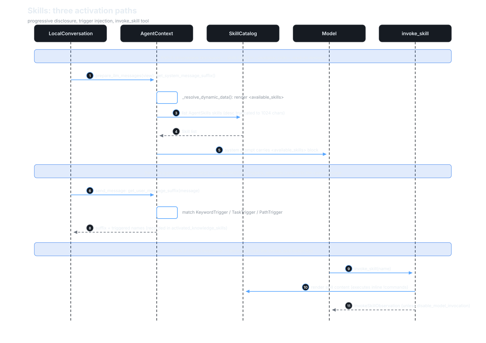

**Start here:** `skills/skill.py:Skill`, `skills/trigger.py`,
`context/agent_context.py:get_system_message_suffix`.

### 2. Hooks

Claude-Code-style lifecycle hooks configured in `hooks.json`/`HookConfig`,
with three executor kinds (`hooks/executor.py`): **command** (subprocess —
`HookEvent` JSON on stdin, JSON decision on stdout), **prompt** (LLM judge
hook, using the conversation's current LLM via getter so it survives
`switch_llm`), and **agent** (a full sub-conversation: fresh `Agent` +
`LocalConversation` with `hook_config=None` — no recursion — restricted
tools, its own system prompt; the final response is parsed as the
decision).[^72] Hook failures **fall open** (default `ALLOW`,
`executor.py:196-212`) — a crashed judge never blocks the loop.[^73] Six
event types (`hooks/types.py:12-17`): `PreToolUse`, `PostToolUse`,
`UserPromptSubmit`, `SessionStart`, `SessionEnd`, `Stop`; decisions are
allow/deny with exit-code semantics (`HookResult.should_continue`).[^74]
`HookEventProcessor` (`hooks/conversation_hooks.py:50`) wraps `on_event`,
so hooks intercept the stream: `PreToolUse` deny marks the action blocked
and the batch emits `UserRejectObservation(rejection_source="hook")`;
`PostToolUse` never blocks; `UserPromptSubmit` deny blocks the message
(and can inject `additional_context`); `Stop` deny flips `FINISHED` back
to `RUNNING`.[^75] Async hooks in `PreToolUse` cannot block (warn +
background).[^76] `HookMatcher` matches per event type with optional
tool-name patterns (`config.py:121`).[^77]

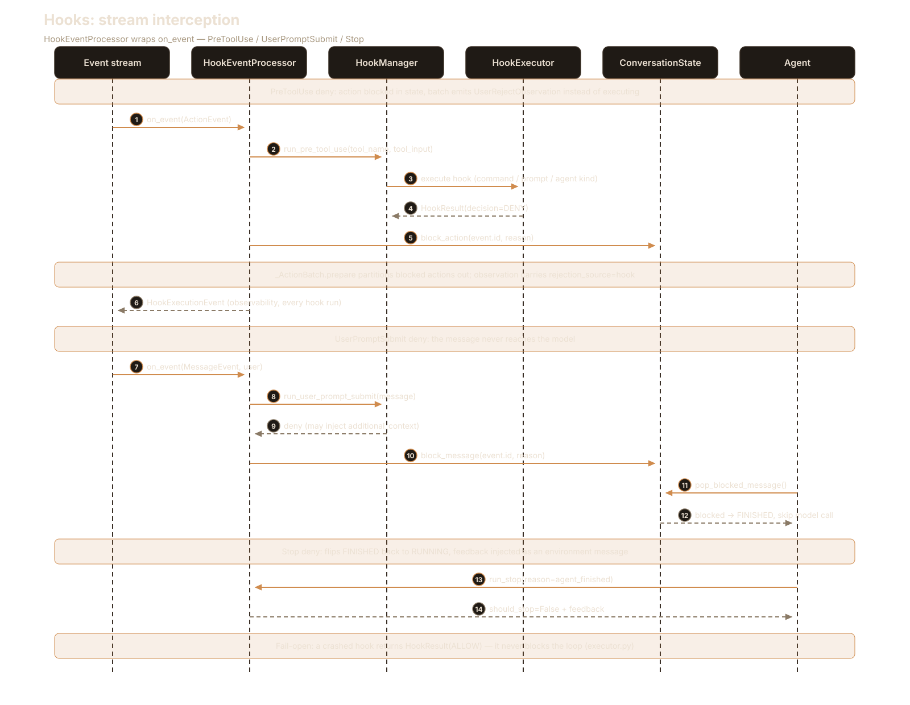

**Start here:** `hooks/manager.py:HookManager`,
`hooks/conversation_hooks.py:50`, `hooks/config.py:HookDefinition`.

### 3. Plugins

Claude-Code-compatible bundles: skills + hooks + MCP servers + agents +
slash commands in one package (`plugin/plugin.py:36`).[^78] Commands
become keyword-triggered skills (`plugin.py:get_all_skills:104`) — there
is no standalone slash-command dispatcher anywhere in the SDK; `/goal` is
a loop driver, not a command registry (verified by absence: `commands/`
dirs exist only inside plugins).[^79]

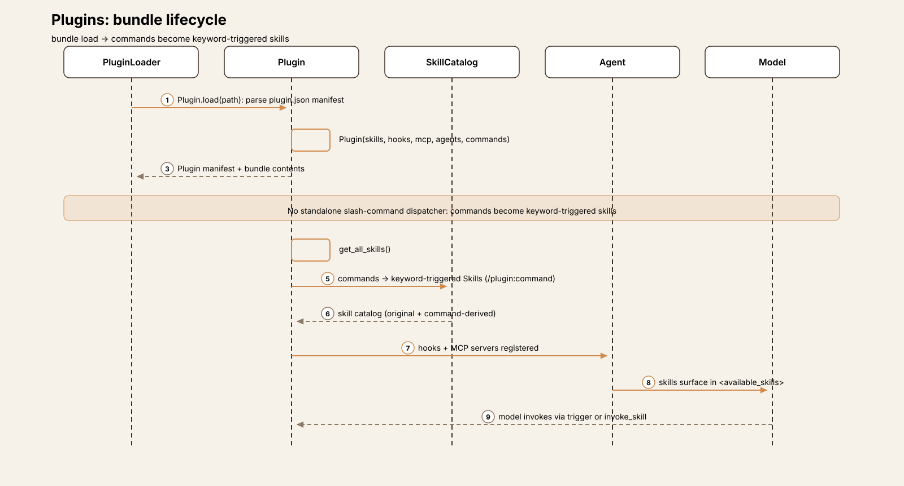

**Start here:** `plugin/plugin.py:Plugin`, `plugin/loader.py`.

### 4. MCP servers

The SDK owns a flat server map (`mcp/config.py:MCPServer:497`); FastMCP is
built only at the FastMCP boundary (`mcp/utils.py:_prepare_mcp_config`).[^80]
`MCPClient` (async) bridges sync/async callers. Servers are configured
directly, declared by skills (repo skills only), or bundled in plugins;
`.mcp.json`'s `{"mcpServers": …}` wrapper is unwrapped at the v4→v5
migration boundary.[^81]

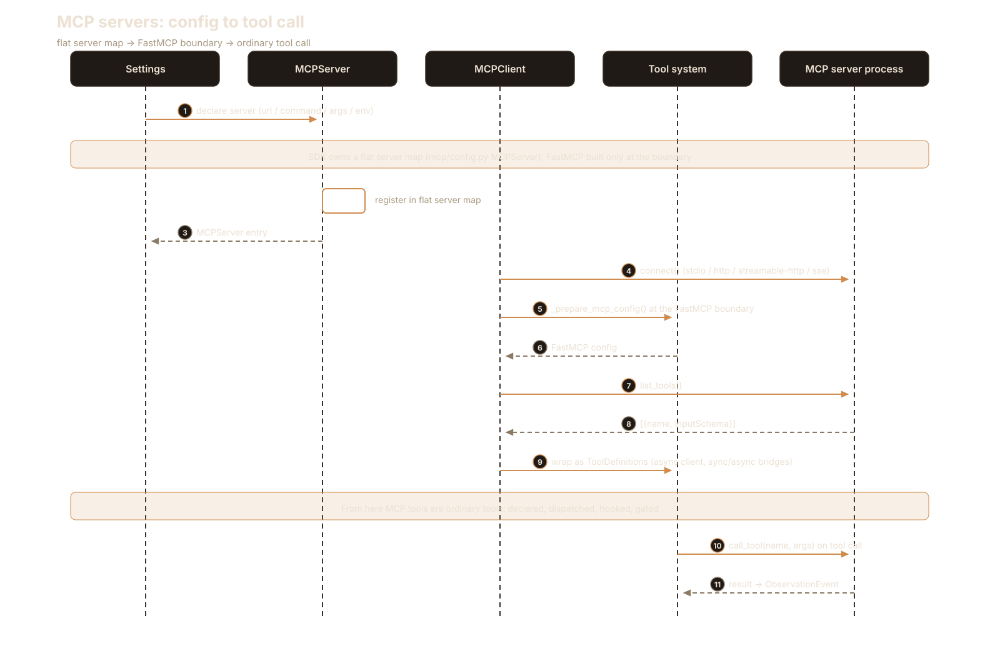

**Start here:** `mcp/config.py:MCPServer`, `mcp/client.py:MCPClient`.

### 5. Sub-agent definitions

Markdown frontmatter defining whole agents: own tools, skills, MCP
config, hooks, condenser, confirmation policy, permission mode, max
iterations and budget caps (`subagent/schema.py:AgentDefinition:198`).[^63]
Delegation goes through `DelegateExecutor`, which spawns full
`LocalConversation` sub-conversations; `SubAgentScope`
(`subagent/scope.py:25`) narrows the tool set per delegation; the
`task_tool_set` exposes delegation to the model; `TaskManager` tracks tasks
with resume.[^64]

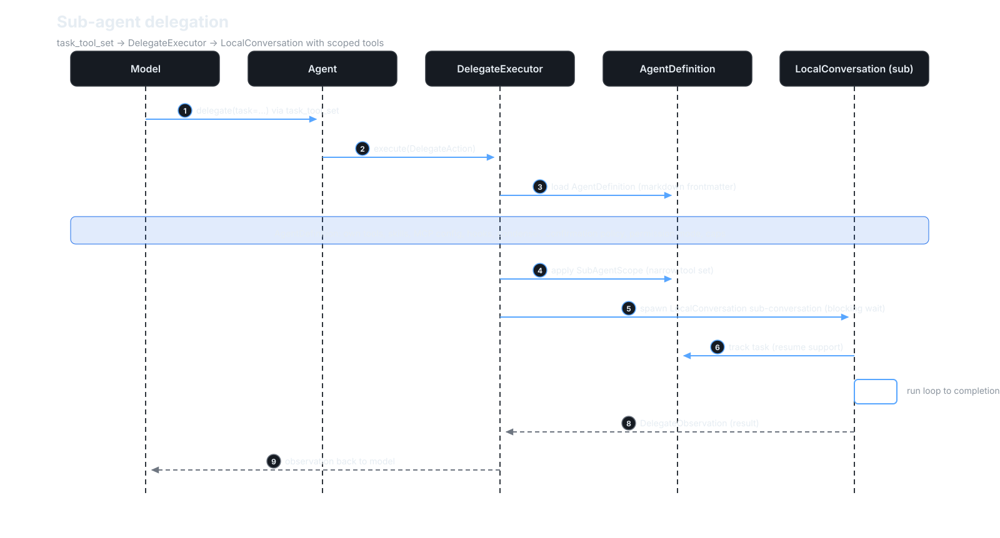

**Start here:** `subagent/schema.py:AgentDefinition`,
`openhands-tools/.../delegate/impl.py:DelegateExecutor`.

### 6. Marketplace

A registry of plugin marketplaces with resolution and prefetch
(`marketplace/registry.py:MarketplaceRegistry:79`) — the distribution
layer for plugin bundles.[^82]

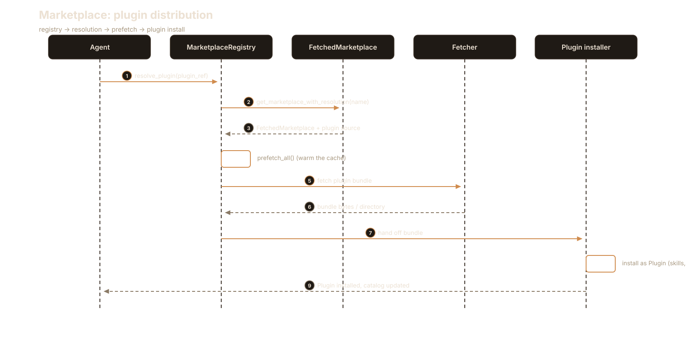

**Start here:** `marketplace/registry.py:MarketplaceRegistry`.

### 7. Extensions installation

Fetch from local, git, or GitHub sources
(`extensions/fetch.py:parse_extension_source`), then the
install/enable/disable/update lifecycle with a metadata session
(`extensions/installation/manager.py:InstallationManager:29`).[^83]

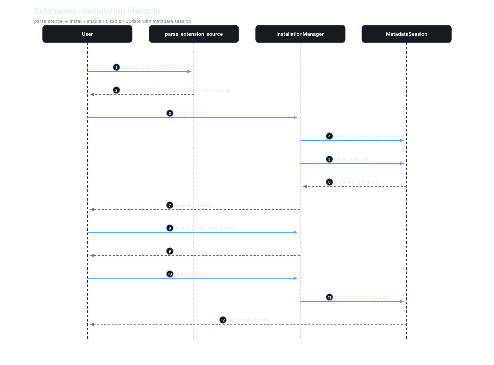

**Start here:** `extensions/installation/manager.py:InstallationManager`.

### 8. Automation

The SDK side is deliberately thin: observability context — tags and kwargs
for automation-dispatched conversations
(`automation/__init__.py:automation_conversation_kwargs:126`).[^67]
Scheduling and dispatch live in the separate `OpenHands/automation` repo.
If you come from Goose's recipes, recalibrate: OpenHands keeps the
scheduler out of the harness.

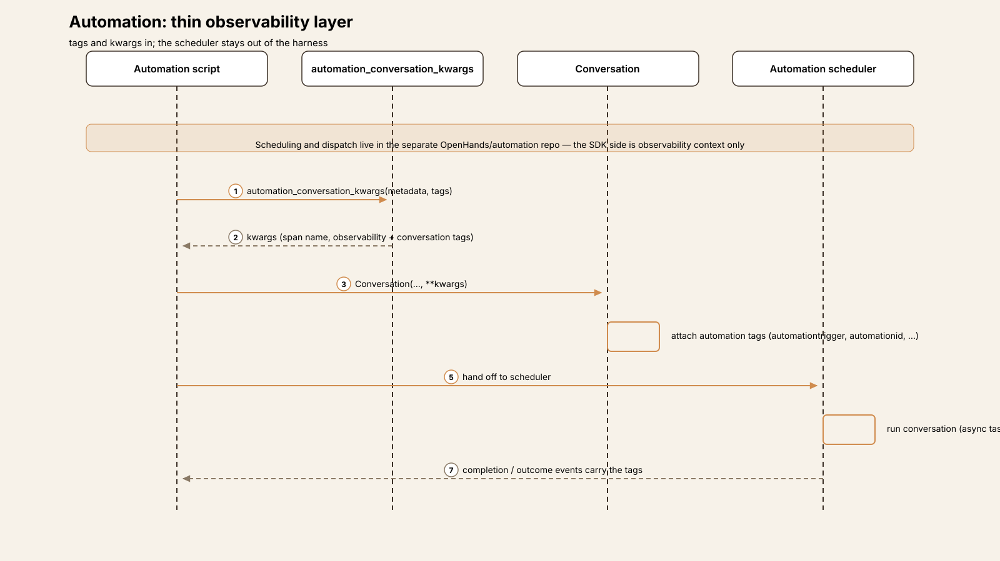

**Start here:** `sdk/automation/__init__.py`.

### 9. Critic

Pluggable quality scoring wired into loop termination — see [The critic
and iterative refinement](#the-critic-and-iterative-refinement) above.
`CriticBase.evaluate(events, git_patch) -> CriticResult`
(`critic/base.py:83`); per-action scoring during dispatch via
`critic_mixin.py`; refinement injected at `_ActionBatch.finalize`.[^31][^33][^34]


**Start here:** `critic/base.py:CriticBase`.

### 10. Condenser

Pluggable context compaction: `CondenserBase.condense(view, agent_llm) ->
View | Condensation` (`context/condenser/base.py:16`) —
`LLMSummarizingCondenser` (rolling summary), `PipelineCondenser`,
`NoOpCondenser` — triggered proactively (`handles_condensation_requests`)
or reactively on context-window/malformed-history errors via
`CondensationRequest` events.[^60]

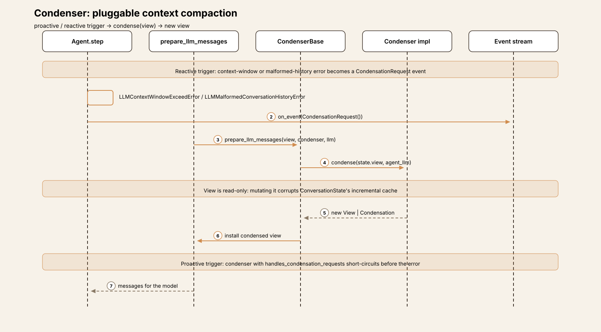

**Start here:** `context/condenser/base.py:CondenserBase`.

### 11. LLM router

`RouterLLM` (`llm/router/base.py:28`) subclasses `LLM`, holds
`llms_for_routing: dict[str, LLM]`, and per completion `select_llm(messages)`
picks the active model and delegates (`__getattr__` falls back to the
first).[^84] Implementations: `MultimodalRouter` (image-bearing turns go to
a vision-capable model), `RandomRouter`. Route-aware runtime metadata feeds
the condenser's token thresholds.[^85] Alongside it, the `switch_llm` /
`classify_and_switch_llm` builtin tools let the *agent* swap its own model
mid-run — routing by policy, switching by agency.[^86]

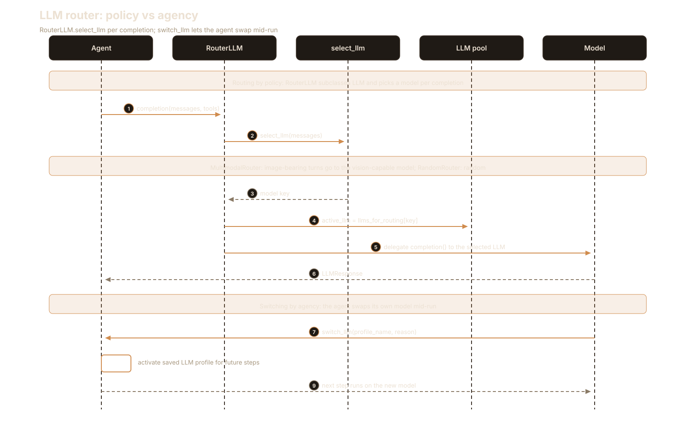

**Start here:** `llm/router/base.py:RouterLLM`.

### 12. Agent server and ACP

The agent-server is the deployment substrate: REST/WebSocket API,
conversation orchestration, `EventService` pub/sub fan-out, leases,
Docker runtime provisioning (`openhands-agent-server/`).[^6] `ACPAgent`
(`agent/acp_agent.py:1714`, ~4,700 lines) inverts the harness: it hosts an
external ACP server (Claude Code, Codex, Gemini CLI) *as* the loop, with
the SDK as adapter.[^66]

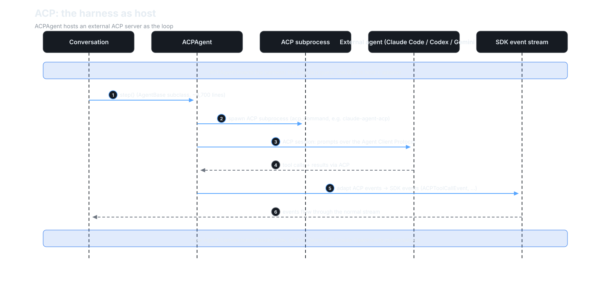

**Start here:** `agent_server/event_service.py:EventService`,
`agent/acp_agent.py:1714`.

## Deliberate omissions

OpenHands ships no git-level safety net — no auto-commit, no stash, no
session undo. The `git` module is read-only helpers plus cached clones
for extensions; the only undo anywhere is per-file `undo_edit` in the
file editor (verified: every `commit|undo|stash` hit in `sdk/git/*.py` is
a read-only history helper or a checkout/reset on a cached extension
clone, never the user's workspace).[^87]
Contrast Aider, whose git auto-commit plus `/undo` is the safety model.
There is no OS sandbox in the loop — no Seatbelt, no seccomp, no
bubblewrap, no Landlock (grep over `openhands-sdk/` and `openhands-tools/`
returns zero hits);[^88] sandboxing is a deployment concern handled by the
agent-server's Docker runtimes. Contrast Codex, whose four-layer sandbox
stack sits inside the harness. There is no standalone slash-command
dispatcher, no recipes-as-programs (Goose), no repo-map (Aider), no
proto-bus bridge (Cline) — though ACP host mode is arguably the bridge's
inverse: instead of embedding the harness in the IDE, the harness embeds
*other harnesses*.

Read the omissions as the SDK thesis: OpenHands is infrastructure for
building agents, not an agent product with opinions. Safety nets, sandboxes,
and schedulers are the deployer's job — the SDK gives you the stream, the
hooks, and the confirmation policy to build them with.

## Comparison matrix row

| # | Dimension | OpenHands (v1.53.0) |
|---|---|---|
| 1 | Agent loop | Event-sourced; `LocalConversation._run` → `Agent.step` → pure `classify_response`; `max_iteration_per_run` 500; stop hooks can veto FINISHED [^18][^19][^20][^26] |
| 2 | Tool system | Spec/registry split; SDK never imports `openhands-tools`; Pydantic validation; parallel batches in original order [^8][^47][^54] |
| 3 | Model providers | LiteLLM; Chat Completions + Responses API; per-completion `RouterLLM`; agent self-swaps via `switch_llm` [^40][^55][^84][^86] |
| 4 | Prompt construction | Cached incremental view with enforced invariants; `<available_skills>` progressive disclosure [^37][^38][^15] |
| 5 | Memory/session | JSONL `EventLog` per event; pluggable condensers; server `base_state.json` resume; no cross-session recall [^49][^60] |
| 6 | Reasoning/planning | Critic + iterative refinement gates termination; `/goal` LLM judge loop; sub-agent frontmatter defs [^34][^30][^63] |
| 7 | Extensibility | Skills, 3-kind hooks, plugins, MCP, sub-agents, marketplace, extensions, condenser, router, critic — 12 axes [^70][^72][^78] |
| 8 | Interfaces | SDK / agent-server REST+WS / ACP host mode / TS client; all consume the event stream [^6][^66] |
| 9 | Failure handling | Tenacity retries; condensation recovery; stuck detector; corrective nudges; hook fail-open [^56][^60][^61][^73] |
| 10 | Security model | Risk labels + confirmation policy + defense-in-depth rails; no OS sandbox in the loop [^44][^58][^88] |

## Endnotes

All notes are VERIFIED against `v1.53.0`
(`54daf056bd863bb46f922a2fe9324dd736b37ff6`) unless marked DOCS; line
anchors and file paths re-checked on 2026-10-07.
`GH` = `https://github.com/OpenHands/software-agent-sdk/blob/54daf056bd863bb46f922a2fe9324dd736b37ff6/`.

[^1]: Scope correction, VERIFIED via GitHub API 2026-10-05:
    `OpenHands/OpenHands` at tag `v1.24.0` resolves to the same SHA
    (`7dc6805406ea3c76cb4a3ce407c3c72d481b0ac6`) as `All-Hands-AI/OpenHands`
    (org rename), and its README describes "Agent Canvas — the self-hosted
    developer control center for coding agents and automations. Run
    OpenHands, Claude Code, Codex, Gemini, or any ACP-compatible agent."
    The agent harness under analysis is `OpenHands/software-agent-sdk`
    ("A clean, modular SDK for building AI agents with OpenHands V1"),
    tag `v1.53.0`, released 2026-10-05.
[^2]: `ConversationState` holds events; the model input comes from a cached,
    incrementally maintained view — see
    [GH…/sdk/context/view/view.py](https://github.com/OpenHands/software-agent-sdk/blob/54daf056bd863bb46f922a2fe9324dd736b37ff6/openhands-sdk/openhands/sdk/context/view/view.py)
    and `prepare_llm_messages(state.view, condenser, llm)` in
    [GH…/sdk/agent/utils.py#L564](https://github.com/OpenHands/software-agent-sdk/blob/54daf056bd863bb46f922a2fe9324dd736b37ff6/openhands-sdk/openhands/sdk/agent/utils.py#L564).
[^3]: Loop: `LocalConversation._run`
    ([GH…/conversation/impl/local_conversation.py#L1917](https://github.com/OpenHands/software-agent-sdk/blob/54daf056bd863bb46f922a2fe9324dd736b37ff6/openhands-sdk/openhands/sdk/conversation/impl/local_conversation.py#L1917),
    `while True:` at L1935) → `Agent.step`
    ([GH…/sdk/agent/agent.py#L693](https://github.com/OpenHands/software-agent-sdk/blob/54daf056bd863bb46f922a2fe9324dd736b37ff6/openhands-sdk/openhands/sdk/agent/agent.py#L693))
    → `classify_response`
    ([GH…/sdk/agent/response_dispatch.py#L54](https://github.com/OpenHands/software-agent-sdk/blob/54daf056bd863bb46f922a2fe9324dd736b37ff6/openhands-sdk/openhands/sdk/agent/response_dispatch.py#L54)).
[^4]: `HookEventProcessor`
    ([GH…/sdk/hooks/conversation_hooks.py#L50](https://github.com/OpenHands/software-agent-sdk/blob/54daf056bd863bb46f922a2fe9324dd736b37ff6/openhands-sdk/openhands/sdk/hooks/conversation_hooks.py#L50))
    wraps the `on_event` callback; hooks are an event-stream interceptor.
[^5]: `CriticBase.evaluate(events, git_patch) -> CriticResult`
    ([GH…/sdk/critic/base.py#L83](https://github.com/OpenHands/software-agent-sdk/blob/54daf056bd863bb46f922a2fe9324dd736b37ff6/openhands-sdk/openhands/sdk/critic/base.py#L83));
    iterative refinement at
    [GH…/sdk/agent/agent.py#L399](https://github.com/OpenHands/software-agent-sdk/blob/54daf056bd863bb46f922a2fe9324dd736b37ff6/openhands-sdk/openhands/sdk/agent/agent.py#L399)
    and L647-L648.
[^6]: Agent-server: REST/WebSocket API, conversation orchestration, event
    service with pub/sub fan-out, leases, Docker runtime provisioning — see
    `openhands-agent-server/`
    ([GH… tree](https://github.com/OpenHands/software-agent-sdk/tree/54daf056bd863bb46f922a2fe9324dd736b37ff6/openhands-agent-server)),
    `EventService` in
    [GH…/event_service.py](https://github.com/OpenHands/software-agent-sdk/blob/54daf056bd863bb46f922a2fe9324dd736b37ff6/openhands-agent-server/openhands/agent_server/event_service.py).
[^7]: Monorepo layout and per-package sizes (Python lines incl.
    blanks/comments, measured 2026-10-05 at the pinned SHA):
    `openhands-sdk/` 303 files / ~77k lines, `openhands-tools/` 93 /
    ~17k, `openhands-workspace/` 14 / ~3k, `openhands-agent-server/` 89 /
    ~33k.
[^8]: `Tool` as a wire-contract spec:
    [GH…/sdk/tool/spec.py#L12](https://github.com/OpenHands/software-agent-sdk/blob/54daf056bd863bb46f922a2fe9324dd736b37ff6/openhands-sdk/openhands/sdk/tool/spec.py#L12)
    (`class Tool(BaseModel)`); runtime resolution via
    [GH…/sdk/tool/registry.py](https://github.com/OpenHands/software-agent-sdk/blob/54daf056bd863bb46f922a2fe9324dd736b37ff6/openhands-sdk/openhands/sdk/tool/registry.py)
    (`register_tool`, `resolve_tool`); the SDK package never imports
    `openhands-tools` (dependency direction enforced by design, per the
    `tool/defaults.py` docstring).
[^9]: `EventType`
    ([GH…/sdk/event/types.py#L4](https://github.com/OpenHands/software-agent-sdk/blob/54daf056bd863bb46f922a2fe9324dd736b37ff6/openhands-sdk/openhands/sdk/event/types.py#L4));
    `SourceType` at
    [L8](https://github.com/OpenHands/software-agent-sdk/blob/54daf056bd863bb46f922a2fe9324dd736b37ff6/openhands-sdk/openhands/sdk/event/types.py#L8).
[^10]: Event tree: `parent_id`, `ROOT_PARENT_ID = "__root__"`
    ([GH…/sdk/event/types.py#L10](https://github.com/OpenHands/software-agent-sdk/blob/54daf056bd863bb46f922a2fe9324dd736b37ff6/openhands-sdk/openhands/sdk/event/types.py#L10)).
[^11]: `Event` base
    ([GH…/sdk/event/base.py#L20](https://github.com/OpenHands/software-agent-sdk/blob/54daf056bd863bb46f922a2fe9324dd736b37ff6/openhands-sdk/openhands/sdk/event/base.py#L20));
    `LLMConvertibleEvent` at
    [L75](https://github.com/OpenHands/software-agent-sdk/blob/54daf056bd863bb46f922a2fe9324dd736b37ff6/openhands-sdk/openhands/sdk/event/base.py#L75);
    `ActionEvent`
    ([GH…/llm_convertible/action.py#L24](https://github.com/OpenHands/software-agent-sdk/blob/54daf056bd863bb46f922a2fe9324dd736b37ff6/openhands-sdk/openhands/sdk/event/llm_convertible/action.py#L24),
    fields include `security_risk` and `critic_result`);
    `MessageEvent`
    ([GH…/llm_convertible/message.py#L25](https://github.com/OpenHands/software-agent-sdk/blob/54daf056bd863bb46f922a2fe9324dd736b37ff6/openhands-sdk/openhands/sdk/event/llm_convertible/message.py#L25));
    `ObservationBaseEvent` / `ObservationEvent`
    ([GH…/llm_convertible/observation.py#L17](https://github.com/OpenHands/software-agent-sdk/blob/54daf056bd863bb46f922a2fe9324dd736b37ff6/openhands-sdk/openhands/sdk/event/llm_convertible/observation.py#L17)
    / [L32](https://github.com/OpenHands/software-agent-sdk/blob/54daf056bd863bb46f922a2fe9324dd736b37ff6/openhands-sdk/openhands/sdk/event/llm_convertible/observation.py#L32)),
    `UserRejectObservation` at L86, `AgentErrorEvent` at L138;
    `SystemPromptEvent`
    ([GH…/llm_convertible/system.py#L12](https://github.com/OpenHands/software-agent-sdk/blob/54daf056bd863bb46f922a2fe9324dd736b37ff6/openhands-sdk/openhands/sdk/event/llm_convertible/system.py#L12)).
[^12]: Non-LLM events: `Condensation` / `CondensationRequest` /
    `CondensationSummaryEvent`
    ([GH…/sdk/event/condenser.py](https://github.com/OpenHands/software-agent-sdk/blob/54daf056bd863bb46f922a2fe9324dd736b37ff6/openhands-sdk/openhands/sdk/event/condenser.py));
    `ConversationStateUpdateEvent`
    ([GH…/sdk/event/conversation_state.py](https://github.com/OpenHands/software-agent-sdk/blob/54daf056bd863bb46f922a2fe9324dd736b37ff6/openhands-sdk/openhands/sdk/event/conversation_state.py));
    `HookExecutionEvent`
    ([GH…/sdk/event/hook_execution.py](https://github.com/OpenHands/software-agent-sdk/blob/54daf056bd863bb46f922a2fe9324dd736b37ff6/openhands-sdk/openhands/sdk/event/hook_execution.py));
    `LLMCompletionLogEvent`, `StreamingDeltaEvent`
    ([GH…/sdk/event/streaming_delta.py](https://github.com/OpenHands/software-agent-sdk/blob/54daf056bd863bb46f922a2fe9324dd736b37ff6/openhands-sdk/openhands/sdk/event/streaming_delta.py)),
    `TokenEvent`
    ([GH…/sdk/event/token.py](https://github.com/OpenHands/software-agent-sdk/blob/54daf056bd863bb46f922a2fe9324dd736b37ff6/openhands-sdk/openhands/sdk/event/token.py)),
    `InterruptEvent` / `PauseEvent`
    ([GH…/sdk/event/user_action.py](https://github.com/OpenHands/software-agent-sdk/blob/54daf056bd863bb46f922a2fe9324dd736b37ff6/openhands-sdk/openhands/sdk/event/user_action.py)),
    `ACPToolCallEvent`
    ([GH…/sdk/event/acp_tool_call.py](https://github.com/OpenHands/software-agent-sdk/blob/54daf056bd863bb46f922a2fe9324dd736b37ff6/openhands-sdk/openhands/sdk/event/acp_tool_call.py)).
[^13]: Producers: agent emits via `on_event`; tools produce observations;
    hooks produce `HookExecutionEvent`s; user actions produce
    interrupt/pause; the condenser produces condensation events — see the
    trace in `Agent._step`
    ([GH…/sdk/agent/agent.py#L706](https://github.com/OpenHands/software-agent-sdk/blob/54daf056bd863bb46f922a2fe9324dd736b37ff6/openhands-sdk/openhands/sdk/agent/agent.py#L706))
    and `LocalConversation._on_event`.
[^14]: Cached incremental view: `prepare_llm_messages(state.view, condenser,
    llm)` at
    [GH…/sdk/agent/utils.py#L564](https://github.com/OpenHands/software-agent-sdk/blob/54daf056bd863bb46f922a2fe9324dd736b37ff6/openhands-sdk/openhands/sdk/agent/utils.py#L564)
    (overloads L573/L581); design comment referencing issue #3053 in the
    view code.
[^15]: View invariants: observation uniqueness, tool-call matching,
    batch/tool-loop atomicity — enforced by view properties in
    [GH…/sdk/context/view/properties/](https://github.com/OpenHands/software-agent-sdk/tree/54daf056bd863bb46f922a2fe9324dd736b37ff6/openhands-sdk/openhands/sdk/context/view/properties).
[^16]: PreToolUse interception: deny marks the action blocked via
    `state.block_action(event.id, reason)`; `_ActionBatch.prepare`
    partitions it out and emits `UserRejectObservation` with
    `rejection_source="hook"` instead of executing — see
    [GH…/sdk/hooks/conversation_hooks.py#L50](https://github.com/OpenHands/software-agent-sdk/blob/54daf056bd863bb46f922a2fe9324dd736b37ff6/openhands-sdk/openhands/sdk/hooks/conversation_hooks.py#L50)
    and `_ActionBatch` in
    [GH…/sdk/agent/agent.py#L380](https://github.com/OpenHands/software-agent-sdk/blob/54daf056bd863bb46f922a2fe9324dd736b37ff6/openhands-sdk/openhands/sdk/agent/agent.py#L380).
[^17]: `StreamContext`
    ([GH…/sdk/agent/stream_context.py](https://github.com/OpenHands/software-agent-sdk/blob/54daf056bd863bb46f922a2fe9324dd736b37ff6/openhands-sdk/openhands/sdk/agent/stream_context.py))
    mints event IDs for streamed items; `_maybe_emit_vllm_tokens` emits
    `TokenEvent` when the provider returns token IDs (`return_token_ids`
    in litellm_extra_body).
[^18]: `LocalConversation.run` / `arun`
    ([GH…/conversation/impl/local_conversation.py#L1902](https://github.com/OpenHands/software-agent-sdk/blob/54daf056bd863bb46f922a2fe9324dd736b37ff6/openhands-sdk/openhands/sdk/conversation/impl/local_conversation.py#L1902)
    / [L2093](https://github.com/OpenHands/software-agent-sdk/blob/54daf056bd863bb46f922a2fe9324dd736b37ff6/openhands-sdk/openhands/sdk/conversation/impl/local_conversation.py#L2093));
    `_run` / `_arun` at
    [L1917](https://github.com/OpenHands/software-agent-sdk/blob/54daf056bd863bb46f922a2fe9324dd736b37ff6/openhands-sdk/openhands/sdk/conversation/impl/local_conversation.py#L1917)
    / L2114; `while True:` at L1935 / L2157.
[^19]: Stop-hook veto on FINISHED:
    [GH…/local_conversation.py#L1952-L1975](https://github.com/OpenHands/software-agent-sdk/blob/54daf056bd863bb46f922a2fe9324dd736b37ff6/openhands-sdk/openhands/sdk/conversation/impl/local_conversation.py#L1952-L1975)
    (deny → `logger.info("Stop hook denied agent stopping")`, feedback
    injected as environment message with `ACP_STOP_HOOK_FEEDBACK_PREFIX`,
    status flipped back to RUNNING); documented WS-FINISHED race in the
    repo AGENTS.md: clients must treat FINISHED as a hint.
[^20]: Termination conditions: PAUSED/STUCK break at
    [GH…/local_conversation.py#L1938-L1943](https://github.com/OpenHands/software-agent-sdk/blob/54daf056bd863bb46f922a2fe9324dd736b37ff6/openhands-sdk/openhands/sdk/conversation/impl/local_conversation.py#L1938-L1943);
    WAITING_FOR_CONFIRMATION break at L2011-L2016; budget
    (`_budget_exceeded_detail` → `MaxBudgetReached`) at L2018-L2023;
    `max_iteration_per_run` (default 500 at L219) →
    `ConversationErrorEvent(code="MaxIterationsReached")` at L2024-L2045.
[^21]: `conversation.interrupt()` cancels the tracked `_arun_task`;
    `asyncio.CancelledError` propagates through the LLM stream → agent
    step → loop; status → PAUSED with `InterruptEvent` (policy text in
    repo AGENTS.md).
[^22]: `Agent.step` / `astep`
    ([GH…/sdk/agent/agent.py#L693](https://github.com/OpenHands/software-agent-sdk/blob/54daf056bd863bb46f922a2fe9324dd736b37ff6/openhands-sdk/openhands/sdk/agent/agent.py#L693)
    / [L898](https://github.com/OpenHands/software-agent-sdk/blob/54daf056bd863bb46f922a2fe9324dd736b37ff6/openhands-sdk/openhands/sdk/agent/agent.py#L898));
    internal `_step` at L706.
[^23]: `prepare_llm_messages(state.view, condenser, llm)`
    ([GH…/sdk/agent/utils.py#L564](https://github.com/OpenHands/software-agent-sdk/blob/54daf056bd863bb46f922a2fe9324dd736b37ff6/openhands-sdk/openhands/sdk/agent/utils.py#L564)).
[^24]: `llm.generate(..., add_security_risk_prediction=True)` in
    `Agent._step`
    ([GH…/sdk/agent/agent.py#L706](https://github.com/OpenHands/software-agent-sdk/blob/54daf056bd863bb46f922a2fe9324dd736b37ff6/openhands-sdk/openhands/sdk/agent/agent.py#L706)).
[^25]: Error paths in `_step`: malformed function call → user-role error
    `MessageEvent`; content-policy violation → deterministic nudge;
    `LLMMalformedConversationHistoryError` → condensation recovery;
    `LLMContextWindowExceedError` → `CondensationRequest` event (if the
    condenser handles requests) else raise.
[^26]: `classify_response` — pure function, decision priority TOOL_CALLS >
    CONTENT > REASONING_ONLY > EMPTY:
    [GH…/sdk/agent/response_dispatch.py#L54](https://github.com/OpenHands/software-agent-sdk/blob/54daf056bd863bb46f922a2fe9324dd736b37ff6/openhands-sdk/openhands/sdk/agent/response_dispatch.py#L54)
    (priority documented L54-L66; "pure: no side effects, no logging, no
    mutation").
[^27]: `_handle_tool_calls` → per-call `_get_action_event`
    ([GH…/sdk/agent/agent.py#L1311](https://github.com/OpenHands/software-agent-sdk/blob/54daf056bd863bb46f922a2fe9324dd736b37ff6/openhands-sdk/openhands/sdk/agent/agent.py#L1311));
    parallel execution via `ParallelToolExecutor`
    ([GH…/sdk/agent/parallel_executor.py](https://github.com/OpenHands/software-agent-sdk/blob/54daf056bd863bb46f922a2fe9324dd736b37ff6/openhands-sdk/openhands/sdk/agent/parallel_executor.py),
    `tool_concurrency_limit`); async path runs each tool in its own
    thread (`run_in_executor` + `asyncio.gather`).
[^28]: `CONTENT` → `_handle_content_response` (emit `MessageEvent`,
    status=FINISHED, "awaits user input"); `REASONING_ONLY`/`EMPTY` →
    corrective nudge with `source="environment"` — see
    [GH…/sdk/agent/response_dispatch.py](https://github.com/OpenHands/software-agent-sdk/blob/54daf056bd863bb46f922a2fe9324dd736b37ff6/openhands-sdk/openhands/sdk/agent/response_dispatch.py).
[^29]: `_ActionBatch.finalize`
    ([GH…/sdk/agent/agent.py#L380](https://github.com/OpenHands/software-agent-sdk/blob/54daf056bd863bb46f922a2fe9324dd736b37ff6/openhands-sdk/openhands/sdk/agent/agent.py#L380)):
    `FinishTool` truncates the batch; iterative-refinement check at
    L399/L647-L648 injects a followup user message instead of FINISHED.
[^30]: `GoalController`
    ([GH…/sdk/conversation/goal/controller.py#L78](https://github.com/OpenHands/software-agent-sdk/blob/54daf056bd863bb46f922a2fe9324dd736b37ff6/openhands-sdk/openhands/sdk/conversation/goal/controller.py#L78));
    LLM judge at
    [GH…/sdk/conversation/goal/judge.py](https://github.com/OpenHands/software-agent-sdk/blob/54daf056bd863bb46f922a2fe9324dd736b37ff6/openhands-sdk/openhands/sdk/conversation/goal/judge.py);
    drivers: sync `run_goal`
    ([GH…/sdk/conversation/goal/runner.py](https://github.com/OpenHands/software-agent-sdk/blob/54daf056bd863bb46f922a2fe9324dd736b37ff6/openhands-sdk/openhands/sdk/conversation/goal/runner.py))
    or async agent-server task.
[^31]: `CriticBase.evaluate(events, git_patch) -> CriticResult`
    ([GH…/sdk/critic/base.py#L83](https://github.com/OpenHands/software-agent-sdk/blob/54daf056bd863bb46f922a2fe9324dd736b37ff6/openhands-sdk/openhands/sdk/critic/base.py#L83));
    modes `finish_and_message` (default) vs `all_actions`.
[^32]: Implementations: `AgentFinishedCritic`, `EmptyPatchCritic`,
    `PassCritic`, and the API critic with rubric taxonomy in
    [GH…/sdk/critic/impl/api/](https://github.com/OpenHands/software-agent-sdk/tree/54daf056bd863bb46f922a2fe9324dd736b37ff6/openhands-sdk/openhands/sdk/critic/impl/api).
[^33]: Per-action critic scoring during dispatch: `_get_action_event`
    calls `_evaluate_with_critic` when `_should_evaluate_with_critic(action)`
    ([GH…/sdk/agent/critic_mixin.py](https://github.com/OpenHands/software-agent-sdk/blob/54daf056bd863bb46f922a2fe9324dd736b37ff6/openhands-sdk/openhands/sdk/agent/critic_mixin.py#L34));
    the result rides on the `ActionEvent.critic_result` field
    ([GH…/sdk/event/llm_convertible/action.py#L24](https://github.com/OpenHands/software-agent-sdk/blob/54daf056bd863bb46f922a2fe9324dd736b37ff6/openhands-sdk/openhands/sdk/event/llm_convertible/action.py#L24)).
[^34]: Iterative refinement at finalize:
    [GH…/sdk/agent/agent.py#L399](https://github.com/OpenHands/software-agent-sdk/blob/54daf056bd863bb46f922a2fe9324dd736b37ff6/openhands-sdk/openhands/sdk/agent/agent.py#L399)
    (`should_continue, followup = check_iterative_refinement(...)`) and
    L647-L648 (the check itself); score below threshold → followup
    user-role `MessageEvent` injected, loop continues instead of
    FINISHED.
[^35]: `LocalConversation.send_message`
    ([GH…/conversation/impl/local_conversation.py#L1807](https://github.com/OpenHands/software-agent-sdk/blob/54daf056bd863bb46f922a2fe9324dd736b37ff6/openhands-sdk/openhands/sdk/conversation/impl/local_conversation.py#L1807)):
    resets FINISHED/STUCK to IDLE; `UserPromptSubmit` hooks via
    `HookEventProcessor.on_event`; skill-trigger matching via
    `agent_context.get_user_message_suffix`
    ([L1845](https://github.com/OpenHands/software-agent-sdk/blob/54daf056bd863bb46f922a2fe9324dd736b37ff6/openhands-sdk/openhands/sdk/conversation/impl/local_conversation.py#L1845)),
    names recorded in `state.activated_knowledge_skills` (L1848).
[^36]: Blocked-message handling in `_step`: `state.pop_blocked_message` →
    FINISHED, skip processing — the hook veto lands before any model call.
[^37]: `prepare_llm_messages(state.view, condenser, llm)`:
    [GH…/sdk/agent/utils.py#L564](https://github.com/OpenHands/software-agent-sdk/blob/54daf056bd863bb46f922a2fe9324dd736b37ff6/openhands-sdk/openhands/sdk/agent/utils.py#L564).
[^38]: `AgentContext._resolve_dynamic_data()` renders `<available_skills>`
    into the system-prompt suffix
    ([GH…/sdk/context/agent_context.py#L360-L454](https://github.com/OpenHands/software-agent-sdk/blob/54daf056bd863bb46f922a2fe9324dd736b37ff6/openhands-sdk/openhands/sdk/context/agent_context.py#L360-L454));
    AgentSkills descriptions truncated to 1024 chars per spec
    ([GH…/sdk/skills/skill.py#L234-L235](https://github.com/OpenHands/software-agent-sdk/blob/54daf056bd863bb46f922a2fe9324dd736b37ff6/openhands-sdk/openhands/sdk/skills/skill.py#L234-L235),
    `MAX_DESCRIPTION_LENGTH = 1024`).
[^39]: SDK builtins (`finish`, `think`, `switch_llm`,
    `classify_and_switch_llm`, `invoke_skill`, `vision_inspect`) in
    [GH…/sdk/tool/builtins/](https://github.com/OpenHands/software-agent-sdk/tree/54daf056bd863bb46f922a2fe9324dd736b37ff6/openhands-sdk/openhands/sdk/tool/builtins);
    default exec set (`terminal`, `file_editor`, `task_tracker`) at
    [GH…/sdk/tool/defaults.py#L27](https://github.com/OpenHands/software-agent-sdk/blob/54daf056bd863bb46f922a2fe9324dd736b37ff6/openhands-sdk/openhands/sdk/tool/defaults.py#L27).
[^40]: `LLM` wraps `litellm.completion` / `litellm.acompletion`
    ([GH…/sdk/llm/llm.py#L76-L80](https://github.com/OpenHands/software-agent-sdk/blob/54daf056bd863bb46f922a2fe9324dd736b37ff6/openhands-sdk/openhands/sdk/llm/llm.py#L76-L80));
    Chat Completions vs Responses API dispatch at
    [L1673](https://github.com/OpenHands/software-agent-sdk/blob/54daf056bd863bb46f922a2fe9324dd736b37ff6/openhands-sdk/openhands/sdk/llm/llm.py#L1673)
    (`uses_responses_api()`).
[^41]: `add_security_risk_prediction=True` in the `llm.generate` call
    inside `Agent._step`
    ([GH…/sdk/agent/agent.py#L706](https://github.com/OpenHands/software-agent-sdk/blob/54daf056bd863bb46f922a2fe9324dd736b37ff6/openhands-sdk/openhands/sdk/agent/agent.py#L706)).
[^42]: `_get_action_event`
    ([GH…/sdk/agent/agent.py#L1311](https://github.com/OpenHands/software-agent-sdk/blob/54daf056bd863bb46f922a2fe9324dd736b37ff6/openhands-sdk/openhands/sdk/agent/agent.py#L1311)):
    argument parsing → `normalize_tool_call` → tool lookup → Pydantic
    validation → security-risk extraction → critic evaluation →
    `ActionEvent` emitted via `on_event`.
[^43]: `state.block_action(event.id, reason)` on PreToolUse deny; see
    [GH…/sdk/hooks/conversation_hooks.py#L50](https://github.com/OpenHands/software-agent-sdk/blob/54daf056bd863bb46f922a2fe9324dd736b37ff6/openhands-sdk/openhands/sdk/hooks/conversation_hooks.py#L50).
[^44]: `_requires_user_confirmation`
    ([GH…/sdk/agent/agent.py#L1130](https://github.com/OpenHands/software-agent-sdk/blob/54daf056bd863bb46f922a2fe9324dd736b37ff6/openhands-sdk/openhands/sdk/agent/agent.py#L1130));
    `ConfirmationPolicy` (AlwaysConfirm / NeverConfirm /
    ConfirmRisky(threshold)) at
    [GH…/sdk/security/confirmation_policy.py](https://github.com/OpenHands/software-agent-sdk/blob/54daf056bd863bb46f922a2fe9324dd736b37ff6/openhands-sdk/openhands/sdk/security/confirmation_policy.py);
    `SecurityAnalyzerBase`
    ([GH…/sdk/security/analyzer.py#L15](https://github.com/OpenHands/software-agent-sdk/blob/54daf056bd863bb46f922a2fe9324dd736b37ff6/openhands-sdk/openhands/sdk/security/analyzer.py#L15))
    with `LLMSecurityAnalyzer`, `PolicyRailSecurityAnalyzer`
    ([GH…/sdk/security/defense_in_depth/policy_rails.py](https://github.com/OpenHands/software-agent-sdk/blob/54daf056bd863bb46f922a2fe9324dd736b37ff6/openhands-sdk/openhands/sdk/security/defense_in_depth/policy_rails.py)),
    `EnsembleSecurityAnalyzer`, `GraySwanAnalyzer`
    ([GH…/sdk/security/grayswan/](https://github.com/OpenHands/software-agent-sdk/tree/54daf056bd863bb46f922a2fe9324dd736b37ff6/openhands-sdk/openhands/sdk/security/grayswan)).
[^45]: Without a configured analyzer, risk is always UNKNOWN and the LLM's
    own `security_risk` field is ignored:
    [GH…/sdk/agent/agent.py#L1173-L1198](https://github.com/OpenHands/software-agent-sdk/blob/54daf056bd863bb46f922a2fe9324dd736b37ff6/openhands-sdk/openhands/sdk/agent/agent.py#L1173-L1198).
[^46]: Confirmation gate → `WAITING_FOR_CONFIRMATION`; next `run()`
    executes pending actions as implicit confirmation
    ([GH…/sdk/conversation/impl/local_conversation.py#L1985-L1990](https://github.com/OpenHands/software-agent-sdk/blob/54daf056bd863bb46f922a2fe9324dd736b37ff6/openhands-sdk/openhands/sdk/conversation/impl/local_conversation.py#L1985-L1990));
    `FinishAction`/`ThinkAction` alone never confirm.
[^47]: `_execute_actions` / `_aexecute_actions` -> `_ActionBatch.prepare`
    (truncate at `FinishTool`; partition hook-blocked into
    `UserRejectObservation(rejection_source="hook")`; execute the rest via
    `ParallelToolExecutor` bounded by `tool_concurrency_limit`;
    `ObservationEvent`s emitted in original call order) — see
    [GH…/sdk/agent/agent.py#L380-L411](https://github.com/OpenHands/software-agent-sdk/blob/54daf056bd863bb46f922a2fe9324dd736b37ff6/openhands-sdk/openhands/sdk/agent/agent.py#L380-L411)
    and
    [GH…/sdk/agent/parallel_executor.py](https://github.com/OpenHands/software-agent-sdk/blob/54daf056bd863bb46f922a2fe9324dd736b37ff6/openhands-sdk/openhands/sdk/agent/parallel_executor.py).
[^48]: Tool errors become `AgentErrorEvent` (tool raised `ValueError`);
    `fix_malformed_tool_arguments` repairs malformed args before
    validation fails — see `Agent._execute_action_event`
    ([GH…/sdk/agent/agent.py#L1468](https://github.com/OpenHands/software-agent-sdk/blob/54daf056bd863bb46f922a2fe9324dd736b37ff6/openhands-sdk/openhands/sdk/agent/agent.py#L1468)).
[^49]: `EventLog` — thread/process-safe, per-event JSONL under the
    conversation directory:
    [GH…/sdk/conversation/event_store.py#L34](https://github.com/OpenHands/software-agent-sdk/blob/54daf056bd863bb46f922a2fe9324dd736b37ff6/openhands-sdk/openhands/sdk/conversation/event_store.py#L34);
    `FileStore` backends (local/memory/cache) in
    [GH…/sdk/io/](https://github.com/OpenHands/software-agent-sdk/tree/54daf056bd863bb46f922a2fe9324dd736b37ff6/openhands-sdk/openhands/sdk/io);
    agent-server persists `meta.json` / `base_state.json` / events under
    `conversations/<id>/` and resumes from `base_state.json`.
[^50]: `EventService` pub/sub fan-out to REST/WebSocket clients — see
    `openhands-agent-server/`
    ([GH… tree](https://github.com/OpenHands/software-agent-sdk/tree/54daf056bd863bb46f922a2fe9324dd736b37ff6/openhands-agent-server));
    `StreamContext` slot-minting:
    [GH…/sdk/agent/stream_context.py](https://github.com/OpenHands/software-agent-sdk/blob/54daf056bd863bb46f922a2fe9324dd736b37ff6/openhands-sdk/openhands/sdk/agent/stream_context.py).
[^51]: SDK builtins in
    [GH…/sdk/tool/builtins/](https://github.com/OpenHands/software-agent-sdk/tree/54daf056bd863bb46f922a2fe9324dd736b37ff6/openhands-sdk/openhands/sdk/tool/builtins)
    (`finish.py`, `think.py`, `switch_llm.py`,
    `classify_and_switch_llm.py`, `invoke_skill.py`,
    `vision_inspect.py`).
[^52]: Default exec tools at
    [GH…/sdk/tool/defaults.py#L27](https://github.com/OpenHands/software-agent-sdk/blob/54daf056bd863bb46f922a2fe9324dd736b37ff6/openhands-sdk/openhands/sdk/tool/defaults.py#L27)
    (`terminal`, `file_editor`, `task_tracker`); `browser_tool_set`
    optional on `enable_browser`; `task_tool_set` for delegation;
    `switch_llm` always appended.
[^53]: Tool implementations in
    [GH… tree openhands-tools/](https://github.com/OpenHands/software-agent-sdk/tree/54daf056bd863bb46f922a2fe9324dd736b37ff6/openhands-tools/openhands/tools):
    terminal, file_editor, task_tracker, browser_use, glob, grep,
    apply_patch, delegate, task, workflow, ask_oracle, tom_consult,
    gemini, planning_file_editor, preset, utils.
[^54]: `ToolDefinition` with Pydantic `action_type` and `ToolExecutor`
    returning an `Observation`; `is_usable()` environment checks filtered
    via `list_usable_tools` — see
    [GH…/sdk/tool/registry.py](https://github.com/OpenHands/software-agent-sdk/blob/54daf056bd863bb46f922a2fe9324dd736b37ff6/openhands-sdk/openhands/sdk/tool/registry.py).
[^55]: Full model strings at the boundary; `get_llm_provider` parsing in
    [GH…/sdk/llm/utils/litellm_provider.py](https://github.com/OpenHands/software-agent-sdk/blob/54daf056bd863bb46f922a2fe9324dd736b37ff6/openhands-sdk/openhands/sdk/llm/utils/litellm_provider.py)
    (`LLMProvider`).
[^56]: Non-native function-calling mixin:
    [GH…/sdk/llm/mixins/non_native_fc.py](https://github.com/OpenHands/software-agent-sdk/blob/54daf056bd863bb46f922a2fe9324dd736b37ff6/openhands-sdk/openhands/sdk/llm/mixins/non_native_fc.py);
    tenacity retries (`RetryMixin`) with hard/idle timeouts inside the
    attempt; error taxonomy in
    [GH…/sdk/llm/exceptions/](https://github.com/OpenHands/software-agent-sdk/tree/54daf056bd863bb46f922a2fe9324dd736b37ff6/openhands-sdk/openhands/sdk/llm/exceptions).
[^57]: Series-internal comparison: Goose's provider trait requires only
    `stream()` (see the Goose installment); OpenHands' `LLM` surface
    (generate/completion/responses, streaming, retries, routing,
    telemetry, metrics) is strictly richer — graded as a comparative
    observation across two pinned trees, not a single-source claim.
[^58]: Defense in depth: shell-semantics parsing and pattern rails in
    [GH…/sdk/security/defense_in_depth/](https://github.com/OpenHands/software-agent-sdk/tree/54daf056bd863bb46f922a2fe9324dd736b37ff6/openhands-sdk/openhands/sdk/security/defense_in_depth);
    ToolShield MCP safety experiences via
    [GH…/sdk/security/toolshield_helpers.py](https://github.com/OpenHands/software-agent-sdk/blob/54daf056bd863bb46f922a2fe9324dd736b37ff6/openhands-sdk/openhands/sdk/security/toolshield_helpers.py).
[^59]: Sandbox-as-deployment: Docker runtime provisioning in
    [GH…/openhands-agent-server/openhands/agent_server/docker_runtime/](https://github.com/OpenHands/software-agent-sdk/tree/54daf056bd863bb46f922a2fe9324dd736b37ff6/openhands-agent-server/openhands/agent_server/docker_runtime);
    no sandbox in the SDK loop itself (see [^88]).
[^60]: `CondenserBase.condense(view, agent_llm) -> View | Condensation`
    ([GH…/sdk/context/condenser/base.py#L16](https://github.com/OpenHands/software-agent-sdk/blob/54daf056bd863bb46f922a2fe9324dd736b37ff6/openhands-sdk/openhands/sdk/context/condenser/base.py#L16));
    `LLMSummarizingCondenser`, `PipelineCondenser`, `NoOpCondenser` in
    [GH…/sdk/context/condenser/](https://github.com/OpenHands/software-agent-sdk/tree/54daf056bd863bb46f922a2fe9324dd736b37ff6/openhands-sdk/openhands/sdk/context/condenser);
    proactive via `handles_condensation_requests`, reactive via
    `CondensationRequest` on `LLMContextWindowExceedError` /
    `LLMMalformedConversationHistoryError`.
[^61]: Stuck detection:
    [GH…/sdk/conversation/stuck_detector.py](https://github.com/OpenHands/software-agent-sdk/blob/54daf056bd863bb46f922a2fe9324dd736b37ff6/openhands-sdk/openhands/sdk/conversation/stuck_detector.py)
    (repeating action-observation loops, action-error streaks with one
    corrective nudge, monologues, alternating patterns → STUCK).
[^62]: Per-run cost budget: `_budget_exceeded_detail()` →
    `MaxBudgetReached`
    ([GH…/sdk/conversation/impl/local_conversation.py#L2018-L2023](https://github.com/OpenHands/software-agent-sdk/blob/54daf056bd863bb46f922a2fe9324dd736b37ff6/openhands-sdk/openhands/sdk/conversation/impl/local_conversation.py#L2018-L2023));
    `conversation.interrupt()` cancels the run task →
    `InterruptEvent`, status PAUSED.
[^63]: `AgentDefinition`
    ([GH…/sdk/subagent/schema.py#L198](https://github.com/OpenHands/software-agent-sdk/blob/54daf056bd863bb46f922a2fe9324dd736b37ff6/openhands-sdk/openhands/sdk/subagent/schema.py#L198)):
    tools, skills, MCP config, hooks, condenser, confirmation policy,
    permission mode, max iterations/budget caps — loaded from markdown
    frontmatter; `DelegateAction` /
    `DelegateExecutor`
    ([GH…/tools/delegate/definition.py#L16](https://github.com/OpenHands/software-agent-sdk/blob/54daf056bd863bb46f922a2fe9324dd736b37ff6/openhands-tools/openhands/tools/delegate/definition.py#L16)
    /
    [GH…/tools/delegate/impl.py#L33](https://github.com/OpenHands/software-agent-sdk/blob/54daf056bd863bb46f922a2fe9324dd736b37ff6/openhands-tools/openhands/tools/delegate/impl.py#L33))
    spawn full `LocalConversation` sub-conversations.
[^64]: `SubAgentScope`
    ([GH…/sdk/subagent/scope.py#L25](https://github.com/OpenHands/software-agent-sdk/blob/54daf056bd863bb46f922a2fe9324dd736b37ff6/openhands-sdk/openhands/sdk/subagent/scope.py#L25));
    `task_tool_set` exposes delegation to the model; `TaskManager` (in
    `openhands-tools/.../task/manager.py`) tracks tasks with resume.
[^65]: Agent-server catalog registration:
    `conversation_service.py:_register_agent_definitions`
    ([GH…/openhands-agent-server/openhands/agent_server/conversation_service.py#L382](https://github.com/OpenHands/software-agent-sdk/blob/54daf056bd863bb46f922a2fe9324dd736b37ff6/openhands-agent-server/openhands/agent_server/conversation_service.py#L382)).
[^66]: `ACPAgent`
    ([GH…/sdk/agent/acp_agent.py#L1714](https://github.com/OpenHands/software-agent-sdk/blob/54daf056bd863bb46f922a2fe9324dd736b37ff6/openhands-sdk/openhands/sdk/agent/acp_agent.py#L1714),
    4,681 lines): `AgentBase` subclass delegating the whole loop to an
    external ACP server (Claude Code / Codex / Gemini CLI subprocesses).
[^67]: `automation_conversation_kwargs`
    ([GH…/sdk/automation/__init__.py#L126](https://github.com/OpenHands/software-agent-sdk/blob/54daf056bd863bb46f922a2fe9324dd736b37ff6/openhands-sdk/openhands/sdk/automation/__init__.py#L126)):
    tags/kwargs for automation-dispatched conversations; scheduling and
    dispatch live in the separate `OpenHands/automation` repo.
[^68]: Legacy microagent support:
    [GH…/sdk/skills/skill.py#L960](https://github.com/OpenHands/software-agent-sdk/blob/54daf056bd863bb46f922a2fe9324dd736b37ff6/openhands-sdk/openhands/sdk/skills/skill.py#L960)
    (`~/.openhands/microagents/` scanned as legacy);
    `_load_legacy_openhands_skill` at
    [L448](https://github.com/OpenHands/software-agent-sdk/blob/54daf056bd863bb46f922a2fe9324dd736b37ff6/openhands-sdk/openhands/sdk/skills/skill.py#L448);
    legacy reference in
    [GH…/sdk/context/agent_context.py#L97](https://github.com/OpenHands/software-agent-sdk/blob/54daf056bd863bb46f922a2fe9324dd736b37ff6/openhands-sdk/openhands/sdk/context/agent_context.py#L97).
[^69]: Skill formats (`skill.py:178`): AgentSkills-format always listed in
    `<available_skills>` with progressive disclosure; legacy OpenHands
    format — with triggers listed + trigger-injected, without triggers
    fully inlined into `<REPO_CONTEXT>` and always active. See
    [GH…/sdk/skills/skill.py#L178](https://github.com/OpenHands/software-agent-sdk/blob/54daf056bd863bb46f922a2fe9324dd736b37ff6/openhands-sdk/openhands/sdk/skills/skill.py#L178)
    and
    [GH…/sdk/context/agent_context.py#L339-L346](https://github.com/OpenHands/software-agent-sdk/blob/54daf056bd863bb46f922a2fe9324dd736b37ff6/openhands-sdk/openhands/sdk/context/agent_context.py#L339-L346).
[^70]: Three activation paths: (1) progressive disclosure via
    `AgentContext._resolve_dynamic_data()`
    ([GH…/sdk/context/agent_context.py#L360-L454](https://github.com/OpenHands/software-agent-sdk/blob/54daf056bd863bb46f922a2fe9324dd736b37ff6/openhands-sdk/openhands/sdk/context/agent_context.py#L360-L454));
    (2) trigger injection — `KeywordTrigger` / `TaskTrigger` /
    `PathTrigger`
    ([GH…/sdk/skills/trigger.py#L19](https://github.com/OpenHands/software-agent-sdk/blob/54daf056bd863bb46f922a2fe9324dd736b37ff6/openhands-sdk/openhands/sdk/skills/trigger.py#L19)
    / [L29](https://github.com/OpenHands/software-agent-sdk/blob/54daf056bd863bb46f922a2fe9324dd736b37ff6/openhands-sdk/openhands/sdk/skills/trigger.py#L29)
    / [L39](https://github.com/OpenHands/software-agent-sdk/blob/54daf056bd863bb46f922a2fe9324dd736b37ff6/openhands-sdk/openhands/sdk/skills/trigger.py#L39));
    (3) `invoke_skill` builtin tool
    ([GH…/sdk/tool/builtins/invoke_skill.py#L60](https://github.com/OpenHands/software-agent-sdk/blob/54daf056bd863bb46f922a2fe9324dd736b37ff6/openhands-sdk/openhands/sdk/tool/builtins/invoke_skill.py#L60))
    rendering content with inline `!command` execution
    ([GH…/sdk/skills/execute.py](https://github.com/OpenHands/software-agent-sdk/blob/54daf056bd863bb46f922a2fe9324dd736b37ff6/openhands-sdk/openhands/sdk/skills/execute.py)
    `render_content_with_commands`); `disable_model_invocation=True`
    forces trigger-only activation.
[^71]: Skill loading dirs (`~/.agents/skills/`, `~/.openhands/skills/`,
    legacy `~/.openhands/microagents/`, repo `.openhands/skills/` and
    `.agents/skills/`, installed skills, plugin skills) — see
    [GH…/sdk/skills/skill.py#L960](https://github.com/OpenHands/software-agent-sdk/blob/54daf056bd863bb46f922a2fe9324dd736b37ff6/openhands-sdk/openhands/sdk/skills/skill.py#L960);
    repo skills may bundle MCP servers (`Skill.mcp_tools`) and declare
    `allowed_tools`.
[^72]: Hook executor kinds — command / prompt / agent:
    [GH…/sdk/hooks/executor.py](https://github.com/OpenHands/software-agent-sdk/blob/54daf056bd863bb46f922a2fe9324dd736b37ff6/openhands-sdk/openhands/sdk/hooks/executor.py);
    prompt hooks use the conversation's current LLM via getter (survives
    `switch_llm`); agent hooks spin up a fresh `Agent` +
    `LocalConversation` with `hook_config=None` (no recursion),
    restricted tools, own system prompt — final response parsed as the
    decision.
[^73]: Fail-open: `_fall_open`
    ([GH…/sdk/hooks/executor.py#L196-L212](https://github.com/OpenHands/software-agent-sdk/blob/54daf056bd863bb46f922a2fe9324dd736b37ff6/openhands-sdk/openhands/sdk/hooks/executor.py#L196-L212),
    default `HookDecision.ALLOW`); "detectable as `decision == ALLOW and
    not success`" at L48.
[^74]: Six hook event types:
    [GH…/sdk/hooks/types.py#L12-L17](https://github.com/OpenHands/software-agent-sdk/blob/54daf056bd863bb46f922a2fe9324dd736b37ff6/openhands-sdk/openhands/sdk/hooks/types.py#L12-L17)
    (`PRE_TOOL_USE`, `POST_TOOL_USE`, `USER_PROMPT_SUBMIT`,
    `SESSION_START`, `SESSION_END`, `STOP`); allow/deny exit-code
    semantics, `HookResult.should_continue`
    ([GH…/sdk/hooks/executor.py#L63](https://github.com/OpenHands/software-agent-sdk/blob/54daf056bd863bb46f922a2fe9324dd736b37ff6/openhands-sdk/openhands/sdk/hooks/executor.py#L63)).
[^75]: `HookEventProcessor`
    ([GH…/sdk/hooks/conversation_hooks.py#L50](https://github.com/OpenHands/software-agent-sdk/blob/54daf056bd863bb46f922a2fe9324dd736b37ff6/openhands-sdk/openhands/sdk/hooks/conversation_hooks.py#L50)):
    PreToolUse at L127 (deny → `state.block_action`), PostToolUse at
    L179 (never blocks), UserPromptSubmit at L244 (deny blocks message,
    can inject `additional_context`), SessionStart/End at L325/L341, Stop
    via `run_stop` (deny flips FINISHED → RUNNING).
[^76]: Async hooks in PreToolUse cannot block — warn + background:
    [GH…/sdk/hooks/manager.py#L83-L88](https://github.com/OpenHands/software-agent-sdk/blob/54daf056bd863bb46f922a2fe9324dd736b37ff6/openhands-sdk/openhands/sdk/hooks/manager.py#L83-L88)
    ("async hook(s) that will run in background").
[^77]: `HookMatcher` per event type with optional tool-name patterns:
    [GH…/sdk/hooks/config.py#L121](https://github.com/OpenHands/software-agent-sdk/blob/54daf056bd863bb46f922a2fe9324dd736b37ff6/openhands-sdk/openhands/sdk/hooks/config.py#L121).
[^78]: `Plugin`
    ([GH…/sdk/plugin/plugin.py#L36](https://github.com/OpenHands/software-agent-sdk/blob/54daf056bd863bb46f922a2fe9324dd736b37ff6/openhands-sdk/openhands/sdk/plugin/plugin.py#L36)):
    Claude-Code-compatible bundles of skills + hooks + MCP servers +
    agents + commands; loader at
    [GH…/sdk/plugin/loader.py](https://github.com/OpenHands/software-agent-sdk/blob/54daf056bd863bb46f922a2fe9324dd736b37ff6/openhands-sdk/openhands/sdk/plugin/loader.py).
[^79]: Commands become keyword-triggered skills:
    `plugin.py:get_all_skills`
    ([GH…/sdk/plugin/plugin.py#L104](https://github.com/OpenHands/software-agent-sdk/blob/54daf056bd863bb46f922a2fe9324dd736b37ff6/openhands-sdk/openhands/sdk/plugin/plugin.py#L104)).
    Negative finding: no standalone slash-command dispatcher in the SDK —
    `commands/` dirs exist only inside plugins; `/goal` is a loop driver
    ([^30]), not a command registry. Search scope: `openhands-sdk/`
    for `register_command|CommandRegistry|slash` (case-insensitive):
    hits only in plugin code.
[^80]: `MCPServer`
    ([GH…/sdk/mcp/config.py#L497](https://github.com/OpenHands/software-agent-sdk/blob/54daf056bd863bb46f922a2fe9324dd736b37ff6/openhands-sdk/openhands/sdk/mcp/config.py#L497));
    flat SDK-owned server map; FastMCP built only at the boundary —
    `_prepare_mcp_config`
    ([GH…/sdk/mcp/utils.py#L167](https://github.com/OpenHands/software-agent-sdk/blob/54daf056bd863bb46f922a2fe9324dd736b37ff6/openhands-sdk/openhands/sdk/mcp/utils.py#L167)).
[^81]: `MCPClient` (async) with sync/async bridges:
    [GH…/sdk/mcp/client.py](https://github.com/OpenHands/software-agent-sdk/blob/54daf056bd863bb46f922a2fe9324dd736b37ff6/openhands-sdk/openhands/sdk/mcp/client.py);
    `.mcp.json` `{"mcpServers": …}` unwrapped at the v4→v5 migration
    boundary (repo AGENTS.md).
[^82]: `MarketplaceRegistry`
    ([GH…/sdk/marketplace/registry.py#L79](https://github.com/OpenHands/software-agent-sdk/blob/54daf056bd863bb46f922a2fe9324dd736b37ff6/openhands-sdk/openhands/sdk/marketplace/registry.py#L79)):
    plugin marketplace registry, resolution, prefetch.
[^83]: `InstallationManager`
    ([GH…/sdk/extensions/installation/manager.py#L29](https://github.com/OpenHands/software-agent-sdk/blob/54daf056bd863bb46f922a2fe9324dd736b37ff6/openhands-sdk/openhands/sdk/extensions/installation/manager.py#L29)):
    install/enable/disable/update lifecycle with metadata session;
    `parse_extension_source`
    ([GH…/sdk/extensions/fetch.py](https://github.com/OpenHands/software-agent-sdk/blob/54daf056bd863bb46f922a2fe9324dd736b37ff6/openhands-sdk/openhands/sdk/extensions/fetch.py))
    handles local/git/github sources.
[^84]: `RouterLLM`
    ([GH…/sdk/llm/router/base.py#L28](https://github.com/OpenHands/software-agent-sdk/blob/54daf056bd863bb46f922a2fe9324dd736b37ff6/openhands-sdk/openhands/sdk/llm/router/base.py#L28)):
    subclasses `LLM`, holds `llms_for_routing: dict[str, LLM]`;
    per-completion `select_llm(messages)`; `__getattr__` falls back to
    the first LLM.
[^85]: `MultimodalRouter`
    ([GH…/sdk/llm/router/impl/multimodal.py#L13](https://github.com/OpenHands/software-agent-sdk/blob/54daf056bd863bb46f922a2fe9324dd736b37ff6/openhands-sdk/openhands/sdk/llm/router/impl/multimodal.py#L13))
    routes image-bearing turns to a vision-capable model;
    `RandomRouter`
    ([GH…/sdk/llm/router/impl/random.py#L11](https://github.com/OpenHands/software-agent-sdk/blob/54daf056bd863bb46f922a2fe9324dd736b37ff6/openhands-sdk/openhands/sdk/llm/router/impl/random.py#L11));
    route-aware runtime metadata feeds condenser token thresholds
    (`agent.py: resolve_runtime_metadata`).
[^86]: `switch_llm` / `classify_and_switch_llm` builtin tools:
    [GH…/sdk/tool/builtins/switch_llm.py](https://github.com/OpenHands/software-agent-sdk/blob/54daf056bd863bb46f922a2fe9324dd736b37ff6/openhands-sdk/openhands/sdk/tool/builtins/switch_llm.py)
    and `classify_and_switch_llm.py` — the agent swaps its own model
    mid-run.
[^87]: No git-level safety net. Search scope (2026-10-05, pinned SHA):
    case-insensitive grep for `commit|undo|stash` over
    `openhands-sdk/openhands/sdk/git/*.py` and
    `openhands-tools/openhands/tools/**/`. In `openhands-tools` the only
    undo is `undo_edit` (`tools/file_editor/definition.py:26`, also
    exposed by `planning_file_editor`). In `sdk/git` the hits are
    read-only history helpers (`git_commits.py`, `git_changes.py`,
    `git_diff.py`) and `checkout`/`reset --hard` on cached extension
    clones (`cached_repo.py:108`, `:121`) — none snapshot or restore the
    user's workspace. Commit guidance appears only as a static
    prompt section
    ([GH…/sdk/context/prompts/sections/static.py#L227](https://github.com/OpenHands/software-agent-sdk/blob/54daf056bd863bb46f922a2fe9324dd736b37ff6/openhands-sdk/openhands/sdk/context/prompts/sections/static.py#L227)).
[^88]: No OS sandbox in the SDK. Search scope (2026-10-05, pinned SHA):
    grep for `seatbelt|seccomp|bubblewrap|landlock` (case-insensitive)
    across `openhands-sdk/` and `openhands-tools/`: zero hits.
    `openhands-sdk/openhands/sdk/security/` contains analyzers and
    policy rails only. Sandboxing lives in deployment (agent-server
    Docker runtimes, [^59]).
