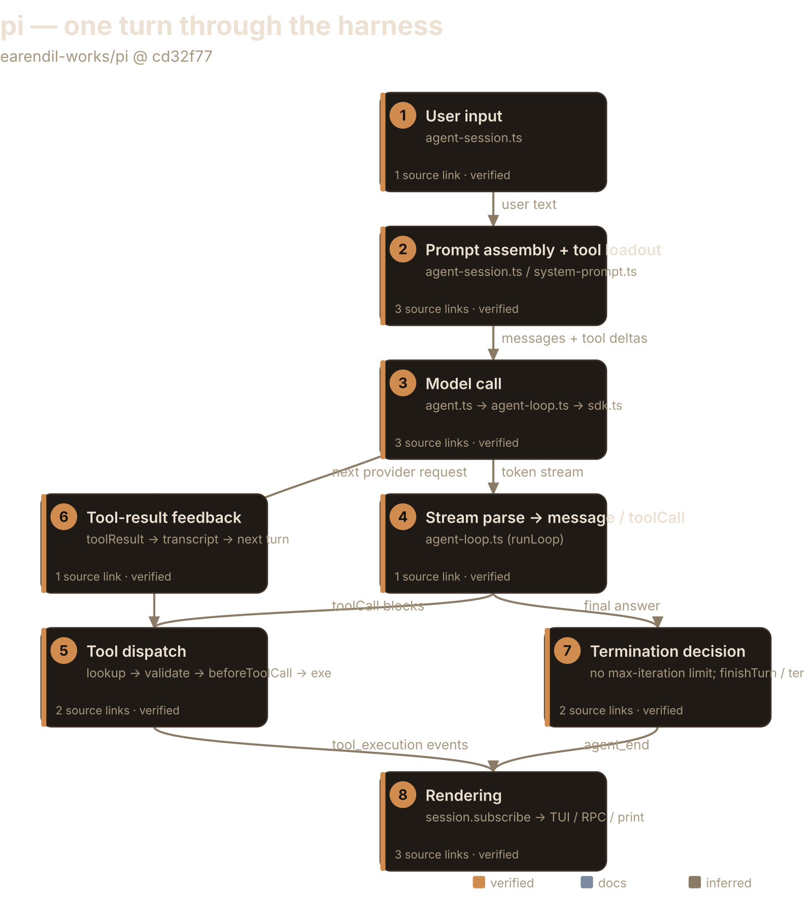
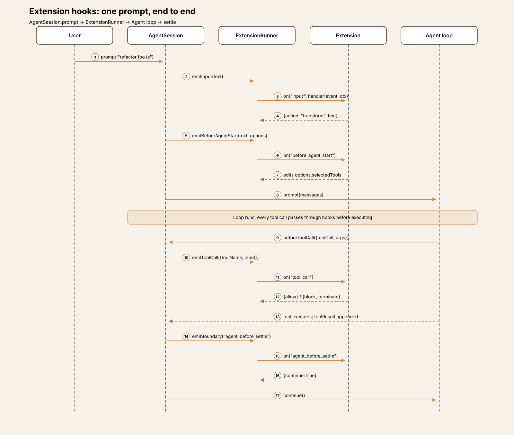
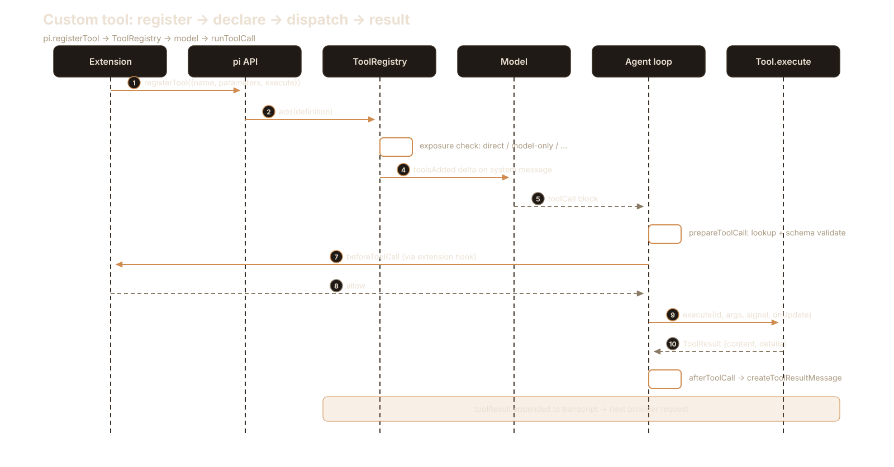
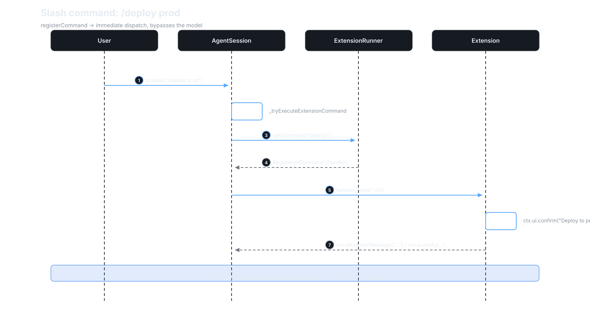
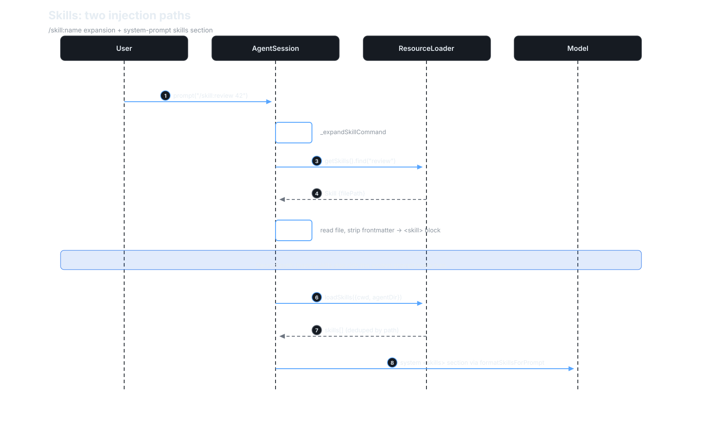
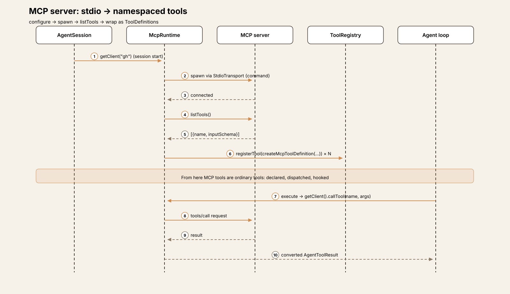
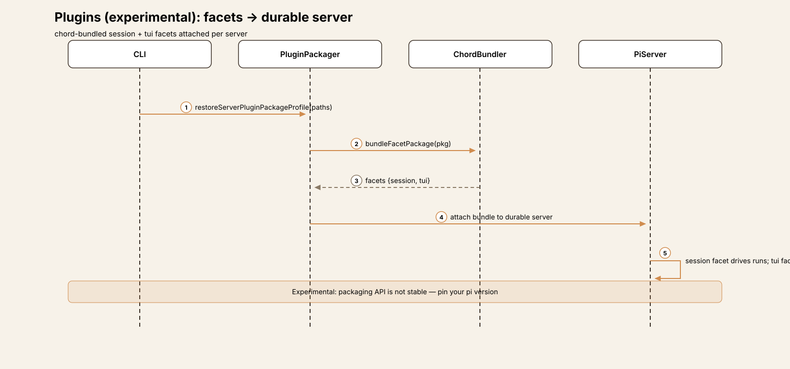
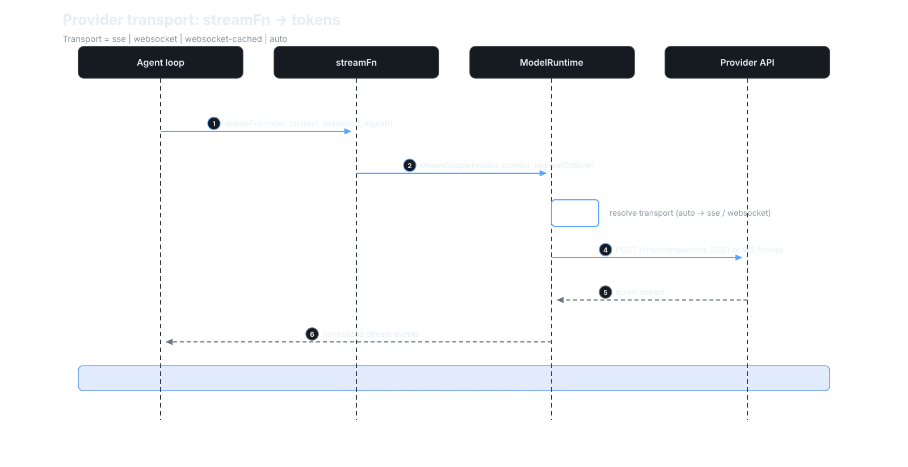
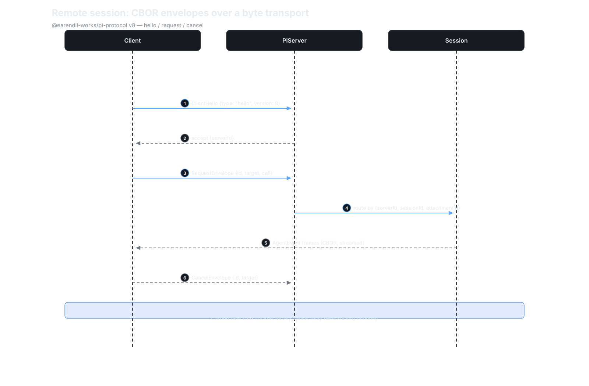

# Agent Harness Anatomy #1: pi — the minimalist terminal harness

> **Series:** Agent Harness Anatomy — top-down dissections of real agent
> harnesses, grounded in verifiable source code. Every behavioral claim
> below carries a footnote to a pinned GitHub permalink; the full evidence
> lives in the endnotes. 

## Version block

- **Repo:** [earendil-works/pi](https://github.com/earendil-works/pi)
- **Pinned:** tag `v1.0.2` → `cd32f7725fdbddbaecdff5b1e68491563394e0ca` (2026-10-04)
- **Language:** TypeScript (Node ≥ 22.19)
- **Claim under test:** "a hardened, minimal, extensible agent harness"

## The mental model

pi is two things with a clean seam between them: a **model-agnostic agent
loop library** (`@earendil-works/pi-agent-core`) that knows nothing about
terminals, and a **terminal coding application** that configures one `Agent`
instance per session and renders its event stream.[^1] The loop doesn't know
what a tool *does* — it only knows the protocol: look up, validate,
`beforeToolCall`, execute, `afterToolCall`, append the result.[^2] Everything
pi-specific (system prompt sections, the 4 default tools, the TUI) lives
above that seam.[^3]

The governing tradeoff: pi keeps the core tiny and pushes *policy* to the
edges. Anything opinionated — approvals, planning, memory, iteration caps —
is an extension's job or doesn't exist at all. You get a small, stable core
with a large extension surface; you pay by assembling your own policy layer.
If you're building a harness, that's pi's thesis in one sentence: mechanism
in the core, policy in extensions.

## Package map

The repo is a monorepo. For this article only three packages matter:[^4]

| Package | Role |
|---|---|
| `packages/agent` | The loop: `Agent` class + `runAgentLoop`/`runAgentLoopContinue` + event types |
| `packages/ai` | Model providers (~42) behind one `StreamFn` signature |
| `packages/coding-agent` | The app: `AgentSession`, system prompt, tools, TUI/RPC/print modes |

Everything else (`mcp`, `server`, `tui`, `durable`, `evals`, …) is out of
scope for the core trace.

## The core loop

`runAgentLoop()` and `runAgentLoopContinue()` both delegate to a shared
`runLoop()`.[^5] Two nested loops:

- **Inner loop** — runs while tool calls or steering messages remain. Each
  iteration: append pending messages → `prepareRequest` (may swap
  context/model/reasoning) → `transformContext` (extension hooks) →
  `convertToLlm` → provider streaming call → parse response → execute tool
  calls → append results.[^6]
- **Outer loop** — after the agent would otherwise stop, drains follow-up
  messages.[^6]

The loop is **event-sourced**: every state change emits a typed `AgentEvent`
(`agent_start/end`, `turn_start/end`, `message_start/update/end`,
`tool_execution_start/update/end`).[^7] The `Agent` class reduces these into
its state and forwards them to subscribers.[^8] The TUI, the RPC server, and
print mode are all just subscribers — there is no privileged renderer.[^9]

**The most interesting negative finding:** there is no max-iteration,
max-step, or max-turn limit anywhere in the loop or the session layer.[^10]
A runaway loop is stopped by the model ceasing to emit tool calls, every
tool result in a batch setting `terminate: true`, a `finishTurn` hook, or the user
hitting Ctrl+C (`AbortController`).[^11] pi trusts the model's stop behavior
the way a REPL trusts EOF.

That's a deliberate trust model, not an oversight — and it's the kind of
decision to steal or reject consciously. Anyone who wants a cap can add one
in a `finishTurn` hook without forking the loop, so the core never has to
know what "too many iterations" means for your deployment.[^11] The price is
real: a misbehaving model burns tokens until the user aborts. pi's bet is
that a policy-free core stays small and stable while the ecosystem sorts out
policy — the same bet as the approval story below.

## One turn, end to end

Trace: the user types `help me refactor foo.ts` in interactive mode.

**① Input.** `AgentSession.prompt()` first gives extension slash commands
a chance to handle the text, then lets extensions intercept via `input`
handlers, then expands skill commands and prompt templates.[^12] If the
agent is already streaming, the message is queued through `steer()`
(interrupt) or `followUp()` (wait) instead of starting a new run — the
caller must say which, or `prompt()` throws.[^13] Only on the non-streaming
path does it validate the model and auth (OAuth/API key) and run a
pre-prompt compaction check.[^12][^30]

**② Prompt assembly.** Before every agent start, extensions may edit the
system-prompt options.[^14] `_preparePromptAndToolLoadout` then diffs the
*structured* system prompt — sections named `preamble`, `tools`, `rules`,
and `docs` (the last three only when pi's default prompt is in use), plus
`addendum`, `project_context`, `skills`, `cwd`, and any custom sections —
against the transcript's
current sections, and emits only the changed ones (a `null` removes a
section).[^15][^16] Non-preamble sections are wrapped in XML tags of the
same name so the model can match later updates to them.[^16] Tool
declarations ride along as `toolsAdded`/`toolsRemoved` deltas on the system
message, keeping the provider-visible tool list reconciled with the runtime
registry.[^17]

The tradeoff here is token economics versus protocol complexity. Resending
only changed sections keeps long sessions cheap — the model never re-reads
a prompt it already has — but it means the system message is a small
versioned protocol (sections, `null` removals, tool deltas) that every
provider adapter must replay faithfully.[^15][^16] Most harnesses resend the
whole prompt and eat the tokens; pi chose the complex, cheap path.

**③ Model call.** `Agent.prompt()` → `runAgentLoop()` → the app's `streamFn`,
which delegates to `modelRuntime.streamSimple()` — token streaming from
whichever of ~42 providers is selected.[^18] Per-request hooks (`onPayload`,
`onResponse`) feed extension observers; the same `streamFn` also starts a
prompt-cache warmer for session requests.[^19]

**④ Response parsing.** Streaming events assemble the partial assistant
message in context. Tool calls are extracted from assistant content blocks.[^20]
Edge case worth noting: if the model stops because of output length, tool
calls are **not** executed — each receives an error result, because the
arguments may have been truncated.[^21]

**⑤ Tool dispatch.** Sequential or parallel.[^22] Per call: tool lookup →
argument preparation → schema validation (TypeBox) → `beforeToolCall` →
execute → `afterToolCall`.[^22] `beforeToolCall` can block the call and mark
the turn for termination.[^23] In the coding app this hook is wired to
extension `tool_call` handlers — there is no built-in per-command approval
prompt.[^24]

Same mechanism/policy split as the iteration cap. The core never blocks on
a human, so scripted and headless runs can never hang on a prompt — but
every deployment that wants gating must build it as an extension. If your
threat model needs approvals, pi gives you the hook, not the feature; budget
accordingly.

**⑥ Feedback.** Each result becomes a `toolResult` message appended to the
transcript; the inner loop issues the next provider request.[^25]

**⑦ Termination.** The turn ends when no tool calls, steering, or follow-ups
remain, `finishTurn` says stop, every result in a batch set `terminate`, or
an error/abort occurs.[^11] Post-loop, the session runs auto-retry for
retryable errors, a compaction check, and the `agent_before_settle`
extension boundary before finally settling.[^26]

**⑧ Rendering.** The interactive TUI subscribes to the session's event
stream and renders tokens, tool executions, and results purely from events.
Same stream feeds RPC and print/JSON modes.[^9]

The tradeoff of event-sourcing the UI: any interface can render the same
run without the loop knowing it exists — but the event schema becomes the
de-facto API contract. Adding a new event type is a versioning decision,
not an implementation detail.

## Subsystem inventory

- **Tools.** 8 built-ins: `read`, `bash`, `edit`, `write` are active by
  default; `powershell`, `grep`, `find`, and `ls` ship disabled and can be
  switched on.[^27] Schema-validated,
  with per-tool system-prompt contributions (a one-line snippet + guideline
  bullets that flow into the prompt's `tools` and `rules` sections).[^27]
  Extensions register more through the same registry; tools can invoke
  other tools via `ctx.executeTool()` (nested tool calls re-enter the
  pipeline with the session's hooks).[^28]
- **Providers.** ~42 providers under `packages/ai/src/providers/` (Anthropic,
  OpenAI, Google, Bedrock, OpenRouter, xAI, …). The loop sees exactly one
  function signature; API keys resolve per request (supports expiring
  credentials); thinking levels/budgets are forwarded opaquely.[^29]
- **Sessions.** JSONL files under `~/.pi/agent/sessions/`. Compaction lives
  in `core/compaction/` with branch summarization; a compaction check runs
  before and after each prompt.[^30]
- **Extensibility.** TypeScript extensions with hooks at every seam (see
  [Extension points](#extension-points) below).[^31]

## Extension points

pi's minimalism is load-bearing: the core stays small because nearly
everything plugs in somewhere.

- **Extensions** (stable API). TypeScript modules with hooks at every seam
  of the loop and session — `input`, `before_agent_start`, `tool_call`,
  `tool_result`, `context`, `agent_before_settle` — plus slash commands,
  themes, and prompt templates.[^31] They run in-process and can veto tool
  calls through `beforeToolCall`.[^24]
- **Custom tools.** Extensions and the SDK register tools through the same
  registry as the built-ins; a tool can call other tools via
  `ctx.executeTool()`, re-entering the pipeline with the session's
  hooks.[^28]
- **Skills.** Markdown files with frontmatter (`name`, `description`),
  loaded from the project directory, the global agent dir, or explicit
  paths — deduplicated by canonical path — and rendered into the system
  prompt's `skills` section.[^34] Invoked as `/skill:name`, expanded before
  the prompt reaches the loop.[^12]
- **MCP servers.** A bundled extension wraps each server tool as a pi
  `ToolDefinition` (named `mcp__<server>__<tool>`, labelled `server/tool`,
  parameters converted from its input schema), so its calls run through
  the same pipeline and hooks as built-ins.[^40] By default, though, MCP
  tools get `codemode` exposure: callable from codemode scripts but not
  declared to the model.[^50] The MCP client itself speaks stdio,
  streamable HTTP, or in-memory transports.[^41]
- **Plugins** (experimental). Facet-bundled packages — `session` and `tui`
  facets — built with the chord bundler and attached per durable server via
  plugin package profiles.[^35]
- **Provider transports.** The `StreamFn` abstraction streams from model APIs
  over SSE, WebSocket, or cached WebSocket
  (`Transport = "sse" | "websocket" | "websocket-cached" | "auto"`).[^36]
- **Remote session protocol.** `@earendil-works/pi-protocol`: a
  transport-neutral CBOR RPC protocol (version 8) with request/cancel
  envelopes addressed to server/session/attachment targets.[^37] The
  experimental server carries it over Unix domain sockets;[^38] a radius
  relay extends it over WebSocket beyond the local machine.[^39]

## Extension points in depth

Each axis below is a complete starting kit: what the harness does, the
exact interaction sequence, and the first file to open when you implement.
Diagrams use the same numbering as the prose steps.

### 1. Lifecycle hooks

Every prompt passes through the same hook pipeline, in a fixed order:
`input` handlers can rewrite or swallow the text before skill and template
expansion (only extension slash commands run earlier); `before_agent_start` can edit the system-prompt options and tool
selection; then the loop runs, consulting `tool_call`/`tool_result` hooks
around every tool execution; finally `agent_before_settle` gets a last word
— its handlers can force another turn — before `agent_end`.

Handlers run in-process and receive `(event, ctx)`. Several events support
cancellation (`return { cancel: true }`) — the session-switch confirmation
in `examples/extensions/confirm-destructive.ts` is the canonical
pattern.[^44]

**Start here:** copy `examples/extensions/permission-gate.ts` — it blocks
dangerous `bash` commands from a `tool_call` handler and asks the user via
`ctx.ui.select` when a UI is present.[^51] An
extension is a default-exported function taking `pi: ExtensionAPI`, dropped
in `~/.pi/agent/extensions/` or your project's `.pi/extensions/`.[^42]
Subscribe with `pi.on("tool_call", handler)`; return `{ block: true }` from
a `tool_call` handler and the call never executes (`ToolCallEventResult`
also carries an optional `reason` and a `terminate` hint).[^31][^49]

### 2. Custom tools

Tools are the richest axis. Registration is one call —
`pi.registerTool({ name, description, parameters, execute })` — but what
happens next crosses four subsystems: the registry checks the tool's
*exposure* (`direct` | `model-only` | `codemode` | `deferred` | `hidden`),
which decides whether the model sees it, whether it activates on
registration, and who else may call it.[^45] Active tools are declared to
the model as `toolsAdded` deltas; when the model emits a `toolCall`, the
loop looks the tool up, validates arguments against its TypeBox schema,
runs `beforeToolCall`, executes, runs `afterToolCall`, and appends the
result.

**Start here:** `ExtensionAPI.registerTool` in
`core/extensions/types.ts`.[^43] Model the `parameters` schema on
`bash.ts`'s TypeBox definition and the `execute(id, args, signal,
onUpdate)` signature on any built-in; set `exposure: "model-only"` if the
model should see the tool but other tools must never call it through
`ctx.executeTool()`.[^45]

### 3. Slash commands

Commands bypass the model entirely: text starting with `/` is intercepted
before prompt expansion, matched against the command registry, and its
handler runs immediately — even mid-stream.[^12] The handler receives the
raw argument string and a command context with UI primitives
(`ctx.ui.confirm/select/notify`) and messaging (`ctx.sendMessage`,
`ctx.sendUserMessage`, which can trigger a fresh turn).[^44][^46]

**Start here:** `pi.registerCommand("deploy", { description, handler:
async (args, ctx) => { … } })` — see `examples/extensions/commands.ts` for
the full shape including argument completions.[^42][^43]

### 4. Skills

Skills have two injection paths, and the diagram shows both. Invoked as
`/skill:name`, the skill's markdown body (frontmatter stripped) is inlined
as a `<skill>` block ahead of the user's text. Independently, every prompt
lists the loaded skills in the system prompt's `skills` section, so the
model knows they exist before anyone invokes one — except skills marked
`disable-model-invocation`, and only when `read` or `bash` is active
(the model needs one of them to open a skill file).[^34]

**Start here:** a markdown file with `name:`/`description:` frontmatter in
`<project>/.pi/skills/` or `~/.pi/agent/skills/`.[^48] Keep the body
task-shaped — skills are procedures, not documentation.

### 5. MCP servers

MCP is an adapter, not a parallel tool system. Each configured server
(`command` for stdio, `url` for streamable HTTP)[^47] connects in the
background when the session starts; each of its tools is wrapped by
`createMcpToolDefinition` into a native pi `ToolDefinition` — named
`mcp__<server>__<tool>`, labelled `server/tool` in the UI, parameters
converted from the MCP input schema.[^40] Every call is dispatched, hooked,
and rendered exactly like a built-in's.

What differs is visibility. The default exposure is `codemode`: MCP tools
stay out of the model's tool declarations and are reached from codemode
scripts instead. `deferred` surfaces them on demand through `tool_search`,
and only `direct` declares them to the model up front.[^50] That is the
same mechanism/policy split again — the adapter is uniform, and how much
of a server's surface the model sees is configuration.

**Start here:** the server entry in `mcp.json` (including its `exposure`), then
`extensions/mcp/tools.ts` if you need custom result conversion.[^40] The
MCP client itself speaks stdio, streamable HTTP, or in-memory
transports.[^41]

### 6. Plugins (experimental)

Plugins are the heavyweight axis: whole *facets* of pi — a `session` facet
and a `tui` facet — bundled with the chord bundler and attached to a
durable server via a persisted plugin-package profile.[^35] Where an
extension customizes behavior inside a running session, a plugin ships a
custom session and interface. The API is explicitly not stable; pin your pi
version.

**Start here:** `experimental/plugins/package.ts` — but treat this axis as
incubating, not as a contract.

### 7. Provider transports

Below the `StreamFn` abstraction, the model runtime picks a wire transport
per request: SSE, WebSocket, cached WebSocket, or `auto`.[^36] Extension
hooks (`onPayload`, `onResponse`, `provider_stream_event`) observe the
traffic at this layer, which is also where the prompt-cache warmer
operates.[^19]

**Start here:** the `transport` setting and `ModelRuntime.streamSimple`.
If you're adding a provider, this is the seam — implement the transport,
the loop never changes.

### 8. Remote session protocol

`@earendil-works/pi-protocol` is a transport-neutral CBOR RPC protocol
(version 8): `hello`, `request`, and `cancel` envelopes addressed to
server/session/attachment targets.[^37] The experimental server carries
those frames over Unix domain sockets;[^38] the radius relay extends them
over WebSocket past the local machine.[^39] Because the protocol streams
`AgentEvent`s, a remote client renders exactly what the local TUI renders —
there is still no privileged renderer, just a longer wire.[^9]

**Start here:** `packages/protocol/src/protocol.ts` for the envelopes,
`framing.ts` for the byte framing.

## Deliberate omissions

pi ships no sub-agents, no plan mode, and no per-tool approval prompts.[^32]
The first two are documented philosophy ("adapt pi to your workflows"); the
third is architectural: approval is an extension's job, implemented through
`beforeToolCall`, not a core feature.[^24] The security model is project trust
(`--approve` trusts project-local files) plus extension hooks — not
per-command gating.[^33]

The repo does ship all three as *example* extensions — `subagent/`,
`plan-mode/`, and `permission-gate.ts` — which is the thesis made
concrete: the features exist, as policy, outside the core.[^52] One caveat
to "minimal": the coding app loads MCP, `codemode`, and `tool_search` as
built-in extensions (the latter two inactive until enabled), so the *core*
is minimal while the default install is somewhat broader.[^50]

Read the omissions as the other half of the thesis: every "missing" feature
is a decision to keep the core's surface area small and let the extension
layer — or the model itself — carry the weight. Steal the pattern when your
harness needs to stay hackable; reject it when your users need guardrails
out of the box.

## Comparison matrix row

| # | Dimension | pi (v1.0.2) |
|---|---|---|
| 1 | Agent loop | Event-sourced; inner (tool/steer) + outer (follow-up) loops; no iteration cap [^5][^6][^10] |
| 2 | Tool system | 8 built-ins (4 active by default) + registry; TypeBox validation; sequential/parallel; nested calls [^22][^27][^28] |
| 3 | Model providers | ~42 behind one `StreamFn`; per-request key resolution [^18][^29] |
| 4 | Prompt construction | Structured sections, diffed per turn, XML-tagged [^15][^16] |
| 5 | Memory/session | JSONL sessions; compaction with branch summarization [^30] |
| 6 | Reasoning/planning | Thinking levels forwarded; no planner/sub-agents (omitted) [^29][^32] |
| 7 | Extensibility | TS extensions, hooks at every seam, MCP, skills [^31] |
| 8 | Interfaces | TUI / print / RPC / SDK — all event subscribers [^9] |
| 9 | Failure handling | Auto-retry, truncation guards, abort; no iteration cap [^21][^26][^10] |
| 10 | Security model | Project trust + extension hooks; no built-in approval UX [^24][^33] |

## Endnotes

All notes are VERIFIED against `v1.0.2`
(`cd32f7725fdbddbaecdff5b1e68491563394e0ca`) unless marked DOCS; line
anchors re-checked on 2026-10-07.
`GH` = `https://github.com/earendil-works/pi/blob/cd32f7725fdbddbaecdff5b1e68491563394e0ca/`.

[^1]: The `Agent` class is constructed once per session in
    `packages/coding-agent/src/core/sdk.ts` ([GH…/sdk.ts#L387-L395](https://github.com/earendil-works/pi/blob/cd32f7725fdbddbaecdff5b1e68491563394e0ca/packages/coding-agent/src/core/sdk.ts#L387-L395));
    the loop package exports only the loop, types, and streaming
    primitives ([GH…/agent/src/index.ts](https://github.com/earendil-works/pi/blob/cd32f7725fdbddbaecdff5b1e68491563394e0ca/packages/agent/src/index.ts)).
[^2]: Tool pipeline stages — lookup, argument preparation, and validation in
    `prepareToolCall` ([GH…/agent-loop.ts#L707-L725](https://github.com/earendil-works/pi/blob/cd32f7725fdbddbaecdff5b1e68491563394e0ca/packages/agent/src/agent-loop.ts#L707-L725)),
    `beforeToolCall` gating ([GH…/agent-loop.ts#L727-L746](https://github.com/earendil-works/pi/blob/cd32f7725fdbddbaecdff5b1e68491563394e0ca/packages/agent/src/agent-loop.ts#L727-L746)),
    execution ([GH…/agent-loop.ts#L820-L848](https://github.com/earendil-works/pi/blob/cd32f7725fdbddbaecdff5b1e68491563394e0ca/packages/agent/src/agent-loop.ts#L820-L848)),
    `afterToolCall` and result finalization ([GH…/agent-loop.ts#L853-L903](https://github.com/earendil-works/pi/blob/cd32f7725fdbddbaecdff5b1e68491563394e0ca/packages/agent/src/agent-loop.ts#L853-L903)).
[^3]: Prompt sections in
    [GH…/system-prompt.ts#L121](https://github.com/earendil-works/pi/blob/cd32f7725fdbddbaecdff5b1e68491563394e0ca/packages/coding-agent/src/core/system-prompt.ts#L121);
    built-in tool names in
    [GH…/core/tools/index.ts#L95-L105](https://github.com/earendil-works/pi/blob/cd32f7725fdbddbaecdff5b1e68491563394e0ca/packages/coding-agent/src/core/tools/index.ts#L95-L105);
    TUI event subscription in
    [GH…/interactive-mode.ts#L3354](https://github.com/earendil-works/pi/blob/cd32f7725fdbddbaecdff5b1e68491563394e0ca/packages/coding-agent/src/modes/interactive/interactive-mode.ts#L3354).
[^4]: `packages/agent/src/index.ts` exports `agent.ts`, `agent-loop.ts`,
    `proxy.ts`, `stream-fn.ts`, `types.ts`
    ([GH…/agent/src](https://github.com/earendil-works/pi/tree/cd32f7725fdbddbaecdff5b1e68491563394e0ca/packages/agent/src));
    `packages/ai/src/providers/` holds ~42 providers (92 files, counting the `*.models.ts` catalogs)
    ([GH…/ai/src/providers](https://github.com/earendil-works/pi/tree/cd32f7725fdbddbaecdff5b1e68491563394e0ca/packages/ai/src/providers));
    `packages/coding-agent/src/core/` holds `agent-session.ts`, `sdk.ts`,
    `system-prompt.ts`, `tools/`, `modes/`
    ([GH…/coding-agent/src/core](https://github.com/earendil-works/pi/tree/cd32f7725fdbddbaecdff5b1e68491563394e0ca/packages/coding-agent/src/core)).
[^5]: [GH…/agent-loop.ts#L102-L128](https://github.com/earendil-works/pi/blob/cd32f7725fdbddbaecdff5b1e68491563394e0ca/packages/agent/src/agent-loop.ts#L102-L128)
    (`runAgentLoop`, `runAgentLoopContinue`);
    [GH…/agent-loop.ts#L163](https://github.com/earendil-works/pi/blob/cd32f7725fdbddbaecdff5b1e68491563394e0ca/packages/agent/src/agent-loop.ts#L163)
    (`runLoop`).
[^6]: Inner loop drains steering messages at
    [GH…/agent-loop.ts#L176](https://github.com/earendil-works/pi/blob/cd32f7725fdbddbaecdff5b1e68491563394e0ca/packages/agent/src/agent-loop.ts#L176)
    and re-polls at
    [L205](https://github.com/earendil-works/pi/blob/cd32f7725fdbddbaecdff5b1e68491563394e0ca/packages/agent/src/agent-loop.ts#L205);
    per-turn pipeline — `prepareRequest`
    ([L219](https://github.com/earendil-works/pi/blob/cd32f7725fdbddbaecdff5b1e68491563394e0ca/packages/agent/src/agent-loop.ts#L219)),
    `transformContext`
    ([L390-L391](https://github.com/earendil-works/pi/blob/cd32f7725fdbddbaecdff5b1e68491563394e0ca/packages/agent/src/agent-loop.ts#L390-L391)),
    `convertToLlm` + `normalizeContext`
    ([L395-L397](https://github.com/earendil-works/pi/blob/cd32f7725fdbddbaecdff5b1e68491563394e0ca/packages/agent/src/agent-loop.ts#L395-L397));
    outer loop drains follow-ups at
    [L302-L310](https://github.com/earendil-works/pi/blob/cd32f7725fdbddbaecdff5b1e68491563394e0ca/packages/agent/src/agent-loop.ts#L302-L310).
[^7]: `AgentEvent` union in
    [GH…/agent/src/types.ts#L514-L529](https://github.com/earendil-works/pi/blob/cd32f7725fdbddbaecdff5b1e68491563394e0ca/packages/agent/src/types.ts#L514-L529).
[^8]: `Agent.processEvents` reduces each event into state, then awaits
    listeners, in
    [GH…/agent/src/agent.ts#L565-L613](https://github.com/earendil-works/pi/blob/cd32f7725fdbddbaecdff5b1e68491563394e0ca/packages/agent/src/agent.ts#L565-L613).
[^9]: Interactive TUI
    ([GH…/interactive-mode.ts#L3354](https://github.com/earendil-works/pi/blob/cd32f7725fdbddbaecdff5b1e68491563394e0ca/packages/coding-agent/src/modes/interactive/interactive-mode.ts#L3354)),
    RPC mode
    ([GH…/rpc-mode.ts#L355](https://github.com/earendil-works/pi/blob/cd32f7725fdbddbaecdff5b1e68491563394e0ca/packages/coding-agent/src/modes/rpc/rpc-mode.ts#L355)),
    print mode
    ([GH…/print-mode.ts#L108](https://github.com/earendil-works/pi/blob/cd32f7725fdbddbaecdff5b1e68491563394e0ca/packages/coding-agent/src/modes/print-mode.ts#L108))
    all subscribe to the same event stream; no renderer calls the loop
    directly.
[^10]: Negative finding: case-insensitive grep for
    `maxIterations|maxTurns|maxToolCalls|maxSteps|iterationLimit|turnLimit|loopLimit`
    over `packages/agent/src` and `packages/coding-agent/src` at the pinned
    SHA returns zero hits.
[^11]: Termination paths in
    [GH…/agent-loop.ts#L286-L310](https://github.com/earendil-works/pi/blob/cd32f7725fdbddbaecdff5b1e68491563394e0ca/packages/agent/src/agent-loop.ts#L286-L310)
    (`finishTurn` decision, steering/follow-up exhaustion) and the batch
    termination rule
    ([L689-L691](https://github.com/earendil-works/pi/blob/cd32f7725fdbddbaecdff5b1e68491563394e0ca/packages/agent/src/agent-loop.ts#L689-L691));
    abort via the per-run `AbortController` in
    [GH…/agent.ts#L507-L540](https://github.com/earendil-works/pi/blob/cd32f7725fdbddbaecdff5b1e68491563394e0ca/packages/agent/src/agent.ts#L507-L540)
    (`runWithLifecycle`; public `abort()` at L341).
[^12]: `AgentSession.prompt` at
    [GH…/agent-session.ts#L1921-L2015](https://github.com/earendil-works/pi/blob/cd32f7725fdbddbaecdff5b1e68491563394e0ca/packages/coding-agent/src/core/agent-session.ts#L1921-L2015):
    extension commands (L1930), input handlers (L1946), skill/template
    expansion (L1961), streaming branch (L1966), then model and auth
    validation (L1986-L2003).
[^13]: Streaming branch queues via `steer()`/`followUp()` at
    [GH…/agent-session.ts#L1967-L1975](https://github.com/earendil-works/pi/blob/cd32f7725fdbddbaecdff5b1e68491563394e0ca/packages/coding-agent/src/core/agent-session.ts#L1967-L1975);
    without a `streamingBehavior` the call throws (L1967-L1971); queue
    primitives in
    [GH…/agent.ts#L299-L308](https://github.com/earendil-works/pi/blob/cd32f7725fdbddbaecdff5b1e68491563394e0ca/packages/agent/src/agent.ts#L299-L308).
[^14]: `emitBeforeAgentStart` at
    [GH…/agent-session.ts#L2015-L2030](https://github.com/earendil-works/pi/blob/cd32f7725fdbddbaecdff5b1e68491563394e0ca/packages/coding-agent/src/core/agent-session.ts#L2015-L2030).
[^15]: `_preparePromptAndToolLoadout` at
    [GH…/agent-session.ts#L1689-L1701](https://github.com/earendil-works/pi/blob/cd32f7725fdbddbaecdff5b1e68491563394e0ca/packages/coding-agent/src/core/agent-session.ts#L1689-L1701);
    section diffing in `diffSystemPromptSections` at
    [GH…/system-prompt.ts#L204-L216](https://github.com/earendil-works/pi/blob/cd32f7725fdbddbaecdff5b1e68491563394e0ca/packages/coding-agent/src/core/system-prompt.ts#L204-L216)
    (`null` removes a section).
[^16]: Section list and XML wrapping in `buildSystemPromptSections` at
    [GH…/system-prompt.ts#L121-L160](https://github.com/earendil-works/pi/blob/cd32f7725fdbddbaecdff5b1e68491563394e0ca/packages/coding-agent/src/core/system-prompt.ts#L121-L160);
    `preamble`/`tools`/`rules`/`docs` are built only without a custom
    prompt (L143-L161), `addendum`/`project_context`/`skills`/`cwd` after
    (L163-L170); default tool selection `[read, bash, edit, write]` in
    `normalizeBuildSystemPromptOptions` (L58).
[^17]: `declareToolChanges` at
    [GH…/agent-loop.ts#L333-L360](https://github.com/earendil-works/pi/blob/cd32f7725fdbddbaecdff5b1e68491563394e0ca/packages/agent/src/agent-loop.ts#L333-L360),
    applied to initial messages
    ([L110](https://github.com/earendil-works/pi/blob/cd32f7725fdbddbaecdff5b1e68491563394e0ca/packages/agent/src/agent-loop.ts#L110))
    and each turn's pending messages
    ([L211](https://github.com/earendil-works/pi/blob/cd32f7725fdbddbaecdff5b1e68491563394e0ca/packages/agent/src/agent-loop.ts#L211)).
[^18]: `Agent.prompt` →
    [GH…/agent.ts#L373-L380](https://github.com/earendil-works/pi/blob/cd32f7725fdbddbaecdff5b1e68491563394e0ca/packages/agent/src/agent.ts#L373-L380)
    → `runAgentLoop`
    ([GH…/agent-loop.ts#L102](https://github.com/earendil-works/pi/blob/cd32f7725fdbddbaecdff5b1e68491563394e0ca/packages/agent/src/agent-loop.ts#L102));
    the app's `streamFn` delegates to `modelRuntime.streamSimple` at
    [GH…/sdk.ts#L387-L406](https://github.com/earendil-works/pi/blob/cd32f7725fdbddbaecdff5b1e68491563394e0ca/packages/coding-agent/src/core/sdk.ts#L387-L406).
[^19]: `transformProviderPayload` / `handleProviderResponse` at
    [GH…/sdk.ts#L358-L380](https://github.com/earendil-works/pi/blob/cd32f7725fdbddbaecdff5b1e68491563394e0ca/packages/coding-agent/src/core/sdk.ts#L358-L380);
    prompt-cache warming inside the app's `streamFn` at
    [L404](https://github.com/earendil-works/pi/blob/cd32f7725fdbddbaecdff5b1e68491563394e0ca/packages/coding-agent/src/core/sdk.ts#L404).
[^20]: Tool-call extraction from assistant content blocks at
    [GH…/agent-loop.ts#L259](https://github.com/earendil-works/pi/blob/cd32f7725fdbddbaecdff5b1e68491563394e0ca/packages/agent/src/agent-loop.ts#L259)
    and
    [L515](https://github.com/earendil-works/pi/blob/cd32f7725fdbddbaecdff5b1e68491563394e0ca/packages/agent/src/agent-loop.ts#L515).
[^21]: Truncated-response handling at
    [GH…/agent-loop.ts#L472-L493](https://github.com/earendil-works/pi/blob/cd32f7725fdbddbaecdff5b1e68491563394e0ca/packages/agent/src/agent-loop.ts#L472-L493)
    (error result: "the response hit the output token limit, so its
    arguments may be truncated"), with the rationale at
    [L265](https://github.com/earendil-works/pi/blob/cd32f7725fdbddbaecdff5b1e68491563394e0ca/packages/agent/src/agent-loop.ts#L265).
[^22]: `toolExecution` mode (default `"parallel"`) in
    [GH…/agent.ts#L240-L260](https://github.com/earendil-works/pi/blob/cd32f7725fdbddbaecdff5b1e68491563394e0ca/packages/agent/src/agent.ts#L240-L260)
    (constructor); per-call pipeline in `runToolCall` at
    [GH…/agent-loop.ts#L810-L818](https://github.com/earendil-works/pi/blob/cd32f7725fdbddbaecdff5b1e68491563394e0ca/packages/agent/src/agent-loop.ts#L810-L818).
[^23]: `beforeToolCall` blocking and `terminate` marking at
    [GH…/agent-loop.ts#L727-L746](https://github.com/earendil-works/pi/blob/cd32f7725fdbddbaecdff5b1e68491563394e0ca/packages/agent/src/agent-loop.ts#L727-L746).
[^24]: The app's `_beforeToolCall` only forwards to extension `tool_call`
    handlers, at
    [GH…/agent-session.ts#L630-L653](https://github.com/earendil-works/pi/blob/cd32f7725fdbddbaecdff5b1e68491563394e0ca/packages/coding-agent/src/core/agent-session.ts#L630-L653);
    negative finding: no approval/confirmation prompt exists in
    `packages/coding-agent/src` or `packages/tui/src` (grep for
    `toolApproval|confirmTool|permissionManager` returns nothing).
[^25]: `createToolResultMessage` at
    [GH…/agent-loop.ts#L922-L936](https://github.com/earendil-works/pi/blob/cd32f7725fdbddbaecdff5b1e68491563394e0ca/packages/agent/src/agent-loop.ts#L922-L936);
    results appended to the transcript at
    [L276](https://github.com/earendil-works/pi/blob/cd32f7725fdbddbaecdff5b1e68491563394e0ca/packages/agent/src/agent-loop.ts#L276),
    feeding the next inner-loop request.
[^26]: `_handlePostAgentRun` at
    [GH…/agent-session.ts#L1806-L1844](https://github.com/earendil-works/pi/blob/cd32f7725fdbddbaecdff5b1e68491563394e0ca/packages/coding-agent/src/core/agent-session.ts#L1806-L1844)
    (auto-retry, compaction check at L1837); `agent_before_settle`
    boundary at
    [L1846-L1875](https://github.com/earendil-works/pi/blob/cd32f7725fdbddbaecdff5b1e68491563394e0ca/packages/coding-agent/src/core/agent-session.ts#L1846-L1875).
[^27]: The eight built-in tool names in
    [GH…/core/tools/index.ts#L95-L105](https://github.com/earendil-works/pi/blob/cd32f7725fdbddbaecdff5b1e68491563394e0ca/packages/coding-agent/src/core/tools/index.ts#L95-L105);
    the four enabled by default in `DEFAULT_TOOL_NAMES` at
    [GH…/settings-manager.ts#L214-L215](https://github.com/earendil-works/pi/blob/cd32f7725fdbddbaecdff5b1e68491563394e0ca/packages/coding-agent/src/core/settings-manager.ts#L214-L215);
    per-tool prompt contributions, e.g.
    [GH…/core/tools/bash.ts](https://github.com/earendil-works/pi/blob/cd32f7725fdbddbaecdff5b1e68491563394e0ca/packages/coding-agent/src/core/tools/bash.ts)
    (`bashToolSystemPromptContribution`), consumed as `toolSnippets` /
    `toolGuidelines` in
    [GH…/system-prompt.ts](https://github.com/earendil-works/pi/blob/cd32f7725fdbddbaecdff5b1e68491563394e0ca/packages/coding-agent/src/core/system-prompt.ts).
[^28]: `_executeNestedToolCall` at
    [GH…/agent-session.ts#L699-L730](https://github.com/earendil-works/pi/blob/cd32f7725fdbddbaecdff5b1e68491563394e0ca/packages/coding-agent/src/core/agent-session.ts#L699-L730)
    re-enters `runToolCall` with the session's hooks.
[^29]: About 42 providers (one `*.models.ts` catalog each) in
    [GH…/ai/src/providers/](https://github.com/earendil-works/pi/tree/cd32f7725fdbddbaecdff5b1e68491563394e0ca/packages/ai/src/providers);
    per-request API-key resolution at
    [GH…/agent-loop.ts#L401](https://github.com/earendil-works/pi/blob/cd32f7725fdbddbaecdff5b1e68491563394e0ca/packages/agent/src/agent-loop.ts#L401);
    `thinkingBudgets` / `transport` forwarded opaquely via `AgentOptions`
    in
    [GH…/agent.ts#L114-L186](https://github.com/earendil-works/pi/blob/cd32f7725fdbddbaecdff5b1e68491563394e0ca/packages/agent/src/agent.ts#L114-L186).
[^30]: Session directory layout in
    [GH…/session-manager.ts#L587-L601](https://github.com/earendil-works/pi/blob/cd32f7725fdbddbaecdff5b1e68491563394e0ca/packages/coding-agent/src/core/session-manager.ts#L587-L601)
    (`~/.pi/agent/sessions/`, `.jsonl` at L754); compaction in
    [GH…/core/compaction/](https://github.com/earendil-works/pi/tree/cd32f7725fdbddbaecdff5b1e68491563394e0ca/packages/coding-agent/src/core/compaction)
    with checks before and after each prompt
    ([GH…/agent-session.ts#L2009](https://github.com/earendil-works/pi/blob/cd32f7725fdbddbaecdff5b1e68491563394e0ca/packages/coding-agent/src/core/agent-session.ts#L2009),
    [L1837](https://github.com/earendil-works/pi/blob/cd32f7725fdbddbaecdff5b1e68491563394e0ca/packages/coding-agent/src/core/agent-session.ts#L1837)).
[^31]: Hook event types in
    [GH…/core/extensions/types.ts](https://github.com/earendil-works/pi/blob/cd32f7725fdbddbaecdff5b1e68491563394e0ca/packages/coding-agent/src/core/extensions/types.ts)
    (e.g. `tool_call` at L1153, L1620), dispatched by the extension runner
    ([GH…/runner.ts#L1246](https://github.com/earendil-works/pi/blob/cd32f7725fdbddbaecdff5b1e68491563394e0ca/packages/coding-agent/src/core/extensions/runner.ts#L1246)).
[^32]: DOCS grade — stated in project documentation/philosophy, not derived
    from code: pi deliberately omits sub-agents and plan mode
    ([GH…/README.md#L17-L19](https://github.com/earendil-works/pi/blob/cd32f7725fdbddbaecdff5b1e68491563394e0ca/README.md#L17-L19)). Consistent
    with the code: `packages/agent/src` contains only the loop, the `Agent`
    wrapper, and types — no sub-agent orchestration
    ([GH…/agent/src](https://github.com/earendil-works/pi/tree/cd32f7725fdbddbaecdff5b1e68491563394e0ca/packages/agent/src)),
    and the loop has no planning stage
    ([GH…/agent-loop.ts](https://github.com/earendil-works/pi/blob/cd32f7725fdbddbaecdff5b1e68491563394e0ca/packages/agent/src/agent-loop.ts)).
    The philosophical framing ("adapt pi to your workflows") remains a docs
    claim.
[^33]: `--approve` / `--no-approve` flags trust or ignore project-local
    files, at
    [GH…/cli/args.ts#L232-L234](https://github.com/earendil-works/pi/blob/cd32f7725fdbddbaecdff5b1e68491563394e0ca/packages/coding-agent/src/cli/args.ts#L232-L234)
    (help text at L330-L331).
[^34]: `SkillFrontmatter` / `Skill` in
    [GH…/core/skills.ts#L67-L83](https://github.com/earendil-works/pi/blob/cd32f7725fdbddbaecdff5b1e68491563394e0ca/packages/coding-agent/src/core/skills.ts#L67-L83);
    `loadSkills` resolves the project dir, global agent dir, explicit
    paths, and defaults, deduplicating by canonical path (L425), at
    [GH…/core/skills.ts#L409-L509](https://github.com/earendil-works/pi/blob/cd32f7725fdbddbaecdff5b1e68491563394e0ca/packages/coding-agent/src/core/skills.ts#L409-L509);
    skills render into the prompt via `formatSkillsForPrompt`, which drops
    `disable-model-invocation` skills, at
    [GH…/core/skills.ts#L352-L356](https://github.com/earendil-works/pi/blob/cd32f7725fdbddbaecdff5b1e68491563394e0ca/packages/coding-agent/src/core/skills.ts#L352-L356);
    the `skills` section is emitted only when `read` or `bash` is selected, at
    [GH…/system-prompt.ts#L165-L169](https://github.com/earendil-works/pi/blob/cd32f7725fdbddbaecdff5b1e68491563394e0ca/packages/coding-agent/src/core/system-prompt.ts#L165-L169).
[^35]: Experimental plugin packaging: profile version and the default
    `session`/`tui` facets at
    [GH…/experimental/plugins/package.ts#L12-L13](https://github.com/earendil-works/pi/blob/cd32f7725fdbddbaecdff5b1e68491563394e0ca/packages/coding-agent/src/experimental/plugins/package.ts#L12-L13),
    bundled via `@earendil-works/chord/bundler`. Status is experimental —
    the API is not covered by the stability claims made for extensions.
[^36]: `Transport` in
    [GH…/ai/src/types.ts#L120](https://github.com/earendil-works/pi/blob/cd32f7725fdbddbaecdff5b1e68491563394e0ca/packages/ai/src/types.ts#L120);
    selected via settings and passed to the `Agent` constructor
    ([GH…/sdk.ts#L419](https://github.com/earendil-works/pi/blob/cd32f7725fdbddbaecdff5b1e68491563394e0ca/packages/coding-agent/src/core/sdk.ts#L419)).
[^37]: `@earendil-works/pi-protocol` — "Transport-neutral CBOR protocol for
    remote pi sessions"
    ([GH…/protocol/package.json](https://github.com/earendil-works/pi/blob/cd32f7725fdbddbaecdff5b1e68491563394e0ca/packages/protocol/package.json));
    `PROTOCOL_VERSION = 8` at
    [GH…/protocol/src/protocol.ts#L5](https://github.com/earendil-works/pi/blob/cd32f7725fdbddbaecdff5b1e68491563394e0ca/packages/protocol/src/protocol.ts#L5),
    with request/cancel envelopes and server/session/attachment targets.
[^38]: Unix-socket server transport in
    [GH…/experimental/server.ts#L17](https://github.com/earendil-works/pi/blob/cd32f7725fdbddbaecdff5b1e68491563394e0ca/packages/coding-agent/src/experimental/server.ts#L17)
    (`createUnixServer` from `@earendil-works/pi-server/unix`), socket path
    per server at L153.
[^39]: Radius relay over WebSocket (`pi-session-relay.host.v1` /
    `pi-session-relay.client.v1` subprotocols) in
    [GH…/experimental/radius-relay.ts](https://github.com/earendil-works/pi/blob/cd32f7725fdbddbaecdff5b1e68491563394e0ca/packages/coding-agent/src/experimental/radius-relay.ts);
    `TransportAddress = UnixTransportAddress | RadiusTransportAddress` at
    [GH…/cli/experimental/command-options.ts#L19](https://github.com/earendil-works/pi/blob/cd32f7725fdbddbaecdff5b1e68491563394e0ca/packages/coding-agent/src/cli/experimental/command-options.ts#L19).
[^40]: `createMcpToolDefinition` in
    [GH…/extensions/mcp/tools.ts#L260-L300](https://github.com/earendil-works/pi/blob/cd32f7725fdbddbaecdff5b1e68491563394e0ca/packages/coding-agent/src/extensions/mcp/tools.ts#L260-L300)
    wraps an MCP tool as a pi `ToolDefinition` (label
    `server/tool` at L274, parameters from `inputSchema`, `execute` → MCP
    `callTool`); the registered name `mcp__<server>__<tool>` comes from
    `createMcpToolName` at
    [GH…/extensions/mcp/tools.ts#L88-L97](https://github.com/earendil-works/pi/blob/cd32f7725fdbddbaecdff5b1e68491563394e0ca/packages/coding-agent/src/extensions/mcp/tools.ts#L88-L97).
[^41]: `@earendil-works/pi-mcp` — "Standalone Model Context Protocol client
    for pi and other applications"
    ([GH…/mcp/package.json](https://github.com/earendil-works/pi/blob/cd32f7725fdbddbaecdff5b1e68491563394e0ca/packages/mcp/package.json));
    transports in
    [GH…/mcp/src/transports/](https://github.com/earendil-works/pi/tree/cd32f7725fdbddbaecdff5b1e68491563394e0ca/packages/mcp/src/transports)
    (`stdio.ts`, `streamable-http.ts`, `in-memory.ts`).

[^42]: Extension shape: a default-exported function taking `pi: ExtensionAPI`,
    installed in `~/.pi/agent/extensions/` or `<project>/.pi/extensions/`,
    per the header of
    [GH…/examples/extensions/commands.ts#L1-L16](https://github.com/earendil-works/pi/blob/cd32f7725fdbddbaecdff5b1e68491563394e0ca/packages/coding-agent/examples/extensions/commands.ts#L1-L16).
[^43]: `RegisteredCommand` (`handler: (args, ctx) => Promise<void>`) at
    [GH…/core/extensions/types.ts#L1528-L1534](https://github.com/earendil-works/pi/blob/cd32f7725fdbddbaecdff5b1e68491563394e0ca/packages/coding-agent/src/core/extensions/types.ts#L1528-L1534);
    `registerCommand` at
    [L1639](https://github.com/earendil-works/pi/blob/cd32f7725fdbddbaecdff5b1e68491563394e0ca/packages/coding-agent/src/core/extensions/types.ts#L1639),
    `registerTool` at
    [L1630](https://github.com/earendil-works/pi/blob/cd32f7725fdbddbaecdff5b1e68491563394e0ca/packages/coding-agent/src/core/extensions/types.ts#L1630).
[^44]: `ctx.ui.confirm` / `ctx.ui.notify` / `ctx.ui.select` as used in
    [GH…/examples/extensions/confirm-destructive.ts#L15-L55](https://github.com/earendil-works/pi/blob/cd32f7725fdbddbaecdff5b1e68491563394e0ca/packages/coding-agent/examples/extensions/confirm-destructive.ts#L15-L55).
[^45]: `ToolExposure = "direct" | "model-only" | "codemode" | "deferred" | "hidden"` at
    [GH…/core/extensions/types.ts#L509](https://github.com/earendil-works/pi/blob/cd32f7725fdbddbaecdff5b1e68491563394e0ca/packages/coding-agent/src/core/extensions/types.ts#L509);
    exposure and `defaultActive` semantics at
    [L593-L606](https://github.com/earendil-works/pi/blob/cd32f7725fdbddbaecdff5b1e68491563394e0ca/packages/coding-agent/src/core/extensions/types.ts#L593-L606).
[^46]: `sendMessage` / `sendUserMessage` on `ExtensionAPI` at
    [GH…/core/extensions/types.ts#L1690-L1710](https://github.com/earendil-works/pi/blob/cd32f7725fdbddbaecdff5b1e68491563394e0ca/packages/coding-agent/src/core/extensions/types.ts#L1690-L1710).
[^47]: MCP server configuration (`command` for stdio, `url` for streamable
    HTTP) validated at
    [GH…/core/mcp-servers.ts#L265-L277](https://github.com/earendil-works/pi/blob/cd32f7725fdbddbaecdff5b1e68491563394e0ca/packages/coding-agent/src/core/mcp-servers.ts#L265-L277)
    (schema at L46-L47).
[^48]: Default skill locations in
    [GH…/core/skills.ts#L453-L454](https://github.com/earendil-works/pi/blob/cd32f7725fdbddbaecdff5b1e68491563394e0ca/packages/coding-agent/src/core/skills.ts#L453-L454)
    (`<agentDir>/skills` for user skills, `<cwd>/.pi/skills` for project
    skills).
[^49]: `ToolCallEventResult` in
    [GH…/core/extensions/types.ts#L1413](https://github.com/earendil-works/pi/blob/cd32f7725fdbddbaecdff5b1e68491563394e0ca/packages/coding-agent/src/core/extensions/types.ts#L1413)
    (`block`, `reason`, `terminate`).
[^50]: Built-in MCP integration header at
    [GH…/extensions/mcp/index.ts#L1-L21](https://github.com/earendil-works/pi/blob/cd32f7725fdbddbaecdff5b1e68491563394e0ca/packages/coding-agent/src/extensions/mcp/index.ts#L1-L21):
    tools registered as `mcp__<server>__<tool>`, default `"exposure": "codemode"`
    (callable from codemode scripts, not declared to the model), `deferred`
    via `tool_search`, `direct` declared up front, configured in `mcp.json`.
    `codemode` and `tool_search` are built-in extensions registered inactive
    ([GH…/extensions/codemode/index.ts#L1-L7](https://github.com/earendil-works/pi/blob/cd32f7725fdbddbaecdff5b1e68491563394e0ca/packages/coding-agent/src/extensions/codemode/index.ts#L1-L7),
    [GH…/extensions/tool-search/index.ts#L1-L7](https://github.com/earendil-works/pi/blob/cd32f7725fdbddbaecdff5b1e68491563394e0ca/packages/coding-agent/src/extensions/tool-search/index.ts#L1-L7)).
[^51]: `tool_call` handler returning `{ block: true, reason }` for dangerous
    `bash` commands, with `ctx.ui.select` confirmation when a UI is present, in
    [GH…/examples/extensions/permission-gate.ts#L10-L34](https://github.com/earendil-works/pi/blob/cd32f7725fdbddbaecdff5b1e68491563394e0ca/packages/coding-agent/examples/extensions/permission-gate.ts#L10-L34).
[^52]: Example extensions
    [GH…/examples/extensions/subagent/](https://github.com/earendil-works/pi/tree/cd32f7725fdbddbaecdff5b1e68491563394e0ca/packages/coding-agent/examples/extensions/subagent),
    [GH…/examples/extensions/plan-mode/](https://github.com/earendil-works/pi/tree/cd32f7725fdbddbaecdff5b1e68491563394e0ca/packages/coding-agent/examples/extensions/plan-mode), and
    [GH…/examples/extensions/permission-gate.ts](https://github.com/earendil-works/pi/blob/cd32f7725fdbddbaecdff5b1e68491563394e0ca/packages/coding-agent/examples/extensions/permission-gate.ts).

---

*Next in the series: Hermes — where the same ten dimensions meet scheduled
jobs, persistent memory, and sub-agents.*
