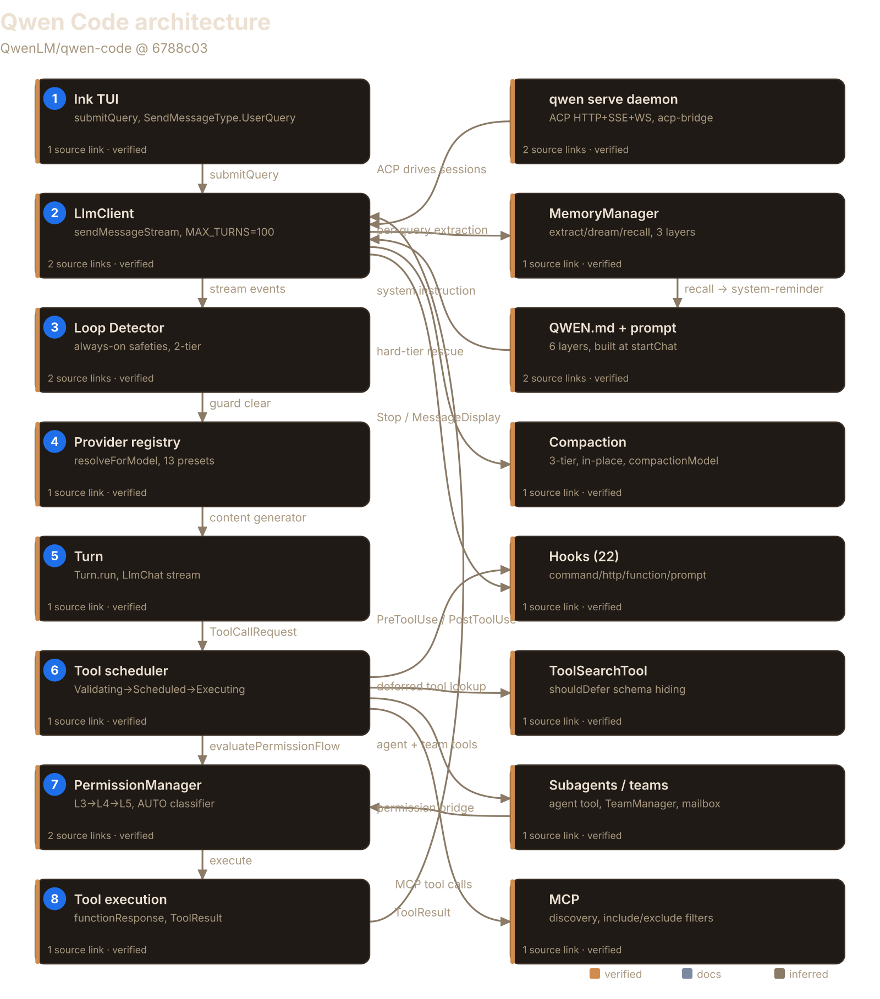
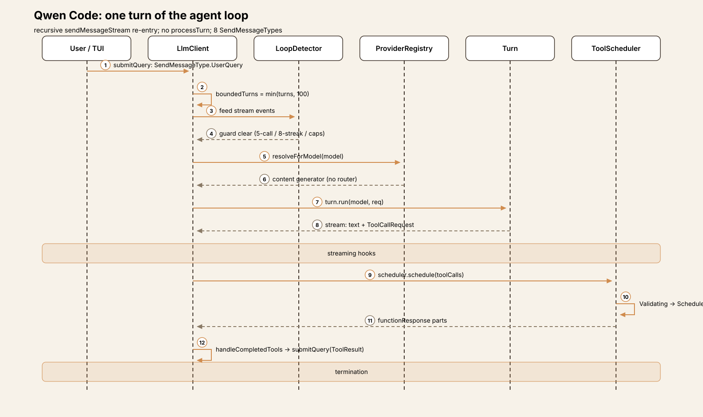
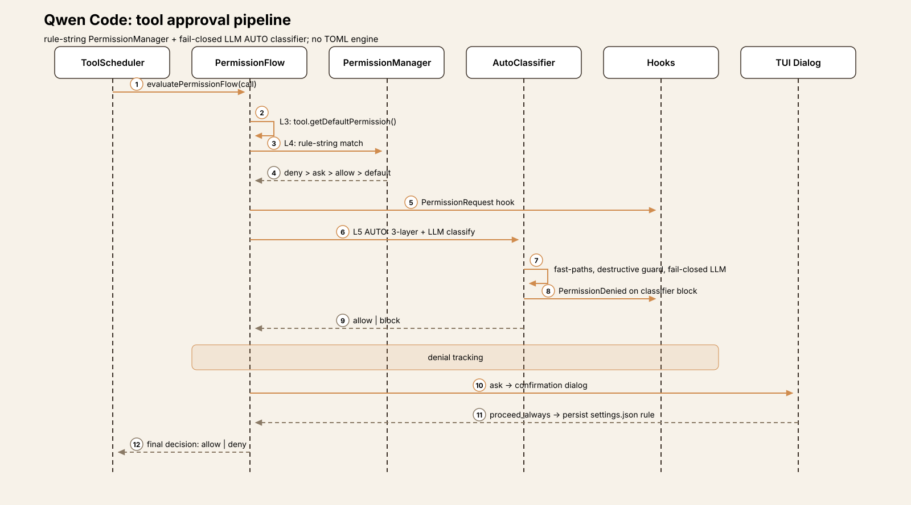
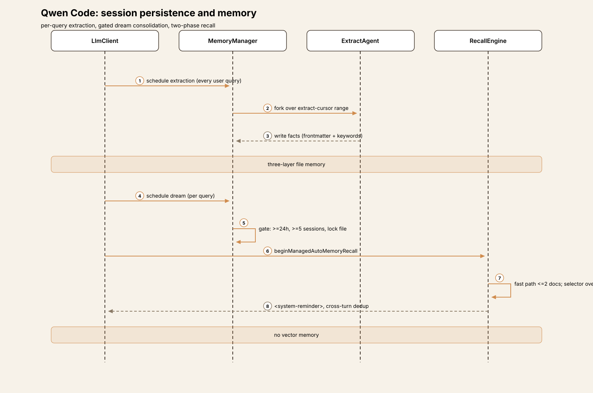
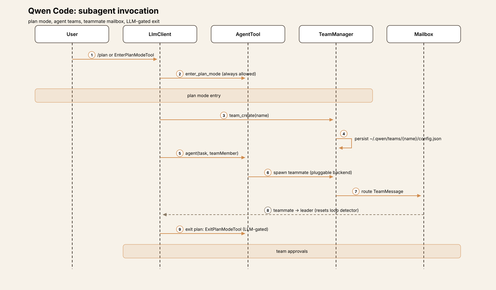
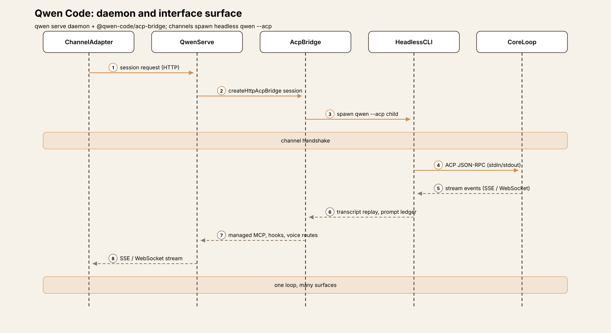

# Agent Harness Anatomy #12: Qwen Code — the fork that outgrew its parent

> **Series:** Agent Harness Anatomy — top-down dissections of real agent
> harnesses, grounded in verifiable source code. Every behavioral claim
> below carries a footnote to a pinned GitHub permalink; the full evidence
> lives in the endnotes.

## Version block

- **Repo:** [QwenLM/qwen-code](https://github.com/QwenLM/qwen-code)
- **Pinned:** tag `v0.25.0` → `6788c035698a0ada471c958d1e789e96c6cddd9b` (2026-10-05)
- **Language:** TypeScript (pnpm workspaces monorepo)
- **License:** Apache-2.0
- **Claim under test:** "An open-source, terminal-first AI agent optimized for Qwen models" (from the repo description)



## The mental model

Qwen Code is a fork of Gemini CLI v0.8.2 that kept almost nothing of its parent's signature machinery. The README is explicit: "Starting from Qwen Code v0.1, we stopped syncing with upstream and began independent development as a multi-protocol, multi-platform agent framework."[^1] That fork point predates Gemini CLI's TOML policy engine and its composite model router — so the systems that define Gemini CLI #10 simply never arrived here. Qwen rebuilt the middle from scratch: a **rule-string PermissionManager with an LLM-judged AUTO mode** in place of the TOML engine, an **explicit provider/model registry with per-vendor wire adapters** in place of the router, and an **interface layer the parent never had** — an ACP daemon (`qwen serve`), messaging channels, a Tauri desktop, an Android shell, voice, and three SDKs.[^2]

The core loop is still recognizably Gemini's — the rename sweep is mechanical (`GeminiClient` → `LlmClient` and `Llm*` type aliases prove it) — but restructured around **recursive `async *sendMessageStream` re-entry**: there is no `processTurn`; every continuation yields back into `sendMessageStream` with a decremented turn budget.[^3]

The governing idea moved from Gemini's *delegation* to *explicitness*: no per-turn router (the user picks via `/model`), no next-speaker auto-nudge (skipped by default), no policy tiers (one quaternary decision: deny > ask > allow > default).[^4] What Qwen added instead is surface area: ~54 built-in tools versus the parent's 26, a tool-search primitive Gemini never built, 22 hook types on Claude Code's taxonomy, Agent Teams, a per-query memory manager, and a tool-call parsing stack hardened for third-party servers.[^5]

The tradeoff differs from the parent's. Gemini CLI's complexity was vertical — router, scheduler, policy engine, sandbox, Conseca stacked inside one terminal program. Qwen Code's complexity is horizontal: the loop stays thin while the codebase sprawls two to three times wider across providers, runtimes, interfaces, and collaboration machinery.[^6]

## Package map

The repo is a pnpm workspaces monorepo. For this article nine areas matter:[^7]

| Area | Role | Scale |
|---|---|---|
| `packages/core/src/core/` | The loop: `LlmClient`, `Turn`, `LlmChat`, scheduler, permission flow | client.ts (~5,700 lines) |
| `packages/core/src/providers/` + `models/` + `qwen/` | Provider registry, model catalog, OAuth, content generators | 13 presets, 6 auth wires |
| `packages/core/src/permissions/` | PermissionManager, AUTO-mode classifier, destructive-command rules | autoMode.ts, classifier.ts |
| `packages/core/src/tools/` | ~54 tool classes, registry, ToolSearchTool | one class per file |
| `packages/core/src/agents/` | Subagents, Agent Teams, workflows, pluggable backends | team/, workflow-*.ts |
| `packages/core/src/hooks/` | 22 hook event types, 4 hook kinds, skill-registered hooks | hooks/types.ts |
| `packages/core/src/memory/` | MemoryManager: 3-layer file memory, extraction, dream, recall | manager.ts (~2,500 lines) |
| `packages/core/src/skills/` + `extension/` | Skills, Auto-Skills curator, Claude Code plugin converter | skill-curator.ts |
| `packages/cli/src/` | Ink TUI, `qwen serve` daemon, ACP integration, 11 channels via `packages/channels/` | run-qwen-serve.ts (~3,600 lines) |

## The core loop

The loop lives in `LlmClient.sendMessageStream` (`packages/core/src/core/client.ts:3437`). Its shape:[^8]

```typescript
const MAX_TURNS = 100;  // client.ts:207

async *sendMessageStream(request, signal, prompt_id, options, turns = MAX_TURNS, ...) {
  const boundedTurns = Math.min(turns, MAX_TURNS);
  const turn = new Turn(this.getChat(), prompt_id, goalPermit, ...);
  // ... consume turn.run() events, schedule tool calls ...
  yield* this.sendMessageStream(nextRequest, signal, prompt_id, options, boundedTurns - 1);
}
```

There is **no `processTurn`** — a repo-wide grep returns nothing; the old `processTurn` was absorbed into `sendMessageStream` itself, and every continuation re-enters it recursively with a decremented budget.[^9] The request type grew: `SendMessageType` now has eight values — `UserQuery`, `ToolResult`, `Steer` (mid-turn user input), `Retry`, `Hook`, `Cron` (scheduled prompts), `Notification` (background agents), `TeamMessage` (teammate → leader, resetting the loop detector).[^10]

`Turn.run` (`core/turn.ts:714`) wraps `LlmChat.sendMessageStream` and translates wire-stream events into `ServerLlm*` events, accumulating `pendingToolCalls`; on a wire `retry` or `model_fallback` it **clears them** before yielding, so replayed attempts can't double-execute.[^11] The CLI pump collects `ToolCallRequest` events, hands them to the scheduler, and on completion `handleCompletedTools` calls `submitQuery` back into `sendMessageStream` with `SendMessageType.ToolResult` — the loop is still split across the package boundary: **core streams and decides, the CLI schedules and feeds back**.[^12]

Termination comes from seven directions: budget exhaustion (`MAX_TURNS`), a session turn cap (goal runtime turns excluded), a **session-token-limit gate** keyed by resolved model-route identity, `LoopDetected`, API error, user cancel, or natural end — no pending tool calls, the stop-hook chain clear, and the next-speaker check saying `user`.[^13] The next-speaker check (a side query with a fixed `CHECK_PROMPT` and `{reasoning, next_speaker}` schema) exists but is **skipped by default** — Gemini CLI's auto-nudge is off here unless enabled.[^14]

Loop detection is two-tier. Always-on safeties fire regardless of the `skipLoopDetection` setting: 5 consecutive-identical tool calls, an 8-call shell-inspection stagnation streak, and a soft-100/hard-1000 per-turn tool-call cap.[^15] The opt-in heuristic layer (content/thought repetition, read-file churn, global duplicates, ABAB alternation) is disabled by default — "the documented escape hatch only relaxes the heuristics" — while result-aware guards distinguish productive re-polling from stuck loops for stateful read tools (`task_list`): repetition counts only when the *results* are also unchanged.[^16][^17]

Two newer loop stages sit before the end of a turn. A **`Stop` hook** fires through the `MessageBus` when no tool calls are pending, ahead of the next-speaker check; a blocking decision recurses with the hook's `continueReason`, with chains bounded by a stop-hook blocking cap and a fresh loop-detector budget.[^18] A **`MessageDisplay` hook** dispatcher fires repeatedly as the reply streams, with an idempotent `finish()` awaited on every exit path.[^19] New in this fork is **steer input**: `options.getSteerInput` injects user input mid-turn at a sampling boundary, recursing with `SendMessageType.Steer`; user text can carry a `+500k`-style turn-budget directive parsed by `core/turn-budget.ts` (1,000 to 100,000,000 tokens).[^20] Model resolution per call is explicit: `BaseLlmClient.resolveForModel(model)` resolves the content generator from the provider registry — the composite router is gone (no `routing/` directory, no `router.route` references).[^21]



## Trace one turn

Trace `Summarize the changes in this repo` through the interactive CLI:[^22]

1. **Input.** The Ink TUI captures the prompt; `submitQuery` enters `sendMessageStream` with `SendMessageType.UserQuery`. `UserPromptSubmit` hooks fire once per `prompt_id`.[^23]
2. **Turn budget.** `boundedTurns = Math.min(turns, 100)`; the session turn cap is checked; the session-token-limit gate is evaluated against the model-route identity.[^24]
3. **Loop guard.** The loop detector is fed one stream event at a time; the always-on safeties (5 identical calls, 8 shell-inspection stagnation, soft-100/hard-1000 caps) can abort here before the model is called.[^25]
4. **Model resolution.** No router: `resolveForModel` picks the content generator for the user's selected model/provider, resolved fresh at request time.[^26]
5. **Model call.** `Turn.run` → `LlmChat.sendMessageStream` → the wire. `MessageDisplay` hooks fire as the reply streams. The model emits text plus a `run_shell_command` call (`git log --oneline -10`).[^27]
6. **Tool request.** `Turn` yields `ToolCallRequest`; the CLI collects it and `scheduler.schedule(...)` enqueues it in the core scheduler: `ValidatingToolCall` → `ScheduledToolCall` → `ExecutingToolCall`.[^28]
7. **Permissions.** `evaluatePermissionFlow` runs L3 (the tool's intrinsic `getDefaultPermission` — shell non-read-only → ask) → L4 (`PermissionManager` rule strings, deny > ask > allow > default) → L5 (AUTO mode: three-layer filter + fail-closed LLM classifier; "Always allow" outcomes persist rules into `settings.json`).[^29]
8. **Feedback.** The tool executes; output becomes `functionResponse` parts. `handleCompletedTools` calls `submitQuery(responses, {isContinuation: true})` with `SendMessageType.ToolResult` → back to step 2 with `boundedTurns - 1`. When no tool calls are pending, the `Stop`-hook chain runs, then the next-speaker check (skipped by default → turn ends).[^30]



## Subsystem inventory


**Tool system.** ~54 concrete tool classes in `tools/` + `tools/agent/` versus 26 in the parent — plus goal, omni media, session-source, image-generation, synthetic `structured_output`, and workflow tools (~60–70 potential registrations over ~20 feature flags).[^31] The fork adds cron, plan-mode, worktree, team, and thread tools plus `send_message`, `list_agents`, `create_sub_session`, `exec`, and `tool_search`; LS is opt-in and off by default.[^32] Registration is lazy and mode-gated — `Config.registerLazyTool` stores dynamic `import()` factories, and `createToolRegistry` wires bare/sandbox/container/managed/subagent branches.[^33] And Qwen built what Gemini CLI never had: **`ToolSearchTool`** — only a curated core set is declared to the model up front; tools marked `shouldDefer=true` stay hidden until the model queries by exact `select:` or fuzzy match, then invokes through a `ToolCall` bridge without changing the active declaration list.[^34]

**Approvals.** The fork's signature subsystem, replacing Gemini's TOML policy engine entirely: no `PolicyEngine`, no `policies/*.toml`, no Conseca — and the inherited confirmation bus auto-responds `confirmed:true` with the comment "policy engine removed."[^35] Five approval modes — `plan`, `default`, `auto-edit`, `auto`, `yolo` — with **AUTO the default** (bare/safe mode and untrusted folders force manual approval); unlike Gemini, YOLO may be set persistently in `settings.json`.[^36][^37] Each tool call runs a shared **L3 → L4 → L5** flow: L3, the tool's intrinsic `getDefaultPermission()`; L4, the `PermissionManager` rule override; L5, the approval-mode override (YOLO auto-approves everything except `ask_user_question`; PLAN blocks non-read-only; AUTO_EDIT approves edit/info).[^38] Decisions are quaternary — `allow | ask | deny | default` — and rules are **strings** like `"Bash(git *)"`, `"Read(./secrets/**)"`, `"WebFetch(domain:x.com)"`, with specifier kinds auto-derived from the tool category.[^39] Evaluation order is **deny > ask > allow > default**, session rules before persistent ones, restrictive rules following canonical paths so a symlink can't widen an explicit allow.[^40] Rules come from `settings.json` `permissions.{allow,ask,deny}` (≤500 rules, ≤512 chars); "always allow" dialog outcomes write rules back into settings, and a whole-tool deny removes the tool from the registry.[^41]

**AUTO mode** is the biggest Qwen-specific addition: the default mode lets an **LLM classifier** decide per call. Three layers fire only when L4 returned `'default'` or intrinsic `'ask'`: an accept-edits fast-path for Edit/Write inside the workspace; a safe-tool allowlist of read-only built-ins (MCP tools and `send_message` excluded); a deterministic destructive-command guard that runs *before* the LLM; then the two-stage classifier (`max_tokens=32` fast path, `4096` full review).[^42] The classifier is **fail-closed** (any error → `shouldBlock=true`), consuming the transcript tail with assistant text and tool results stripped, plus host-confirmed user answers and `hints.allow`.[^43] Protected-write surfaces (`.git`, `package.json`, CI workflows, all `.qwen/` self-modification, QWEN_HOME, memory files) never take the fast path and force manual fallback outside the workspace; interpreter-led `Bash(...)` allow rules are stripped while in AUTO; denial tracking (3 consecutive blocks, 2 classifier-unavailable, 20 total) circuit-breaks to manual approval, and classified denials instruct the model not to seek equivalent paths.[^44][^45][^46]

**Sandbox.** Two mechanisms. (a) A new **Linux-only execution sandbox**: shell/payload execution inside `bwrap` or `landlock` backends via relay binaries; non-Linux throws "Tool execution sandbox requires Linux." Policy is `filesystem: 'read-only' | 'workspace-write'`, `network: 'open' | 'closed'`, probed at startup, and incompatible with ACP, worktrees, LSP, MCP, and extensions (fatal config error if combined).[^47] (b) The legacy whole-CLI container sandbox from v0.8.2 (`--sandbox` with `docker`/`podman`/`sandbox-exec`); `--sandbox bwrap` is a fatal error redirecting to `tools.executionSandbox`.[^48]

**Model providers.** The other full rebuild: six auth wires — `openai`, `openai-responses`, `qwen-oauth`, `gemini`, `vertex-ai`, `anthropic` — dispatch to per-protocol generators (lazy-loaded, plus a logging wrapper), with the `openai` wire picking among 10 host-sniffed adapters.[^49] A declarative **13-preset registry** declares protocol, baseUrl, env key, models, and discovery per preset; a setup wizard writes an install plan to settings, and discovery-capable providers fetch `GET {baseUrl}/models` at setup.[^50] The runtime `ModelRegistry` is keyed `AuthType → compositeKey(id + baseUrl)` with a typo guard, per-model `wireApi` routing, and `switchModel` with rollback snapshots.[^51] **Auth is Alibaba-centric**: the primary Qwen path is an RFC 7636 PKCE device-code flow against `chat.qwen.ai` (credentials in `~/.qwen/oauth_creds.json`), consumed as bearer tokens against DashScope's OpenAI-compatible endpoint; two API-key plans have regional endpoints; generic provider keys round out the set.[^52][^53] Deep Qwen-family logic is everywhere: `QwenContentGenerator` subclasses `OpenAIContentGenerator`; `isQwenFamilyWireModel()` gates the DashScope reasoning-knob mapping and a regex modality table (generic `qwen*` → text-only, fail-closed); a `<think>` tagged-thinking parser converts inline reasoning to `thought: true` parts.[^54] Model knowledge comes from a bundled models.dev projection refreshed in the background (serving the *next* process), feeding modality defaults and context-window detection; the Qwen OAuth models are hard-coded.[^55][^56]

**Prompt construction.** Six ordered layers — `base` (identity "You are Qwen Code, … developed by Alibaba Group …", overridable via `QWEN_SYSTEM_IDENTITY_MD` or fully replaced via `QWEN_SYSTEM_MD`), `mediaGuidance`, `contextFiles` (the QWEN.md hierarchy), `appendPrompt`, `gitStatus` (once per session), and `autoMemory` — **always last** "so a save invalidates the shortest possible cached prompt prefix."[^57] Built once at `startChat`, refreshed only on events (memory writes, `/cd`, output-language changes), not per turn.[^58] Cache-aware: the stable layers are recorded via `setStaticSystemPrefix`, and the Anthropic converter splits at that boundary into two `cache_control` blocks (stable prefix with optional cross-session `scope: 'global'`; volatile per-session suffix); the OpenAI pipeline has separate `prompt_cache_breakpoint` markers for DashScope.[^59] Startup context is a single user message of `<system-reminder>` parts (MCP instructions, skills snapshot capped at 8000 chars, deferred-tools reminder) ordered stable-first for prefix caching, and re-prepended after auto-compaction.[^60] Per-turn delivery points unshift memory recall to the front of the reminder block and append a `tool_result` point *after* tool responses so functionCall/functionResponse pairs are never split.[^61]

**Memory/session.** Sessions persist as append-only JSONL — `<uuid>.jsonl` under `~/.qwen/projects/<cwd>/chats`, `randomUUID` ids, the global dir renamed `~/.gemini` → `~/.qwen`.[^62] Compaction is redesigned on claude-code lines: **three tiers** — `warn = auto − 20_000`, `auto = min(0.85 × window, window − 20_000 − 13_000)`, `hard = window − 3_000` — with a hard-tier rescue forcing in-flight compaction, run **in-place** (no restart), a dedicated `compactionModel` setting, and a 3-failure circuit breaker.[^63] Context files became `QWEN.md` + `AGENTS.md` + `QWEN.local.md` (gitignored per-developer override, excluded from upward search); Gemini's Tier-3 JIT discovery is gone; the write tools are `manage_memory` + `search_memory`.[^64][^65] Gemini's background extraction service is gone — replaced by **`MemoryManager`**, a three-layer file memory (project, user `~/.qwen/memories/`, team `<gitRoot>/.qwen/team-memory/` synced via git): no SQLite, no embeddings — frontmatter-keyword scans plus a model selector.[^66][^67] **Extraction runs after every user query** through a cursor-based forked agent; **dream** is also scheduled per query but gated (≥24h, ≥5 sessions, different session, lock file); **recall** is a two-phase prefetch (fast path ≤2 docs + model selector over ≤200 candidates) delivered as `<system-reminder>` with cross-turn dedup.[^68][^69][^70]



**Hooks.** 11 → **22 event types** on Claude Code's taxonomy — `PreToolUse`, `PostToolUse`, `PostToolUseFailure`, `PostToolBatch`, `Notification`, `UserPromptSubmit`, `UserPromptExpansion`, `SessionStart`, `Stop`, `MessageDisplay`, `SubagentStart`, `SubagentStop`, `PreCompact`, `PostCompact`, `SessionEnd`, `SessionDelete`, `PermissionRequest`, `PermissionDenied`, `StopFailure`, `TodoCreated`/`TodoCompleted` ("Qwen Code specific"), `InstructionsLoaded`.[^71] Hook kinds grew to **four** — `command`, `http` (with an SSRF guard), `function`, `prompt` — and sources are Project, User, System, Extensions, plus **Session** (new): **skills can register session-scoped hooks from frontmatter**, auto-removed with `once: true`.[^72][^73] Permission hooks get a `PermissionRequest` decision point before the dialog and a `PermissionDenied` event on AUTO-mode classifier blocks.[^74]

**Subagents and planning.** The model-facing subagent tool is renamed **`agent`** (`task` survives as a legacy alias).[^75] **Plan Mode** is first-class: `EnterPlanModeTool` (kind `Think`, always allowed since entering *lowers* privileges) is "the only door into plan mode in headless/ACP sessions," with YOLO-entry a no-op unless user-requested; the exit is an LLM-gated `ExitPlanModeTool`.[^76] **Agent Teams** are a full subsystem: a `TeamManager`, persisted `TeamFile`s at `~/.qwen/teams/{team-name}/config.json`, `team_create`/`team_delete` tools, a teammate **mailbox**, a distributed **task board**, and a leader permission bridge forwarding approvals with badges.[^77] Around them: checkpointed resumable **dynamic workflows**, resumable **background agents** with a notification queue, pluggable agent backends, and a **native LSP client** plus a model-facing `lsp` tool.[^78]



**Skills.** The SKILL.md model survives with dirs renamed to `.qwen` — `.qwen/skills/`, `.qwen/archived-skills/`, and a `.qwen/pending-skills/` staging dir beside the skills root so discovery never picks up unconfirmed skills.[^79] **Auto-Skills** replaces the background skill-extraction agent: a scheduled curator that auto-generates skills weekly, marks stale after 30 days, archives after 90, and surfaces via `/curator`.[^80] `extension/` adds converters that **import Claude Code plugins**.[^81] MCP is the least-changed extensibility pillar: discovery with `includeTools`/`excludeTools` filtering and the `--mcpServerCommand` injection path carried over.[^82]



**Interfaces.** The biggest delta of all. `qwen serve` is a ~3,600-line Express daemon (HTTP+HTTPS, TLS) hosting sessions over **ACP on HTTP + SSE + WebSocket** serving the web UI and exposing managed MCP, hooks, and voice/session routes.[^83] The shared protocol core is factored out as **`@qwen-code/acp-bridge`** (~27 modules), which the daemon builds on.[^84] Eleven **channel adapters** (telegram, weixin, dingtalk, wecom, feishu, qqbot, github, gitlab, dws, email, plugin example) spawn headless `qwen --acp` children via a `ChannelAgentBridge` with a private-parent capability handshake — channels, Zed, and the web shells all drive the same core loop by speaking ACP to a spawned CLI.[^85] The rest of the surface: a browser **web shell**, a **Tauri desktop** app that starts `qwen serve` on an ephemeral loopback port with a per-launch bearer token and opens the daemon-served Web Shell in the native window, a **VS Code companion** extension, a **Zed manifest-only stub**, a vendored **CUA driver** for desktop/browser automation, a **mobile MCP** server, an **Android WebView shell**, a standalone `node-repl` MCP server, and browser-use bindings.[^86] The voice path (native mic → realtime voice control plane → Electron macOS host → daemon voice routes) is present in package structure but its end-to-end flow was not traced.[^87] Three **SDKs** ship: TypeScript (`@qwen-code/sdk`, experimental, `query({prompt, options})`), Python (`qwen-code-sdk`, alpha), and Java (Maven multi-module with a managed agent server and runtime broker).[^88]

**Failure handling.** `retryWithBackoff` defaults to 7 attempts, 1.5s initial / 30s max delay, jitter, abort-awareness, and stderr heartbeats; an **unattended mode** (`QWEN_CODE_UNATTENDED_RETRY=true`) retries transient 429/529 capacity errors indefinitely — backoff capped at 5 min, absolute single-wait cap 6h — and is explicitly *not* auto-enabled on CI.[^89] A transport retry allow-list covers `ECONNRESET`, `ETIMEDOUT`, and undici socket/body timeouts, plus status-less upstream gateway errors pushed into an already-200 SSE stream; stream watchdogs cover silent and drip-fed never-completing streams, with inactivity errors classified as retryable.[^90] Retry and model-fallback events clear the turn's accumulated tool calls while the loop-guard feed rolls back streaks and cap-trackers, so a replayed attempt doesn't trip the detector.[^91] Cross-restart **session recovery** classifies the persisted tail (`clean | interrupted_prompt | interrupted_turn | degraded_history`): orphaned user entries re-submit with Retry semantics, and orphaned `functionCall`s are closed with **synthesized error `functionResponse`s** submitted as a ToolResult — a legal continuation after a crash mid-tool-run.[^92] Incomplete tool-call args (truncated by the output-token limit) carry a non-enumerable symbol marker kept separate from the user-visible diagnosis, so fixing a finish-reason rewrite can't silently disarm the half-written-call guard; a tool-response finalizer handles boundary diagnostics and persist-and-truncate, and the compaction cheap-gate NOOPs after 3 consecutive failures.[^93][^94]

## What it deliberately omits

- **No per-turn model router.** The composite strategy chain with sticky sequencing never arrived from the parent; model selection is explicit (`/model`, `switchModel`) and resolved per call.
- **No TOML policy engine.** Gemini's tiered policies are gone; rules are plain strings in `settings.json`, and the confirmation bus is a `confirmed:true` passthrough.
- **No vector memory.** Sessions are JSONL, memory is frontmatter markdown — retrieval is keyword scans plus a model selector, not embeddings.
- **No non-Linux sandbox.** macOS Seatbelt and Windows helpers were removed, not replaced; the execution sandbox throws on other platforms.
- **No JIT context discovery.** Gemini's Tier-3 `discoverContext` per-access injection is absent.
- **No idle-time background extraction.** Memory extraction and dream-consolidation run per user query instead of on an idle timer.[^95]

## Comparison matrix row

| # | Dimension | Qwen Code (v0.25.0) |
|---|---|---|
| 1 | Agent loop | Recursive `sendMessageStream` re-entry (no `processTurn`); `MAX_TURNS=100` + session-turn cap + session-token-limit gate; 8 `SendMessageType`s; next-speaker check skip-by-default; Stop/MessageDisplay hook stages |
| 2 | Tool system | ~54 built-in classes + goal/omni/workflow tools (≈60–70 potential); lazy mode-gated registration; `ToolSearchTool` + `shouldDefer` schema hiding; scheduler lifecycle retained |
| 3 | Model providers | 6-auth-wire dispatch; 13-preset registry + wizard; **no per-turn router** — explicit `/model` selection; models.dev bundled/live catalog; 10 host-sniffed OpenAI adapters; deep Qwen-family logic |
| 4 | Prompt construction | 6-layer system prompt (autoMemory last); frozen at `startChat`; Anthropic two-block `cache_control` split; `<system-reminder>` prelude re-prepended after compaction; claude-code 9-section `<state_snapshot>` |
| 5 | Memory/session | JSONL `<uuid>.jsonl` under `~/.qwen/projects/<cwd>/chats`; 3-tier compaction (warn/auto 0.85/hard); QWEN.md + AGENTS.md + QWEN.local.md; MemoryManager (project/user/team layers), per-query extraction + gated dream; **no vector DB** |
| 6 | Reasoning/planning | `agent` tool (task alias); Plan Mode (enter/exit, ACP/headless entry); Agent Teams (mailbox, task board, persisted teams, leader permission bridge); workflow checkpoints; goal runtime; native LSP |
| 7 | Extensibility | MCP (least-changed); 22 hooks in 4 kinds, Claude-Code-convergent; skills register session hooks; Auto-Skills weekly curator; Claude Code plugin converter |
| 8 | Interfaces | Ink TUI; `qwen serve` ACP daemon (HTTP+SSE+WS) + `@qwen-code/acp-bridge`; 11 channel adapters spawning headless `qwen --acp`; web shell; Tauri desktop; VS Code companion; Zed thin stub; voice; Android shell; TS/Python/Java SDKs |
| 9 | Failure handling | `retryWithBackoff` (7 attempts, 1.5s→30s) + unattended infinite-retry mode; stream-transport allow-list + watchdogs; two-tier loop detector; result-aware guards; cross-restart session recovery with synthetic tool responses |
| 10 | Security model | AUTO default: rule-string PermissionManager (deny>ask>allow>default) + fail-closed LLM classifier + destructive-command guard + protected writes; confirmation bus gutted; Linux-only bwrap/landlock sandbox; **YOLO settable in settings.json** |

## Endnotes

[^1]: `README.md:214` (fork of Gemini CLI v0.8.2; independent since Qwen Code v0.1; "multi-protocol, multi-platform agent framework").
[^2]: Rebuilt layers: `packages/core/src/permissions/` (rule-string `permission-manager.ts`, `autoMode.ts`, `classifier.ts`); `packages/core/src/providers/all-providers.ts:54-68` (13-preset registry); `packages/cli/src/serve/run-qwen-serve.ts` (ACP daemon); `packages/channels/` (11 adapters).
[^3]: `packages/core/src/core/client.ts:438` (`LlmClient`); `core/turn.ts:173` (`GeminiErrorEventValue = LlmErrorEventValue` alias proves mechanical rename); `core/client.ts:3437, 3442` (`sendMessageStream` async-generator signature).
[^4]: No `routing/` directory and zero `router.route` references in `packages/core/src` (absence verified by grep); `packages/core/src/core/client.ts:4361` (`BaseLlmClient.resolveForModel`); `packages/core/src/config/config.ts:3610` (`skipNextSpeakerCheck ?? true`); `packages/core/src/permissions/types.ts:12-18` (quaternary `PermissionDecision`).
[^5]: 54 concrete tool classes counted by class grep over `packages/core/src/tools/` (+ `tools/agent/`), excluding discovered/mock/base classes; `packages/core/src/tools/tool-search.ts:8-20` (`ToolSearchTool`, `shouldDefer`); `packages/core/src/hooks/types.ts:24-69` (22 `HookEventName` members); `packages/core/src/agents/team/` (`TeamManager.ts` etc.); `packages/core/src/memory/manager.ts` (~2,500 lines); `packages/core/src/openaiContentGenerator/taggedThinkingParser.ts:1-50`; `packages/core/src/core/xml-tool-call-fallback.ts:10-30`.
[^6]: New top-level dirs in `packages/core/src/` verified by listing: `qwen/`, `providers/`, `models/`, `permissions/`, `goals/`, `followup/`, `omni/`, `code-mode/`, `managed-runtime/`, `confirmation-bus/`, `ipc/`, `ide/`, `lsp/`, `memory/`, `telemetry/`, `skills/`, `output/`, `resources/`, `extension/`; `scheduler/` → folded into `core/coreToolScheduler.ts`, `policy/` → per-concern files in `core/`, `routing/` → `providers/` + `models/`, `context/` → dispersed.
[^7]: Package layout and line counts from the pinned tree; `packages/core/src/core/client.ts` spans beyond line 5690 (`generateContent`); `packages/core/src/memory/manager.ts` ~2,500 lines; `packages/cli/src/serve/run-qwen-serve.ts` ~3,600+ lines.
[^8]: `packages/core/src/core/client.ts:3437` (`sendMessageStream`); `client.ts:207` (`MAX_TURNS = 100`); continuations pass `boundedTurns - 1` (steer: `client.ts:~5061`; stop-hook: `client.ts:~5212/~5313`; next-speaker: `client.ts:~5428`).
[^9]: Grep for `processTurn` across `packages/core/src/core/` returns zero hits (absence verified).
[^10]: `packages/core/src/core/client.ts:212-227` (`SendMessageType` eight values); `TeamMessage` resets loop-detector + interaction span.
[^11]: `packages/core/src/core/turn.ts:697, 714` (`Turn.run`, `pendingToolCalls` accumulation); retry/model_fallback clearing in `run()` body (method-level verified).
[^12]: `packages/cli/src/ui/hooks/use-llm-stream.ts:283` (`scheduler.schedule`); `use-llm-stream.ts:1131` (`handleCompletedTools`); `use-llm-stream.ts:3555` (`submitQuery`); `live-session.ts:964` (second scheduler hand-off).
[^13]: `packages/core/src/core/client.ts:207, 4310-4315` (max turns, `'max turns exhausted'`); `client.ts:~4291` (`MaxSessionTurns`); `client.ts:4305-4309` (goal turns excluded); `client.ts:4350-4405` (`SessionTokenLimitExceeded`, per model-route identity); `client.ts:4686-4693` (`LoopDetected`); `client.ts:5030-5060` (API error); `client.ts:5360-5450` (natural end: no pending calls, stop-hook chain clear, next-speaker `user`).
[^14]: `packages/core/src/utils/nextSpeakerChecker.ts:19-29` (`CHECK_PROMPT`); `nextSpeakerChecker.ts:31-44` (`{reasoning, next_speaker}` schema); `nextSpeakerChecker.ts:60-90` (short-circuits); `packages/core/src/config/config.ts:3610` (`skipNextSpeakerCheck ?? true`, default off).
[^15]: `packages/core/src/services/loopDetectionService.ts:71` (`TOOL_CALL_LOOP_THRESHOLD = 5`); `loopDetectionService.ts:162` (`SHELL_COMMAND_STAGNATION_THRESHOLD = 8`); `loopDetectionService.ts:176-191` (soft 100 / hard 1000 caps); `packages/core/src/core/client.ts:4876` (`checkAlwaysOnSafeties`, fires before and regardless of `skipLoopDetection`); `packages/core/src/config/config.ts:1937` (`validateMaxToolCallsPerTurn`).
[^16]: `packages/core/src/services/loopDetectionService.ts:141-156` (file-read churn 8-in-15, cold-start exemption); `:168` (global duplicates 6); `:172` (ABAB 3 cycles); `:139` (thought repetition 3); `packages/core/src/core/client.ts:4903-4918` (heuristic layer opt-in, `skipLoopDetection` default true, "documented escape hatch only relaxes the heuristics").
[^17]: `packages/core/src/services/loopDetectionService.ts:559` (`recordToolResultByCallId`, fed at `client.ts:4674-4701`); `:131` (`STATEFUL_READ_TOOLS = {'task_list'}`); `packages/core/src/core/client.ts:4767-4780, 4883-4891` (call-id dedup, guard rollback on retry).
[^18]: `packages/core/src/core/client.ts:~5095-5360` (Stop hook via MessageBus before next-speaker check); `client.ts:5180-5360` (`stopHookBlockingCap`, `StopHookLoop`); `client.ts:~5295-5304` (fresh loop-detector budget on stop-hook continuations).
[^19]: `packages/core/src/core/client.ts:4737-4765, 5021-5028` (`MessageDisplay` dispatcher, `is_final`, idempotent `finish()` on every exit path).
[^20]: `packages/core/src/core/client.ts:4320-4355` (`takeSteerInput`); `client.ts:5049-5095` (steered recursion, `SendMessageType.Steer`, stop-hook chain cleared); `packages/core/src/core/turn-budget.ts:~35, ~42` (`+500k` parsing, `MAX_TURN_BUDGET_TOKENS = 100_000_000`, `MIN_TURN_BUDGET_TOKENS = 1_000`).
[^21]: `packages/core/src/core/client.ts:4361` (`resolveForModel`); `packages/core/src/core/client.ts:4355-4369` (`\0`-suffixed route selector); `packages/core/src/config/config.ts:7415` (`Config.switchModel`); `packages/core/src/models/modelsConfig.ts:511-546` (`ModelsConfig.switchModel`); `config/config.ts:5800-5823` (`onModelChange` → `refreshAuth`).
[^22]: Trace reconstructed from the code paths cited per step; no live run was performed.
[^23]: `packages/core/src/hooks/types.ts:25-68` (`UserPromptSubmit` in the 22-event enum); `packages/cli/src/ui/hooks/use-llm-stream.ts:3555` (`submitQuery` → `sendMessageStream` with `SendMessageType.UserQuery`).
[^24]: `packages/core/src/core/client.ts:207, 4310-4315` (`boundedTurns`, max-turns end); `client.ts:~4291` (session-turn cap); `client.ts:4350-4405` (session-token-limit gate).
[^25]: `packages/core/src/services/loopDetectionService.ts:71, 162, 176-191` (always-on thresholds); `packages/core/src/core/client.ts:4876-4891` (always-on check before model call).
[^26]: `packages/core/src/core/client.ts:4361` (`resolveForModel`); `packages/core/src/providers/` + `packages/core/src/models/` (registry/catalog); no `routing/` directory.
[^27]: `packages/core/src/core/turn.ts:714` (`Turn.run`); `packages/core/src/core/client.ts:4737-4765` (`MessageDisplay` hooks during streaming).
[^28]: `packages/cli/src/ui/hooks/use-llm-stream.ts:283` (`scheduler.schedule`); `packages/core/src/core/coreToolScheduler.ts:605-717` (`ValidatingToolCall` → `ScheduledToolCall` → `ExecutingToolCall`).
[^29]: `packages/core/src/core/permissionFlow.ts:64-106` (`evaluatePermissionFlow` L3 → L4); `permissionFlow.ts:178-232` (L5 overrides: YOLO, AUTO_EDIT, PLAN, AUTO); `packages/core/src/permissions/permission-manager.ts:469-489` (`evaluateSingle`, deny > ask > allow > default); `packages/core/src/permissions/permission-manager.ts:529-577` (compound shell split); `permission-manager.ts:358-395` (virtual-op escalation-only); `packages/core/src/permissions/autoMode.ts:1059-1100` (`evaluateAutoMode`, three-layer + classifier); `packages/core/src/permissions/classifier.ts:13-16` (fail-closed); `packages/core/src/core/coreToolScheduler.ts:3955` (`ask_user_question` always confirms); `packages/core/src/core/permission-helpers.ts:182-245` (`persistPermissionOutcome`).
[^30]: `packages/cli/src/ui/hooks/use-llm-stream.ts:1131` (`handleCompletedTools`); `use-llm-stream.ts:3555` (`submitQuery` with `SendMessageType.ToolResult`); `packages/core/src/core/client.ts:~5095-5360` (Stop-hook chain); `packages/core/src/config/config.ts:3610` (next-speaker skipped by default).
[^31]: 54 named tool classes in `packages/core/src/tools/` + `tools/agent/` (class grep, excluding discovered/mock/base); `packages/core/src/config/config.ts:12368-12390` (goal tools); `config.ts:12909-13013` (15 omni media tools); `config.ts:12341-12363` (synthetic `structured_output`); `config.ts:12715` (session-source tool); `config.ts:12709` (image-generation tool); `config.ts:12887` (workflow tool); the ≈60–70 figure is a ceiling over ~20 feature flags (INFERRED from branch structure).
[^32]: Gemini-era basics + Qwen additions enumerated from `packages/core/src/config/config.ts:12314-13025` (`createToolRegistry` branches): cron trio + `loop_wakeup`; `enter`/`exit_plan_mode`; `enter`/`exit_worktree`; 7 team tools (agent-team flag); 6 thread tools (workspace-agent sessions); `send_message`; `list_agents`; `create_sub_session` (daemon/ACP only); `exec` (code-mode only); `tool_search`; LS opt-in.
[^33]: `packages/core/src/config/config.ts:12106` (`registerLazyTool`, dynamic `import()` factories); `config.ts:12298` (`createToolRegistry`); `config.ts:12314-12536` (mode branches: bare / shell-sandbox / container / managed / subagent); `forSubAgent` strips structured-output, workflow, `request_shutdown`.
[^34]: `packages/core/src/tools/tool-search.ts:8-20` (`ToolSearchTool`, `shouldDefer` schema hiding, exact `select:` + fuzzy match, `ToolCall` bridge); registered in standard and execution-environment branches (`packages/core/src/config/config.ts:12546-12549`, `:12462-12465`).
[^35]: No `policy/` dir, no `PolicyEngine`, no TOML files, no Conseca, no `safety/` dir — all verified by repo-wide grep under `packages/{core,cli}/src` (zero hits); `packages/core/src/confirmation-bus/message-bus.ts:49-56` (`TOOL_CONFIRMATION_REQUEST` auto-responds `confirmed:true`, "policy engine removed").
[^36]: `packages/core/src/config/approval-mode.ts:7-13` (enum: `plan | default | auto-edit | auto | yolo`); `packages/core/src/config/config.ts:3393` (`approvalMode ?? ApprovalMode.AUTO`); `packages/cli/src/config/config.ts:1908-1910` (CLI falls through to AUTO); `packages/cli/src/config/settingsSchema.ts:3230` (schema default AUTO); `packages/cli/src/config/config.ts:1905-1923` (bare/safe → DEFAULT; untrusted folder forces DEFAULT).
[^37]: `packages/cli/src/config/settingsSchema.ts:3224-3243` (YOLO as a plain settings option; no yolo-restriction error found); `packages/cli/src/config/approval-mode-value.ts:29-34` (`auto_edit`/`autoedit` aliases); `packages/cli/src/config/top-level-options.ts:243-255` (`--yolo`/`--approval-mode` flags); `packages/cli/src/config/config.ts:782-783` (`--yolo` + `--approval-mode` is fatal).
[^38]: `packages/core/src/core/permissionFlow.ts:64-106` (`evaluatePermissionFlow`); `permissionFlow.ts:178-232` (`needsConfirmation` / `isPlanModeBlocked` / `isAutoEditApproved`); `packages/core/src/tools/enterPlanMode.ts:81-83` (`enter_plan_mode` L3 → allow); `packages/core/src/core/permission-helpers.ts:128-148` (PM skipped when L3 denied); `packages/core/src/core/coreToolScheduler.ts:3549-3559` (`fixed_policy` skips interactive flow); `coreToolScheduler.ts:4293-4316` (background agents auto-deny); `coreToolScheduler.ts:4095-4125` (non-interactive denies outright).
[^39]: `packages/core/src/permissions/types.ts:12-18` (`PermissionDecision`); `types.ts:30-46, 54-64` (rule-string forms and examples); `types.ts:48-72` (specifier kinds: command/path/domain/literal, `key:value` matchers).
[^40]: `packages/core/src/permissions/permission-manager.ts:469-489` (`evaluateSingle`; deny > ask > allow > default; session rules before persistent); `permission-manager.ts:469-474` (restrictive rules canonical, allow rules lexical).
[^41]: `packages/cli/src/config/permission-settings.ts:54-72` (`readPermissionRuleSet`); `permission-settings.ts:14-15` (≤500 rules, ≤512 chars); `permissions/permission-manager.ts:236-246` (settings merge); `permission-manager.ts:238-256` (`coreTools`/`allowedTools`/`excludeTools` folded into rules); `packages/core/src/tools/tools.ts:1274-1291` (`ToolConfirmationOutcome`: `proceed_always`, `proceed_always_project`, `proceed_always_user`, `proceed_once_and_switch_to_default`, …); `packages/core/src/core/permission-helpers.ts:182-245` (`persistPermissionOutcome`); `permission-manager.ts:740-827` (`getToolRegistrationStatus`: whole-tool deny → not registered; `eager` allowlist demotes to deferred).
[^42]: `packages/core/src/permissions/autoMode.ts:1059-1100` (`evaluateAutoMode`; fires only when L4 = `'default'` or intrinsic `'ask'`; skipped under explicit user ask rule); `autoMode.ts:784-808` (L5.1 accept-edits fast-path); `autoMode.ts:56-120` (L5.2 `SAFE_TOOL_ALLOWLIST`; MCP and `send_message` excluded); `autoMode.ts:1102-1126` (L5.2.5 deterministic destructive-command guard); `packages/core/src/permissions/destructive-commands.ts` (guard rules).
[^43]: `packages/core/src/permissions/classifier.ts:7-16` (stage 1: `max_tokens=32`, thinking off, ~300ms, `STAGE1_TIMEOUT_MS=10_000`; stage 2: `max_tokens=4096`, `STAGE2_TIMEOUT_MS=30_000`); `classifier.ts:13-16` (fail-closed: API error/timeout/schema failure → `shouldBlock=true`); `permissions/classifier-transcript.ts` (transcript-tail stripping); `permissions/trusted-user-answers.ts`; `packages/core/src/config/config.ts:641-643` (`hints.allow`).
[^44]: `packages/core/src/permissions/autoMode.ts:122-199` (protected-write patterns + `isAutoModeProtectedWritePath`, realpath resolution); `autoMode.ts:256-290` (classifier `allow` on protected write → review); `autoMode.ts:1128-1150` (`external_write`/`external_directory` manual fallbacks).
[^45]: `packages/core/src/permissions/dangerousRules.ts:24-75` (55-token interpreter/shell/package-runner/remote-shell list); `packages/core/src/permissions/permission-manager.ts:198-207` (`strippedAllowRules`: stripped on AUTO entry, restored on exit, `settings.json` untouched).
[^46]: `packages/core/src/permissions/denialTracking.ts:41-46` (`AUTO_MODE_DENIAL_LIMITS`: 3 consecutive blocks, 2 classifier-unavailable, 20 total → manual); `packages/core/src/permissions/autoMode.ts:688-694` (`AUTO_MODE_DENIAL_GUIDANCE`); `packages/core/src/core/coreToolScheduler.ts:3867-3888` (`firePermissionDeniedEvent`).
[^47]: `packages/core/src/sandbox/sandbox-execution.ts:32, 66-76` (`sandboxBwrapRelay.js`/`sandboxLandlockRelay.js`/`sandboxFileWorker.js`); `sandbox-execution.ts:127-128` ("Tool execution sandbox requires Linux."); `sandbox-execution.ts:34-48` (filesystem/network policy, backends); `packages/core/src/sandbox/runtime-shell-policy.ts:100-126` (admission checks); `packages/cli/src/config/execution-sandbox-settings.ts:18-60` (`tools.executionSandbox` strict schema); `packages/core/src/sandbox/runtime-shell-policy.ts:143-170` (startup probe, bwrap first/landlock fallback); `packages/cli/src/config/config.ts:1736-1754` (fatal with ACP/worktrees/LSP/MCP/extensions).
[^48]: `packages/cli/src/config/sandboxConfig.ts:24-36, 128-143` (legacy `--sandbox`: `docker`, `podman`, `sandbox-exec`); `packages/cli/src/config/execution-sandbox-settings.ts:29-32` + `packages/cli/src/config/config.ts:639-640` (`--sandbox bwrap` fatal, redirect to `tools.executionSandbox`).
[^49]: `packages/core/src/utils/auth-type.ts:8-15` (six `AuthType` values); `packages/core/src/core/contentGenerator.ts:530-596` (`createContentGenerator` dispatch); `contentGenerator.ts:468-528` (`LazyContentGenerator` + `LoggingContentGenerator`); `packages/core/src/core/openaiContentGenerator/index.ts:62+` (10 host-sniffed `OpenAICompatibleProvider` adapters).
[^50]: `packages/core/src/providers/all-providers.ts:54-68` (13 presets, `alibaba` vs `third-party` `uiGroup`); `packages/core/src/providers/types.ts:42-135` (`ProviderConfig`); `packages/core/src/providers/provider-config.ts:317` (`buildInstallPlan`); `packages/core/src/providers/install.ts:167` (`applyProviderInstallPlan`); `packages/core/src/providers/model-discovery.ts:89-132` (`GET {baseUrl}/models`, 5s timeout, 1MB cap, sanitized ids); `packages/core/src/providers/presets/alibaba-standard.ts:10-38` (4 regional DashScope hosts), `:41-80` (Qwen models, `reasoning.toggleOnly`, 1M context).
[^51]: `packages/core/src/models/modelRegistry.ts:177` (`AuthType → compositeKey(id + baseUrl)`); `modelRegistry.ts:45-82` (typo guard on unknown provider ids); `modelRegistry.ts:84-108` (`resolveModelProtocol`, per-model `wireApi`); `packages/core/src/models/modelsConfig.ts:558-586` (`switchModel` with rollback snapshots); `packages/cli/src/ui/commands/authCommand.ts:16-40` (`/auth` dialog).
[^52]: `packages/core/src/qwen/qwenOAuth2.ts:32-42` (device-code endpoints, client id `f0304373b74a44d2b584a3fb70ca9e56`, scope `openid profile email model.completion`); `qwenOAuth2.ts:866-940` (PKCE pair → device authorization → browser at `verification_uri_complete` → poll every 2s); `qwenOAuth2.ts:41,1256` + `packages/cli/src/config/storage-paths-lite.ts:12,157-168` (`~/.qwen/oauth_creds.json`); `packages/core/src/qwen/qwenContentGenerator.ts:57-135` (DashScope compatible-mode endpoint, dynamic `resource_url`, 401/403 refresh with one retry); `packages/core/src/core/contentGenerator.ts:326` (`QWEN_OAUTH` bypasses API-key validation); `packages/core/src/qwen/sharedTokenManager.ts` (token pairing + refresh).
[^53]: `packages/core/src/providers/presets/alibaba-coding-plan.ts:14-18` (`BAILIAN_CODING_PLAN_API_KEY`, China vs intl endpoints); `packages/core/src/providers/presets/alibaba-token-plan.ts:14-18` (`BAILIAN_TOKEN_PLAN_API_KEY`, Beijing vs Singapore endpoints); `packages/cli/src/commands/auth.ts:18-40` (old `qwen auth` removed → migration notice); `packages/cli/src/config/auth.ts:24-29` (`DEFAULT_ENV_KEYS` for generic providers).
[^54]: `packages/core/src/core/modalityDefaults.ts:143-150` (`isQwenFamilyWireModel`: qwen* ids + `coder-model`); `packages/core/src/core/openaiContentGenerator/provider/dashscope.ts:57-100` (`selectDashScopeThinkingKnob`: low/medium/high/xhigh/max → `enable_thinking`/`reasoning_effort`/`thinking_budget`, extra_body > samplingParams > reasoning); `packages/core/src/core/modalityDefaults.ts:29-100` (`MODALITY_PATTERNS` regex table; generic `qwen*` → text-only fail-closed); `packages/core/src/core/openaiContentGenerator/taggedThinkingParser.ts:1-50` (`<think>`/`<thinking>` → `thought: true`); `packages/core/src/core/openaiContentGenerator/prefix-caching.ts:19-61` (DashScope `prompt_cache_breakpoint`); `packages/core/src/core/contentGenerator.ts` docstring (`enableRequestMetadata` auto-enabled only for qwen-family; DashScope gateway 400s otherwise, issue #11590).
[^55]: `packages/core/src/models/model-catalog.ts:12` (bundled `models/generated/model-registry.json`); `packages/core/src/config/config.ts:4076` (`refreshModelCatalog()` at Config init); `packages/core/src/models/model-catalog-refresh.ts:385-405` (download serves the *next* process); `model-catalog.ts:36-41` (kill switches `QWEN_CODE_MODELS_DEV=off`, `QWEN_CODE_MODELS_DEV_REFRESH=off`; mirror via `QWEN_CODE_MODELS_DEV_URL`); `model-catalog.ts:59-61` (`~/.qwen/model-registry.json` cache); `packages/core/src/core/tokenLimits.ts` (`lookupModelCatalog` → context-window detection); `packages/core/src/models/constants.ts` (`AUTH_ENV_MAPPINGS`).
[^56]: `packages/core/src/models/constants.ts:108-115` (`QWEN_OAUTH_MODELS`, hard-coded, non-overridable); `packages/core/src/utils/default-qwen-model.ts:12` (`DEFAULT_QWEN_MODEL = 'coder-model'`); `packages/core/src/config/models.ts` (`MAINLINE_CODER_MODEL = 'qwen3.7-max'`).
[^57]: `packages/core/src/core/prompts.ts:720-863` (`getCoreSystemPrompt`); `prompts.ts:803-870` (six `SystemPromptLayers`: base → mediaGuidance → contextFiles → appendPrompt → gitStatus → autoMemory); `prompts.ts:106` ("You are Qwen Code, … developed by Alibaba Group …"); `prompts.ts:110-140, 730-757` (`QWEN_SYSTEM_IDENTITY_MD`, `QWEN_SYSTEM_MD`); `prompts.ts:799-801` (autoMemory always last, minimal cache-prefix invalidation); `packages/core/src/core/client.ts:1967-1976` (gitStatus computed once per session).
[^58]: `packages/core/src/core/client.ts:2752-2757` (built once at `startChat`); `client.ts:2091-2096` (`refreshSystemInstruction`); `packages/core/src/tools/manage-memory.ts:69-87` (refresh on memory writes); `packages/core/src/core/llm-chat.ts:2934` (`chat.setSystemInstruction`).
[^59]: `packages/core/src/core/client.ts:1995-2006` (`setStaticSystemPrefix`); `packages/core/src/core/anthropicContentGenerator/converter.ts:1058-1138` (two `cache_control` blocks: stable prefix with optional `scope: 'global'`, volatile suffix `ephemeral`).
[^60]: `packages/core/src/core/environmentContext.ts:568-615` (`getInitialChatHistory`: single user message of `<system-reminder>` parts — MCP instructions, skills snapshot, deferred-tools reminder); `environmentContext.ts:32` (8000-char skills cap); `environmentContext.ts:594-597` (stable-first ordering for prefix cache); `packages/core/src/core/client.ts:2060-2083` (`restoreStartupContextAfterCompaction`).
[^61]: `packages/core/src/core/client.ts:4555+` (per-send system reminders); `client.ts:4564-4573` (`tool_result` delivery point appended after tool responses, never splitting functionCall/functionResponse pairs); `client.ts:1368-1415` (memory-recall delivery unshifted to front of reminder block).
[^62]: `packages/core/src/services/chatRecordingService.ts:1322-1326` (`<sessionId>.jsonl` in `<projectDir>/chats`); `packages/core/src/config/config.ts:3285` (`randomUUID` session id); `packages/core/src/config/storage.ts:193-203` (`~/.qwen`, `QWEN_HOME` override); `storage.ts:619-623` (`projects/<sanitizedCwd>`); `storage.ts:625-630` (legacy `tmp/<projectHash>` retained).
[^63]: `packages/core/src/services/chatCompressionService.ts:109` (`DEFAULT_PCT = 0.85`); `chatCompressionService.ts:113-136` (`warn = auto − 20_000`, `auto = min(0.85 × window, window − 20_000 − 13_000)`, `hard = window − 3_000`, "match claude-code's" buffers); `chatCompressionService.ts:210-246` (`computeThresholds`); `chatCompressionService.ts:141-148` (`MAX_CONSECUTIVE_FAILURES = 3`); `packages/core/src/core/llm-chat.ts:3107-3132` (hard-tier in-flight rescue); `packages/core/src/config/config.ts:6878-6902` (`compactionModel` setting, fallback to main model); `chatCompressionService.ts:752-770` (streamed, thinking disabled); `chatCompressionService.ts:680-706, 748` (output budget clamped); `services/microcompaction/microcompact.js` (wired in `llm-chat.ts`); `services/compactionInputSlimming.ts`.
[^64]: `packages/core/src/utils/memory-constants.ts:11-33` (`QWEN.md`, `AGENTS.md`, `QWEN.local.md`; QWEN.md first; `QWEN.local.md` gitignored at `<projectRoot>/.qwen/`, excluded from upward search); `memory-constants.ts:92-99` (`setGeminiMdFilename` deprecated alias); `packages/core/src/config/config.ts:5308-5330` (`refreshHierarchicalMemory` → `loadServerHierarchicalMemory` → `userMemory` as the contextFiles layer).
[^65]: No `discoverContext` matches anywhere in the codebase (absence verified by grep); `packages/core/src/tools/manage-memory.ts:54-57` (`manage_memory`, structured mode only); `packages/core/src/tools/search-memory.ts:383` (`search_memory`).
[^66]: `packages/core/src/memory/manager.ts` (~2,500 lines); `packages/core/src/memory/paths.ts:116` (project layer root), `:287` (`~/.qwen/memories/` user layer), `:327` (`<gitRoot>/.qwen/team-memory/` team layer, git-synced); no SQLite/embeddings — retrieval is frontmatter-keyword scans + model selector.
[^67]: `packages/core/src/memory/prompt.ts:30-44` (frontmatter schema: name, description, type, category, 2–6 keywords, 1–3 usage scenarios, ≤~1200 chars, one fact per file); `prompt.ts:16-22` (`MEMORY.md` index capped at 200 lines / 25,000 bytes).
[^68]: `packages/core/src/core/client.ts:3146` (extraction scheduled after every user query); `packages/core/src/memory/extract.ts:129-200` (forked extraction agent); `extract-cursor.json` cursor (`processedOffset`); `packages/core/src/memory/manager.ts:1098-1125` (skipped when main agent wrote memory itself: `'memory_tool'`).
[^69]: `packages/core/src/core/client.ts:3163` (dream scheduled per query); `packages/core/src/memory/manager.ts:294` (`DEFAULT_AUTO_DREAM_MIN_HOURS = 24`); `manager.ts:1494-1595` (≥5 sessions gate, different session, lock file, skipped under memory pressure or pending migration); `packages/core/src/memory/dream.ts:36-60`, `memory/dream-operations.ts` (create/update/delete/dedupe/split + keyword backfill).
[^70]: `packages/core/src/core/client.ts:1368-1415` (`beginManagedAutoMemoryRecall`, two-phase prefetch per user query); `packages/core/src/memory/recall.ts:37-42` (`MAX_FAST_RECALL_DOCS = 2`, ≤200 candidates, ≤5 docs, ≤1200 chars each); `packages/core/src/core/client.ts:1466-1710` (delivery as `<system-reminder>` at `initial`/`tool_result` points, cross-turn dedup via `surfacedRelevantAutoMemoryPaths`).
[^71]: `packages/core/src/hooks/types.ts:24-69` (22 `HookEventName` members: PreToolUse, PostToolUse, PostToolUseFailure, PostToolBatch, Notification, UserPromptSubmit, UserPromptExpansion, SessionStart, Stop, MessageDisplay, SubagentStart, SubagentStop, PreCompact, PostCompact, SessionEnd, SessionDelete, PermissionRequest, PermissionDenied, StopFailure, TodoCreated, TodoCompleted, InstructionsLoaded).
[^72]: `packages/core/src/hooks/types.ts` (`HookType`: `command | http | function | prompt`); `packages/core/src/hooks/httpHookRunner.ts` (remote webhook hooks); `packages/core/src/hooks/ssrfGuard.ts`, `hooks/urlValidator.ts` (SSRF guard).
[^73]: `packages/core/src/hooks/types.ts:13-19` (`HooksConfigSource`: Project, User, System, Extensions, Session); `packages/core/src/hooks/registerSkillHooks.ts:7-12` (skill-frontmatter hooks registered as session-scoped), `:17-40` (`HttpHookConfig`, `once: true` auto-removal).
[^74]: `packages/core/src/core/coreToolScheduler.ts:4132-4164, 4244-4300` (`PermissionRequest` hook decision point before the dialog); `coreToolScheduler.ts:3867-3888` (`firePermissionDeniedEvent`); `packages/core/src/core/tool-invocation-guard.ts`, `core/tool-hook-context.ts`, `core/toolHookTriggers.ts` (hook context at invocation).
[^75]: `packages/core/src/tools/tool-names.ts:33` (`ToolNames.AGENT: 'agent'`); `tool-names.ts:204` (`task` legacy alias); `packages/core/src/tools/agent/agent.ts:767` (`AgentTool`); `tool-names.ts:854` (`TEAM_AGENT_NAME_PROPERTY`, injected when team mode is active at `agent.ts:1037`); `packages/core/src/tools/agent/fork-subagent.ts`, `fork-profile.ts` (child-session model).
[^76]: `packages/core/src/tools/enterPlanMode.ts:194` (`EnterPlanModeTool`); `enterPlanMode.ts:62-80` (always allowed — entering lowers privileges); `enterPlanMode.ts:82-88` (`isPlanLifecycleToolUnavailableInSubagent`); `enterPlanMode.ts:89-105` (YOLO-entry no-op unless `userRequested`; "the only door into plan mode in headless/ACP sessions"; issue #5970); `packages/core/src/tools/exitPlanMode.ts:441` (`ExitPlanModeTool`); `exitPlanMode.ts:99` (`PLAN_EXIT_APPROVED_LLM_CONTENT_PREFIXES`); `packages/core/src/core/plan-mode-entry-policy.ts`, `core/plan-mode-shell-policy.ts`.
[^77]: `packages/core/src/agents/team/TeamManager.ts:9-18` ("central orchestrator for agent teams… Follows the ArenaManager pattern"); `packages/core/src/agents/team/types.ts:22-52` (`TeamFile` at `~/.qwen/teams/{team-name}/config.json`: `leadAgentId`, `leadSessionId`, `leadPid`, `members`, `teamAllowedPaths`); `packages/core/src/tools/team-create.ts`, `tools/team-delete.ts`; `packages/core/src/agents/team/mailbox.ts`, `board-tasks.ts`, `board-lock.ts`; `packages/core/src/agents/team/leaderPermissionBridge.ts` (`wrapConfirmWithBadge`).
[^78]: `packages/core/src/agents/workflow-checkpoint.ts`, `workflow-resume-call.ts`, `workflow-snapshot.ts`, `workflow-run-registry.ts`, `workflow-result-format.ts` (checkpointed resumable dynamic workflows); `packages/core/src/agents/background-tasks.ts`, `background-agent-resume.ts`, `background-notification-queue.ts`; `packages/core/src/agents/background-agent-resume.ts:1911, 1927, 1939` (`SubagentStart` hook, non-fatal); `packages/core/src/agents/backends/types.ts` (`Backend`, `AgentSpawnConfig`, `TeamAgentHandle`); `packages/core/src/agents/worktree-pin.ts`, `agents/workspace-agents/`; `packages/core/src/lsp/` (`native-lsp-service.ts`, `lsp-server-manager.ts`, `NativeLspClient.ts`); `packages/core/src/tools/lsp.ts`.
[^79]: `packages/core/src/skills/skill-paths.ts:10-22` (`.qwen/skills/`, `.qwen/archived-skills/`, `.qwen/pending-skills/`); `skill-paths.ts:23-27` (pending dir is a sibling so `loadSkillsFromDir` never discovers unconfirmed skills).
[^80]: `packages/core/src/skills/skill-curator.ts:20` (`AUTO_SKILL_CURATOR_INTERVAL_MS` = 7 days); `:21-22` (stale after 30d, archive after 90d); `:34` (prefix `auto-skill-`); `:35-37` (`skill-curator.json` + file lock); `packages/core/src/config/config.ts:4486` (`maybeRunAutoSkillCurator` at config init); `packages/core/src/tools/skill.ts:25` (`recordAutoSkillUsage`); `packages/cli/src/ui/commands/curator-command.ts` (`/curator` command).
[^81]: `packages/core/src/extension/claude-converter.ts` (imports Claude Code plugins); `packages/core/src/extension/extension-converter.ts`, `extension/agent-plugins-v1/`, `extension/extension-git-client.ts`.
[^82]: `packages/core/src/mcp/` retained; `packages/core/src/tools/mcp-client.ts:676, 736` (`includeTools`/`excludeTools`); `mcp-client.ts:1371` (`--mcpServerCommand` injection); `packages/cli/src/serve/managed-mcp-routes.ts`, `managed-mcp-runtime.ts`, `client-mcp-sender-registry.ts`, `client-mcp-ws.ts` (MCP exposed through the daemon).
[^83]: `packages/cli/src/serve/run-qwen-serve.ts` (~3,600+ lines; imports `express`, `node:http`, `node:https` at `:16-28`; TLS `X509Certificate` at `:11`); `packages/cli/src/serve/acp-http/` (`dispatch.ts` `AcpDispatcher`, `sse-stream.ts`, `ws-stream.ts`, `json-rpc.ts`, `connection-registry.ts`, `workspace-qualified-acp.ts`); `packages/cli/src/serve/routes/`, `server/` (health/status), `serve/auth/`, `serve/local-control/`, `serve/voice/`, `serve/live/`, `serve/web-shell-preauth.ts`, `web-shell-static.ts`.
[^84]: `packages/acp-bridge/src/index.ts` re-exports ~27 modules (`createHttpAcpBridge` factory, `BridgeClient`, `defaultSpawnChannelFactory`, `eventBus`, `bridge`, `permissionMediator`, `compactionEngine`, `transcript-replay`, `prompt-ledger`, `sessionArtifacts`, `sessionAttachments`, `ndJsonStream`, `process-registry`, `daemon-memory-budget`, `child-heap-policy`); `run-qwen-serve.ts:45-54` imports bridge primitives (`eventBus`, `sessionRestoreTimeout`, `replayWindowLimits`, `channelControlTimeouts`).
[^85]: `packages/channels/` (11 adapters + `base`: telegram, weixin, dingtalk, wecom, feishu, qqbot, github, gitlab, dws, email, plugin-example); `packages/channels/base/src/ChannelAgentBridge.ts` (`ACP_PRIVATE_PARENT_CAPABILITY_META_KEY`, `QWEN_CODE_PRIVATE_ACP_CAPABILITY`, ~lines 35–50); `packages/cli/src/cli.ts:594` (`--acp`/`--experimental-acp` flag); `packages/zed-extension/extension.toml` (manifest only; Zed downloads `@qwen-code/qwen-code-0.10.0.tgz` and runs `node ./package/cli.js --acp`).
[^86]: `packages/web-shell/client/App.tsx` (browser daemon-session terminal UI; README Chinese-language); `packages/desktop/src-tauri/` (Tauri 2: starts `qwen serve` on an ephemeral loopback port with a per-launch bearer token, waits for `/health`, opens the daemon-served Web Shell — README); `packages/vscode-ide-companion/src/extension.ts` (VS Code extension: diff management, IDE server); `packages/cua-driver/` (vendored `cua-driver-rs-v0.20.0`, native desktop/browser automation); `packages/mobile-mcp`, `packages/mobile-shell/app/` (Android WebView shell); `packages/node-repl`, `packages/browser-use` (Chrome bridge); `packages/live-host` (Electron macOS audio/shortcut host), `packages/qwen-live` (realtime voice control plane), `packages/audio-capture` (native mic, `binding.gyp`).
[^87]: Voice path (audio-capture → qwen-live → live-host → daemon `serve/voice/` + `serve/live/`) is INFERRED from package descriptions and directory names; not traced end-to-end.
[^88]: `@qwen-code/sdk` 0.1.17 ("Minimum experimental TypeScript SDK", `query({prompt, options})` in `src/query/`); `qwen-code-sdk` 0.1.0 (Python, hatchling `pyproject.toml`, "Development Status :: 3 - Alpha"); sdk-java (Maven multi-module: `client/`, `qwencode/`, `managed-agent-server/`, `runtime-broker/`, each with `pom.xml`).
[^89]: `packages/core/src/utils/retry.ts:259` (`retryWithBackoff`); `retry.ts:99-102` (defaults: `maxAttempts` 7, `initialDelayMs` 1500, `maxDelayMs` 30000); `retry.ts:203-256` (jitter, abort-aware, heartbeat callbacks); `retry.ts:157-161` (`QWEN_CODE_UNATTENDED_RETRY`); `retry.ts:28-30` (`PERSISTENT_MAX_BACKOFF_MS` 5 min, `PERSISTENT_CAP_MS` 6 h, heartbeat 30 s); `retry.ts:152-156` (not auto-enabled on CI).
[^90]: `packages/core/src/core/stream-transport-retry.ts:12-19` (retryable: `ECONNRESET`, `ETIMEDOUT`, `UND_ERR_BODY_TIMEOUT`, `UND_ERR_CONNECT_TIMEOUT`, `UND_ERR_HEADERS_TIMEOUT`, `UND_ERR_SOCKET`); `:12-56` (`upstream-error-without-status` predicate); `packages/core/src/core/stream-guards.ts:9-40` (silent/drip-fed stream watchdogs; `QWEN_STREAM_IDLE_TIMEOUT_MS_ENV`, `QWEN_STREAM_MAX_LIFETIME_MS_ENV`; `StreamInactivityTimeoutError` with `code: 'ETIMEDOUT'`).
[^91]: `packages/core/src/core/llm-chat.ts:560` (`model_fallback` event, `LlmEventType.MODEL_FALLBACK`); `packages/core/src/core/turn.ts` (`run()` clears accumulated tool calls/citations/finish reason); `packages/core/src/core/client.ts:4883-4902` (loop-guard rollback on retry: `loopGuardFedCallIds.clear()`, streak/cap-tracker rollback).
[^92]: `packages/core/src/core/session-recovery.ts:12-28` (`clean | interrupted_prompt | interrupted_turn | degraded_history`); `packages/core/src/core/turn-interruption.ts:9-30` (orphaned user entries re-submitted with Retry semantics; orphaned `functionCall`s closed with synthesized error `functionResponse`s as ToolResult; works across restarts from persisted history).
[^93]: `packages/core/src/core/incomplete-tool-call-args.ts:8-30` (non-enumerable symbol marker for args truncated by the output-token limit; separate from the user-visible diagnosis, issue #12970).
[^94]: `packages/core/src/tools/tool-response-finalizer.ts:1-16` (boundary diagnostics, persist-and-truncate); `packages/core/src/core/llm-chat.ts:89, 2246, 2821-2824` (compaction cheap-gate NOOPs after `MAX_CONSECUTIVE_FAILURES` = 3).
[^95]: No per-turn model router (no `routing/`); no TOML policy engine (`confirmation-bus/message-bus.ts:49-56`); no vector memory (`packages/core/src/memory/` file-based + keyword scans); no macOS/Windows sandbox (`packages/core/src/sandbox/` Linux-only); no JIT `discoverContext`; memory extraction/dream per user query (`packages/core/src/core/client.ts:3146, 3163`) instead of an idle-timer service.
